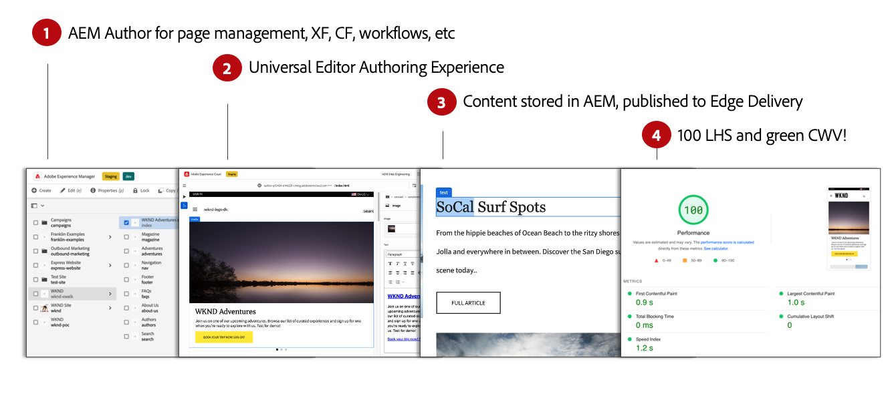

# Using Edge Delivery Services {#usingedge}

With Edge Delivery, you can create rapid development environments where authors can update and publish content quickly, and new sites can be launched rapidly. To this end, you can work with multiple content sources on the same website and publishing will be seamless and streamlined regardless of you chosen source. As such, it takes only a couple of seconds to go from editing to seeing the content live on the internet.

## Finding the Right Tool {#right-tool}

Edge Delivery is decoupled from the content source and can ingest content from different content sources.

Ingesting from multiple content sources offers maximum flexibility to the user. Adobe offers guidance to help you choose which content sources are the best fit for your project.

There are cases where the content source is predefined or otherwise not flexible (e.g. the project can not use Sharepoint or Google Drive). But in many cases, the tool is not preordained and choice of tool is not black and white. 

Adobe's guiding principle is simplicity. Start with document-based authoring and add complexity when needed. If a tool change is needed, Crosswalk covers content migration.

## How AEM Authoring Works with Edge Delivery Services {#how-it-works}

When using Edge Delivery Services with AEM as a Cloud Service, the most fundamental fact to understand is that the content you author is persisted in AEM as a Cloud Service.

1. [The AEM authoring environment](/help/sites-cloud/authoring/getting-started/quick-start.md) is used for content management such as creating new pages, Experience Fragments, Content Fragments, etc.
   * All features of AEM are likewise available such as workflows, MSM, translation, Launches, etc.
1. [The Universal Editor](/help/implementing/universal-editor/authoring.md) is used to author the content managed in AEM.
   * The Universal Editor offers a new and modern UI for content authoring.
   * For authoring, AEM renders the HTML but includes the scripts, styles, icons and other resources from Edge Delivery.
   * Although the Universal Editor is used, all changes are persisted to AEM.
1. Content that you author with the Universal Editor and persist to AEM is published to Edge Delivery Services.
   * Content remains stored in AEM.
   * AEM renders semantic HTML that is needed for ingestion.
   * Content is published to Edge Delivery Services.
1. [Edge Delivery Services](https://www.aem.live/home) ensures a 100% Lighthouse score.

## Authoring {#authoring-edge}

With Edge Delivery Services, authoring is easy, fast, and flexible. You can choose to author using document-based authoring or authoring in AEM with the Universal Editor.

Please see the document [Authoring](authoring.md) for more information.

## Publishing {#publishing-edge}

With Edge Delivery, publishing content is seamless regardless of your content source.

Please see the document [Publishing](publishing.md) for more information.

## Developing {#developing-edge}

Edge Delivery Services is based around the concept of blocks. AEM comes with a comprehensive library of predefined blocks, which can be extended to meet your project needs. Code for Edge Delivery Services projects are managed in GitHub.

Please see the document [Developing](developing.md) for more information.

## Further Reading {#further-reading}

For more details, see the following documents:

* For details on how to get started with Edge Delivery, see the [Build](https://www.aem.live/docs/#build) section of the Edge delivery documentation.
* To understand how to author and publish content by using Edge Delivery, see the [Publish section](https://www.aem.live/docs/authoring) of the Edge Delivery Services documentation.
* For AEM authoring, see the [Authoring Concepts page.](/help/sites-cloud/authoring/getting-started/concepts.md)
