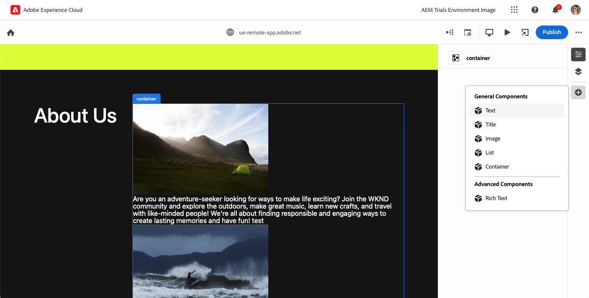

# WYSIWYG Content Authoring for Edge Delivery Services {#authoring-edge}

With Edge Delivery Services, authoring is easy, fast, and flexible. You have two options to author content for Edge Delivery Services:

* [Universal Editor](#universal-editor) - A modern what-you-see-is-what-you-get (WYSIWYG) UI for  authoring content within AEM
* [Document-Based Authoring ](#document-based) - Such as Microsoft Word or Google Docs

## Universal Editor Authoring {#universal-editor}

When using Edge Delivery Services with AEM as a Cloud Service, the most fundamental fact to understand is that the content you author is persisted in AEM as a Cloud Service.

1. [The AEM Sites environment](/help/sites-cloud/authoring/quick-start.md) is used for content management such as creating new pages, Experience Fragments, Content Fragments, etc.
   * All features of AEM are available such as workflows, MSM, translation, Launches, etc.
1. [The Universal Editor](/help/sites-cloud/authoring/universal-editor/authoring.md) is used to author the content managed in AEM.
   * The Universal Editor offers a new and modern UI for content authoring.
   * For authoring, AEM renders the HTML but includes the scripts, styles, icons and other resources from Edge Delivery Services.
   * Although the Universal Editor is used, all changes are persisted to AEM.
   * The Universal Editor is not yet at feature-parity with the AEM Page Editor and some AEM features may not be available in the Universal Editor.
1. Content that you author with the Universal Editor and persist to AEM is published to Edge Delivery Services.
   * Content remains stored in AEM.
   * AEM renders semantic HTML that is needed for ingestion.
   * Content is published to Edge Delivery Services.
1. [Edge Delivery Services](/help/edge/developer/keeping-it-100.md) ensure a 100% Lighthouse score.

Blocks are fundamental components of a page delivered by Edge Delivery Services. Authors can choose from default blocks provided as standard by Adobe or from blocks customized for your project by your developers.

The Universal Editor provides a modern and intuitive GUI for authoring your content by adding and arranging blocks.

Details of the blocks can then be configured in the Properties panel.

For details on how to author using the Universal Editor, please see the document [Authoring Content with the Universal Editor](/help/sites-cloud/authoring/universal-editor/authoring.md).

Please see the [Developer Getting Started Guide for WYSIWYG Authoring with Edge Delivery Services](/help/edge/wysiwyg-authoring/edge-dev-getting-started.md) to learn how to start your own project to author with AEM and Edge Delivery Services.

## Additional Authoring Methods  {#authoring-methods}

WYSIWYG authoring is a powerful and intuitive tools for content authors. However, there are many different authoring use cases, which is why AEM offers additional authoring solutions.

Please see the document [Choosing an Authoring Method](/help/edge/authoring-methods.md) to learn more about the authoring solutions AEM offers including document-based authoring and headless.
