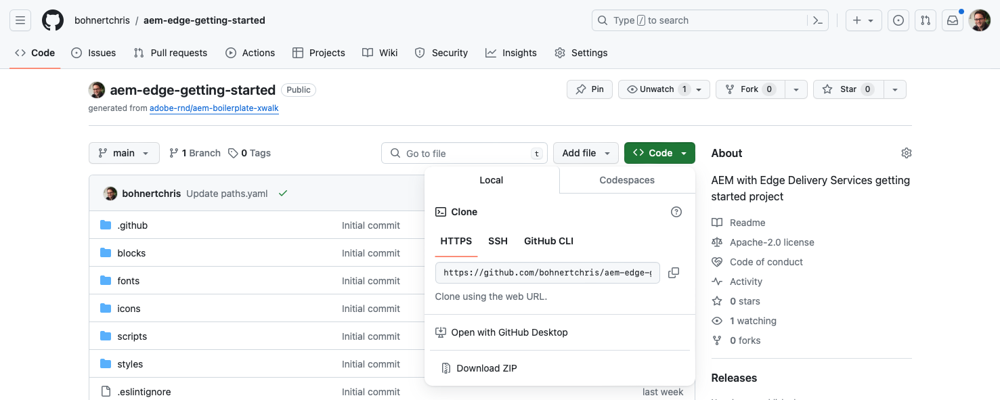
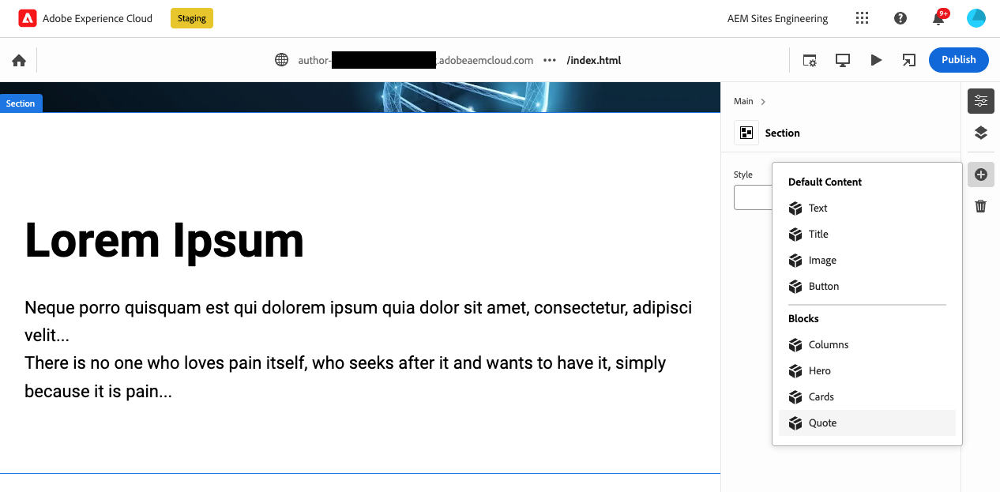
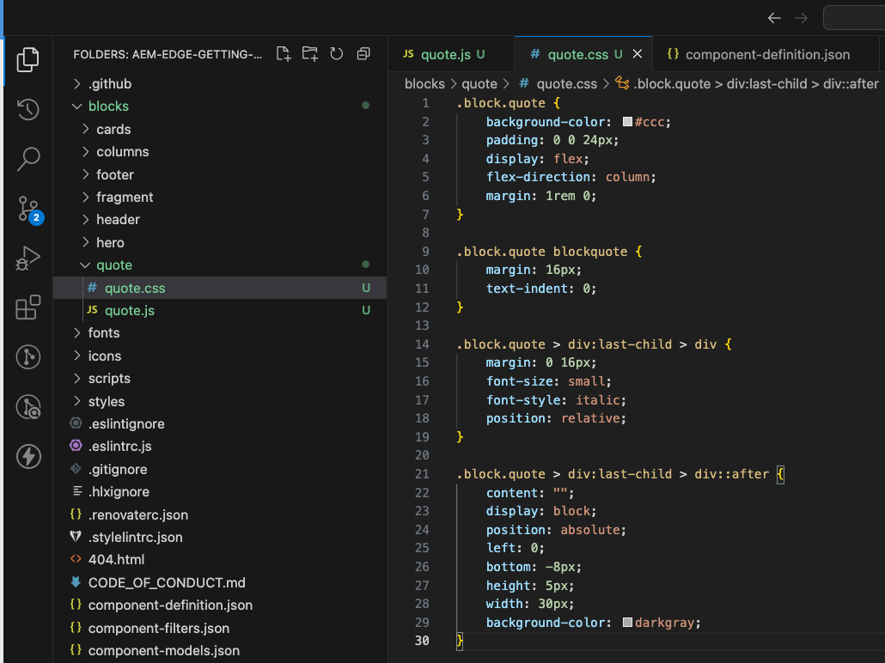
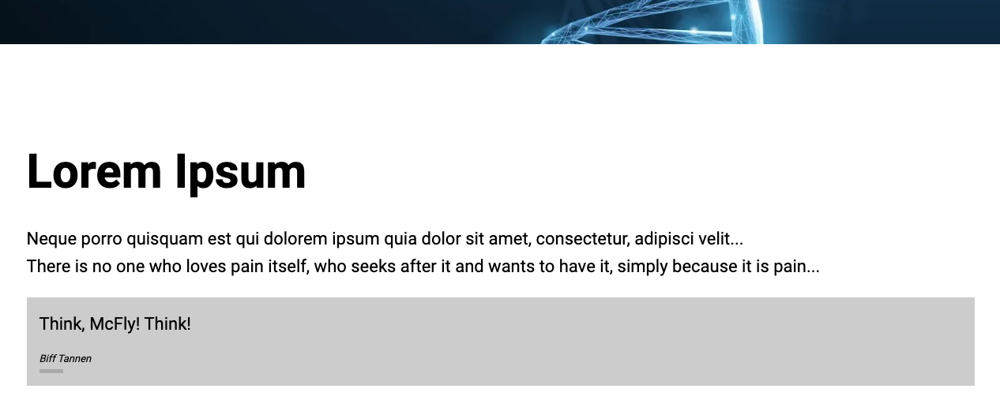

# Creating Blocks Instrumented for use with the Universal Editor {#create-block}

Learn how to create blocks instrumented for use with the Universal Editor in WYSIWYG authoring with Edge Delivery Services projects.

## Prerequisites {#prerequisites}

This guide provides step-by-step instructions for how to create blocks instrumented for the Universal Editor in WYSIWYG authoring with Edge Delivery Services projects. It covers adding components, loading component definitions in the Universal Editor, publishing pages, implementing block decoration and styles, bringing the changes to production, and verifying them. Upon completing this guide, you can create and deploy a new block for your own project.

This guide necessarily requires existing knowledge of WYSIWYG authoring with Edge Delivery Services projects as well as the Universal Editor. Before beginning this guide, you should already have access to Edge Delivery Services and be familiar with its basics including:

* You have completed the [Edge Delivery Service tutorial.](/help/edge/developer/tutorial.md)
* You have access to an [AEM Cloud Service sandbox.](/help/implementing/cloud-manager/getting-access-to-aem-in-cloud/introduction-sandbox-programs.md)
* You have [enabled the Universal Editor on the same sandbox environment.](/help/implementing/universal-editor/getting-started.md)
* You have completed the [Developer Getting Started Guide for WYSIWYG authoring with Edge Delivery Services](/help/edge/wysiwyg-authoring/edge-dev-getting-started.md) guide.

This guide builds on the work done in the [Developer Getting Started Guide for WYSIWYG authoring with Edge Delivery Services](/help/edge/wysiwyg-authoring/edge-dev-getting-started.md) guide.

## Adding a New Block to Your Project {#add-block}

In this guide, you will build a block to render a memorable quote on your page.

To simplify this example, all changes are made to the `main` branch of the project repository. Of course for your actual project, [you should follow development best practices](https://www.aem.live/docs/dev-collab-and-good-practices) by developing on a different branch and reviewing all changes via pull request before merging to `main`.

Adobe recommends that you develop blocks in a three-phased approach:

1. Create the definition and model for the block, review it, and bring it to production.
1. Create content with the new block.
1. Implement the decoration and styles for the new block.

The following quote block example follows this approach.

### Create Block Definition and Model {#create-block-model}

1\. Clone the GitHub project locally that you created in the [Developer Getting Started Guide for WYSIWYG authoring with Edge Delivery Services](/help/edge/wysiwyg-authoring/edge-dev-getting-started.md) guide and open it in an editor of your choice.

   * Microsoft Code is used here for illustrative purposes.

   

2\. Edit the [`component-definition.json` file](/help/implementing/universal-editor/component-definition.md) at the root of the project and add the following definition for your new quote block and save the file.

>[!BEGINTABS]

>[!TAB JSON Example]

```json
{
  "title": "Quote",
  "id": "quote",
  "plugins": {
    "xwalk": {
      "page": {
        "resourceType": "core/franklin/components/block/v1/block",
        "template": {
          "name": "Quote",
          "model": "quote",
          "quote": "<p>Think, McFly! Think!</p>",
          "author": "Biff Tannen"
        }
      }
    }
  }
}
```

>[!TAB Screenshot]


>[!ENDTABS]

3\. Edit the `component-models.json` file at the root of the project and add the following [model definition](/help/implementing/universal-editor/field-types.md#model-structure) for your new quote block and save the file.

   * Please see the document [Content Modeling for WYSIWYG authoring with Edge Delivery Services Projects](/help/edge/wysiwyg-authoring/content-modeling.md) for more information about what is important to consider when creating content models.

>[!BEGINTABS]

>[!TAB JSON Example]

```json
{
  "id": "quote",
  "fields": [
     {
       "component": "richtext",
       "name": "quote",
       "value": "",
       "label": "Quote",
       "valueType": "string"
     },
     {
       "component": "text",
       "valueType": "string",
       "name": "author",
       "label": "Author",
       "value": ""
     }
   ]
}
```

>[!TAB Screenshot]


>[!ENDTABS]

4\. Edit the [`component-filters.json` file](/help/implementing/universal-editor/customizing.md#filtering-components) at the root of the project and add the quote block to the [filter definition](/help/implementing/universal-editor/customizing.md#filtering-components) to allow the block to be added to any section and save the file.

>[!BEGINTABS]

>[!TAB JSON Example]

```json
{
  "id": "section",
  "components": [
    "text",
    "image",
    "button",
    "title",
    "hero",
    "cards",
    "columns",
    "quote"
   ]
}
```

>[!TAB Screenshot]


>[!ENDTABS]

5\. Using git, commit these changes to your `main` branch.

   * Committing to `main` is for illustrative purposes only. [Follow best practices](https://www.aem.live/docs/dev-collab-and-good-practices) and use a pull request for actual project work.

### Create Content with the Block {#create-content}

Now that your basic quote block is defined and committed to the sample project, you can add a quote block to an existing page.

1. In a browser, sign into AEM as a Cloud Service. [Using the Sites console,](/help/sites-cloud/authoring/basic-handling.md) navigate to the site that you created in the [Developer Getting Started Guide for WYSIWYG authoring with Edge Delivery Services](/help/edge/wysiwyg-authoring/edge-dev-getting-started.md) guide and select a page.

   * In this case, `index` is used for illustrative purposes.

   

1. Tap or click **Edit** in the toolbar of the console and the Universal Editor opens.

   * In order to load the page, you may need to tap or click **Sign in with Adobe** to authenticate to AEM in the Universal Editor.

1. In the Universal Editor, select a section. In the properties panel, tap or click the **Add** icon and then select your new **Quote** block from the menu.

   * The **Add** icon is a plus symbol.
   * You know that you have selected a section if the blue outline of the selected object has a tab labeled **Section**.
   * In this example, tapping or clicking slightly above the **Lorem Ipsum** heading selects a section containing the heading and lorem ipsum text.

   

1. The page is reloaded and the quote block is added to the bottom of the selected section with the default content specified in the `component-definitions.json` file.

   * The quote block can be selected and edited as any other block either in-place or in the properties panel.
   * Styling is be applied in a further step.

   

1. Once you are satisfied with the content of your quote, you can publish the page by tapping or clicking the **Publish** button in the toolbar of the Universal Editor.

1. Verify that the content was published by navigating to the published page. The link will be similar to `https://<branch>--<repo>--<owner>.aem.page`

   

### Style the Block {#style-block}

Now that you have a working quote block you can apply styling to it.

1\. Return to the editor for your project.

2\. Create a `quote` folder under the `blocks` folder.

   

3\. In the new `quote` folder, add a `quote.js` file to implement block decoration by adding the following JavaScript and save the file.

>[!BEGINTABS]

>[!TAB JavaScript Example]

```javascript
export default function decorate(block) {
  const [quoteWrapper] = block.children;
 
  const blockquote = document.createElement('blockquote');
  blockquote.textContent = quoteWrapper.textContent.trim();
  quoteWrapper.replaceChildren(blockquote);
}
   ```

>[!TAB Screenshot]


>[!ENDTABS]

4\. In the `quote` folder, add a `quote.css` file to define the styling for the block by adding the following CSS code and save the file.

>[!BEGINTABS]

>[!TAB CSS Example]

```css
.block.quote {
    background-color: #ccc;
    padding: 0 0 24px;
    display: flex;
    flex-direction: column;
    margin: 1rem 0;
}
 
.block.quote blockquote {
    margin: 16px;
    text-indent: 0;
}
 
.block.quote > div:last-child > div {
    margin: 0 16px;
    font-size: small;
    font-style: italic;
    position: relative;
}
 
.block.quote > div:last-child > div::after {
    content: "";
    display: block;
    position: absolute;
    left: 0;
    bottom: -8px;
    height: 5px;
    width: 30px;
    background-color: darkgray;
}
```

>[!TAB Screenshot]



>[!ENDTABS]

5\. Using git, commit these changes to your `main` branch.

   * Committing to `main` is for illustrative purposes only. [Follow best practices](https://www.aem.live/docs/dev-collab-and-good-practices) and use a pull request for actual project work.

6\. Return to your browser tab of the Universal Editor where you were editing the page of your project and reload the page to view your styled block.

7\. See the now styled quote block on the page.

   

8\. Verify that the changes were pushed to production by navigating to the published page. The link will be similar to `https://<branch>--<repo>--<owner>.aem.page`

   

Congratulations! You now have a fully working and styled quote block. You can use this example as a basis for designing your own project-specific blocks.

### Block Options {#block-options}

If you need a block to look or behave slightly differently based on certain circumstances, but not different enough to become a new block in itself, you can let authors choose from [block options.](content-modeling.md#type-inference)

By adding a `classes` property to the block, the property rendered in the table header for simple blocks, or as value list for items in a container block.

```json
{
  "id": "simpleMarquee",
  "fields": [
    {
      "component": "text",
      "valueType": "string",
      "name": "marqueeText",
      "value": "",
      "label": "Marquee text",
      "description": "The text you want shown in your marquee"
    },
    {
      "component": "select",
      "name": "classes",
      "value": "",
      "label": "Background Color",
      "description": "The marquee background color",
      "valueType": "string",
      "options": [
        {
          "name": "Red",
          "value": "bg-red"
        },
        {
          "name": "Green",
          "value": "bg-green"
        },
        {
          "name": "Blue",
          "value": "bg-blue"
        }
      ]
    }
  ]
}
```

## Using Other Working Branches {#other-branches}

This guide had you commit directly to the `main` branch for simplicity's sake. For experimentation in a sample repository, this is usually not an issue. For actual project work, [you should follow development best practices](https://www.aem.live/docs/dev-collab-and-good-practices) by developing on a different branch and reviewing all changes via pull request before merging to `main`.

When you are not developing on the `main` branch, you can append `?ref=<branch>` in the Universal Editor location bar to load the page from your branch. `<branch>` is the branch name as it would be used for your project's preview or live URLs, e.g. `https://<branch>--<repo>--<owner>.aem.page`.

## Reusing Your Blocks for Document-Based Authoring {#reusing-blocks}

You can use the blocks you create for WYSIWYG authoring using the Universal Editor for document-based authoring if you adhere to the same content model.

Please see the document [Blocks for WYSIWYG and Document-Based Authoring](/help/edge/wysiwyg-authoring/wysiwyg-doc-blocks.md) for more information.

## Next Steps {#next-steps}

Now that you know how to create blocks, it is essential to understand how to model content in a semantic way to achieve a lean developer experience.

Please see the document [Content Modeling for WYSIWYG authoring with Edge Delivery Services Projects](/help/edge/wysiwyg-authoring/content-modeling.md) to learn how content modeling works for WYSIWYG authoring with Edge Delivery Services projects.

>[!TIP]
>
>For an end-to-end walkthrough of creating a new Edge Delivery Services project that is enabled for WYSIWYG authoring with AEM as a Cloud Service as a content source, please view [this AEM GEMs webinar.](https://experienceleague.adobe.com/en/docs/events/experience-manager-gems-recordings/gems2024/aem-authoring-and-edge-delivery)
