# Developer Getting Started Guide for WYSIWYG Authoring with Edge Delivery Services {#edge-dev-getting-started}

This guide will get you up-and-running with a new Adobe Experience Manager site using Edge Delivery Services and the Universal Editor for WYSIWYG content authoring.

## Prerequisites {#prerequisites}

Before beginning this guide, you should already be familiar with the basics of and have access to Edge Delivery Services including:

* You have completed the [Edge Delivery Service tutorial.](/help/edge/developer/tutorial.md)
* You have access to an [AEM Cloud Service sandbox.](/help/implementing/cloud-manager/getting-access-to-aem-in-cloud/introduction-sandbox-programs.md)
* You have [enabled the Universal Editor on the same sandbox environment.](/help/implementing/universal-editor/getting-started.md)

## Core Concepts when Developing for Edge Delivery Services {#core-concepts}

Edge Delivery Services is based around the concept of blocks. AEM comes with a comprehensive library of predefined blocks, which can be extended to meet your project needs. Code for Edge Delivery Services projects is managed in GitHub.

### Blocks {#blocks}

Blocks are the most fundamental part of a page delivered by Edge Delivery Services. A block encapsulates styling and code that drives a logical component of a content page.

AEM provides standard blocks as part of the product within the project boilerplate. Such blocks include heading, text, images, links, lists, etc.

>[!TIP]
>
>Please see the [Build section](/help/edge/developer/block-collection.md) of the Edge Delivery Services documentation for more details on blocks and how to develop for Edge Delivery services.

### Edge Delivery Services and GitHub {#github-edge}

Edge Delivery leverages GitHub so you can manage and deploy code directly from your GitHub repository.

Your authors can create content using either Document-based Authoring  or content in AEM with the Universal Editor. Developers can customize the functionality of your site by using CSS and JavaScript in GitHub regardless of how the authors create their content.

Websites are automatically created for each of your branches from content preview to production. Every resource that you put into your GitHub repository is available on your website without a build process.

>[!TIP]
>
>Please see the [Build section](/help/edge/developer/block-collection.md) of the Edge Delivery Services documentation for more details on blocks and how to develop for Edge Delivery services.

## Getting Started with WYSIWYG Authoring and Edge Delivery Services {#getting-started}

Once you have fulfilled [the prerequisites](#prerequisites) and have made [the choice to use the Universal Editor,](#editor-choice) you can get started on your own project.

### Create Your GitHub Project {#create-github-project}

First you will need to create a new project on GitHub, based on the Adobe template.

1. Navigate to [`https://github.com/adobe-rnd/aem-boilerplate-xwalk`](https://github.com/adobe-rnd/aem-boilerplate-xwalk) and Click on **Use this template** and select **Create a new repository**.

   * You will need to be signed in to GitHub to see this option.

   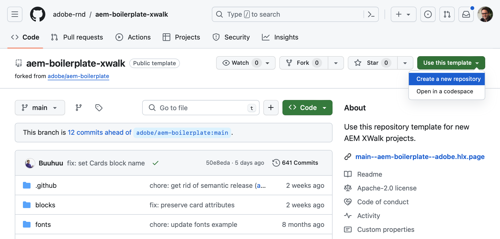

1. By default, the repository will be assigned to you. Change this as necessary as well as provide a repository name and description and click **Create repository**.

   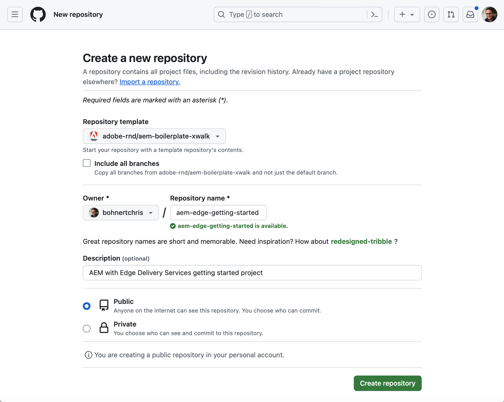

1. In a new tab in the same browser, navigate to [`https://github.com/apps/aem-code-sync`](https://github.com/apps/aem-code-sync) and click **Configure**.

   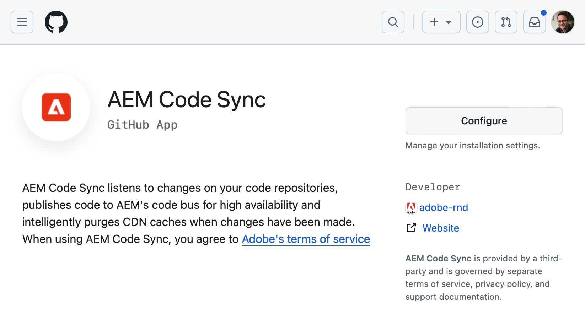

1. Click **Configure** for the org where you created your new repository in the previous step.

   

1. On the AEM Code Sync GitHub page under **Repository access**, select **Only select repositories**, select the repository that you created in the previous step, and then click **Save**.

   

1. Once AEM Code Sync is installed, you receive a confirmation screen. Return to the browser tab of your new repository.

   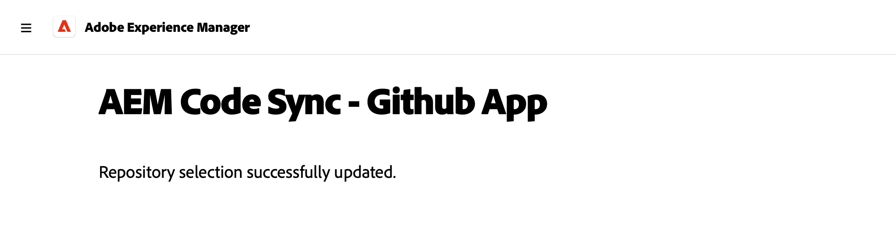

1. Click the `fstab.yaml` file to open it and then the **Edit this file** icon to edit it.

   

1. Edit the `fstab.yaml` file to update the mount point of your project. Replace the default Google Docs URL with the URL of your AEM as a Cloud Service authoring instance and then click **Commit changes...**.

   * `https://<aem-author>/bin/franklin.delivery/<owner>/<repository>/main`
   * Changing the mount point tells Edge Delivery Services where to find the content of the site.
   
   

1. Add a commit message as desired and then click **Commit changes**, committing them directly to the `main` branch.

   

1. Return to the root of your repository and click on `paths.json` and then the **Edit this file** icon.

   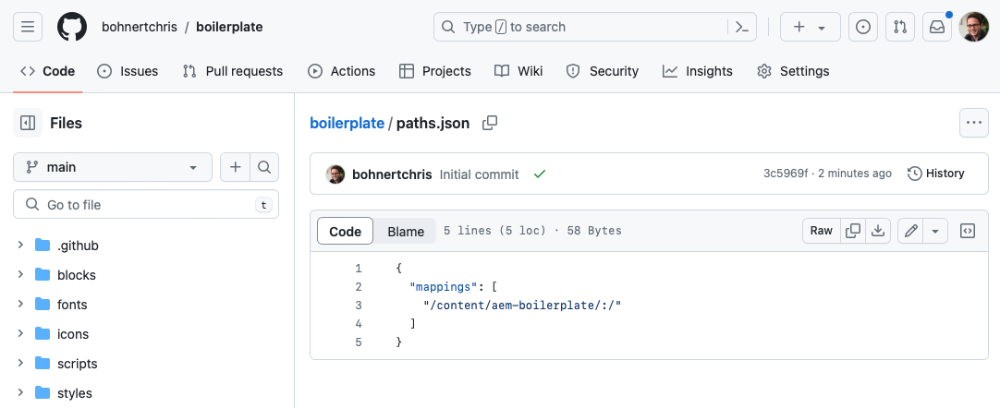

1. The default mapping will use the name of the repository. Update the default mapping as required for your project with `/content/<site-name>/:/` and click **Commit changes...**.

   * Provide your own `<site-name>`. You will need it in a later step.
   * The mappings tells Edge Delivery Services how to map the content in your AEM repository to the site URL.

   

1. Add a commit message as desired and then click **Commit changes**, committing them directly to the `main` branch.

   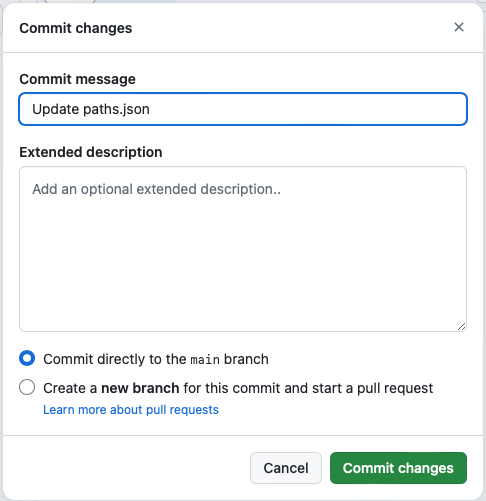

>[!TIP]
>
>For more information about path mappings, please see the document [Path Mapping for Edge Delivery Services.](/help/edge/wysiwyg-authoring/path-mapping.md)

### Create and Edit a New AEM Site {#create-aem-site}

Now that you have a GitHub project, you must create a new AEM site that the project can use.

>[!NOTE]
>
>To edit your site using the Universal Editor, you must use a Chromium-based browser.

1. Download the latest WYSIWYG authoring with Edge Delivery Services site template from GitHub at [`https://github.com/adobe-rnd/aem-boilerplate-xwalk/releases`](https://github.com/adobe-rnd/aem-boilerplate-xwalk/releases).

1. Sign in to your AEM as a Cloud Service authoring instance and navigate to the Sites console and tap or click **Create** -> **Site from template**.

   

1. On the **Select a site template** tab of the create site wizard, click the **Import** button to import a new template.

   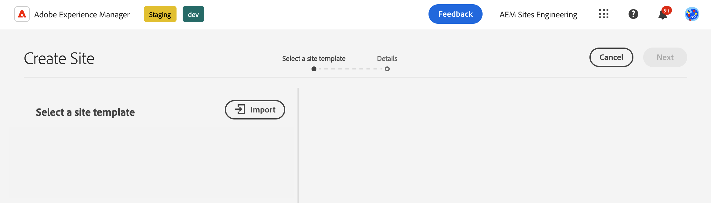

1. Upload the WYSIWYG authoring with Edge Delivery Services site template that you downloaded from GitHub.

   * The template must only be uploaded once. Once uploaded it can be reused to create additional sites.

1. Once the template is imported, it appears in the wizard. Tap or click to select it and then tap or click **Next**.

   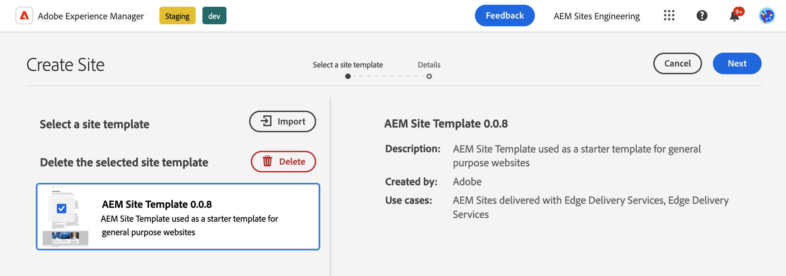

1. Provide the following fields and tap or click **Create**.

   * **Site title** - Add a descriptive title for the site.
   * **Site title** - Use the `<site-name>` that you defined in the [previous step.](#create-github-project) 
   * **GitHub URL** - Use the URL of the GitHub project you created in the previous step.

   

1. AEM confirms the site creation with a dialog. Tap or click **OK** to dismiss.

   

1. On the sites console, navigate to the `index.html` of the newly-created site and tap or click **Edit** in the toolbar.

   

1. The Universal Editor opens in a new tab. You may need to tap or click **Sign in with Adobe** to authenticate to edit your page.

   

You can now edit your site using the Universal Editor. See the [Universal Editor documentation](/help/sites-cloud/authoring/universal-editor/authoring.md) for more information.

### Publishing Your New Site {#publishing}

Once you are finished editing your new site using the Universal Editor, you can publish your content.

1. On the sites console, select all of the pages you created for your new site and tap or click **Quick publish** in the toolbar.

   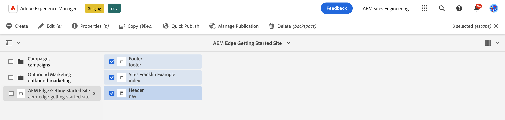

1. Tap or click **Publish** in the confirmation dialog to start the process.

   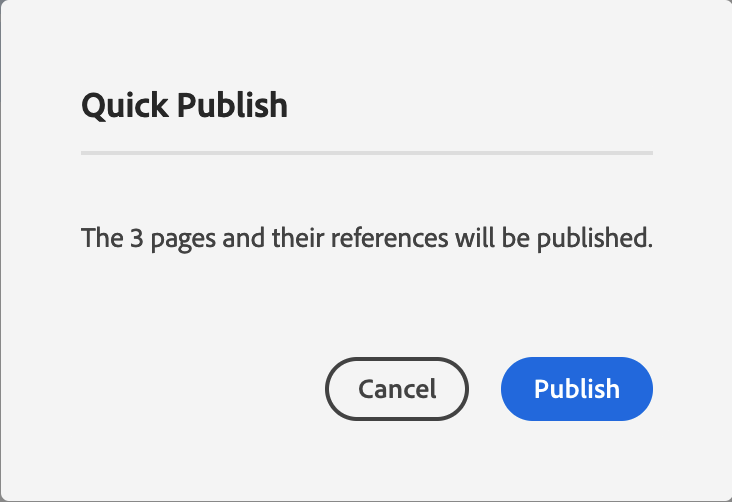

1. Open a new tab in the same browser and navigate to the URL of your new site.

   * `https://main--<repository-name>--<owner>.aem.page`

1. See your content published.

   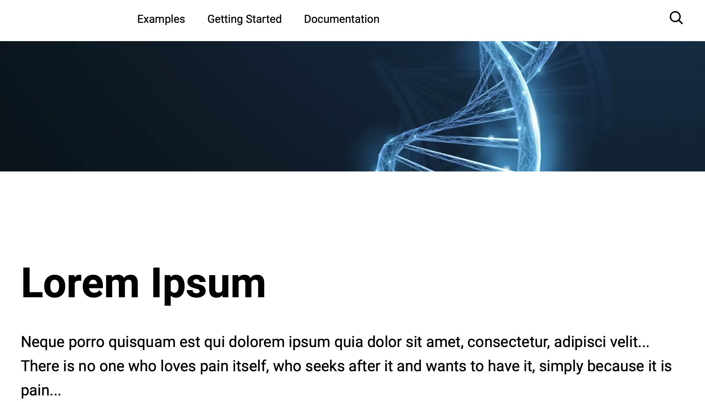

## Next Steps {#next-steps}

Now that you have a working WYSIWYG authoring with Edge Delivery Services project, you can begin creating and styling your own blocks.

Please see the guide [Creating Blocks Instrumented for use with the Universal Editor](/help/edge/wysiwyg-authoring/create-block.md) for more information.

>[!TIP]
>
>For an end-to-end walkthrough of creating a new Edge Delivery Services project that is enabled for WYSIWYG authoring with AEM as a Cloud Service as a content source, please view [this AEM GEMs webinar.](https://experienceleague.adobe.com/en/docs/events/experience-manager-gems-recordings/gems2024/aem-authoring-and-edge-delivery)
