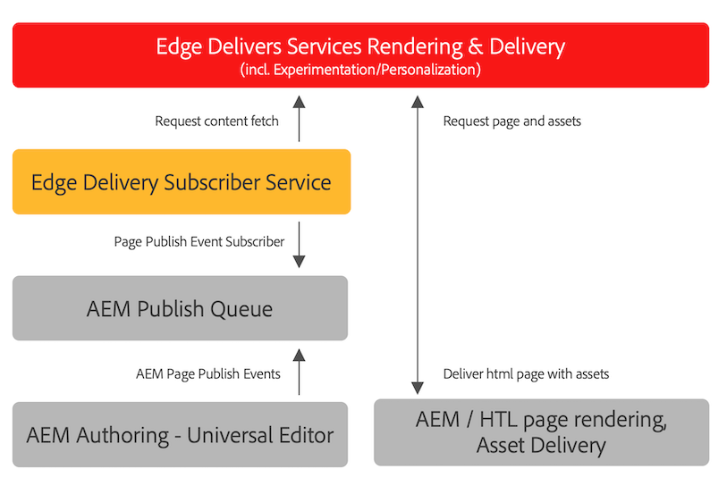

# Publishing Content for Edge Delivery Services {#publishing-edge}

With Edge Delivery Services, publishing content is seamless regardless of your content source:

* Document-based content - Please see [Publish section](/help/edge/docs/authoring.md) of the Edge Delivery Services documentation.
* AEM content - Please see the details below.

## Publishing Flow from AEM {#publishing-flow}

When using the Universal Editor to author AEM content, publishing is as simple as clicking the **Publish** button in the Universal Editor. Please see the document [Publishing Content with the Universal Editor](/help/sites-cloud/authoring/universal-editor/publishing.md).

The flow of information when publishing is as follows. Once the author starts publication, this flow is automatic and is illustrated here for information purposes.

>[!NOTE]
>
>Up to a maximum of 5000 paths published from the authoring UI or by workflows are permitted per day. Integrations that create bulk-publication work loads are not supported. If you project requires higher capacity, please propose it for the [VIP Program](https://www.aem.live/vip/intake).

1. The content author publishes AEM content in the Universal Editor.
1. A publish event is pushed to Adobe pipeline queue.
1. The Edge Delivery Services publish service forwards the relevant events to Edge Delivery Services admin API.
1. Edge Delivery pulls and ingests semantic HTML from AEM author.
1. AEM is updated with publish status.

>[!NOTE]
>
>By default, the Edge Delivery Services admin API is not protected and can be used to publish or unpublish documents without authentication. In order to configure authentication for the admin API as documented in [Configuring Authentication for Authors](https://www.aem.live/docs/authentication-setup-authoring), your project must be provisioned with an API_KEY, which grants access to the publish service. [Please reach out to the Adobe team on Slack](/help/edge/docs/slack.md) for guidance.

