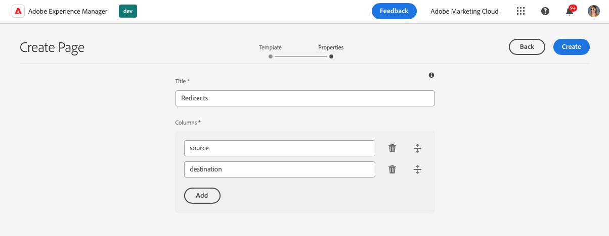
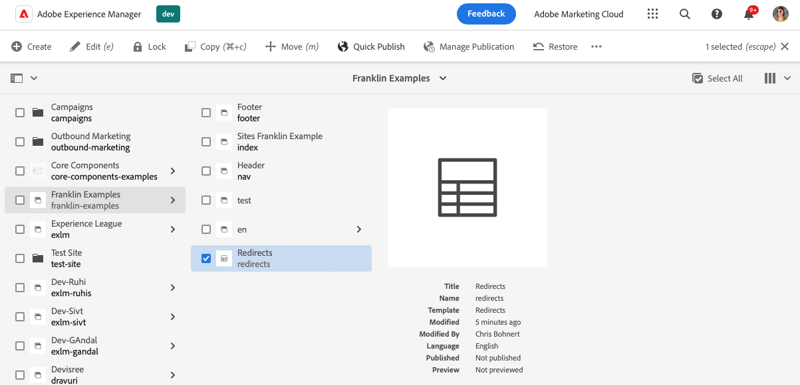

# Using Spreadsheets to Manage Tabular Data {#tabular-data}

Learn how to use spreadsheets to manage tabular data for various values such as metadata and redirects for your AEM with Edge Delivery Services site.

## Use Cases {#use-cases}

For any AEM with Edge Delivery Services site, there is a need to maintain lists of tabular data such as for key-value mappings. These can be lists of many different values such as metadata and redirects. Edge Deliver Services allows you to maintain such tabular lists using an intuitive tool: the spreadsheet. AEM translates these spreadsheets into JSON files that can easily be consumed by your website or web application.

Common use cases include:

* [Placeholders](/help/edge/docs/placeholders.md)
* [Metadata](/help/edge/docs/bulk-metadata.md)
* [Headers](/help/edge/docs/custom-headers.md)
* [Redirects](/help/edge/docs/redirects.md)
* [Configurations](/help/edge/docs/setup-byo-cdn-push-invalidation.md) such as for CND setups

In addition, you can [create your spreadsheets](#own-spreadsheet) of any structure to store mappings for your own purposes.

This document uses the example of redirects to illustrate how to create such spreadsheets. See the previously-linked topics in the Edge Delivery Services documentation for details of each use case.

>[!TIP]
>
>For more information on how spreadsheets in general work with Edge Delivery Services, please see the document [Spreadsheets and JSON](/help/edge/developer/spreadsheets.md).

>[!TIP]
>
>Spreadsheets should only be used to maintain tabular data. For storing structured data, [check out AEM's headless features](/help/headless/introduction.md).

## Prerequisites {#prerequisites}

In order to create mappings using spreadsheets in your AEM with Edge Delivery Services project, you need to have created your site using the latest site template.

Please see the document [ Developer Getting Started Guide for WYSIWYG authoring with Edge Delivery Services](/help/edge/wysiwyg-authoring/edge-dev-getting-started.md) for more information.

## Creating a Spreadsheet {#spreadsheet}

In this example, you will create a spreadsheet to manage redirects for your AEM with Edge Delivery Services site. The same steps apply to [other spreadsheet types](#other) that you wish to create.

1. Sign in to your AEM as a Cloud Service authoring instance, go to the **Sites** console, and navigate to the root of the site which requires a spreadsheet. Tap or click **Create** -> **Page**.

   

1. On the **Template** tab of the create page wizard, tap or click the **Redirects** template to select it and then tap or click **Next**.

   

1. The **Properties** tab of the wizard presents the default values for the redirects spreadsheet. Tap or click **Create**.

   * **Title** - Leave this value as-is.
   * **Columns** - The minimum columns needed for redirects are prepopulated.
     * **source** - The page to be redirected
     * **destination** - The page to redirect to

   

1. In the **Success** dialog, tap or click **Open**.

   

1. A new tab opens with the spreadsheet loaded into an editor with the predefined **source** and **destination** columns. To define your redirects, tap or click the empty row of the **source** column. Changes are saved automatically as you edit the spreadsheet.

   

   * The **source** is relative to the domain of your website, so it only contains the relative path.
   * The **destination** can be either a fully qualified URL if you are redirecting to a different website, or it can be a relative path if you are redirecting within your own website.
   * Use the tab-key to move focus to the next cell.
   * The editor adds new rows to the spreadsheet as necessary.
   * To delete or move a row, use the **Delete** icon at the end of each row and the drag handles at the beginning of each row, respectively.

## Importing Spreadsheet Data {#importing}

In addition to editing spreadsheets in the AEM Page Editor, you can also import data from a CSV file.

1. When editing your spreadsheet in AEM, tap or click the **Upload** button at the top-left of the screen.
1. In the drop-down, select how you would like to import your data.
   * **Replace Doc** to replace the content of the entire spreadsheet with the content of the CSV file you will upload.
   * **Append To Doc** to append the data of the CSV file you will upload to the existing spreadsheet contents.
1. In the dialog that opens, select your CSV file and then tap or click **Open**.

A dialog opens as the import is processed. Once complete, the data in the CSV file is added to or replaces the content of the spreadsheet. If any errors are encountered such as a mismatch of columns, they are reported so you can correct your CSV file.

>[!NOTE]
>
>* The headings in the CSV file must match the columns in the spreadsheet exactly.
>* Importing the entire CSV does not modify the column headings, only the content rows.
>* If you need to update the columns, you must do that in the AEM Page Editor before performing the import of the CSV.
>* A CSV file can not be larger than 10 MB for import.

Depending on your selection of `mode`, you can also `create`, `replace`, or `append` to spreadsheets using a CSV and a cURL command similar to the following.

```text
curl --request POST \
  --url http://<aem-instance>/bin/asynccommand \
  --header 'content-type: multipart/form-data' \
  --form file=@/path/to/your.csv \
  --form spreadsheetPath=/content/<your-site>/<your-spreadsheet> \
  --form 'spreadsheetTitle=Your Spreadsheet' \
  --form cmd=spreadsheetImport \
  --form operation=asyncSpreadsheetImport \
  --form _charset_=utf-8 \
  --form mode=append
```

The call returns an HTML page with information about the job ID.

```text
Message | Job(Id:2024/9/18/15/27/5cb0cacc-585d-4176-b018-b684ad2dfd02_90) created successfully. Please check status at Async Job Status Navigation.
```

[You can use the **Jobs** console](/help/operations/asynchronous-jobs.md) to view the status of the job or use the ID returned to query it.

```text
https://<aem-instance>/bin/asynccommand?optype=JOBINF&jobid=2024/10/24/14/1/8da63f9e-066b-4134-95c9-21a9c57836a5_1
```

## Publishing a Spreadsheet paths.json {#paths-json}

In order for AEM to be able to publish the data in your spreadsheet, you additionally need to update the `paths.json` file of your project.

1. Open the root of your project in GitHub.

1. Tap or click the `paths.json` file to open its details and then the **Edit** icon.

   

1. Add a line to map your new spreadsheet to a `redirects.json` resource.

   ```json
   {
     "mappings": [
      "/content/<site-name>/:/",
      "/content/<site-name>/redirects:/redirects.json"
     ]
   }
   ```

   >[!NOTE]
   >
   >This `paths.json` entry is based on the example of creating redirects using tabular data. Make sure to update the path appropriate to the [type of spreadsheet you are creating](#other).

1. Click **Commit changes...** to save the changes to `main`.

   * Either commit to `main` or create a pull request as per your process.

1. When you are finished defining your redirects and you updated the path mapping, return to the **Sites** console.

1. Tap or click to select the redirects spreadsheet that you created in the console and then tap or click **Quick Publish** in the actions bar to publish the spreadsheet.

   

1. In the **Quick Publish** dialog, tap or click **Publish**.

   

1. A banner confirms the publication.

   

The redirects spreadsheet is now published and publicly-accessible.

>[!TIP]
>
>For more information about path mappings, please see the document [Path Mapping for Edge Delivery Services](/help/edge/wysiwyg-authoring/path-mapping.md).

## Other Spreadsheet Types {#other}

Now that you know how to create a redirects spreadsheet, you can create any other standard spreadsheet type:

* [Placeholders](https://www.aem.live/docs/placeholders)
* [Metadata](https://www.aem.live/docs/bulk-metadata)
* [Headers](https://www.aem.live/docs/custom-headers)
* [Configuration](https://www.aem.live/docs/configuration) - Such as for [cache invalidation](https://www.aem.live/docs/byo-cdn-adobe-managed#setup-push-invalidation)
* [Taxonomy](/help/edge/wysiwyg-authoring/taxonomy.md)

Simply follow the same steps in the sections [Create Spreadsheet](#spreadsheet) and [Update paths.json](#paths-json) and choose the appropriate template and update the `paths.json` file appropriately.

For [Configuration](https://www.aem.live/docs/configuration), [Headers](https://www.aem.live/docs/custom-headers) and [Metadata](https://www.aem.live/docs/bulk-metadata) make sure to add a mapping to publish them to their default locations:

* Configuration: `/.helix/config.json`
* Headers: `/.helix/headers.json`
* Metadata: `/metadata.json`
* Taxonomy: Please see the document [Managing Taxonomy Data](/help/edge/wysiwyg-authoring/taxonomy.md) for more information.

Additionally, you can [create your own spreadsheet](#own-spreadsheet) with arbitrary columns for your own use.

>[!NOTE]
>
>You do not need to create a spreadsheet to manage indexing for AEM as a Cloud Service with Edge Delivery Services projects.
>
>If you wish to create your own indices, [please follow this documentation](https://www.aem.live/developer/indexing#setting-up-more-index-configurations) to create your own `helix-query.yaml` file.

## Creating Your Own Spreadsheet {#own-spreadsheet}

1. Follow the same steps in the section [Create Spreadsheet](#spreadsheet).

1. When selecting the template, choose **Spreadsheet**.

1. In the **Properties** tab of the wizard, you can add your own columns.

   

   * In the **Columns** section, tap or click **Add** to add a new column.
   * Provide a name for the column.
   * Remove or reorganize the columns using the **Delete** and drag handle icons, respectively.

1. Create the spreadsheet and publish as per the instructions for the redirects spreadsheet.

1. Add a mapping to the `paths.json` file as per the instructions for the redirects spreadsheet.

