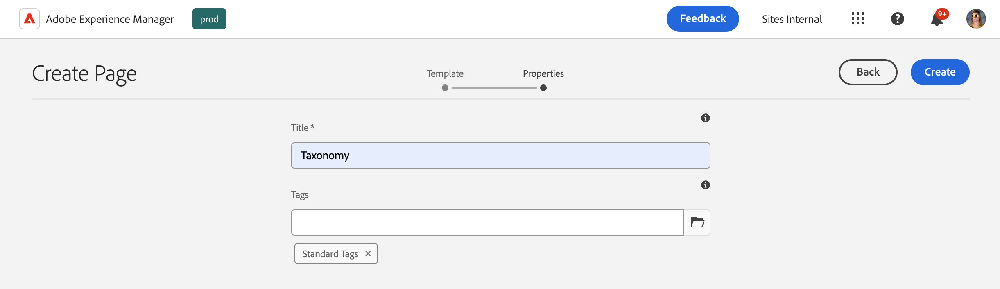
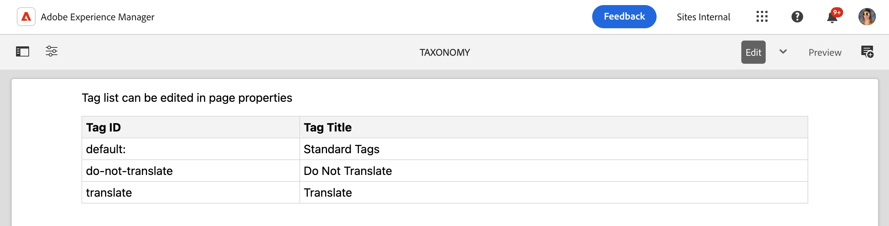
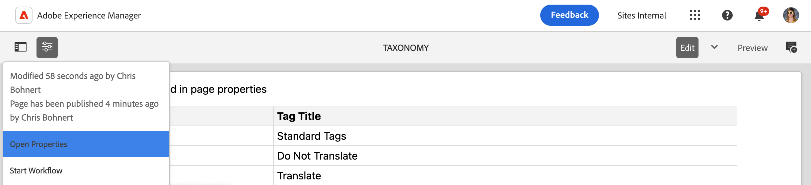

# Managing Taxonomy Data {#managing-taxonomy-data}

Learn how to manage taxonomy data for using tags with your AEM with Edge Delivery Services sites.

## Introduction {#introduction}

Tagging is an important feature that helps you organize and manage your pages. [The Tagging Console](/help/sites-cloud/administering/tags.md#tagging-console) in AEM allows you to create a rich taxonomy of tags to organize your pages.

These tags are useful not only for you and your authors in organizing your content, but can also be for your readers as well. Tags and their taxonomy can be used in components on the page to help your readers navigate your content.

The Universal Editor works only with the IDs of your tags. By creating a taxonomy page for your content, you expose the descriptions of these tags in all languages to the Universal Editor so it can use that information when rendering content.

## Creating a Taxonomy Page {#creating}

A taxonomy is created like [any other page in AEM.](/help/sites-cloud/authoring/sites-console/creating-pages.md)

1. Navigate to the [**Sites** console.](/help/sites-cloud/authoring/sites-console/introduction.md)

1. Select the location where you wish to create your taxonomy.

1. Tap or click **Create** -&gt; **Page**.

   

1. On the **Template** tab of the **Create Page** wizard, select the **Taxonomy** template and tap or click **Next**.

   

1. On the **Properties** tab of the **Create Page** wizard, provide a descriptive name for the page and [use the tag picker](/help/sites-cloud/authoring/sites-console/tags.md) to select the tag(s) or namespace(s) you wish to include in your taxonomy.

   

1. Tap or click **Create**.

The taxonomy page is created. In the **Success** dialog, you can tap or click **Done** dialog to dismiss the message or **Open** to edit the page in the [Page Editor.](/help/sites-cloud/authoring/page-editor/introduction.md)

## Editing a Taxonomy Page {#editing}

A taxonomy is edited like any other page in AEM.

1. Navigate to the [**Sites** console.](/help/sites-cloud/authoring/sites-console/introduction.md)

1. Select the taxonomy you wish to edit.

1. Tap or click **Edit** in the action bar.

1. The Page Editor opens, showing the taxonomy.

   * The view in the Page Editor is view only.

   

1. Tap or click the **Page Information** icon in the toolbar and select **Open Properties**.

   

1. In the **Page Properties** window, you can update the name of the page and use the tag selector to update the tag(s) and namespace(s) included in your taxonomy.

   

1. Tap or click **Save &amp; Close**.

The page displayed in the Page Editor is read-only because the content of the taxonomy is generated automatically from the selected tag(s) and namespace(s). They act as a kind of filter for the content of the taxonomy.

AEM automatically updates the content of the taxonomy page when you update the underlying tag(s) and namespace(s). However you must [republish the taxonomy](#publishing) after any change to make those changes available to your users.

## Publishing a Taxonomy {#publishing}

A taxonomy is not available to the Universal Editor or your users until it is published.

Taxonomy pages are published like any other page by [using the **Quick Publish** or **Manage Publication** icons in the toolbar.](/help/sites-cloud/authoring/sites-console/publishing-pages.md)

You must republish your taxonomy page every time you:

* Edit the taxonomy page.
* Edit or add to the tag(s) and namespace(s) included in your taxonomy page.

## Accessing Taxonomy Information {#accessing}

Once your taxonomy is published, its information can be leveraged by the Universal Editor and made visible to your users.

