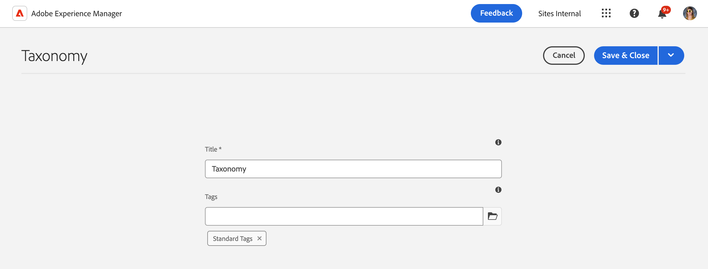

# Managing Taxonomy Data {#managing-taxonomy-data}

Learn how to manage taxonomy data for using tags with your AEM with Edge Delivery Services sites.

## Introduction {#introduction}

Tagging is an important feature that helps you organize and manage your pages. [The Tagging Console](/help/sites-cloud/administering/tags.md#tagging-console) in AEM allows you to create a rich taxonomy of tags to organize your pages.

These tags are useful not only for you and your authors in organizing your content, but can also be for your readers as well. Tags and their taxonomy can be used in components on the page to help your readers navigate your content.

The Universal Editor works only with the IDs of your tags. By creating a taxonomy page for your content, you expose the descriptions of these tags in all languages to the Universal Editor so it can use that information when rendering content.

## Creating a Taxonomy Page {#creating}

A taxonomy is created like [any other page in AEM.](/help/sites-cloud/authoring/sites-console/creating-pages.md)

1. Navigate to the [**Sites** console.](/help/sites-cloud/authoring/sites-console/introduction.md)

1. Select the location where you wish to create your taxonomy.

1. Tap or click **Create** -&gt; **Page**.

   

1. On the **Template** tab of the **Create Page** wizard, select the **Taxonomy** template and tap or click **Next**.

   

1. On the **Properties** tab of the **Create Page** wizard, provide a meaningful **Title** for the page and in the **Tags** field, [use the tag picker](/help/sites-cloud/authoring/sites-console/tags.md) to select the tag(s) or namespace(s) you wish to include in your taxonomy.

   

1. Tap or click **Create**.

The taxonomy page is created. In the **Success** dialog, you can tap or click **Done** dialog to dismiss the message or **Open** to edit the page in the [Page Editor.](/help/sites-cloud/authoring/page-editor/introduction.md)

Take note of the resulting page name of the taxonomy page for use in the following steps.

## Editing a Taxonomy Page {#editing}

You start editing a taxonomy page like any other page in AEM.

1. Navigate to the [**Sites** console.](/help/sites-cloud/authoring/sites-console/introduction.md)

1. Select the taxonomy you wish to edit.

1. Tap or click **Edit** in the action bar.

1. The Page Editor opens, showing the taxonomy.

   * The taxonomy page is read-only in the Page Editor.

   

1. Tap or click the **Page Information** icon in the toolbar and select **Open Properties**.

   

1. In the **Page Properties** window, you can update the name of the page and use the tag selector to update the tag(s) and namespace(s) included in your taxonomy.

   

1. Tap or click **Save &amp; Close**.

The page displayed in the Page Editor is read-only because the content of the taxonomy is generated automatically from the selected tag(s) and namespace(s). They act as a kind of filter for automatically generating the content of the taxonomy. Therefore there is no reason to directly edit the page in the editor.

AEM automatically updates the content of the taxonomy page when you update the underlying tag(s) and namespace(s). However you must [republish the taxonomy](#publishing) after any change in order to make those changes available to your users.

## Update paths.json for Taxonomy Publication {#paths-json}

Like when [managing and publishing tabular data for your Edge Delivery Services site,](/help/edge/wysiwyg-authoring/tabular-data.md) you need to update your `paths.json` file of your project to allow publication of your taxonomy data.

1. Open the root of your project in GitHub.

1. Tap or click the `paths.json` file to open its details and then the **Edit** icon.

   

1. Add a line to map your new taxonomy page to a `.json` resource.

   ```json
   {
     "mappings": [
      "/content/<site-name>/:/",
      "/content/<site-name>/<taxonomy-page-name>:/<taxonomy-json-name>.json"
     ]
   }
   ```

   * `<taxonomy-page-name>` must match the name of the [taxonomy page you created.](#creating)
   * `<taxonomy-json-name>` can be any valid name you choose.

1. Click **Commit changes...** to save the changes to `main`.

   * Either commit to `main` or create a pull request as per your process.

This process only needs to be done once per taxonomy page. Once done, you can publish your taxonomy.

>[!TIP]
>
>For more information about path mappings, please see the document [Path Mapping for Edge Delivery Services.](/help/edge/wysiwyg-authoring/path-mapping.md)

## Publishing a Taxonomy {#publishing}

A taxonomy is not available to the Universal Editor or your users until it is published.

Taxonomy pages are published like any other page by [using the **Quick Publish** or **Manage Publication** icons in the toolbar.](/help/sites-cloud/authoring/sites-console/publishing-pages.md)

You must republish your taxonomy page every time you:

* Edit the taxonomy page.
* Edit or add to the tag(s) and namespace(s) included in your taxonomy page.

If you create a new taxonomy page you must first [add a mapping to it to the `paths.json` file in your project.](#paths-json)

## Accessing Taxonomy Information {#accessing}

Once your taxonomy is published, its information can be leveraged by the Universal Editor and made visible to your users.

You can access the taxonomy as JSON data at the following address.

`https://<branch>--<repository>--<owner>.aem.page/<taxonomy-json-name>.json`

Use the `<taxonomy-json-name>` that you defined when [mapping your taxonomy to the `paths.json` file in your project.](#paths-json) The taxonomy data is returned as JSON data like in the following example.

```json
{
  "total": 3,
  "offset": 0,
  "limit": 3,
  "data": [
    {
      "tag": "default:",
      "title": "Standard Tags"
    },
    {
      "tag": "do-not-translate",
      "title": "Do Not Translate"
    },
    {
      "tag": "translate",
      "title": "Translate"
    }
  ],
  "columns": [
    "tag",
    "title"
  ],
  ":type": "sheet"
}
```

This JSON data will automatically update as you update the taxonomy and republish it. Your app can programmatically access this information for your users.

[If you maintain tags in multiple languages,](/help/sites-cloud/administering/tags.md#managing-tags-in-different-languages) you can access those languages by passing in the ISO2 language code as the value of a `sheet=` parameter.

## Exposing Additional Tag Properties {#additional-properties}

By default, your taxonomy will contain `tag` and `title` values as seen [in the previous example.](#accessing) You can configure your taxonomy to expose additional tag properties. In this example we will expose the tag description.

1. Use the Sites console to select the taxonomy you created.
1. Tap or click the **Properties** icon in the toolbar.
1. In the **Additional Properties** section, tap or click **Add** to add a field.
1. In the new field enter the JRC property name to expose. In this case, enter `jcr:description` for the tag description.
1. Tap or click **Save &amp; Close**.
1. With the taxonomy still selected, tap or click **Quick Publish** in the toolbar.

Now [when you access your taxonomy,](#accessing) the tag description (or whatever property you chose to expose) is included in the JSON.

```json

{
  "total": 3,
  "offset": 0,
  "limit": 3,
  "data": [
    {
      "tag": "default:",
      "title": "Standard Tags",
      "jcr:description": "These are the standard tags"
    },
    {
      "tag": "do-not-translate",
      "title": "Do Not Translate",
      "jcr:description": "Tag to mark pages that should not be translated"
    },
    {
      "tag": "translate",
      "title": "Translate",
      "jcr:description": "Tag to mark pages that should be translated"
    }
  ],
  "columns": [
    "tag",
    "title",
    "jcr:description"
  ],
  ":type": "sheet"
}
```
