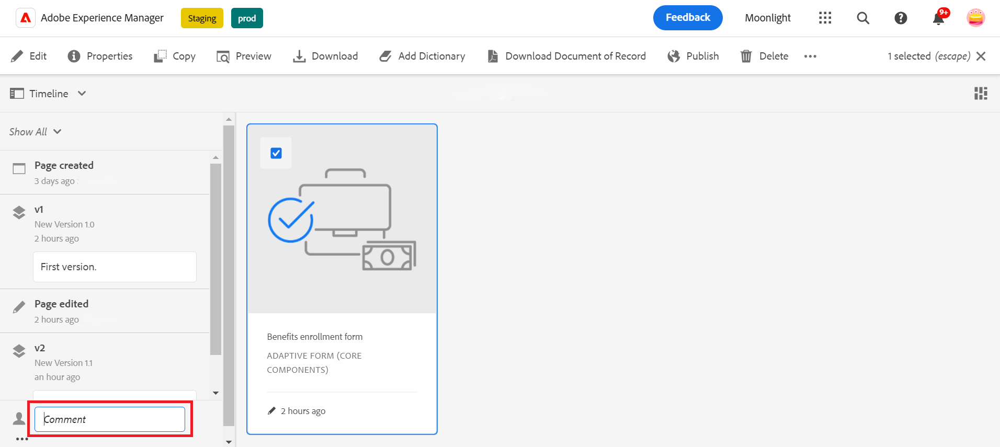

# Versioning, reviewing and commenting on an Adaptive Form

<!--Before you can use versionings, comments, and annotations in an Adaptive Form, you must ensure you have [enabled Adaptive Form Core Components](
https://experienceleague.adobe.com/en/docs/experience-manager-cloud-service/content/forms/setup-configure-migrate/enable-adaptive-forms-core-components).-->

<!--Adaptive Form Core Components facilitates to add versionings, comments, and annotations to a form. These features helps form authors and users to enhance the form development process where they can create multiple versions of a form, collaborate and add their comments to a form, and add annotations to form components.-->

 This is a pre-release feature and accessible through our [pre-release channel](https://experienceleague.adobe.com/docs/experience-manager-cloud-service/content/release-notes/prerelease.html#new-features). 

Adaptive Form Core Components provide functionality that enables form authors to incorporate versioning, commenting, and annotations into forms. These features serve to streamline the form development process by allowing users to create and manage multiple versions of a form, engage in collaborative discussions through comments, and attach annotations to specific form components, thereby enhancing the overall form-building experience.

## Adaptive Form versioning {#adaptive-form-versioning}

Adaptive form versioning helps add versions to a form. Form authors can easily create multiple versions of a form and finally use the one that is suitable for the business objectives. In addition, form users can also revert the form to the previous versions. It also facilitates authors to compare any two versions of a form by previewing them, allowing them to analyze forms better from UI perspectives. Let's go in detail for each adaptive form versioning functionality:

### Create a form version {#create-a-form-version}

To create version of a form, follow the steps given below:

1. Create a form or you use an existing form.
1. On AEM UI, navigate to the **[!UICONTROL Form]**>>**[!UICONTROL Forms & Documents]** and select your **Form**.
1. On the selection dropdown on the left panel, select **[!UICONTROL Versions]**.
        
1. Click the **three dots** located on the lower panel on the left, click **[!UICONTROL Save as Version]**.
1. Now, provide a label to the form version, and you can provide information about the form through the comment.
     

### Update a form version {#update-a-form-version}

When you edit and update your adaptive form, you add a new version to the form. Follow the steps given in the last section to name a new version of the form as shown in the image:

### Revert a form version {#revert-a-form-version}

To revert a form version to the previous, select a form version, click **[!UICONTROL Revert to this Version]**.

### Compare form versions {#compare-form-versions}

Form authors can compare two different versions of a form for previewing purposes. To compare versions, select any form version and click **[!UICONTROL Compare to Current]**. It shows two different form versions in preview mode.

## Add Comments {#add-comments}

A review is a mechanism that allows one or more reviewers to comment on forms. Any form user can comment on a form or review a form through comments. To comment on a form, select a **[!UICONTROL Form]**, and add a **[!UICONTROL Comment]** to the form.

   >[!NOTE]
   > When you use comments in adaptive form core components as discussed above, the form functionality [Creating and managing reviews to forms](/help/forms/create-reviews-forms.md) is disabled.

  

## Add Annotations {#adaptive-form-annotations}

In many cases, form group users are required to add annotations to a form for review purposes, for example, on a specific tab of a form or components of a form. In such cases, authors can use annotations. To add annotations to a form, perform the following steps:

1. Open a form in the **[!UICONTROL Edit]** mode.

1. Click the **add icon** located on the upper right rail as given in the image.
        

1. Click the **add icon** located on the upper left rail as given in the image to add the annotation.
        

1. Now, you can add comments, draw sketches with multiple colors to form components.

1. To see all your added annotations to a form, select your form, and you see the annotations added on the left panel, as shown in the image.

   

## See Also {#see-also}

{{see-also}}
