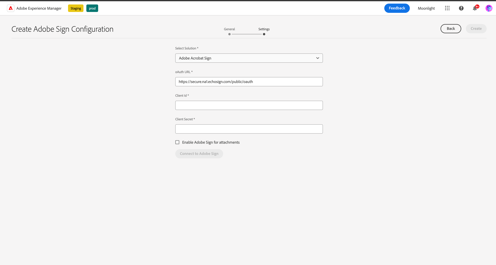
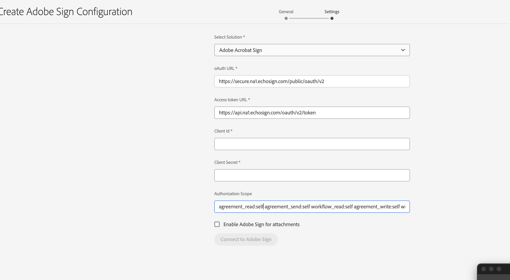

# Connect [!DNL AEM Forms] as a Cloud Service with [!DNL Adobe Acrobat Sign] {#integrate-adobe-sign-with-aem-forms}

| Version | Article link |
| -------- | ---------------------------- |
| AEM 6.5  |    [Click here](https://experienceleague.adobe.com/docs/experience-manager-65/forms/adaptive-forms-advanced-authoring/adobe-sign-integration-adaptive-forms.html#adobe-acrobat-sign-for-government)                  |
| AEM as a Cloud Service     | This article        |

[!DNL Adobe Acrobat Sign] enables e-signature workflows for Adaptive Forms and AEM Workflows. E-signatures improve workflows to process documents for legal, sales, payroll, human resource management, and many more areas.

In a typical [!DNL Adobe Acrobat Sign] and Adaptive Forms scenario, a user fills an Adaptive Form to apply for a service. For example, a credit card application and a citizen benefits form. When a user fills, submits, and signs the application form, the form is sent to the service provider for further action. Service provider reviews the application and uses [!DNL Adobe Acrobat Sign] to mark the application approved. AEM Forms supports both Adobe Acrobat Sign and Adobe Acrobat Sign Solutions for Government. Depending on your license and requirements, you can integrate or connect AEM Forms with either of the solution:

* [Connect AEM Forms with Adobe Acrobat Sign](#adobe-sign)
* [Connect AEM Forms with Adobe Acrobat Sign Solutions for Government](#adobe-acrobat-sign-for-government)

## Connect AEM Forms with Adobe Acrobat Sign {#adobe-sign}

To connect **[!DNL AEM Forms]** with **[!DNL Adobe Acrobat Sign]**, set up the software and accounts listed in the prerequisites section, and configure the Adobe Sign Cloud Service in your Forms as a Cloud Service Author and Publish instances:

### Prerequisites to connect AEM Forms with Adobe Acrobat Sign {#prerequisites-for-adobe-sign}

You require the following setup to integrate [!DNL Adobe Acrobat Sign] with [!DNL AEM Forms]:

1. An active [Adobe Acrobat Sign developer account](https://acrobat.adobe.com/us/en/sign/developer-form.html). 
1. An [Adobe Acrobat Sign API application](https://www.adobe.io/apis/documentcloud/sign/docs.html#!adobedocs/adobe-sign/master/gstarted/create_app.md).
1. Credentials (Client ID and Client Secret) of [!DNL Adobe Acrobat Sign] API application.
1. (Only for Government ID-based authentication) [Enable the authentication method](https://helpx.adobe.com/sign/using/adobesign-authentication-government-id.html#AuditReport) for Government ID authentication.

### Connect AEM Forms Author and publish instances with Adobe Acrobat Sign {#configure-adobe-sign-with-aem-forms}

After prerequisites are in place, perform the following steps to configure [!DNL Adobe Acrobat Sign] with [!DNL AEM Forms] on the Author instances.

1. On AEM Forms author instance, navigate to **[!UICONTROL Tools]**  &gt; **[!UICONTROL General]** &gt; **[!UICONTROL Configuration Browser]**.
1. On the **[!UICONTROL Configuration Browser]** page, select **[!UICONTROL Create]**.
1. In the **[!UICONTROL Create Configuration]** dialog, specify a **[!UICONTROL Title]** for the configuration, enable **[!UICONTROL Cloud Configurations]**, and select **[!UICONTROL Create]**. It creates a configuration container to store  Cloud Services. Ensure that the folder name does not contain any space.
1. Navigate to **[!UICONTROL Tools]**  &gt; **[!UICONTROL Cloud Services]** &gt; **[!UICONTROL Adobe Acrobat Sign]** and open the configuration container you created in the previous step.

   >[!NOTE]
   >
   >When you create an Adaptive Form, specify the container name in the **[!UICONTROL Configuration Container]** field.  
  
1. On the configuration page, select **[!UICONTROL Create]** to create [!DNL Adobe Acrobat Sign] configuration in AEM Forms.
1. In the **[!UICONTROL General]** tab of the **[!UICONTROL Create Adobe Acrobat Sign Configuration]** page, specify a **[!UICONTROL Name]** for the configuration, and select **[!UICONTROL Next]**. You can optionally specify a **[!UICONTROL Title]** and browse to select a **[!UICONTROL Thumbnail]** for the configuration.

1. Now you can **[!UICONTROL Select solution]** to select [!DNL Adobe Acrobat Sign].
   
   <!---->
   

<!--

[create URL](#create-a-redirect-url-for-your-aem-instance)
 -->

1. Copy the URL present in your current browser window to a notepad and remove the part `/ui#/aem` from the URL. The modified URL is then required to configure [!DNL Adobe Acrobat Sign] application with [!DNL AEM Forms], in a later step. Select **[!UICONTROL Next]**.

1.  In the **[!UICONTROL Settings]** tab,
      * the **[!UICONTROL OAuth URL]** field contains the default URL which includes the Adobe Sign database shard. The format of the URL is:

         `https://<shard>/public/oauth/v2`
   
         For example: 
         `https://secure.na1.echosign.com/public/oauth/v2`

      * the **[!UICONTROL Access token URL]** field contains the default URL which includes the Adobe Sign database shard. The format of the URL is:

         `https://<shard>/oauth/v2/token`
   
         For example: 
         `https://api.na1.echosign.com/oauth/v2/token`
   
      where:
   
      **na1** refers to the default database shard. You can modify the value for the database shard. Ensure that  the [!DNL  Adobe Acrobat Sign] Cloud Configurations point to the [correct Shard](https://helpx.adobe.com/sign/using/identify-account-shard.html).
   
      >[!NOTE]
      >
      >* Keep the **Create Adobe Acrobat Sign Configuration** page open. Do not close it. You can retrieve **Client Id** and **Client Secret** after configuring OAuth settings for the [!DNL Adobe Acrobat Sign] application as described in upcoming steps.
      > * After logging in your Adobe Sign account,navigate to **[!UICONTROL Acrobat Sign API]** > **[!UICONTROL API Information]** > **[!UICONTROL REST API Methods Documentation]** > **[!UICONTROL OAuth Access Token]** to access information related to Adobe Sign OAuth URL and Access Token URL.

1. Configure OAuth settings for the [!DNL Adobe Acrobat Sign] application:

    1. Open a browser window and sign in to your [!DNL Adobe Acrobat Sign] developer account.
    1. Select the application configured for [!DNL AEM Forms], and select **[!UICONTROL Configure OAuth for Application]**.
    1. In the **[!UICONTROL Redirect URL]** box, add the URL copied in a previous step (Step 8) and click **[!UICONTROL Save]**.
    1. Enable the following Scope for the [!DNL Adobe Acrobat Sign] application and click **[!UICONTROL Save]**.

    * [!DNL aggrement_read]
    * [!DNL aggrement_write]
    * [!DNL aggrement_send]
    * [!DNL widget_read]
    * [!DNL widget_write]
    * [!DNL workflow_read]

    >[!NOTE]
    > You can change the scopes modifier from `self` to `account` directly from AEM UI as given in the step 12.
    
   For step-by-step information to configure OAuth settings for an [!DNL Adobe Acrobat Sign] application and obtain the keys, see [Configure oAuth settings for the application](https://www.adobe.io/apis/documentcloud/sign/docs.html#!adobedocs/adobe-sign/master/gstarted/configure_oauth.md) developer documentation.

   

1. Go back to the **[!UICONTROL Create Adobe Acrobat Sign Configuration]** page. In the **[!UICONTROL Settings]** tab, specify the [**[!UICONTROL Client ID]** (also referred to as Application ID) and **[!UICONTROL Client Secret]**]. Use the [Client ID and Client Secret of Adobe Acrobat Sign application](https://opensource.adobe.com/acrobat-sign/developer_guide/helloworld.html#get-the-app-id-and-secret) you created in the previous step.

1. In the [!UICONTROL Authorization Scope] section, you can modify the scopes to either "account" or "self" by adding the prefix "self" or "account" to the scopes, as needed.
   

1. Select the **[!UICONTROL Enable Adobe Acrobat Sign for attachments]** option to append files attached to an Adaptive Form to the corresponding [!DNL Adobe Acrobat Sign] document sent for signing.

1. Select **[!UICONTROL Connect to Adobe Acrobat Sign]**. When prompted for credentials, provide **username** and **password** of the account used while creating [!DNL Adobe Acrobat Sign] application. When asked to confirm,  access for `your developer account`, Click **[!UICONTROL Allow Access]**. If the credentials are correct and you allow [!DNL AEM Forms] to access your [!DNL Adobe Acrobat Sign] developer account, a success message similar to the following appears.

   

1. Select **[!UICONTROL Create]** to create the [!DNL Adobe Acrobat Sign] configuration.

1. Select the configuration and click **[!UICONTROL Publish]**, select the configuration, and click **[!UICONTROL Publish]**. It replicates the configuration to corresponding publish environments.

1. Repeat all the above steps on your developer, stage, and production instances (whichever left) to complete configuring [!DNL Adobe Acrobat Sign] with [!DNL AEM Forms] for your environment.

Now, you can [use add Adobe Acrobat Sign fields to an Adaptive Form](working-with-adobe-sign.md). Ensure that you add the configuration container used for the Cloud Service to all the Adaptive Forms being enabled for [!DNL Adobe Acrobat Sign]. You can specify a configuration container from the  properties of an Adaptive Form.

>[!NOTE]
>
> To configure the Adobe Sign sandbox, you can follow the same configuration steps as explained in [Adobe Sign](#adobe-sign).

#### Troubleshooting {#resolve-config-error}

When you connect [!DNL Adobe Acrobat Sign] with [!DNL AEM Forms] and find an error `Unable to authorize access because the client configuration is invalid: invalid_request` as shown in the image below. You resolve this by following the steps given below:


1. Copy the URL present in your current browser window to a notepad and remove the part `/ui#/aem` from the URL.
1. Open a browser window and sign in to your [!DNL Adobe Acrobat Sign] developer account.
1. Select the application configured for [!DNL AEM Forms], and select **[!UICONTROL Configure OAuth for Application]**.
1. In the **[!UICONTROL Redirect URL]** box, add the URL copied in a previous step and click **[!UICONTROL Save]**.

## Connect AEM Forms with Adobe Acrobat Sign Solutions for Government {#adobe-acrobat-sign-for-government}

Connecting AEM Forms with Adobe Acrobat Sign Solutions for Government is a multi-step process. It involves: 

* Creating redirect URL for your AEM instances
* Sharing the redirect URL and scopes with Adobe Sign Solutions for Government team
* Receiving credentials from Adobe Sign team
* Using the received credentials to connect AEM Forms with Adobe Acrobat Sign Solutions for Government


AEM Forms as a Cloud Service provides development, stage, and production environments. You can start with connecting your development environment for with Adobe Acrobat Sign Solutions for Government and connect the stage and production environments later. 

### Before you start {#prerequisites-for-adobe-sign-for-acrobat-sign-for-government}

Before you start connecting AEM Forms with Adobe Acrobat Sign Solution, ensure that your [Adobe Acrobat Sign Solutions for Government](https://opensource.adobe.com/acrobat-sign/signgov/gstarted.html#account-provisioning) account is provisioned. 


### Connect AEM Forms as a Cloud Service with Adobe Acrobat Sign Solutions for Government {#connect-adobe-acrobat-sign-for-government}

#### Create a redirect URL for your AEM instance

1. On the Forms as a Cloud Service author instance, navigate to **[!UICONTROL Tools]**  &gt; **[!UICONTROL General]** &gt; **[!UICONTROL Configuration Browser]**.
1. On the **[!UICONTROL Configuration Browser]** page, select **[!UICONTROL Create]**.
1. In the **[!UICONTROL Create Configuration]** dialog, specify a **[!UICONTROL Title]** for the configuration, enable **[!UICONTROL Cloud Configurations]**, and select **[!UICONTROL Create]**. It creates a configuration container to store Cloud Services. Ensure that the folder name does not contain any space.
1. Navigate to **[!UICONTROL Tools]**  &gt; **[!UICONTROL Cloud Services]** &gt; **[!UICONTROL Adobe Acrobat Sign]** and open the configuration container you created in the previous step. When you create an Adaptive Form, specify the container name in the **[!UICONTROL Configuration Container]** field.  
1. On the configuration page, select **[!UICONTROL Create]** to create [!DNL Adobe Acrobat Sign] configuration in AEM Forms.
1. Copy the URL of your current browser window to a notepad and remove `/ui#/aem` from the URL. This URL is referred as `re-direct URL`. 
In the next section, you share the `re-direct URL` and `Scopes` with Adobe Sign team and request credentials (Client Id and Client Secret).  

#### Share the redirect URL and scopes with Adobe Sign team and receive credentials

Adobe Acrobat Sign for Government Solutions team requires the `re-direct URL` and the certain scopes to be enabled for your Adobe Acrobat Sign application (listed below) to generate credentials (Client Id and Client Secret) that allow you to connect AEM Forms with Adobe Acrobat Sign Solutions for Government.

Share the `scopes` (listed below) and the `re-direct URL` created and noted down the last step of previous section with your Adobe Acrobat Sign for Government Solution representative ([Adobe Professional Services team member](https://opensource.adobe.com/acrobat-sign/signgov/gstarted.html#password)).

**_Scopes_**

* [!DNL aggrement_read]
* [!DNL aggrement_write]
* [!DNL aggrement_send]
* [!DNL widget_read]
* [!DNL widget_write]
* [!DNL workflow_read]
* [!DNL offline_access]

The representative generates and shares credentials with you. In the next section, you use the credentials (Client Id and Client Secret) to connect AEM Forms with Adobe Acrobat Sign Solutions for Government.

#### Use the received credentials to connect AEM Forms with Adobe Acrobat Sign Solutions for Government

1.  Open the `re-direct URL` in your browser. You created and noted down the `re-direct URL` in the last step of the [create a redirect URL on your AEM instance](#create-a-redirect-url-for-your-aem-instance) section. 

1. In the **[!UICONTROL General]** tab of the **[!UICONTROL Create Adobe Sign Configuration]** page, specify a **[!UICONTROL Name]** for the configuration, and select **[!UICONTROL Next]**. You can optionally specify a **[!UICONTROL Title]** and browse to select a **[!UICONTROL Thumbnail]** for the configuration. Click **[!UICONTROL Next]**. 

1. In the **[!UICONTROL Settings]** tab of the **[!UICONTROL Create Adobe Sign Configuration]** page, for the **[!UICONTROL Select solution]** option, select [!DNL Adobe Acrobat Sign Solutions for Government].

   
      

1.  In the **[!UICONTROL Email]** filed, specify the email address associated with your Adobe Acrobat Sign Solutions for Government account.  

1.  In the **[!UICONTROL Settings]** tab,
      * the **[!UICONTROL OAuth URL]** field contains the default URL which includes the Adobe Sign database shard. The format of the URL is:

         `https://<shard>/api/gateway/adobesignauthservice/api/v1/authorize`
   
         For example: 
         `https://secure.na1.adobesign.us/api/gateway/adobesignauthservice/api/v1/authorize`

      * the **[!UICONTROL Access token URL]** field contains the default URL which includes the Adobe Sign database shard. The format of the URL is:

         `https://<shard>/api/gateway/adobesignauthservice/api/v1/token`
   
         For example: 
         `https://secure.na1.adobesign.us/api/gateway/adobesignauthservice/api/v1/token`
   
      where:
   
      **na1** refers to the default database shard. You can modify the value for the database shard. Ensure that  the [!DNL  Adobe Acrobat Sign] Cloud Configurations point to the [correct Shard](https://helpx.adobe.com/sign/using/identify-account-shard.html).  
   
      >[!NOTE]
      >
      > * After logging in your Adobe Sign account, navigate to **[!UICONTROL Acrobat Sign API]** > **[!UICONTROL API Information]** > **[!UICONTROL REST API Methods Documentation]** > **[!UICONTROL OAuth Access Token]** to access information related to Adobe Sign oAuth URL and Access Token URL.
 
1.  Use the credentials shared by  Adobe Acrobat Sign for Government Solution representative ([Adobe Professional Services team member]) in the previous section as [**[!UICONTROL Client ID]** and **[!UICONTROL Client Secret]**].  

1.  Select the **[!UICONTROL Enable Adobe Acrobat Sign for attachments]** option to append files attached to an Adaptive Form to the corresponding [!DNL Adobe Acrobat Sign] document sent for signing.

1.  Select **[!UICONTROL Connect to Adobe Sign]**. When prompted for credentials, provide username and password of the account used while creating [!DNL Adobe Acrobat Sign] application. When asked to confirm access for `your developer account`, Click **[!UICONTROL Allow Access]**. If the credentials are correct and you allow [!DNL AEM Forms] to access your [!DNL Adobe Acrobat Sign] developer account, a success message similar to the following appears.
     
      

      <!-- > When prompted for credentials, provide username and password of the account used while creating [!DNL Adobe Acrobat Sign] application. When asked to confirm access for `your developer account`, Click **[!UICONTROL Allow Access]**. --> 

1.  Select **[!UICONTROL Create]** to create the configuration.

1.  Select the configuration and click **[!UICONTROL Publish]**, select the configuration, and click **[!UICONTROL Publish]**. It replicates the configuration to the corresponding publish environments.

1.  Repeat all the above steps on your developer, stage, and production instances (whichever left) to complete configuring [!DNL Adobe Acrobat Sign Solutions for Government] with [!DNL AEM Forms] for your environment.

Now, you can [use add Adobe Acrobat Sign fields in an Adaptive Form](working-with-adobe-sign.md) or [AEM Workflow](/help/forms/aem-forms-workflow-step-reference.md#sign-document-step-sign-document-step). Ensure that you add the configuration container used for the Cloud Service configuration to all the Adaptive Forms being enabled for [!DNL Adobe Acrobat Sign]. You can specify a configuration container from the  properties of an Adaptive Form.

## Configure [!DNL Adobe Acrobat Sign] scheduler to sync the signing status {#configure-adobe-sign-scheduler-to-sync-the-signing-status}

AEM Forms as a Cloud Service, provides a scheduler service that checks the status of signers at defined intervals. The scenarios in which you configure the scheduler service: 

* If you use [Submit the form (after every recipient completes signing ceremony)](/help/forms/working-with-adobe-sign.md#select-adobe-sign-cloud-service-and-signing-order) to sign a document, the form is submitted only after all signers have signed the form.
* If you use the [Sign Step in an AEM Workflow](/help/forms/aem-forms-workflow-step-reference.md#sign-document-step) to sign a document, the sign step waits for all the signers to sign the document, before proceeding to the next step of the workflow.

By default, the [!DNL Adobe Acrobat Sign] Scheduler services checks (polls) signer response after every 24 hours. You can change the default interval for your environment.

To change the default interval, specify a [cron expression](https://en.wikipedia.org/wiki/Cron#CRON_expression) for the **sign.status.exp** property of the **Adobe Acrobat Sign Configuration Service** configuration.

For example, to run the configuration service daily at 00:00 am, set the **sign.status.exp** property of the **Adobe Acrobat Sign Configuration Service** configuration to specify `0 0 0 1/1 * ? *`. The following JSON file displays the sample to run the configuration service daily at 00:00 am:

```json
{
  "sign.status.exp":"0 0 0 1/1 * ? *"
}
```

To set values of a configuration, [Generate OSGi Configurations using the AEM SDK](https://experienceleague.adobe.com/docs/experience-manager-cloud-service/implementing/deploying/configuring-osgi.html?lang=en#generating-osgi-configurations-using-the-aem-sdk-quickstart), and [deploy the configuration](https://experienceleague.adobe.com/docs/experience-manager-cloud-service/implementing/using-cloud-manager/deploy-code.html?lang=en#deployment-process) to your Cloud Service instance.

## Frequently Asked Questions

* **Q: Can I render the Adobe Sign GovCloud Signature page in an iframe?**  
* **A:** Yes, you can render the Adobe Sign GovCloud Signature page in an iframe.

>[!MORELIKETHIS]
>
>* [E-sign a form using scribble signatures](/help/forms/signing-forms-using-scribble.md)
>* [Best practices for using Adobe Acrobat Sign with Adaptive Forms](https://medium.com/adobetech/using-adobe-sign-to-e-sign-an-adaptive-form-heres-the-best-way-to-do-it-dc3e15f9b684)
