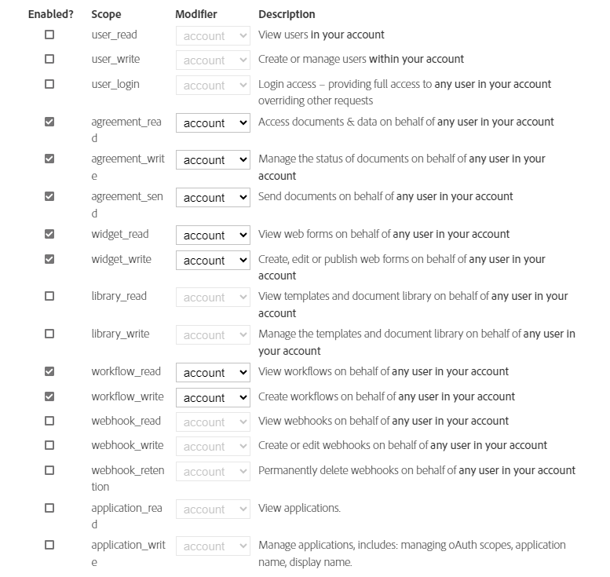

# Integrate [!DNL Adobe Sign] with [!DNL AEM Forms] as a Cloud Service  {#integrate-adobe-sign-with-aem-forms}

[!DNL Adobe Sign] enables e-signature workflows for Adaptive Forms. E-signatures improve workflows to process documents for legal, sales, payroll, human resource management, and many more areas.

In a typical [!DNL Adobe Sign] and Adaptive Forms scenario, a user fills an Adaptive Form to apply for a service. For example, a credit card application and a citizen benefits form. When a user fills, submits, and signs the application form, the form is sent to the service provider for further action. Service provider reviews the application and uses [!DNL Adobe Sign] to mark the application approved. To enable similar electronic-signature workflows, you can integrate [!DNL Adobe Sign] with [!DNL AEM Forms].

To use [!DNL Adobe Sign] with [!DNL AEM Forms], configure [!DNL Adobe Sign] in AEM Cloud Services:

## Prerequisites {#prerequisites}

You require the following to integrate [!DNL Adobe Sign] with [!DNL AEM Forms]:

* An active [Adobe Sign developer account](https://acrobat.adobe.com/us/en/sign/developer-form.html).
* An [Adobe Sign API application](https://www.adobe.io/apis/documentcloud/sign/docs.html#!adobedocs/adobe-sign/master/gstarted/create_app.md).
* Credentials (Client ID and Client Secret) of [!DNL Adobe Sign] API application.
* Use [identical crypto key](https://experienceleague.adobe.com/docs/experience-manager-65/administering/security/security-checklist.html?lang=en#make-sure-you-properly-replicate-encryption-keys-when-needed) for author and publish instances.
* (Only for Government ID based authentication) [Enable the authentication method](https://helpx.adobe.com/sign/using/adobesign-authentication-government-id.html#AuditReport) for Government ID authentication.

## Configure [!DNL Adobe Sign] with [!DNL AEM Forms] {#configure-adobe-sign-with-aem-forms}

After prerequisites are in place, perform the following steps to configure [!DNL Adobe Sign] with [!DNL AEM Forms] on the Author instances.

1. On AEM Forms author instance, navigate to **[!UICONTROL Tools]**  &gt; **[!UICONTROL General]** &gt; **[!UICONTROL Configuration Browser]**.
1. On the **[!UICONTROL Configuration Browser]** page, tap **[!UICONTROL Create]**.
1. In the **[!UICONTROL Create Configuration]** dialog, specify a **[!UICONTROL Title]** for the configuration, enable **[!UICONTROL Cloud Configurations]**, and tap **[!UICONTROL Create]**. It creates a configuration container to store  Cloud Services. Ensure that the folder name does not contain any space.
1. Navigate to **[!UICONTROL Tools]**  &gt; **[!UICONTROL Cloud Services]** &gt; **[!UICONTROL Adobe Sign]** and open the configuration container you created in the previous step.

   >[!NOTE]
   >
   >When you create an Adaptive Form, specify the container name in the **[!UICONTROL Configuration Container]** field.  
  
1. On the configuration page, tap **[!UICONTROL Create]** to create [!DNL Adobe Sign] configuration in AEM Forms.
1. In the **[!UICONTROL General]** tab of the **[!UICONTROL Create Adobe Sign Configuration]** page, specify a **[!UICONTROL Name]** for the configuration, and tap **[!UICONTROL Next]**. You can optionally specify a **[!UICONTROL Title]** and browse to select a **[!UICONTROL Thumbnail]** for the configuration. 

1. Copy the URL in your current browser window to a notepad. The URL is required to configure [!DNL Adobe Sign] application with [!DNL AEM Forms] in a later step. Tap **[!UICONTROL Next]**.

1.  In the **[!UICONTROL Settings]** tab, the **[!UICONTROL OAuth URL]** field contains the default URL. The format of the URL is:

      `https://<shard>/public/oAuth/v2`
   
      For example: 
      `https://secure.na1.echosign.com/public/oauth/v2`
   
      where:
   
      **na1** refers to the default database shard. You can modify the value for the database shard. Ensure that  the [!DNL  Adobe Sign] Cloud Configurations point to the [correct Shard](https://helpx.adobe.com/sign/using/identify-account-shard.html).
   
      If you create another [!DNL Adobe Sign] configuration for an Adobe Experience Manager feature or component, ensure that all the [!DNL Adobe Sign] Cloud Configurations point to the same shard.
   
      >[!NOTE]
      >
      > Keep the **Create Adobe Sign Configuration** page open. Do not close it. You can retrieve **Client Id** and **Client Secret** after configuring OAuth settings for the [!DNL Adobe Sign] application as described in upcoming steps.


1. Configure OAuth settings for the [!DNL Adobe Sign] application:

    1. Open a browser window and sign in to your [!DNL Adobe Sign] developer account.
    1. Select the application configured for [!DNL AEM Forms], and tap **[!UICONTROL Configure OAuth for Application]**.
    1. In the **[!UICONTROL Redirect URL]** box, add the URL copied in a previous step (Step 7) and click **[!UICONTROL Save]**.
    1. Enable the following Scope for the [!DNL Adobe Sign] application and click **[!UICONTROL Save]**.

    * [!DNL aggrement_read]
    * [!DNL aggrement_write]
    * [!DNL aggrement_send]
    * [!DNL widget_read]
    * [!DNL widget_write]
    * [!DNL workflow_read]

   For step-by-step information to configure OAuth settings for an [!DNL Adobe Sign] application and obtain the keys, see [Configure oAuth settings for the application](https://www.adobe.io/apis/documentcloud/sign/docs.html#!adobedocs/adobe-sign/master/gstarted/configure_oauth.md) developer documentation.

   

1. Go back to the **[!UICONTROL Create Adobe Sign Configuration]** page. In the **[!UICONTROL Settings]** tab, specify the [**[!UICONTROL Client ID]** (also referred to as Application ID) and **[!UICONTROL Client Secret]**]. Use the [Client ID and Client Secret of Adobe Sign application](https://opensource.adobe.com/acrobat-sign/developer_guide/helloworld.html#get-the-app-id-and-secret) you created in previous step.

1. Select the **[!UICONTROL Enable Adobe Sign for attachments]** option to append files attached to an Adaptive Form to the corresponding [!DNL Adobe Sign] document sent for signing.

1. Tap **[!UICONTROL Connect to Adobe Sign]**. When prompted for credentials, provide username and password of the account used while creating [!DNL Adobe Sign] application. When asked to confirm access for `your developer account`, Click **[!UICONTROL Allow Access]**. If the credentials are correct and you allow [!DNL AEM Forms] to access your [!DNL Adobe Sign] developer account, a success message similar to the following appears.

   

1. Tap **[!UICONTROL Create]** to create the [!DNL Adobe Sign] configuration.

1. Select the configuration and click **[!UICONTROL Publish]**, select the configuration, and click **[!UICONTROL Publish]**. It replicates the configuration to corresponding publish environments.

1. Repeat all the above steps on your developer, stage, and production instances (whichever left) to complete configuring [!DNL Adobe Sign] with [!DNL AEM Forms] for your environment.

Now, you can [use add Adobe Sign fields to an Adaptive Form](working-with-adobe-sign.md). Ensure that you add the configuration container used for the Cloud Service to all the Adaptive Forms being enabled for [!DNL Adobe Sign]. You can specify a configuration container from the  properties of an Adaptive Form.

## (For AEM Workflows only) Configure [!DNL Adobe Sign] scheduler to sync the signing status {#configure-adobe-sign-scheduler-to-sync-the-signing-status}

When you use [!DNL Adobe Sign] Workflow step to Sign an Adaptive Form, the form can be passed across signers one after another or can be sent to all the signers simultaneously, depending on the configuration of workflow step. [!DNL Adobe Sign] enabled Adaptive Forms are submitted to Experience Manager Forms Server only after all the signers complete the signing process.

By default, the [!DNL Adobe Sign] Scheduler services checks (polls) signer response after every 24 hours. You can change the default interval for your environment.

To change the default interval, specify a [cron expression](https://en.wikipedia.org/wiki/Cron#CRON_expression) for the **sign.status.exp** property of the **Adobe Sign Configuration Service** configuration.

For example, to run the configuration service daily at 00:00 am, set the **sign.status.exp** property of the **Adobe Sign Configuration Service** configuration to specify `0 0 0 1/1 * ? *`. The following JSON file displays the sample to run the configuration service daily at 00:00 am:

```json
{
  "sign.status.exp":"0 0 0 1/1 * ? *"
}
```

To set values of a configuration, [Generate OSGi Configurations using the AEM SDK](https://experienceleague.adobe.com/docs/experience-manager-cloud-service/implementing/deploying/configuring-osgi.html?lang=en#generating-osgi-configurations-using-the-aem-sdk-quickstart), and [deploy the configuration](https://experienceleague.adobe.com/docs/experience-manager-cloud-service/implementing/using-cloud-manager/deploy-code.html?lang=en#deployment-process) to your Cloud Service instance.

<!-- , perform the following steps:

1. Log in to [!DNL AEM Forms] Server with admin credentials and navigate to **[!UICONTROL Tools]** &gt;**[!UICONTROL Operations]** &gt; **[!UICONTROL Web Console]**.

   You can also open the following URL in a browser window:
   `https://server/system/console/configMgr`

1. Locate and open the **[!UICONTROL Adobe Sign Configuration Service]** option. Specify a [cron expression](https://en.wikipedia.org/wiki/Cron#CRON_expression) in the **Status Update Scheduler Expression** field and click **Save**. For example, to run the configuration service daily at 00:00 am, specify `0 0 0 1/1 * ? *` in the **Status Update Scheduler Expression** field.

Default interval to sync status of [!DNL Adobe Sign] is now changed. -->

## Related Articles {#related-articles}

* [Using Adobe Sign in an Adaptive Form](working-with-adobe-sign.md)

* [Best practices for using Adobe Sign with Adaptive Forms](https://medium.com/adobetech/using-adobe-sign-to-e-sign-an-adaptive-form-heres-the-best-way-to-do-it-dc3e15f9b684)
