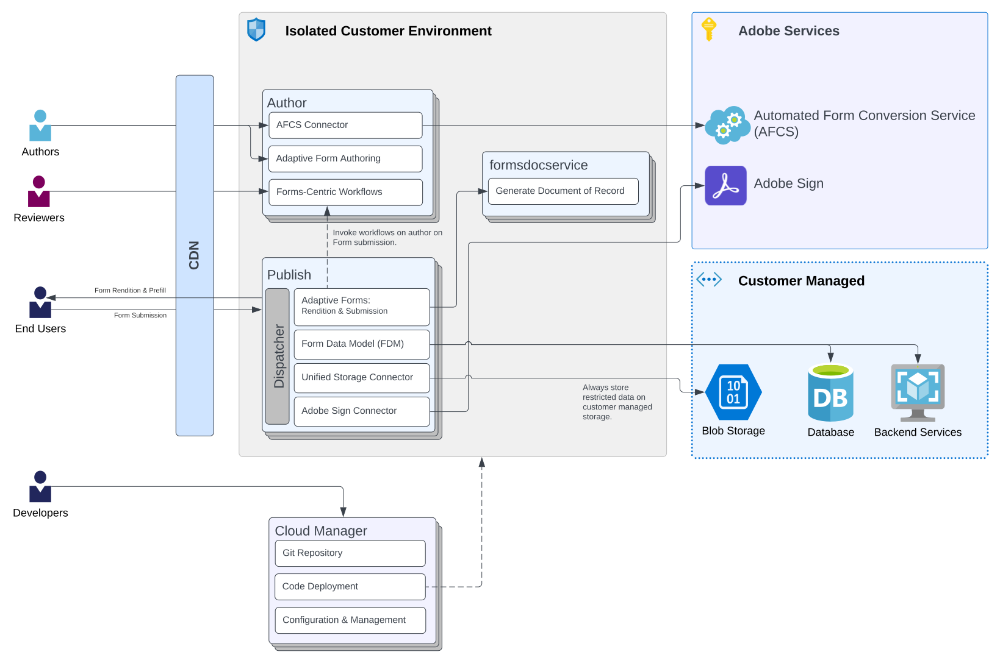
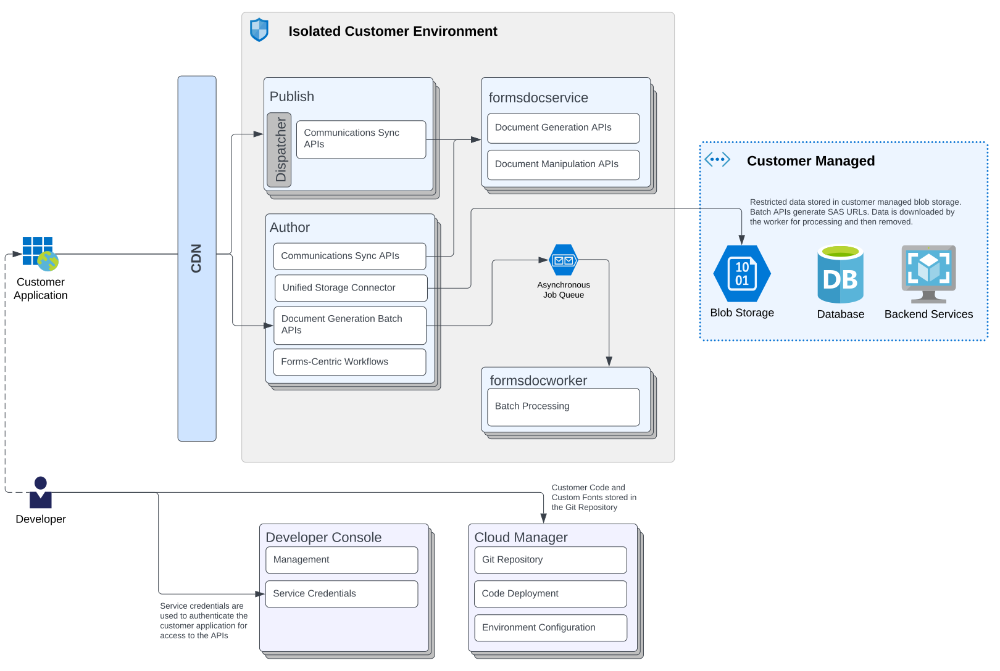

# [!DNL AEM] Forms as a Cloud Service architecture {#architecture}

[!DNL Adobe Experience Manager Forms] as a Cloud Service is a cloud-native solution for businesses to create, manage, publish, and update complex digital forms and communications while integrating submitted data with back-end processes, business rules, and saving data in an external data store. It extends [!DNL Adobe Experience Manager as a Cloud Service]. To learn more about scaling, deployment, environments and other infrastructure, see [An Introduction to the Architecture of [!DNL Adobe Experience Manager as a Cloud Service]](https://experienceleague.adobe.com/docs/experience-manager-cloud-service/core-concepts/architecture.html).

AEM Forms as a Cloud Service supports two major use cases: Digital Enrollment and Customer Communications. The following illustrations depict architecture for both the use cases.

## Architecture and flow diagrams

**Forms Digital Enrollment**

**Forms Communications**  

## Components

Forms as a Cloud Service comprises multiple components:

### CDN (Content Delivery Network)

Every AEM Forms as a Cloud Service program has access to [built-in CDN service](https://experienceleague.adobe.com/docs/experience-manager-cloud-service/content/implementing/content-delivery/cdn.html). It is included in the license of Forms as a Cloud Services.

### Author

An Author is an AEM Forms as a Cloud Service instance running in the standard Author run mode. It is intended for internal users, forms designers, and developers. An Author environment enables the following functionalities:

* Authoring and managing forms.
* Connecting to Automated forms conversion service to convert a PDF or XDP form to an adaptive form.
* Creating and running Forms-centric workflows.
* Managing adaptive forms assets.
* Managing Communications assets.
* Synchronous RESTful APIs (Real-time APIs) and Batch APIs to create, assemble, and deliver brand-oriented and personalized communications.
* Synchronous APIs to combine, rearrange, and validate PDF documents.

### Publish

A Publish instance is an AEM Forms as a Cloud Service running in the standard Publish run mode. Publish instances are intended for end users of form-based applications, for example, users accessing a public website and submitting forms. It enables the following functionalities:

* Rendering and submitting forms for end users.
* Transporting of raw-submitted form data for further processing and storage in the final system-of-record.
* Connecting to Customer Managed Storage to store data.
* Connecting with Adobe Sign to e-sign an adaptive form submission record.
* Sync APIs to create, assemble, and deliver brand-oriented and personalized communications.
* Sync APIs to combine, rearrange, and validate PDF documents.

Reverse Replication is not available on AEM as a Cloud Service to send content/data from the Publish Service to the Author Service. However, you can configure an Adaptive Forms running on Publish to submit data to a Workflow on an Author (Workflows can only be run on the Author). This is helpful in approval use-cases.

#### Dispatcher

[Dispatcher](https://experienceleague.adobe.com/docs/experience-manager-cloud-service/content/implementing/content-delivery/disp-overview.html) is Adobe Experience Manager’s caching and/or load-balancing tool that can be used with an enterprise-class web server.

### Adobe Services

**Automated Forms Conversion Service**

[Automated Forms Conversion service](https://experienceleague.adobe.com/docs/aem-forms-automated-conversion-service/using/introduction.html) automatically converts your PDF and XFA forms to device-friendly, responsive, and HTML5-based adaptive forms.

**Adobe Sign**

Adobe Sign is a cloud-based e-signature service that allows the user to send, sign, track, and manage signature processes using a browser or mobile device. You can integrate Adobe Sign with an adaptive form to automate signing workflows, simplify single and multi-signature processes, and to electronically sign adaptive forms.

<!-- **PDF Service API**
Adobe’s PDF Services API lets create, combine, export, and extract data from PDFs through powerful and flexible cloud-based APIs. -->

### Customer Managed Storage

Forms as a Cloud Service provide options to store content in an external storage system such as Blob Store, Database, or a storage service. You can also store in-process Workflows data (AEM Workflow Variables data) that contains Sensitive Personal Data (SPD) elements in a customer-managed repository for secure processing. Adobe recommends storing sensitive data on customer managed storages only.

You can use the **Unified Storage Connector** to connect to Blob Storage and **Form Data Model** to connect to  databases or backend services (RESTful, SOAP, Azure Blob Storage, and more).  

### Document Services

Document services constitute of the following:  

* **Output Service (Communications - Document Generation APIs)** helps create brand-approved, personalized, and standardized documents such as business correspondences, statements, claim processing letters, benefit notices, monthly bills, or welcome kits.

* **Assembler Service (Communications - Document Manipulation APIs)** helps combine, rearrange, and validate PDF documents.

* **Document of Record (DoR) Service** helps generate Document of Record (DoR). The service runs in its own pods separate form  Author and Publish instances of Forms as a Cloud Service. It helps provide a better performance and scale the pods independently depending on the load.  

### Cloud Manager

Cloud Manager is an essential component to [AEM as a Cloud Service](https://experienceleague.adobe.com/docs/experience-manager-cloud-service/overview/introduction.html). It is the single-entry point for the operations and developer persona of our customers. It is the place from where the AEM programs and environments can be managed. Cloud Manager has evolved as a self-service portal where the main components of the AEM as a Cloud Service can be created and configured:

* Creating and managing programs
* Creating and managing the AEM environments within the programs
* Creating and managing the pipelines for deploying the customer code and configuration to a particular environment
* Getting notified of important lifecycle events for these components (for example, product updates)
For more information about Cloud Manager, see [Understand Adobe Cloud Manager](https://experienceleague.adobe.com/docs/experience-manager-learn/foundation/cloud-manager/understand-cloud-manager-for-aem.html) and [Introduction to Cloud Manager](https://experienceleague.adobe.com/docs/experience-manager-cloud-manager/using/introduction-to-cloud-manager.html).

### Developer Console

A Developer Console provides various details of each running Forms as a Cloud service environment. These details are helpful in debugging the environment. For details, see [Debugging AEM as a Cloud Service with the Developer Console](https://experienceleague.adobe.com/docs/experience-manager-learn/cloud-service/debugging/debugging-aem-as-a-cloud-service/developer-console.html).

<!--

+++CDN (Content Delivery Network):

Every AEM Forms as a Cloud Service program has access to Fastly CDN service. It is included in the licence of Forms as a Cloud Services.

+++

+++Adaptive Forms
Adaptive Forms enable customers to author web-friendly reflowable web forms and fragments that are used by the customers for their data capture needs. This feature enables customers to manage their complex data capture needs easily, by leveraging multiple integrations with Adobe Sign, Document Services, Form Data Model, Automated Forms Conversion service, and more.

+++

+++Automated Forms Conversion Service (AFCS)
Automated Forms Conversion service helps accelerate digitization and modernization of data capture experience through automated conversion of PDF forms to adaptive forms. The service, powered by Adobe Sensei, automatically converts your PDF forms to device-friendly, responsive, and HTML5-based adaptive forms. While leveraging the existing investments in PDF Forms and XFA, the service also applies appropriate validations, styling, and layout to adaptive form fields during conversion.

+++

+++Form Data Model
The Form Data Model (FDM) feature is the standard way of creating data integrations with external/internal data sources and using them across the different Forms as a Cloud Service features. FDM provides a rich editor for customers to integrate, define, and manage relationships between the different entities and data sources and perform operations on them. Form data is stored in a data store hosted on the customer premises. Organizations can also use blob store hosted by the cloud provider and Adobe Experince Platform to store data.

+++

+++Forms Workflows
Forms-centric workflows is an extension to the default AEM Workflow and provides our customers with additional workflow capabilities like Form Data review, task assignment, and document services invocation.

+++

+++Communications
Forms as a Cloud Service offering consists of multiple services tailored specifically for document processing.

+++

+++Document of Record
A Document of Record is a PDF version of a form. It provides an ability to keep a record of the information  that you provide and submit in an Adaptive Form in PDF fromat. The service provides a default DoR template and tools to develop a custom template.

+++

## Terminologies

<!-- ## Cloud Manager{#cloud-manager}

Cloud Manager is an essential component to [AEM as a Cloud Service](https://experienceleague.adobe.com/docs/experience-manager-cloud-service/overview/introduction.html?lang=en). Each new tenant of the [!DNL AEM Forms] as a Cloud Service is first provisioned for Cloud Manager access. Cloud Manager is the single-entry point for the operations and developer persona of our customers. It is the place from where the AEM programs and environments can be managed. Cloud Manager has evolved as a self-service portal where the main components of the AEM as a Cloud Service can be created and configured:

* Creating and managing programs
* Creating and managing the AEM environments within the programs
* Creating and managing the pipelines for deploying the customer code and configuration to a particular environment
* Getting notified of important lifecycle events for these components (e.g. product updates)
For more information about Cloud Manager, see [Understand Adobe Cloud Manager](https://experienceleague.adobe.com/docs/experience-manager-learn/foundation/cloud-manager/understand-cloud-manager-for-aem.html) and [Introduction to Cloud Manager](https://experienceleague.adobe.com/docs/experience-manager-cloud-manager/using/introduction-to-cloud-manager.html).

## Users and Authentication {#users-and-authentication}

AEM as a Cloud Service includes Admin Console support for AEM instances and Adobe Identity Management System (IMS) based authentication. The Admin Console allows administrators to centrally manage all Experience Cloud users. Users and Groups can be assigned to product profiles associated with AEM as a Cloud Service instances, allowing them to log in to that instance. For more information about users, authentication, and, and accessing an instance of AEM as a Cloud Service, see [IMS Support for [!DNL Adobe Experience Manager] as a Cloud Service](https://experienceleague.adobe.com/docs/experience-manager-cloud-service/security/ims-support.html?lang=en#introduction).

Various personas are involved in a typical [!DNL AEM Forms] project. After you log in to your [!DNL AEM Forms] as a Cloud Service instance, you can [add users in admin console](https://experienceleague.adobe.com/docs/experience-manager-cloud-service/security/ims-support.html) for personas applicable to your organization or project and [assign users to built-in groups](forms-groups-privileges-tasks.md) to provide them required privileges.

To learn various in-built [!DNL AEM Forms] specific user groups and privileges available on [!DNL AEM Forms] as a Cloud Services instance, see [Configure, user, roles and groups](forms-groups-privileges-tasks.md). 

## Developer Experience {#developer-experience}

The new architecture supporting AEM as a Cloud Service brings some key changes to the overall developer experience. One of the major goals for the changes to developer experience is to allow migration to AEM as a Cloud Service as quickly as possible, with little modifications to existing custom code.

## Cloud development {#cloud-development}

Here are the guidelines to run your existing code smoothly on AEM as a Cloud Service environment:

* Store your code and configurations to the Git repository of the associated Cloud Manager program. It makes managing and integrating code with CI/CD a breeze.  
* Make application code and configuration compatible with the baseline [!DNL AEM Forms] images. Using the latest APIs helps to build faster and secure applications.
* Use the Cloud Manager pipeline associated with the Cloud Manager environment to build and deploy applications. It helps you bring the latest features and bug fixed for [!DNL AEM Forms] as a Cloud Service to your environment.
* Try that your custom applications pass all the code quality, security, and performance gates enforced in the pipeline. It helps build secure and better performing applications which leads to better customer experience. You can always use Cloud Manager UI to skip some checks.
This process is commonly referred to as cloud-first development. [!DNL AEM Forms] as a Cloud Service also provides an SDK to support rapid development before the pending code and configuration changes are attempted in the cloud.
Some interfaces that were previously part of the AEM QuickStart are no longer available to the users of the AEM as a Cloud Service environment. For instance, the Web Console where OSGI bundles and their associated configuration are managed. The CRXDE Lite content repository browser becomes only accessible on non-production environment types. A subset of the Web Console functionalities that developers require, especially when it comes to diagnostics and status purposes, is made available via a new developer console.
Also, one of the most common requirements for developers is quick access to the log files of the various environments. With [!DNL AEM Cloud Service], the log files of the different nodes in the Author, Publish are made available via the Cloud Manager, either in the form of files that can be downloaded or via APIs for tailing the logs. Due to the clear separation of code and content, developers can leverage a particular process for updating content as part of a deployment. The typical use cases for mutable content are:
* Standard “default” content that is part of the customer project (e.g. folders, templates, workflows...)
* Search index definitions
* ACLs and permissions
* Service users and user groups
Set up your development environment, [Configure your CI/CD Pipeline](https://experienceleague.adobe.com/docs/experience-manager-cloud-manager/using/how-to-use/configuring-pipeline.html), and learn to [deploy your code](https://experienceleague.adobe.com/docs/experience-manager-cloud-manager/using/how-to-use/deploying-code.html) on the environment. -->

### Adaptive Form Authoring {#local-development}

When you set up and configure an [!DNL AEM Forms] as a Cloud Service environment, you set up development, staging, and production environments. In addition, set up and configure a local development environment for rapid iterations and development. You can download and set up AEM SDK and [!DNL AEM Forms] add-on feature archive to set up a local [!DNL Forms] as a Cloud Service development environment.  For detailed instructions, see [Set up a local development environment](setup-local-development-environment.md).

## Debugging {#debugging}

AEM as a Cloud Service runs on self-service, scalable, cloud infrastructure. It requires AEM developers to understand and debug various facets of AEM as a Cloud Service, from build, and deploy to obtaining details of running AEM applications. For detailed information, see [Debugging AEM as a Cloud Service](https://experienceleague.adobe.com/docs/experience-manager-learn/cloud-service/debugging/debugging-aem-as-a-cloud-service/overview.html).
