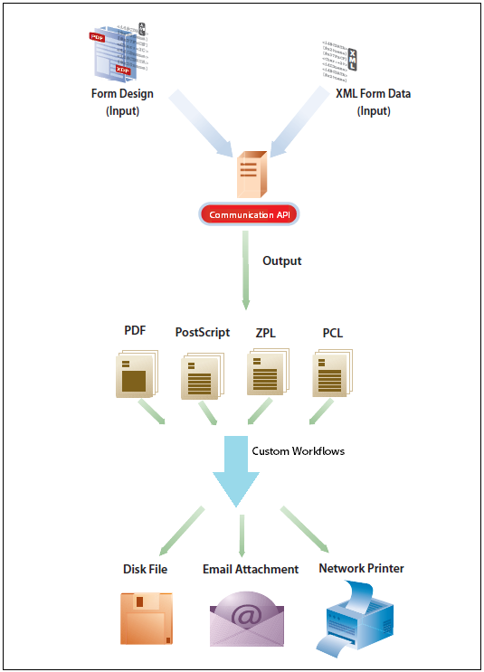
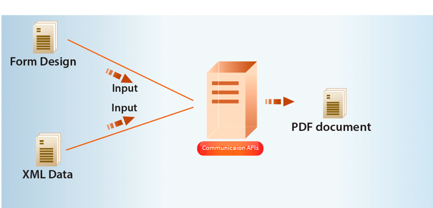
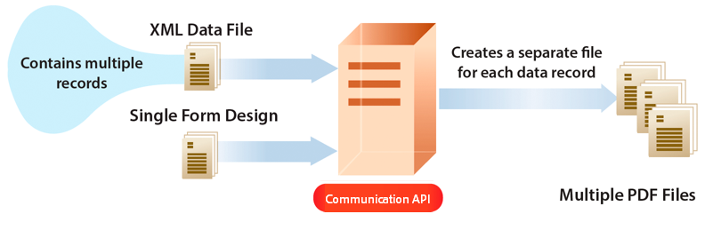
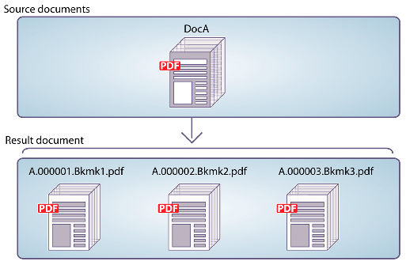
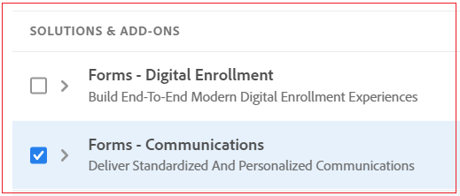
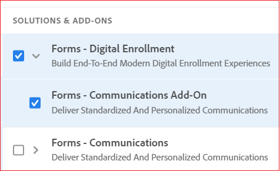

# AEM Forms as a Cloud Service Communication APIs {#communications-apis-overview}

> **Version Availability**
>
> * **AEM 6.5**: [Overview of AEM Document Services](https://experienceleague.adobe.com/docs/experience-manager-65/forms/use-document-services/overview-aem-document-services.html)
> * **AEM as a Cloud Service**: This article

## Introduction

Communications APIs in AEM Forms as a Cloud Service help you create brand-approved, personalized, and standardized documents for your business needs. These powerful APIs enable you to generate, manipulate, and secure documents programmatically, whether on-demand or in high-volume batch processes.

### Key Benefits

* **Streamlined document generation** - Create personalized documents by merging templates with customer data
* **Powerful document manipulation** - Combine, rearrange, and validate PDF documents programmatically
* **Flexible deployment options** - Use on-demand APIs for low-latency needs or batch APIs for high-throughput operations
* **Enhanced security** - Apply digital signatures, certification, and encryption to protect sensitive documents
* **Cloud-native architecture** - Leverage scalable, secure cloud infrastructure with no maintenance overhead

## Key Capabilities

Communications APIs provide a comprehensive set of document processing capabilities organized into the following functional areas:

| Document Generation | Document Manipulation | Document Extraction | Document Conversion | Document Assurance |
|---------------------|----------------------|---------------------|---------------------|-------------------|
| Generate personalized documents by merging templates with data in various formats including PDF and print formats. | Combine, rearrange, and validate PDF documents programmatically to create new document packages. | Extract properties, metadata, and content from PDF documents for further processing. | Convert documents between formats, including PDF/A compliance validation for archival needs. | Apply digital signatures, certification, and encryption to secure and protect documents. |

## Document Generation

Communications document generation APIs combine templates (XFA or PDF) with customer data (XML) to create personalized documents in PDF and various print formats (PS, PCL, DPL, IPL, ZPL).

### How Document Generation Works

The typical workflow involves:

1. Creating a template using [Designer](use-forms-designer.md)
2. Preparing XML data to populate the template
3. Using Communications APIs to merge the template with data
4. Generating output documents in your desired format

### Create PDF Documents

The document generation APIs allow you to create non-interactive PDF documents by merging XML data with form templates:

You can deliver the generated PDFs to users through downloads, store them in a repository, or optionally upload them to Azure Blob Storage.

Uploading generated PDFs to Azure Blob Storage is available through the [Early Adopter Program](/help/forms/early-access-ea-features.md). Contact aem-forms-ea@adobe.com from your official email to join.

### Create Print Format Documents

Generate documents in print formats including:
* PostScript (PS)
* Printer Command Language (PCL)
* Zebra Printing Language (ZPL)

These formats are ideal for high-volume printing operations and specialized printing needs.

### Batch Processing for Multiple Documents

Process large volumes of documents efficiently using batch APIs:

Batch processing allows you to:

* Generate separate documents for each record in an XML data source
* Process documents asynchronously for better performance
* Configure various conversion parameters for the batch process

## Document Manipulation

Document manipulation APIs help you combine, rearrange, and transform PDF documents programmatically.

### Document Assembly

Combine multiple PDF or XDP documents into a single cohesive document:

Document assembly capabilities include:
* Creating simple PDF documents from multiple sources
* Building PDF Portfolios
* Assembling encrypted documents
* Adding Bates numbering for legal documents
* Flattening and assembling interactive forms

### Document Disassembly

Break down large PDF documents into smaller, more manageable components:

Document disassembly allows you to:
* Extract specific pages from source documents
* Divide documents based on bookmarks
* Create logical document sets from larger compilations

>[!NOTE]
>
> AEM Forms includes many built-in fonts that integrate seamlessly with PDF files. For a complete list of supported fonts, [click here](/help/forms/supported-out-of-the-box-fonts.md).

## Document Extraction

Document Extraction is available through the [Early Adopter Program](/help/forms/early-access-ea-features.md). Contact aem-forms-ea@adobe.com from your official email to join.

Document Extraction APIs allow you to retrieve information from PDF documents, including:

* Document properties (is it a fillable form, does it have attachments, etc.)
* Usage rights and permissions
* Metadata information using Adobe Extensible Metadata Platform (XMP)

This capability is particularly useful for document management systems, archiving solutions, and workflow automation.

## Document Conversion

### PDF/A Conversion and Validation

Convert standard PDF documents to PDF/A format for long-term archival purposes:

* Support for PDF/A-1a, 1b, 2a, 2b, 3a, and 3b compliance standards
* Validation of PDF/A compliance
* Preservation of document integrity with embedded fonts and uncompressed content

### PDF to XDP Conversion

PDF to XDP conversion is available through the [Early Adopter Program](/help/forms/early-access-ea-features.md). Contact aem-forms-ea@adobe.com from your official email to join.

Convert PDF documents containing XFA streams to XDP format for template editing and reuse.

## Document Assurance {#doc-assurance}

Document Assurance includes Signature and Encryption APIs to protect your documents throughout their lifecycle.

### Signature APIs

Protect PDF documents with digital signatures and certification:

* Add visible or invisible signature fields
* Digitally sign signature fields
* Certify documents for integrity
* Remove signatures from documents
* Delete signature fields from documents

Signature removal and signature field deletion are available through the [Early Adopter Program](/help/forms/early-access-ea-features.md). Contact aem-forms-ea@adobe.com from your official email to join.

### Encryption APIs

Secure document content with encryption:

* Encrypt PDF documents with passwords
* Remove password-based encryption
* Determine security types applied to documents
* Retrieve security information from protected documents

### Document Utilities {#doc-utility}

Document utilities provide additional functionality for working with PDF documents:

#### Usage Rights APIs (Reader Extension)

Usage Rights (Reader Extension) is available through the [Early Adopter Program](/help/forms/early-access-ea-features.md). Contact aem-forms-ea@adobe.com from your official email to join.

Extend the functionality of Adobe Reader by adding usage rights to PDF documents, enabling features like:

* Form filling and saving
* Adding comments and annotations
* Digital signing
* File attachments
* Form data import/export
* Access to web services and databases

Available usage rights include:

* **Form Interaction**: Form Fill In, Form Data Import/Export, Dynamic Form Fields/Pages
* **Annotations**: Comments (online and offline), Digital Signatures
* **Document Handling**: Embedded Files, Submit Standalone, Barcodes Decoding
* **Online Services**: Online Forms, access to web services

## Types of Communications APIs {#types}

Communications provides two types of APIs to suit different use cases:

### Synchronous APIs

**Best for**: On-demand, low-latency, single document generation
**Use cases**: User-triggered document generation, interactive applications
**Documentation**: [Synchronous API Reference](https://developer.adobe.com/experience-manager-forms-cloud-service-developer-reference/)

### Batch APIs (Asynchronous)

**Best for**: Scheduled, high-throughput, multiple document generation
**Use cases**: Monthly statements, bills, notices, scheduled reports
**Documentation**: [Batch API Reference](https://developer.adobe.com/experience-manager-forms-cloud-service-developer-reference/)

## Getting Started with Communications APIs

### Onboarding Process

Communications is available as a standalone module or add-on for Forms as a Cloud Service users:

1. Contact Adobe Sales or your Adobe representative to request access
2. Adobe will enable access for your organization and grant administrator privileges
3. Your administrator can then grant access to developers in your organization

### Enabling Communications in Your Environment

Follow these steps to enable Communications for your Forms as a Cloud Service environment:

1. Log in to Cloud Manager and open your AEM Forms as a Cloud Service Instance
2. Open the Edit Program option and go to the Solutions & Add-ons tab
3. Select the **[!UICONTROL Forms - Communications]** option

   

   If you've already enabled **[!UICONTROL Forms - Digital Enrollment]**, select the **[!UICONTROL Forms - Communications Add-On]** option instead.

   

4. Click **[!UICONTROL Update]**
5. Run the build pipeline - Communications APIs will be enabled after successful completion

>[!NOTE]
>
> To enable document manipulation APIs, add the following rule to your [Dispatcher configuration](setup-local-development-environment.md#forms-specific-rules-to-dispatcher):
>
> `# Allow Forms Doc Generation requests`
> `/0062 { /type "allow" /method "POST" /url "/adobe/forms/assembler/*" }`

## API Reference Documentation {#api-reference}

Communications APIs are organized into several functional categories, each with detailed reference documentation. These API references provide comprehensive information about endpoints, parameters, request/response formats, and authentication requirements.

### Document Generation APIs

| API | Description | Reference Link |
|-----|-------------|----------------|
| Document Generation - Synchronous | Generate documents on-demand with low latency for interactive scenarios | [API Reference](https://developer.adobe.com/experience-manager-forms-cloud-service-developer-reference/api/output-sync/) |
| Document Generation - Batch | Process high volumes of documents asynchronously for scheduled operations | [API Reference](https://developer.adobe.com/experience-manager-forms-cloud-service-developer-reference/api/output-batch/) |

### Document Manipulation APIs

| API | Description | Reference Link |
|-----|-------------|----------------|
| Document Manipulation - Synchronous | Combine, split, and transform PDF documents using DDX instructions | [API Reference](https://developer.adobe.com/experience-manager-forms-cloud-service-developer-reference/api/assembler-sync/) |

### Document Assurance APIs

| API | Description | Reference Link |
|-----|-------------|----------------|
| DocAssurance - Synchronous | Apply digital signatures, certification, encryption, and reader extensions | [API Reference](https://developer.adobe.com/experience-manager-forms-cloud-service-developer-reference/api/docassurance/) |

### Common API Parameters

Each API category has specific parameters, but some common parameters include:

#### Document Generation Parameters

| Parameter | Type | Required | Description |
|-----------|------|----------|-------------|
| `template` | String | Yes | Path to the XDP or PDF template file |
| `data` | String | No | XML data to merge with the template |
| `outputOptions` | Object | No | Configuration options for the output document |

#### Document Manipulation Parameters

| Parameter | Type | Required | Description |
|-----------|------|----------|-------------|
| `ddx` | String | Yes | DDX instructions for document assembly or disassembly |
| `inputDocuments` | Object | Yes | Map of input documents to be processed |
| `outputOptions` | Object | No | Configuration options for the output document |

#### Document Assurance Parameters

| Parameter | Type | Required | Description |
|-----------|------|----------|-------------|
| `inputPDF` | String | Yes | Input PDF document to be secured or signed |
| `certificateAlias` | String | Conditional | Alias of the certificate for signing operations |
| `credentialPassword` | String | Conditional | Password for the credential used in signing |

For complete parameter details, authentication requirements, and example requests/responses, refer to the specific API reference documentation linked in the tables above.

## Additional Resources {#see-also}

* [Communication Processing - Synchronous APIs](/help/forms/aem-forms-cloud-service-communications.md)
* [Communication Processing - Batch APIs](/help/forms/aem-forms-cloud-service-communications-batch-processing.md)
* [AEM Forms as a Cloud Service Architecture](/help/forms/aem-forms-cloud-service-architecture.md)
* [API Reference Documentation](https://developer.adobe.com/experience-cloud/experience-manager-apis/api/experimental/document/)
* [Early Adopter Program Features](/help/forms/early-access-ea-features.md)
