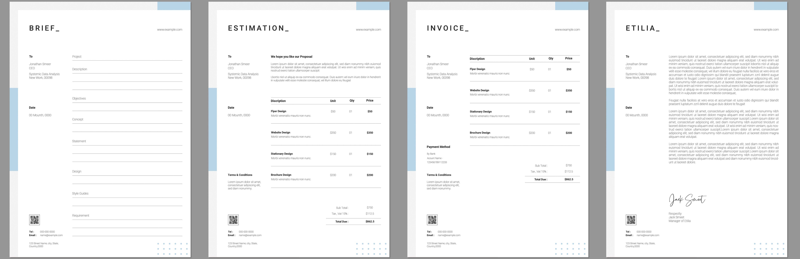

# AEM Forms as a Cloud Service Communication APIs {#frequently-asked-questions}

| Version | Article link |
| -------- | ---------------------------- |
| AEM 6.5  |    [Click here](https://experienceleague.adobe.com/docs/experience-manager-65/forms/use-document-services/overview-aem-document-services.html)                  |
| AEM as a Cloud Service     | This article        |

Communications capability helps you to create brand-approved, personalized, and standardized documents such as business correspondences, statements, claim processing letters, benefit notices, monthly bills, or welcome kits.

The capability provides APIs to generate and manipulate the documents. You can generate or manipulate a document on demand or create a batch job to generate multiple documents at defined intervals. Communications APIs provide:

* streamlined on-demand and batch documentation generation capabilities.

* capability to combine, rearrange, and validate PDF documents on-demand.

* HTTP APIs for easier integration with external systems. Separate APIs for on demand (low-latency) and batch operations (high-throughput operations) are included.

* a secure access to data. Communications APIs connect to and access data only from customer-designated data repositories, making Communications highly secure.

The [API reference documentation](https://developer.adobe.com/experience-cloud/experience-manager-apis/api/experimental/document/) provides detailed information about all the parameters, authentication methods, and various services provided by APIs. The API reference documentation is also available in the .yaml format. You can download the .yaml and upload it to Postman to check the functionality of the APIs.

<!-- 

A credit card statement can be created using Communications APIs. This sample statement uses same template but separate data for each customer depending on their usage of credit card.

-->

## Document Generation

Communications document generation APIs help to combine a template (XFA or PDF) with customer data (XML) to generate documents in PDF and Print Formats like PS, PCL, DPL, IPL, and ZPL formats. These APIs utilize PDF and XFA templates with [XML data](communications-known-issues-limitations.md#form-data) to generate a single document on demand or multiple documents using a batch job.

Typically, you create a template using [Designer](use-forms-designer.md) and use Communications APIs to merge data with the template. Your application can send the output document to a network printer, a local printer, or to a storage system for archival. A typical out of the box and custom workflows look like the following:

Depending on the use case, you can also make these documents available for download via your Website or a storage server.

Some examples of document generation APIs are:

### Create PDF documents {#create-pdf-documents}

You can use the document generation APIs to create a PDF document that is based on a form design and XML form data. The output is a non-interactive PDF document. That is, users cannot enter or modify the form data. A basic workflow is to merge XML form data with a form design to create a PDF document. The following Illustration shows the merging of a form design and XML form data to produce a PDF document.

Figure: Typical workflow to create a PDF document

The document generation API returns the generated PDF document. You can also optionally upload the generated PDFs to Azure Blob Storage.

 Uploading the generated PDFs using document generation API to Azure Blob Storage capability is under [Early Adopter Program](/help/forms/early-access-ea-features.md). You can write to aem-forms-ea@adobe.com from your official email id to join the early adopter program and request access to the capability. 

### Create PostScript (PS), Printer Command Language (PCL), Zebra Printing Language (ZPL) document {#create-PS-PCL-ZPL-documents}

You can use document generation APIs to create PostScript (PS), Printer Command Language (PCL), and Zebra Printing Language (ZPL) document that is based on an XDP form design or PDF document. These APIs help to merge a form design with form data to generate a document. You can save the document to a file and develop a custom process to send it to a printer.

<!-- ### Processing batch data to create multiple documents

Communications APIs can create separate documents for each record within an XML batch data source. The APIs can also create a single document that contains all records (this functionality is the default). Assume that an XML data source contains ten records and you instruct the APIs to create a separate document for each record (for example, PDF documents). As a result, the APIs generate ten PDF documents.

The following illustration also shows Communications APIs processing an XML data file that contains multiple records. However, assume that you instruct the APIs to create a single PDF document that contains all data records. In this situation, the APIs generate one document that contains all the records.

The following illustration shows Communications APIs processing an XML data file that con tains multiple records. Assume that you instruct the Communications APIs to create a separate PDF document for each data record. In this situation, the APIs generates a separate PDF document for each data record.

 -->

### Processing batch data to create multiple documents {#processing-batch-data-to-create-multiple-documents}

You can use document generation APIs to create separate documents for each record within an XML batch data source. You can generate documents in bulk and asynchronous mode. You can configure various parameters for the conversion and then start the batch process.

<!-- You can can also create a single document that contains all records (this functionality is the default).  Assume that an XML data source contains ten records and you have a requirement to create a separate document for each record (for example, PDF documents). You can use the Communication APIs to generate ten PDF documents. -->

<!-- The following illustration shows the Communication APIs processing an XML data file that contains multiple records. However, assume that you instruct the Communication APIs to create a single PDF document that contains all data records. In this situation, the Communication APIs generate one document that contains all the records.

The following illustration shows the Communication APIs processing an XML data file that contains multiple records. Assume that you instruct the Communication APIs to create a separate PDF document for each data record. In this situation, the Communication APIs generates a separate PDF document for each data record.

For detailed information on using Batch APIs, see Communication APIs: Processing batch data to create multiple documents. 

### Flatten interactive PDF documents {#flatten-interactive-pdf-documents}

You can use document generation APIs to transform an interactive PDF document (for example, a form) to a non-interactive PDF document. An interactive PDF document lets users enter or modify data located in the PDF document fields. The process of transforming an interactive PDF document to a non-interactive PDF document is called flattening. When a PDF document is flattened, a user cannot modify the data located in the document's fields. One reason to flatten a PDF document is to ensure that data cannot be modified.

You can flatten the following types of PDF documents:

* Interactive PDF documents created in Designer (that contain XFA streams).

* Acrobat PDF forms

If you attempt to flatten a non-interactive PDF document, an exception occurs.

### Retain Form State {#retain-form-state}

An interactive PDF document contains various elements that constitute a form. These elements may include fields (to accept or display data), buttons (to trigger events), and scripts (commands to perform a specific action). Clicking a button may trigger an event that changes the state of a field. For example, choosing a gender option may change the color of a field or the appearance of the form. This is an example of a manual event causing the form state to change.

When such an interactive PDF document is flattened using the Communications APIs, the state of the form is not retained. To ensure that the state of the form is retained even after the form is flattened, set the Boolean value _retainFormState_ to True to save and retain the state of the form. -->

## Document Manipulation

Communications document manipulation (Document Transformation) APIs help to combine, rearrange PDF documents. Typically, you create a DDX and submit it to document manipulation APIs to assemble or rearrange a document. The [DDX document](https://helpx.adobe.com/content/dam/help/en/experience-manager/forms-cloud-service/ddxRef.pdf) provides instructions on how to use the source documents to produce a set of required documents. The DDX reference documentation provides detailed information about all the supported operations. Some examples of document manipulation are:

### Assemble PDF documents

You can use the document manipulation APIs to assemble two or more PDF or XDP documents into a single PDF document or PDF Portfolio. Here are some of the ways that you can assemble PDF documents:

* Assemble a simple PDF document
* Create a PDF Portfolio
* Assemble encrypted documents
* Assemble documents using Bates numbering
* Flatten and assemble documents

Figure: Assembling a simple PDF document from multiple PDF documents

### Disassemble PDF documents

You can use the document manipulation APIs to disassemble a PDF document. The APIs can extract pages from the source document or divide a source document based on bookmarks. Typically, this task is useful if the PDF document was originally created from many individual documents, such as a collection of statements.

* Extract pages from a source document
* Divide a source document based on bookmarks

Figure: Dividing a source document based on bookmarks into multiple documents

>[!NOTE]
>
> AEM Forms offers a variety of built-in fonts that seamlessly integrate with PDF files. To see the list of supported fonts, [click here](/help/forms/supported-out-of-the-box-fonts.md).

<!-- 

## Document utilities

Document utilities synchronous APIs helps you convert documents between PDF and XDP file formats, and query information about a PDF document. For example, you can determine whether a PDF document contains comments or attachments.

### Retrieve PDF document properties

You can [query a PDF document](https://developer.adobe.com/experience-manager-forms-cloud-service-developer-reference/references/pdf-utility-sync/#tag/Document-Extraction/) for the following information:

* Is a PDF Document: Check whether the source document is a PDF document.
* Is a fillable form: Check whether the source PDF document is a fillable form.
* Form Type: Retrieve the form type of the document.
* Check for Attachments: Check whether the source PDF document has any attachments.
* Check for Comments: Check whether the source PDF document has any review comments.
* Is a PDF Package: Check whether the document is a PDF package.
* Get the PDF Version: Retrieve the [version of the PDF document](https://en.wikipedia.org/wiki/History_of_PDF).
* Recommended Acrobat Version: Retrieve the required version of Acrobat (Reader) to open the PDF document.
* Is an XFA Document: Check whether the source PDF document is an XFA-based PDF document.
* Is Shell PDF: Check whether the source PDF document is shell PDF. A shell PDF contains only an XFA stream, font and image resources, and one page that is either blank or contains a warning that the document must be opened using Acrobat or Adobe Reader. The shell PDF is used with PDF transformation to optimize delivery of PDFForm transformations only.
* Get the XFA Version: Retrieve the [XFA Version for an XFA-based PDF document](https://en.wikipedia.org/wiki/XFA#XFA_versions).

### Convert PDF Documents into XDP Documents

The [PDF to XDP API](https://developer.adobe.com/experience-manager-forms-cloud-service-developer-reference/references/pdf-utility-sync/#tag/Document-Conversion) converts a PDF document to an XDP file. For a PDF document to be successfully converted to an XDP file, the PDF document must contain an XFA stream in the dictionary. -->

## Document Extraction

 The Document Extraction capability is under the Early Adopter Program. You can write to aem-forms-ea@adobe.com from your official email id to join the early adopter program and request access to the capability. 

Document Extraction service provides you with the capability to get the properties of a PDF document such as its usage rights, PDF properties and metadata. Document Extraction capabilities are:

* Gets the properties of a PDF document, such as if the PDF has attachments, comments, its Acrobat version and many more.
* Extract the usage rights enabled in a PDF document, users retrieve the usage rights enabled or disabled to a PDF document for Adobe Acrobat Reader extensibility.
* Get the metadata information present in a PDF document, the metadata is information about the document (as distinguished from the contents of the document, such as text and graphics). The Adobe Extensible Metadata Platform (XMP) is a standard for handling document metadata. The XMP Utilities service can retrieve XMP metadata from PDF documents and export XMP metadata into PDF documents.

The [API reference documentation](https://developer.adobe.com/experience-cloud/experience-manager-apis/api/experimental/document/) provides detailed information about all the parameters, authentication methods, and the services provided by APIs. The API reference documentation is also available in the .yaml format. You can download the .yaml and upload it to Postman to check the functionality of APIs.

<!--

 The XMP Utilities Service capability is under Early Adopter Program. You can write to aem-forms-ea@adobe.com from your official email id to join the early adopter program and request access to the capability. 

### XMP Utilities {#XMP-utilities}

 The XMP Utilities Service capability is under Early Adopter Program. You can write to aem-forms-ea@adobe.com from your official email id to join the early adopter program and request access to the capability. 

PDF documents contain metadata, which is information about the document (as distinguished from the contents of the document, such as text and graphics). The Adobe Extensible Metadata Platform (XMP) is a standard for handling document metadata. The XMP Utilities service can retrieve and save XMP metadata from PDF documents and import XMP metadata into PDF documents.

-->

## Document Conversion

### Convert to and validate PDF/A-compliant documents

Communications document conversion APIs help to Convert a PDF document to PDF/A. You can use the APIs to convert a PDF document to a PDF/A-compliant document and also to determine whether a PDF document is PDF/A-compliant. PDF/A is an archival format meant for long-term preservation of the document's content. The fonts are embedded within the document, and the file is uncompressed. As a result, a PDF/A document is typically larger than a standard PDF document. Also, a PDF/A document does not contain audio and video content. The supported PDF/A compliance standards include PDF/A-1a, 1b, 2a, 2b, 3a, and 3b.

### Convert PDF to XDP {#convert-pdf-to-xdp}

 The Convert PDF to XDP capability is under the Early Adopter Program. You can write to aem-forms-ea@adobe.com from your official email id to join the early adopter program and request access to the capability. 

Converts a PDF document to an XDP file. For a PDF document to be successfully converted to an XDP file, the PDF document must contain an XFA stream in the dictionary.

## Document Assurance {#doc-assurance}

The DocAssurance service includes the Signature and Encryption APIs:

### Signature APIs 

The Signature APIs let your organization protect the security and privacy of Adobe PDF documents that it distributes and receives. <!--This service uses digital signatures and certification to ensure that only intended recipients can alter documents. --> The security features are applied to the document itself, the document remains secure and controlled for its entire life cycle. The document remains secure beyond the firewall, when it is downloaded offline, and when it is submitted back to your organization. You can accomplish the following tasks using the Signature APIs:

* Add a visible signature field to a PDF document. 
* Add an invisible signature field to a PDF document. 
* Sign the specified signature field in a PDF document. 
* Certify a PDF document
* Remove the signature from the specified signature field in a PDF document
* Delete the specified signature field from a PDF document

 Remove the signature from the specified signature field and delete the specified signature field, from a PDF document are available under the early adopter program. You can write to aem-forms-ea@adobe.com from your official email id to join the early adopter program and request access to the capability. 

<!--

### Remove Signature APIs

The Remove Signature API helps to remove an existing digital signatures from a PDF document. This API is useful when you need to update or revise a signed document and reapply signatures. It maintains document integrity while effectively clearing signatures from specific pages or the entire file. Use cases include re-signing documents with updated data or clearing previous approvals for revised versions.

### Remove Signature Field APIs

The Remove Signature Field API is tailored for removing signature fields from a PDF document. This is ideal when you need to delete empty or unused signature fields to streamline document presentation. It enables users to eliminate signature fields without impacting other form fields or the document structure, making it easier to create cleaner, final versions of a document that no longer require signatures.

-->

### Encryption APIs

The Encryption APIs let you encrypt and decrypt documents. When a document is encrypted, its contents become unreadable. An authorized user can decrypt the document to obtain access to the contents. If a PDF document is encrypted with a password, the user must specify the open password before the document can be viewed in Adobe Reader or Adobe Acrobat. <!-- Likewise, if a PDF document is encrypted with a certificate, the user must decrypt the PDF document with the public key that corresponds to the certificate (private key) that was used to encrypt the PDF document.-->

You can accomplish these tasks using the Encryption APIs:

* Encrypt a PDF document with a password. 
* Remove password-based encryption from a PDF document.
* Retrieve the type of security applied to a PDF document.
* Return the security type applied to a PDF document. 

Both Signature APIs and Encryption APIs are [Synchronous APIs](#types-of-communications-apis-types).

### Document Utilities {#doc-utility}

Document utilities with synchronous APIs help you convert documents between PDF and XDP file formats. Apply usage rights to a document and extract the enabled usage rights from a document. Query information about a PDF document. <!-- determines whether a PDF document contains comments or attachments and more, and use document transformation services for XMP utilities--> Details of Usage Rights APIs is given below:

#### Usage Rights APIs (Reader Extension)

 The Usage Rights (Reader Extension) capability is under the Early Adopter Program. You can write to aem-forms-ea@adobe.com from your official email id to join the early adopter program and request access to the capability. 
  
The Usage Rights capability enables your organization to easily share interactive PDF documents by extending the functionality of Adobe Reader with additional usage rights. The service works with Adobe Reader 7.0 or later and adds usage rights to a PDF document. This action activates features that are not usually available when a PDF document is opened using Adobe Reader, such as adding comments to a document, filling forms, and saving the document.

When PDF documents have the appropriate usage rights added, recipients can do the following activities from within Adobe Reader:

* Complete PDF documents and forms online or offline, allowing recipients to save copies locally for their records and still keep added information intact.
* Save PDF documents to a local hard drive to retain the original document and any additional comments, data, or attachments.
* Attach files and media clips to PDF documents.
* Sign, certify, and authenticate PDF documents by applying digital signatures using industry-standard public key infrastructure (PKI) technologies.
* Submit completed or annotated PDF documents electronically.
* Use PDF documents and forms as an intuitive development front end to internal databases and web services.
* Share PDF documents with others so that reviewers can add comments by using intuitive markup tools. These tools include electronic sticky notes, stamps, highlights, and text strikethrough. The same functions are available in Acrobat.
* Support Barcoded Forms decoding.

These special usage rights capabilities are automatically activated when a rights-enabled PDF document is opened within Adobe Reader. When the user is finished working with a rights-enabled document, those functions are again disabled in Adobe Reader. They remain disabled until the user receives another rights-enabled PDF document.

#### Enable or disable usage rights

The various usage rights capabilities for extending PDF Reader services are:

  * **Barcodes Decoding**: To decode barcodes within the PDF document.

  * **Comments**: To comment offline on the PDF document.

  * **Comments Online**: To comment online on the PDF document.

  * **Digital Signature**: To add digital signatures to a PDF document.

  * **Dynamic Form Fields**: To add form fields to a PDF document.

  * **Dynamic Form Pages**: To add form pages to a PDF document.

  * **Embedded Files**: To embed files within a PDF document.

  * **Form Data Import**: To import form data to a PDF document.

  * **Form Data Export**: To import form data to a PDF document.

  * **Form Fill In**: To fill form fields within a PDF document.

  * **Online Forms**: To access a web service or database from a PDF document.

  * **Submit Standalone**: To submit form data offline from a PDF document.

#### Other capabilities

* **Message**: The message displayed within Adobe Acrobat Reader on opening a PDF document with one or more usage rights applied.
* **Unlock Password**: The password required for opening an encrypted PDF document. Typically, this is the document open password but if the PDF document is additionally protected by a permissions password, either may be used to open it.

## Types of communications APIs {#types}

Communications provide HTTP APIs for on-demand and batch document generation:

* **[Synchronous APIs](https://developer.adobe.com/experience-manager-forms-cloud-service-developer-reference/)** are suitable for on-demand, low latency, and single record document generation scenarios. These APIs are more suitable for user-action based use cases. For example, generating a document after a user completes filling a form.

* **[Batch APIs (Asynchronous APIs)](https://developer.adobe.com/experience-manager-forms-cloud-service-developer-reference/)** are suitable for scheduled, high throughput, and multiple document generation scenarios. These APIs generate documents in batches. For example, phone bills, credit card statements, and benefits statements are generated every month.

## Onboarding

Communications capability is available as a standalone and add-on module for Forms as a Cloud Service users. You can contact the Adobe Sales team or your Adobe representative to request access. Adobe enables access for your organization and provide required privileges to the person designated as administrator in your organization. The administrator can grant access to your Forms as a Cloud Service developers (users) of your organization to use the APIs.

After onboarding, to enable Communications capability for your Forms as a Cloud Service environment:

1. Log in to Cloud Manager and open your AEM Forms as a Cloud Service Instance.

1. Open the Edit Program option, go to the Solutions & Add-ons tab, and select the **[!UICONTROL Forms - Communications]** option.

   

    If you have already enabled the **[!UICONTROL Forms - Digital Enrollment]** option, then select the **[!UICONTROL Forms - Communications Add-On]** option.  

   

1. Click **[!UICONTROL Update]**.

1. Run the build pipeline. After the build pipeline succeeds, Communications APIs are enabled for your environment.

>[!NOTE]
>
> To enable and configure document manipulation APIs, add the following rule to the [Dispatcher configuration](setup-local-development-environment.md#forms-specific-rules-to-dispatcher):
>
> `# Allow Forms Doc Generation requests`
> `/0062 { /type "allow" /method "POST" /url "/adobe/forms/assembler/*" }`

<!--

Communication help you combine a template and XML data to generate print documents in various formats. The service lets you generate documents in synchronous and batch modes. The APIs enables you to create applications that let you:

  * Generate documents by populating template files (PDF and XDP) with XML data.
  * Generate output forms in various formats, including non-interactive PDF print streams.

Consider a scenario where you have one or more templates and multiple records of XML data for each template. You can use Communications APIs to generate a print document for each record.  You can also combine the records into a single document.  The result is a non-interactive PDF document. A non-interactive PDF document does not let users enter data into its fields.

 There are two main Communications APIs. The _generatePDFOutput_ generates PDFs, while the _generatePrintedOutput_ generates PostScript, ZPL, and PCL formats. These APIs are available as REST endpoints on your environment, both on author and publish instances. Since the publish instances are configured to scale faster than the author instances, it is recommended use these APIs via publish instances.

The first parameter of both the operations accept the path and name of the template file (for example, ExpenseClaim.xdp). You can specify a fully qualified path, reference path of your AEM Repository, or path of a binary file. The second parameter accepts an XML document that is merged with the template while generating the output document.  

The [API reference documentation](https://documentcloud.adobe.com/link/track?uri=urn:aaid:scds:US:b1223732-ae0f-4921-bdc0-c31e48b56044) provides detailed information about all the parameters, authentication methods, and various services provided by APIs. The API reference documentation is also available in the .yaml format. You can download the .yaml for [Batch APIs](assets/batch-api.yaml) or [non-Batch API.yaml](assets/non-batch-api.yaml) file and upload it to postman to check functionality of APIs.

>[!VIDEO](https://video.tv.adobe.com/v/335771)

Uploading Communication APIs .yaml file to postman to check functionality of APIs.

## Using the Communications APIs {#workflows}

Typically, you create a template using [Designer](use-forms-designer.md) and use communications APIs ( generatePDFOutput and generatePrintedOutput) to:

* Convert these templates to various formats, including PDF, PostScript, ZPL, and PCL.
* Merge XML form data with a form design to generate a document.
* Generate a document without merging XML form data into the document. However, the primary workflow is merging data into the document.

Then, the output document is stored to a file. You can design custom workflows to send the file to a network printer, a local printer, or to a storage system for archival. A typical out of the box and custom workflows look like the following:

### Create PDF documents {#create-pdf-documents}

You can use the _generatePDFOutput_ API to create PDF document that is based on a form design and XML form data. The output is a non-interactive PDF document. That is, users cannot enter or modify form data. A basic workflow is to merge XML form data with a form design to create a PDF document. The following illustration shows the merging of a form design and XML form data to produce a PDF document.

### Create PostScript (PS), Printer Command Language (PCL), Zebra Printing Language (ZPL) document {#create-PS-PCL-ZPL-documents}

You can use Communications APIs to create PostScript (PS), Printer Command Language (PCL), and Zebra Printing Language (ZPL) document that are based on an XDP form design or PDF document. The _generatePrintedOutput_ API merges a form design with form data to generate a document. You can save the document to a file and develop a custom process to send it to a printer.

 ### Processing batch data to create multiple documents

Communications APIs can create separate documents for each record within an XML batch data source. The APIs can also create a single document that contains all records (this functionality is the default). Assume that an XML data source contains ten records and you instruct the APIs to create a separate document for each record (for example, PDF documents). As a result, the APIs generate ten PDF documents.

The following illustration also shows Communications APIs processing an XML data file that contains multiple records. However, assume that you instruct the APIs to create a single PDF document that contains all data records. In this situation, the APIs generate one document that contains all the records.

The following illustration shows Communications APIs processing an XML data file that contains multiple records. Assume that you instruct the Communications APIs to create a separate PDF document for each data record. In this situation, the APIs generates a separate PDF document for each data record.

### Processing batch data to create multiple documents {#processing-batch-data-to-create-multiple-documents}

You create separate documents for each record within an XML batch data source. You can can also create a single document that contains all records (this functionality is the default). Assume that an XML data source contains ten records and you have a requirement to create a separate document for each record (for example, PDF documents). You can use the Communication APIs to generate ten PDF documents.

The following illustration shows the Communication APIs processing an XML data file that contains multiple records. However, assume that you instruct the Communication APIs to create a single PDF document that contains all data records. In this situation, the Communication APIs generate one document that contains all the records.

The following illustration shows the Communication APIs processing an XML data file that contains multiple records. Assume that you instruct the Communication APIs to create a separate PDF document for each data record. In this situation, the Communication APIs generates a separate PDF document for each data record.

For detailed information on using Batch APIs, see Communication APIs: Processing batch data to create multiple documents.

### Flatten interactive PDF documents {#flatten-interactive-pdf-documents}

You can use the Communications APIs to transform an interactive PDF document (for example, a form) to a non-interactive PDF document. An interactive PDF document lets users enter or modify data located in the PDF document fields. The process of transforming an interactive PDF document to a non-interactive PDF document is called flattening. When a PDF document is flattened, a user cannot modify the data located in the document's fields. One reason to flatten a PDF document is to ensure that data cannot be modified.

You can flatten the following types of PDF documents:

* Interactive PDF documents created in Designer (that contain XFA streams).

* Acrobat PDF forms

If you attempt to flatten a non-interactive PDF document, an exception occurs.

### Retain Form State {#retain-form-state}

An interactive PDF document contains various elements that constitute a form. These elements may include fields (to accept or display data), buttons (to trigger events), and scripts (commands to perform a specific action). Clicking a button may trigger an event that changes the state of a field. For example, choosing a gender option may change the color of a field or the appearance of the form. This is an example of a manual event causing the form state to change.

When such an interactive PDF document is flattened using the Communications APIs, the state of the form is not retained. To ensure that the state of the form is retained even after the form is flattened, set the Boolean value _retainFormState_ to True to save and retain the state of the form.  -->

## See Also {#see-also}

* [Communication Processing - Synchronous APIs](/help/forms/aem-forms-cloud-service-communications.md)
* [Communication Processing - Batch APIs](/help/forms/aem-forms-cloud-service-communications-batch-processing.md)
* [AEM Forms as a Cloud Service Architecture for Adaptive Forms and Communication APIs](/help/forms/aem-forms-cloud-service-architecture.md)
