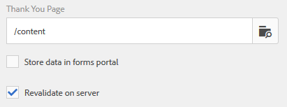
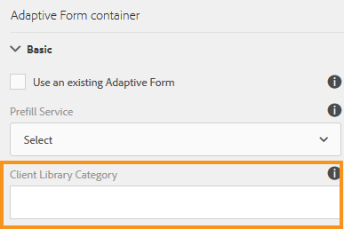

# Submit Actions Supported by Adaptive Forms

Adaptive Forms allow you to create forms that are engaging, responsive, dynamic, and adaptive. They provide an intuitive user interface and a set of out-of-the-box components for designing and managing forms efficiently. You can configure various submit actions to send form data to services like OneDrive, SharePoint, Workfront Fusion, and more.

A submit action is triggered when a user clicks the **[!UICONTROL Submit]** button on an Adaptive Form. Forms as a Cloud Service provides several submit actions out of the box. The built-in submit actions empower you to:

* Effortlessly send form data via email
* Initiate Microsoft&reg; Power Automate flows or AEM Workflows while transmitting the data.
* Directly transmit the form data to Microsoft&reg; SharePoint Server, Microsoft&reg; Azure Blob Storage, or Microsoft&reg; OneDrive.
* Seamlessly send the data to a configured data source using the Form Data Model (FDM).
* Conveniently submit the data to a REST endpoint.

## Submit Actions Supported by Adaptive Forms

AEM forms offers following out-of-the-box submit actions:

* [Send Email](/help/forms/configure-submit-action-send-email.md)
* [Invoke a Power Automate flow](/help/forms/forms-microsoft-power-automate-integration.md)
* [Submit to SharePoint](/help/forms/configure-submit-action-sharepoint.md)
* [Invoke a Workfront Fusion](/help/forms/submit-adaptive-form-to-workfront-fusion.md)
* [Submit using Form Data Model (FDM)](/help/forms/using-form-data-model.md)
* [Submit to Azure Blob Storage](/help/forms/configure-submit-action-azure-blob-storage.md)
* [Submit to REST endpoint](/help/forms/configure-submit-action-restpoint.md)
* [Submit to OneDrive](/help/forms/configure-submit-action-onedrive.md)
* [Invoke an AEM Workflow](/help/forms/configure-submit-action-workflow.md)
* [Submit to Marketo enagage](/help/forms/submit-adaptive-form-to-marketo-engage.md)
* [Submit to Adobe Experience Platform (AEP)](/help/forms/aem-forms-aep-connector.md) 
* [Submit to Spreadsheet](/help/forms/forms-submission-service.md)

You can also submit an Adaptive Form to other storage configurations:

* [Connect Adaptive Form to Salesforce application](/help/forms/aem-forms-salesforce-integration.md)
* [Connect an Adaptive Form to Microsoft&reg; Dynamics OData](/help/forms/ms-dynamics-odata-configuration.md)

## Submit Action Support Across Authoring Types

The table below shows which submit actions are supported based on the form authoring method used in AEM Forms:

| Submit Action               | [Foundation Components](/help/forms/configuring-submit-actions.md) | [Core Components](/help/forms/configure-submit-actions-core-components.md) | [Universal Editor](/help/forms/configure-submit-action-eds-forms.md#submit-actions-supported-by-adaptive-forms-created-in-universal-editor) | [Document-Based Forms](/help/forms/configure-submit-action-eds-forms.md#supported-submit-actions-for-document-based-forms) |
|----------------------------|------------------------|------------------|------------------|------------------------|
| Send an Email              | ✅ Supported           | ✅ Supported     | ✅ Supported     |                        |
| Power Automate Flow        | ✅ Supported           | ✅ Supported     | ✅ Supported     |                        |
| Submit to SharePoint       | ✅ Supported           | ✅ Supported     | ✅ Supported     |                        |
| Workfront Fusion           | ✅ Supported           | ✅ Supported     | ✅ Supported     |                        |
| Submit using FDM           | ✅ Supported           | ✅ Supported     | ✅ Supported     |                        |
| Submit to AEP              | ✅ Supported           | ✅ Supported     | ✅ Supported     |                        |
| Azure Blob Storage         | ✅ Supported           | ✅ Supported     | ✅ Supported     |                        |
| Submit to REST Endpoint    | ✅ Supported           | ✅ Supported     | ✅ Supported     |                        |
| Submit to Marketo Engage   | ✅ Supported           | ✅ Supported     | ✅ Supported     |                        |
| Submit to OneDrive         | ✅ Supported           | ✅ Supported     | ✅ Supported     |                        |
| Invoke AEM Workflow        | ✅ Supported           | ✅ Supported     | ✅ Supported     |                        |
| Submit to Spreadsheet      |                        |                  | ✅ Supported     | ✅ Supported           |

## Server-Side Revalidation in Adaptive Form

Typically, in any online data capture system, developers place someJavaScript validations on client side to enforce a few business rules. But in modern browsers, end users have way to bypass those validations and manually do submissions using various techniques, Such as Web Browser DevTools Console. Such techniques are also valid for Adaptive Forms. A forms developer can create various validation logics, but technically, end users can bypass those validation logics and submit invalid data to the server. Invalid data would break the business rules that a forms author has enforced.

The server-side revalidation feature provides the ability to also run the validations that an Adaptive Forms author has provided while designing an Adaptive Form on the server. It prevents any possible compromise of data submissions and business rules violations represented in terms of form validations.

### What to validate on Server?  

All out of the box (OOTB) field validations of an Adaptive Form that are rerun at the server are:

* Required
* Validation Picture Clause
* Validation Expression

Use the **[!UICONTROL Revalidate on server]** under Adaptive Form Container in the sidebar to enable or disable server-side validation for the current form.

**Enabling Server-Side Validation**

If end-user bypass those validations and submit the forms, the server again performs the validation. If the validation fails at server end, then the submit transaction is stopped. The user is presented with the original form again. The captured data and submitted data are presented to the user as an error.

>[!NOTE]
>
>Server-side validation validates the form model. You are recommended to create a separate client library for validations and not mix it with other things like HTML styling and DOM manipulation in the same client library.

<!--
### Supporting Custom functions in Validation Expressions {#supporting-custom-functions-in-validation-expressions-br}

At times, if there are **complex validation rules**, the exact validation script reside in custom functions and author calls these custom functions from field validation expression. To make this custom function library known and available while performing server-side validations, the form author can configure the name of AEM client library under the **[!UICONTROL Basic]** tab of Adaptive Form Container properties as shown below.

Supporting Custom functions in Validation Expressions

Author can configure customJavaScript library per Adaptive Form. In the library, only keep the reusable functions, which have dependency on jquery and underscore.js third-party libraries.

Refer to the following articles to learn how to create custom functions for:

* [Adaptive Forms based on Foundation Components](/help/forms/rule-editor.md#custom-functions-in-rule-editor)
* [Adaptive Forms based on Core Components](/help/forms/create-and-use-custom-functions.md)
* [Adaptive Forms authored using Document-Based Authoring](/help/edge/docs/forms/rules-forms.md#create-a-custom-function)
* [Adaptive Forms created using the Universal Editor](/help/edge/docs/forms/universal-editor/rule-editor-universal-editor.md#create-a-custom-function)

## Error handling on Submit Action {#error-handling-on-submit-action}

As a part of AEM security and hardening guidelines, configure custom error pages such as 400.jsp, 404.jsp, and 500.jsp. These handlers are called, when on submitting a form 400, 404, or 500 errors appear. The handlers are also called when these error codes are triggered on the Publish node. You can also create JSP pages for other HTTP error codes.

When you prefill a form data model (FDM), or schema based Adaptive Form with XML or JSON data complaint to a schema that is data does not contain `<afData>`, `<afBoundData>`, and `</afUnboundData>` tags, then the data of unbounded fields of the Adaptive Form is lost. The schema can be an XML schema, JSON schema, or a Form Data Model (FDM). Unbounded fields are Adaptive Form fields without the `bindref` property.
-->

## See Also

{{af-submit-action}}
