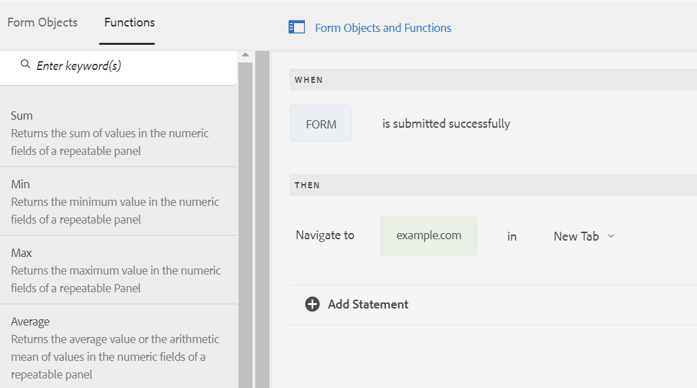

# Asynchronous submission of Adaptive Forms {#asynchronous-submission-of-adaptive-forms}

Traditionally, web forms are configured to submit synchronously. In synchronous submission, when users submit a form, they are redirected to an acknowledgment page, a thank you page, or in case of submission failure, an error page. However, modern web experiences like single page applications are gaining popularity where the web page remains static while client-server interaction happens in the background. You can configure asynchronous submission to provide this experience with Adaptive Forms.

In asynchronous submission, when a user submits a form the form developer plugs-in a separate experience like redirecting to other form or a separate section of the website. The author can also plug-in separate services like sending data to a different data store or adds a custom analytics engine. In case of asynchronous submission, an Adaptive Form behaves like a single page application as the form does not reload or its URL does not change when the submitted form data is validated on the server.

Read on for details about asynchronous submission in Adaptive Forms.

## Configure asynchronous submission {#configure}

To configure asynchronous submission for an Adaptive Form:

1. In Adaptive Form authoring mode, select the Form Container object and tap  to open its properties.
1. In the **[!UICONTROL Submission]** properties section, enable **[!UICONTROL Use asynchronous submission]**.
1. In the **[!UICONTROL On Submit]** section, select one of the following options to perform on successful form submission.

    * **[!UICONTROL Redirect to URL]**: Redirects to the specified URL or page on form submission. You can specify a URL or browse to choose the path to a page in the **[!UICONTROL Redirect URL/Path]** field.
    * **[!UICONTROL Show Message]**: Displays a message on form submission. You can write a message in the text field below the **[!UICONTROL Show Message]** option. The text field support rich text formatting.

1. Tap  to save the properties.

## How asynchronous submission works {#how-asynchronous-submission-works}

[!DNL Experience Manager Forms] provides out-of-the-box success and error handlers for form submissions. Handlers are client-side functions that execute based on the server response. When a form is submitted, the data is transmitted to the server for validation, which returns a response to the client with information about the success or error event for the submission. The information is passed as parameters to the relevant handler to execute the function.

In addition, form authors and developers can write rules at form level to override default handlers. For more information, see [Override default handlers using rules](#custom).

Let us first review the server response for success and error events.

### Server response for submission success event {#server-response-for-submission-success-event}

The structure for the server response for submission success event is as follows:

```json
{oneOf: [
{  properties : {
     contentType : {"type" : "string",  "enum" : ["xmlschema", "jsonschema"]},
    data : {type : "string", description : "Form data in XML or  JSON  format"},
   thankYouOption : {type : "string"}
   }},
  properties : {
     contentType : {"type" : "string",  "enum" : ["xmlschema", "jsonschema"]},
    data : {type : "string", description : "Form data in XML or  JSON  format"},
   thankYouContent: {type: "string"}
   }
]

}
```

The server response in case of successful form submission includes:

* Form data format type: XML or JSON
* Form data in XML or JSON format
* Selected option to redirect to a page or display a message as configured in the form
* Page URL or message content as configured in the form

The success handler reads the server response and accordingly redirects to the configured page URL or displays a message.

### Server response for submission error event {#server-response-for-submission-error-event}

The structure for the server response for submission error event is as follows:

```json
{
   errorCausedBy : "<CAPTCHA_VALIDATION or SERVER_SIDE_VALIDATION>",

   errors : [
               { "somExpression" : "<SOM Expression>",
                 "errorMessage"  : "<Error Message>"
               },
               ...
             ]
 }
```

The server response in case of error in form submission includes:

* Reason for the error, failed CAPTCHA or server-side validation
* List of error objects, which includes the SOM expression of the field that failed validation and the corresponding error message

The errors handler reads the server response and accordingly displays the error message on the form.

## Override default handlers using rules {#custom}

Form developers and authors can write rules, at form level, to override default handlers. The server response for success and error events is exposed at form level, which developers can access using `$event.data` in rules.

Perform the following steps to write rules to handle success and error events.

1. Open the Adaptive Form in authoring mode, select any form object, and tap  to open the rule editor.
1. Select **[!UICONTROL Form]** in the Form Objects tree and tap **[!UICONTROL Create]**.
1. Choose **[!UICONTROL is submitted successfully]** or **[!UICONTROL submission fails]** from the **[!UICONTROL Select state]** drop-down list.
1. Define a **[!UICONTROL Then]** action for the selected state. For example, select **[!UICONTROL Navigate To]** and then type or paste a URL. You can also drag any function using the **[!UICONTROL Functions]** tab to the rule.

   

1. Tap **[!UICONTROL Done]** to save the rule.
