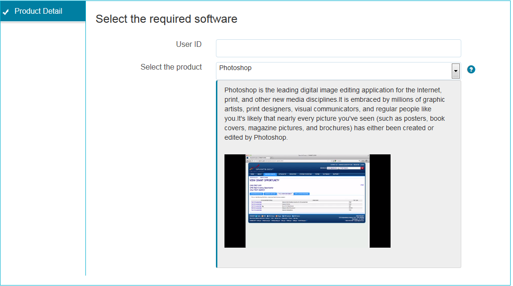

# Authoring in-context help for form fields{#authoring-in-context-help-for-form-fields}

## Introduction {#introduction}

There are situations when end users filling a form are not sure how to fill details in a particular form field. To address such issues, Adaptive Forms provides support to add text or rich in-context help to a form field. It helps improve the form filling experience and avoids any ambiguity for end users.

This article discusses how form authors can add in-context help while authoring Adaptive Forms.

## Add in-context help {#add-in-context-help}

You can specify in-context help using the following options in the Help Content section of the properties tab in the sidebar.

* [Short description](authoring-in-field-help.md#p-short-description-p)
* [Long description](authoring-in-field-help.md#p-long-description-p)

>[!NOTE]
>
>Long description overrides the Short description. If you have specified both, only Long description will appear.

### Short description {#short-description}

The Short description field is to provide quick and short hints about filling a form field. The text specified in the Short description field is displayed as a tooltip on hovering mouse over the field.

>[!NOTE]
>
>Select **Always show short description** to permanently display the help text below the field.

### Long description {#long-description}

You can use the Long description field to specify long text or embed rich media content, including videos, as in-context help. For example, the following image shows how you can embed a video as in-context help.

Adding Long description displays a **?** icon next to the field. Clicking the icon displays the content added in the long description section.

### Panel-level help {#panel-level-help}

In addition to the in-context help for form fields, you can specify help at a panel level in the Help content tab of the panel edit dialog.

Adding help for panel displays a **?** icon next to the panel description. Clicking the icon displays the content added in the Help Content section of the panel edit dialog.

