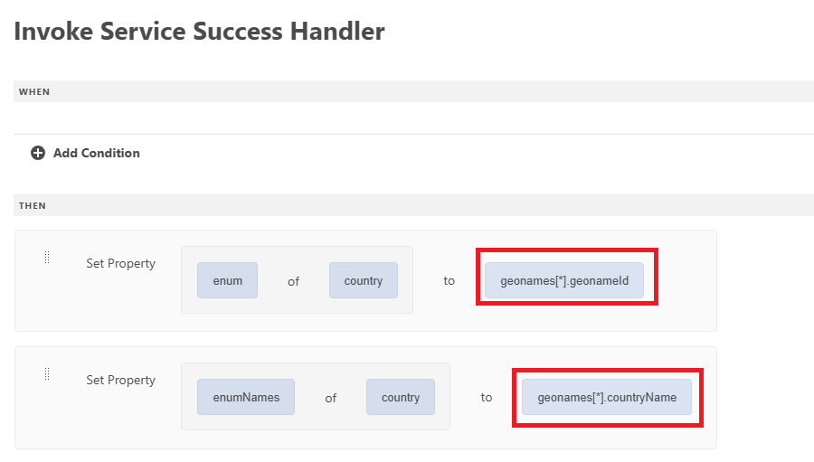

# Create form using universal editor

Create the following form using the universal editor. The form has 3 drop down lists, whose values will be populated using the API integration

## Country of Residence

On initialization, the country of residence drop down will be populated with the results of the API call.
 

## Sucess Handler

The success handler was defined to set the enum and enumNames of the country drop down list with the appropriate values from the geonames array. The geonames array is available under the Event Payload option

## Fetch Child Values

The state or province drop down list is populated when the user makes a selection in the Country of Residence drop down list. The geonameId associated with the selected country is passed as an input parameter to the GetChildren API integration

The sucees handler was defined to set the enum/enumNames of the StateOrProvince drop down field

When the state or province is selected, you can populate the city drop down list by following the above mentioned pattern used for populating state or province drop down list.