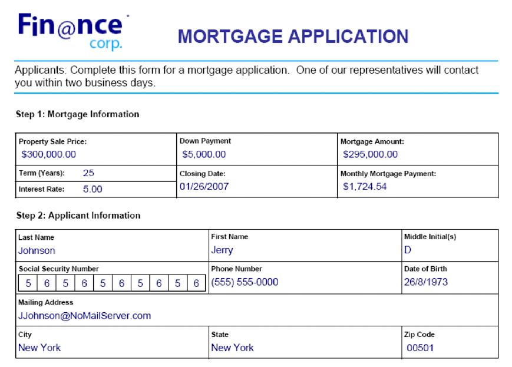

# Considerations known issues, and best practices {#best-practices-known-issues-and-limitations}

Before you begin using Communication APIs, review the following considerations, known issues, and frequently asked questions:

## Considerations  {#considerations-for-communications-apis}

### Form data {#form-data}

Communications APIs accept both a form design that is typically created in Designer and XML form data as input. To populate a document with data, an XML element must exist in the XML form data for every form field that you want to populate. The XML element name must match the field name. An XML element is ignored if it does not correspond to a form field or if the XML element name does not match the field name. It is not necessary to match the order in which the XML elements are displayed. The important factor is that the XML elements are specified with corresponding values.

Consider the following example loan application form:



To merge data into this form design, create an XML data source that corresponds to the form. The following XML represents an XML data source that corresponds to the example mortgage application form.

```XML

<?xml version="1.0" encoding="UTF-8" ?>
- <xfa:datasets xmlns:xfa="http://www.xfa.org/schema/xfa-data/1.0/">
- <xfa:data>
- <data>
    - <Layer>
        <closeDate>1/26/2007</closeDate>
        <lastName>Johnson</lastName>
        <firstName>Jerry</firstName>
        <mailingAddress>JJohnson@NoMailServer.com</mailingAddress>
        <city>New York</city>
        <zipCode>00501</zipCode>
        <state>NY</state>
        <dateBirth>26/08/1973</dateBirth>
        <middleInitials>D</middleInitials>
        <socialSecurityNumber>(555) 555-5555</socialSecurityNumber>
        <phoneNumber>5555550000</phoneNumber>
    </Layer>
    - <Mortgage>
        <mortgageAmount>295000.00</mortgageAmount>
        <monthlyMortgagePayment>1724.54</monthlyMortgagePayment>
        <purchasePrice>300000</purchasePrice>
        <downPayment>5000</downPayment>
        <term>25</term>
        <interestRate>5.00</interestRate>
    </Mortgage>
</data>
</xfa:data>
</xfa:datasets>


```

### Supported document types {#supported-document-types}

For complete access to the rendering capabilities of the Communications APIs, it is recommended that you use an XDP file as input. Sometimes, a PDF file can be used. However, using a PDF file as input has the limitations:

A PDF document that does not contain an XFA stream cannot be rendered as PostScript, PCL, or ZPL. Communications APIs can render PDF documents with XFA streams (that is, forms created in Designer) into laser and label formats. If the PDF document is signed, certified, or contains usage rights (applied using AEM Forms Reader Extensions service), it cannot be rendered to these print formats.


### Printable areas {#printable-areas}

The default 0.25-inch nonprintable margin is not exact for label printers and varies from printer to printer and from label size to label size however, it is recommended that you keep the 0.25-inch margin or reduce it. However, it is recommended that you do not increase the nonprintable margin. Otherwise, information in the printable area does not print properly.

Always ensure that you use the correct XDC file for the printer. For example, avoid choosing an XDC file for a 300-dpi printer and sending the document to a 200-dpi printer.

### Scripts for XFA forms (XDP/PDF) only {#scripts}

A form design that is used with the Communications APIs can contain scripts that run on the server. Ensure that a form design does not contain scripts that run on the client. For information about creating form design scripts, see [Designer Help](use-forms-designer.md).

<!-- #### Working with Fonts
 Document Considerations for Working with Fonts>> -->

### Font mapping {#font-mapping}

To design a form that uses printer-resident fonts, choose a typeface name in Designer that matches the fonts that are available on the printer. A list of fonts that are supported for PCL or PostScript are located in the corresponding device profiles (XDC files). Alternatively, font mapping can be created to map nonprinter-resident fonts to printer-resident fonts of a different typeface name. For example, in a PostScript scenario, references to the Arial® font can be mapped to the printer-resident Helvetica® typeface.

If a font is installed on a client computer, it is available in the drop-down list in Designer. If the font is not installed, it is necessary to specify the font name manually. The “Permanently replace unavailable fonts” option in Designer can be off. Otherwise, when the XDP file is saved in Designer, the substitution font name is written to the XDP file. It means that the printer-resident font is not used.

Two types of OpenType® fonts exist. One type is a TrueType OpenType® font that PCL supports. The other is CFF OpenType®. PDF and PostScript output supports embedded Type-1, TrueType, and OpenType® fonts. PCL output supports embedded TrueType fonts.

Type-1 and OpenType® fonts are not embedded in PCL output. Content that is formatted with Type-1 and OpenType® fonts is rasterized and generated as a bitmap image that can be large and slower to generate.

Downloaded or embedded fonts are automatically substituted when generating PostScript, PCL, or PDF output. It means that only the subset of the font glyphs that are required to properly render the generated document is included in the generated output.

### Working with device profile files (XDC file) {#working-with-xdc-files}

A device profile (XDC file) is a printer description file in XML format. This file enables the Communications APIs to output documents as laser or label printer formats. Communications APIs use the XDC files including the following:

* hppcl5c.xdc

* hppcl5e.xdc

* ps_plain_level3.xdc

* ps_plain.xdc

* zpl300.xdc

* zpl600.xdc

* zpl300.xdc

* ipl300.xdc

* ipl400.xdc

* tpcl600.xdc

* dpl300.xdc

* dpl406.xdc

* dpl600.xdc

You may use the provided XDC files to generate print documents or modify them as per your requirement.
<!-- It is not necessary to modify these files to create documents. However, you can modify them to meet your business requirements. -->

These files are reference XDC files that support the features of specific printers, such as resident fonts, paper trays, and stapler. The purpose of these reference is to help you understand how to set up your own printers by using device profiles. The reference are also a starting point for similar printers in the same product line.

### Working with the XCI configuration file {#working-with-xci-files}

Communications APIs use an XCI configuration file to perform tasks, such as controlling whether the output is a single panel or paginated. Although this file contains settings that can be set, it is not typical to modify this value. <!-- The default.xci file is located in the svcdata\XMLFormService folder. -->

You can pass a modified XCI file while using a Communications API. When doing so, create a copy of the default file, change only the values that requires modification to meet your business requirements, and use the modified XCI file.

Communications APIs start with the default XCI file (or the modified file). Then it applies values that are specified using the Communications APIs. These values override XCI settings.

The following table specifies XCI options.

| XCI option                            | Description                                                                                                                                                                                                                                                                                                                                                                                                                                                                                                 |
| ------------------------------------| ----------------------------------------------------------------------------------------------------------------------------------------------------------------------------------------------------------------------------------------------------------------------------------------------------------------------------------------------------------------------------------------------------------------------------------------------------------------------------------------------------------|
| config/present/pdf/creator            | Identifies the document creator using the Creator entry in the Document Information dictionary. For information about this dictionary, see the PDF Reference guide.                                                                                                                                                                                                                                                                                                                                         |
| config/present/pdf/producer           | Identifies the document producer using the Producer entry in the Document Information dictionary. For information about this dictionary, see the PDF Reference guide.                                                                                                                                                                                                                                                                                                                                       |
| config/present/layout                 | Controls whether the output is a single panel or paginated.                                                                                                                                                                                                                                                                                                                                                                                                                                                 |
| config/present/pdf/compression/level  | Specifies the degree of compression to use when generating a PDF document.                                                                                                                                                                                                                                                                                                                                                                                                                                  |
| config/present/pdf/scriptModel        | Controls whether XFA-specific information is included in the output PDF document.                                                                                                                                                                                                                                                                                                                                                                                                                           |
| config/present/common/data/adjustData | Controls whether the XFA application adjusts the data after merging.                                                                                                                                                                                                                                                                                                                                                                                                                                        |
| config/present/pdf/renderPolicy       | Controls whether the generation of page content is done on the server or deferred to the client.                                                                                                                                                                                                                                                                                                                                                                                                            |
| config/present/common/locale          | Specifies the default locale used in the output document.                                                                                                                                                                                                                                                                                                                                                                                                                                                   |
| config/present/destination            | When contained by a present element, specifies the output format. When contained by an openAction element, specifies the action to perform upon opening the document in an interactive client.                                                                                                                                                                                                                                                                                                              |
| config/present/output/type            | Specifies either the type of compression to apply to a file or the type of output to produce.                                                                                                                                                                                                                                                                                                                                                                                                               |
| config/present/common/temp/uri        | Specifies the Form URI.                                                                                                                                                                                                                                                                                                                                                                                                                                                                                     |
| config/present/common/template/base   | Supplies a base location for URIs in the form design. When this element is absent or empty, the location of the form design is used as the base.                                                                                                                                                                                                                                                                                                                                                            |
| config/present/common/log/to          | Controls the location that log data or output data is written to.                                                                                                                                                                                                                                                                                                                                                                                                                                           |
| config/present/output/to              | Controls the location that log data or output data is written to.                                                                                                                                                                                                                                                                                                                                                                                                                                           |
| config/present/script/currentPage     | Specifies the initial page when the document is opened.                                                                                                                                                                                                                                                                                                                                                                                                                                                     |
| config/present/script/exclude         | Informs to AEM Forms server/Communications APIs which events to ignore.                                                                                                                                                                                                                                                                                                                                                                                                                                     |
| config/present/pdf/linearized         | Controls whether the output PDF document is linearized.                                                                                                                                                                                                                                                                                                                                                                                                                                                     |
| config/present/script/runScripts      | Controls which set of scripts AEM Forms executes.                                                                                                                                                                                                                                                                                                                                                                                                                                                           |
| config/present/pdf/tagged             | Controls the inclusion of tags into the output PDF document. Tags, in the context of PDF, are additional information included in a document to expose the logical structure of the document. Tags assist accessibility aids and reformatting. For example, a page number may be tagged as an artifact so that a screen reader does not enunciate it in the middle of the text. Although tags make a document more useful, they also increase the size of the document and the processing time to create it. |
| config/present/pdf/version            | Specifies the version of PDF document to generate.                                                                                                                                                                                                                                                                                                                                                                                                                                                          |


## Known issues

* You can use a specific render type (PDF, PRINT) only once in the print options list. For example, you cannot have two PRINT options each specifying a PCL render type.

* For a batch configuration, only one instance of combination of values of OutputType(PDF, PRINT) and RenderType(PostScript, PCL, IPL, ZPL, etc.) is allowed.

* For asynchronous APIs (Batch processing), the defaut record level is set to 2. You can use a custom XCI to change record level to 1.

* When the default XCI is configured, it includes path till original rendition. For example `/content/dam/formsanddocuments/default.xci/jcr:content/renditions/original`


## Best Practices

* Adobe recommends to host data files blob container store in the cloud region used by AEM Cloud Service.

## Frequently asked questions {#faq}

**Can I use a watched folder or other storage mechanisms to store input and output?**

At the moment, you can use Microsoft Azure Storage to save input data and generated documents. Microsoft Azure storage provides various options to [automate data movement operations](https://docs.microsoft.com/en-us/azure/storage/common/storage-use-azcopy-v10).

**Is a Microsoft Azure Storage account included with Experience Manager Forms Cloud Service license?**

Microsoft Azure Storage account is independent of Experience Manager Forms Cloud Service license.

**Does Communication APIs store data on Experience Manager Forms Cloud Service servers?**

Input and output data is saved only on Microsoft Azure Storage.

**Are Communication APIs available only for Experience Manager Forms Cloud Service? Can I get similar functionality on on-premise environment?**

You can use AEM Forms Output service to combine a template (XFA or PDF) with customer data to generate documents in PDF, PS, PCL, and ZPL formats.

In comparison to on-premise environment,  the Cloud Service provides additional benefits of auto-scaling and cost effectiveness.

<!--**Where is data processed?**

**Who has access to data?**

**Is data encrypted?**

**Where is data hosted?** -->

**Can I run multiple batch operations simultaneously?**
Yes, you can run multiple batch operations simuntabously. Always use different source and destination folders for every operation to avoid any conflicts.
