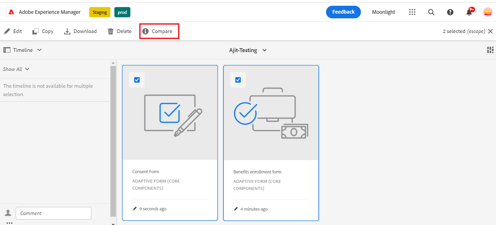
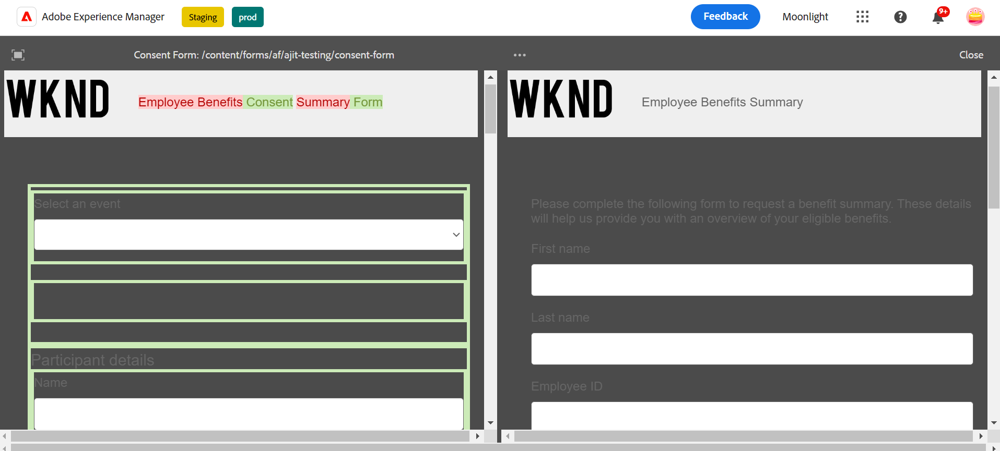

# Compare Adaptive Forms {#compare-two-forms}

 This is a pre-release feature and accessible through our [pre-release channel](https://experienceleague.adobe.com/docs/experience-manager-cloud-service/content/release-notes/prerelease.html#new-features). 

When form authors need to compare two distinct forms based on the fields, content, and form components, they compare the two forms. The form author must make sure that the two forms are in the same directory or folder in order to compare them. To compare two distinct adaptive forms, perform the following steps:

1. Select adaptive forms and click **[!UICONTROL Compare]**.

   

1. On clicking, you see two forms in the preview mode. It selects the first form as the base form to compare with the second form, and compares the content between the two forms, which are similar and differentiated. The differentiated content of the first form is marked as green as shown in the image.

   

## See Also {#see-also}

{{see-also}}
