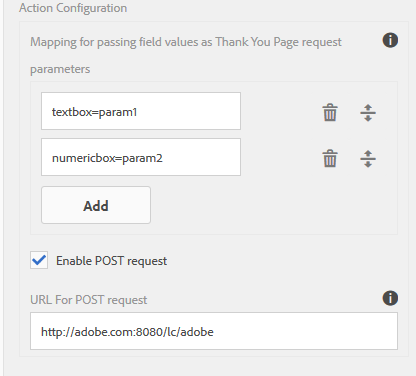
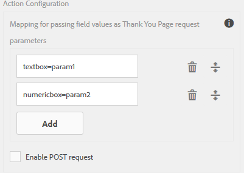
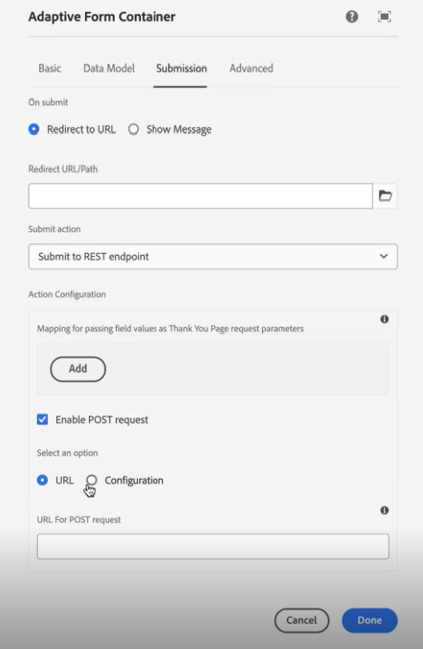

# Configure an Adaptive Form for REST Endpoint submit action

 The capability to specify the REST Endpoint using configuration  is an Early Adopter Program and it is applicable to Core Components and Edge Delivery Services Forms only. You can write to `aem-forms-ea@adobe.com` from your official email id to join the early adopter program and request access to the capability. 

Use the **[!UICONTROL Submit to REST Endpoint]** action to post the submitted data to a REST URL. The URL can be of an internal (the server on which the form is rendered) or an external server.

AEM as a Cloud Service offers various out of the box submit actions for handling form submissions. You can learn more about these options in the [Adaptive Form Submit Action](/help/forms/aem-forms-submit-action.md)  article.

## Advantages

Some of the advantages of configuring the **[!UICONTROL Submit to REST endpoint]** submit action for Adaptive Forms are:

* It enables seamless integration of form data with external systems and services through RESTful APIs.
* It provides flexibility in handling data submissions from Adaptive Forms, supporting dynamic and complex data structures.
* It supports dynamic mapping of form fields to parameters in the REST endpoint URL, allowing for adaptable and customizable data submissions.

## Configure Submit to REST Endpoint  submit action {#steps-to-configure-submit-to-restendpoint-submit-action}

>[!BEGINTABS]

>[!TAB Foundation Component]

To configure submit action based on Swagger Open API specification for Adaptive Form based on Foundation Components are:

1. Open the Adaptive Form for editing and navigate to **[!UICONTROL Submission]** section of the Adaptive Form Container properties. 
1. From the **[!UICONTROL Submit Action]** drop-down list, select **[!UICONTROL Submit to Rest endpoint]**.

     

    To post data to an internal server, provide path of the resource. The data is posted the path of the resource. For example, `/content/restEndPoint`. For such post requests, the authentication information of the submit request is used.
    This option allows you to directly enter the target REST endpoint .
    To post data to an external server, provide a URL. The format of the URL is `https://host:port/path_to_rest_end_point`. Ensure that you configure the path to handle the POST request anonymously.
    
  
    In the example above, user entered information in `textbox` is captured using parameter `param1`. Syntax to post data captured using `param1` is:

    `String data=request.getParameter("param1");`

    Similarly, parameters that you use for posting XML data and attachments are `dataXml` and `attachments`.

    For example, you use these two parameters in your script to parse data to a rest end point. You use the following syntax to store and parse the data:

    `String data=request.getParameter("dataXml");`
    `String att=request.getParameter("attachments");`
    
    In this example, `data` stores the XML data, and `att` stores attachment data.
    The **[!UICONTROL Submit to REST endpoint]** Submit Action submits the data filled in the form to a configured confirmation page as part of the HTTP GET request. You can add the name of the field to request. The format of the request is:
    `{fieldName}={request parameter name}`
  
    As shown in the image below, `param1` and `param2` are passed as parameters with values copied from the **textbox** and **numericbox** fields for the next action.

    

    You can also **[!UICONTROL Enable POST request]** and provide a URL to post the request. To submit data to the AEM server hosting the form, use a relative path corresponding to the root path of the AEM server. For example, `/content/forms/af/SampleForm.html`. To submit data to any other server, use absolute path.

1. Click **[!UICONTROL Done]**.

>[!TAB Core Component]

To configure submit action based on Swagger Open API specification for Adaptive Form based on Core Components are:

1. Open the Content browser, and select the **[!UICONTROL Guide Container]** component of your Adaptive Form. 
1. Click the Guide Container properties  icon. The Adaptive Form Container dialog box opens. 
1. Click the  **[!UICONTROL Submission]** tab. 
1. From the **[!UICONTROL Submit Action]** drop-down list, select **[!UICONTROL Submit to Rest endpoint]**.

    

    To post data to an internal server, provide path of the resource. The data is posted the path of the resource. For example, `/content/restEndPoint`. For such post requests, the authentication information of the submit request is used.

    You have two options to specify the REST endpoint:

    +++URL

    This option allows you to directly enter the target REST endpoint .
    To post data to an external server, provide a URL. The format of the URL is `https://host:port/path_to_rest_end_point`. Ensure that you configure the path to handle the POST request anonymously.

    

    In the example above, user entered information in `textbox` is captured using parameter `param1`. Syntax to post data captured using `param1` is:

    `String data=request.getParameter("param1");`

    Similarly, parameters that you use for posting XML data and attachments are `dataXml` and `attachments`.

    For example, you use these two parameters in your script to parse data to a rest end point. You use the following syntax to store and parse the data:

    `String data=request.getParameter("dataXml");`
    `String att=request.getParameter("attachments");`

    In this example, `data` stores the XML data, and `att` stores attachment data.

    The **[!UICONTROL Submit to REST endpoint]** Submit Action submits the data filled in the form to a configured confirmation page as part of the HTTP GET request. You can add the name of the field to request. The format of the request is:

    `{fieldName}={request parameter name}`

    As shown in the image below, `param1` and `param2` are passed as parameters with values copied from the **textbox** and **numericbox** fields for the next action.

    

    You can also **[!UICONTROL Enable POST request]** and provide a URL to post the request. To submit data to the AEM server hosting the form, use a relative path corresponding to the root path of the AEM server. For example, `/content/forms/af/SampleForm.html`. To submit data to any other server, use absolute path.

    +++

    +++Configuration

    This option allows you to add a predefined HTTP configuration managed via AEM's Configuration Browser. You can select the Configuration created for your Service Rest Endpoint Authentication Type and the Content Types. To know more about Authentication Type and the Content Types, visit [configure data sources](/help/forms/configure-data-sources.md#configure-restful-services-using-service-endpoint-configure-restful-services-service-endpoint)

    +++

1. Click **[!UICONTROL Done]**.

>[!TAB Universal Editor]

To configure submit action based on Swagger Open API specification for Adaptive Form authored in Universal Editor are:

1. Open the Adaptive Form for editing.
1. Click the **Edit Form Properties** extension on the editor. 
    The **Form Properties** dialog appears.
1. Click **Submission** tab and select **[!UICONTROL Submit to Rest endpoint]** submit action.

    To post data to an internal server, provide path of the resource. The data is posted the path of the resource. For example, `/content/restEndPoint`. For such post requests, the authentication information of the submit request is used.

    You have two options to specify the REST endpoint:

    +++URL

    This option allows you to directly enter the target REST endpoint .
    To post data to an external server, provide a URL. The format of the URL is `https://host:port/path_to_rest_end_point`. Ensure that you configure the path to handle the POST request anonymously.

    

    In the example above, user entered information in `textbox` is captured using parameter `param1`. Syntax to post data captured using `param1` is:

    `String data=request.getParameter("param1");`

    Similarly, parameters that you use for posting XML data and attachments are `dataXml` and `attachments`.

    For example, you use these two parameters in your script to parse data to a rest end point. You use the following syntax to store and parse the data:

    `String data=request.getParameter("dataXml");`
    `String att=request.getParameter("attachments");`

    In this example, `data` stores the XML data, and `att` stores attachment data.

    The **[!UICONTROL Submit to REST endpoint]** Submit Action submits the data filled in the form to a configured confirmation page as part of the HTTP GET request. You can add the name of the field to request. The format of the request is:

    `{fieldName}={request parameter name}`

    As shown in the image below, `param1` and `param2` are passed as parameters with values copied from the **textbox** and **numericbox** fields for the next action.

    

    You can also **[!UICONTROL Enable POST request]** and provide a URL to post the request. To submit data to the AEM server hosting the form, use a relative path corresponding to the root path of the AEM server. For example, `/content/forms/af/SampleForm.html`. To submit data to any other server, use absolute path.

    +++

    +++Configuration

    This option allows you to add a predefined HTTP configuration managed via AEM's Configuration Browser. You can select the Configuration created for your Service Rest Endpoint Authentication Type and the Content Types. To know more about Authentication Type and the Content Types, visit [configure data sources](/help/forms/configure-data-sources.md#configure-restful-services-using-service-endpoint-configure-restful-services-service-endpoint)

    +++

2. Click **[!UICONTROL Save&Close]**.

>[!ENDTABS]

<!-- ### Configure submit action based on Service Rest Endpoint {#config-service-endpoint-auth}

1. Open the Content browser, and select the **[!UICONTROL Guide Container]** component of your Adaptive Form.
2. Click the Guide Container properties  icon. The Adaptive Form Container dialog box opens. 
3. Click the  **[!UICONTROL Submission]** tab. 
4. From the **[!UICONTROL Submit Action]** drop-down list, select **[!UICONTROL Submit to Rest endpoint]**.
5. Enable the POST request.
6. Specify the REST endpoint URL.
7. Select the Configuration you have created for your Service Rest Endpoint Authentication Type and the Content Types. To know more about Authentication Type and the Content Types, visit [configure data sources](/help/forms/configure-data-sources.md#configure-restful-services-using-service-endpoint-configure-restful-services-service-endpoint).
    
8. Click Done. -->

## Best Practices

* When posting data to an external server, make sure the URL is secure, and configure the path to handle the POST request anonymously to protect sensitive information.
* To pass the fields as parameters in a REST URL, all the fields must have different element names, even if the fields are placed on different panels.

## Related Articles

{{af-submit-action}}
