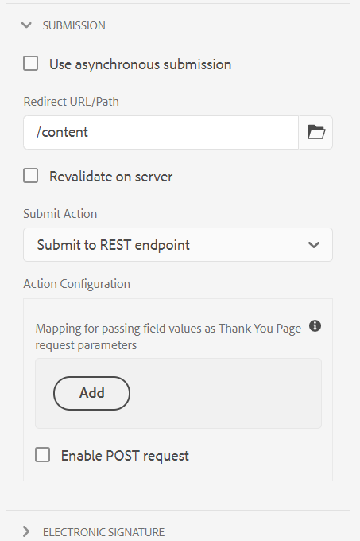

# Configuring redirect page {#configuring-redirect-page}

| Version | Article link |
| -------- | ---------------------------- |
| AEM 6.5  |    [Click here](https://experienceleague.adobe.com/docs/experience-manager-65/forms/adaptive-forms-basic-authoring/configuring-redirect-page.html)                  |
| AEM as a Cloud Service     | This article         |

Form authors can configure a page for each form, to which the form users are redirected after submitting a form.

1. In the edit mode, select a component, then click  &gt; **[!UICONTROL Adaptive Form Container]**, and then click .

1. In the sidebar, click **[!UICONTROL Submission]**.  

1. Provide the URL of the redirect page under **[!UICONTROL Redirect URL/Path]** in the **[!UICONTROL Submission]** section.  
1. Optionally, under Submit Action, for the Submit to REST endpoint action, you can configure the parameter to be passed to the redirect page.

   

   Redirect page configuration

Form authors can use the following parameters that are passed to the Thank you page. For all the available Submit Actions, `status` and `owner` parameters are passed. Besides these two parameters, some additional parameters are passed for the following Submit Actions:

* **[!UICONTROL Submit to REST endpoint]**: Parameters added for in-field to parameter mapping are passed. `status` and `owner` parameters are not passed in this Submit Action. For more information, see [Configuring the Submit to REST endpoint Submit Action](configuring-submit-actions.md).

>[!MORELIKETHIS]
>
>* [Configure a Redirect Page or thank you message](/help/forms/configure-redirect-page-or-thank-you-message.md)
