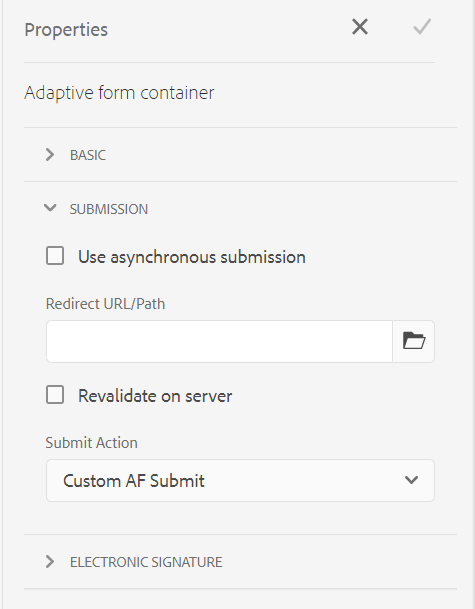

# Adaptive Form Submit Action {#configuring-the-submit-action}

A Submit Action is triggered when a user clicks the **[!UICONTROL Submit]** button on an Adaptive Form. Adaptive Forms provide some Submit Actions out of the box. The Submit Actions available out of the box are:

* [Submit to REST endpoint](#submit-to-rest-endpoint)
* [Send email](#send-email)
* [Submit using Form Data Model](#submit-using-form-data-model)
* [Invoke an AEM Workflow](#invoke-an-aem-workflow)

You can also [extend the default Submit Actions](custom-submit-action-form.md) to create your own Submit Action. 

You can configure a Submit Action in the **[!UICONTROL Submission]** section of the Adaptive Form Container properties, in the sidebar.




<!-- [!NOTE]
>
>Send PDF via Email Submit Action is applicable only to Adaptive Forms that use XFA template as form model. 

>[!NOTE]
>
>Ensure that the [AEM_Installation_Directory]\crx-quickstart\temp\datamanager\ASM folder
>exists. The directory is required to temporarily store attachments. If the directory does not exist, create it. -->

<!--

>[!CAUTION]
>
>If you  [prefill](prepopulate-adaptive-form-fields.md) a form template,  a Form Data Model or schema based Adaptive Form with XML or JSON data complaint to a schema (XML schema, JSON schema , form template, or form data model) that is data does not contain &lt;afData&gt;, &lt;afBoundData&gt;, and &lt;/afUnboundData&gt; tags, then the data of unbounded fields (Unbounded fields are Adaptive Form fields without [bindref](prepopulate-adaptive-form-fields.md) property) of the Adaptive Form is lost. 

>[!CAUTION]
>
>If you [prefill](prepopulate-adaptive-form-fields.md) a form template, a Form Data Model or schema based Adaptive Form with XML or JSON data complaint to a schema (XML schema, JSON schema, or form data model) that does not contain &lt;afData&gt;, &lt;afBoundData&gt;, and &lt;/afUnboundData&gt; tags, then the data of unbounded fields (Unbounded fields are Adaptive Form fields without [bindref](prepopulate-adaptive-form-fields.md) property) of the Adaptive Form is lost.


-->


## Submit to REST endpoint {#submit-to-rest-endpoint}

Use the **[!UICONTROL Submit to REST Endpoint]** action to post the submitted data to a rest URL. The URL can be of an internal (the server on which the form is rendered) or an external server.

To post data to an internal server, provide path of the resource. The data is posted the path of the resource. For example, /content/restEndPoint. For such post requests, the authentication information of the submit request is used.

To post data to an external server, provide a URL. The format of the URL is `https://host:port/path_to_rest_end_point`. Ensure that you configure the path to handle the POST request anonymously.


In the example above, user entered information in `textbox` is captured using parameter `param1`. Syntax to post data captured using `param1` is:

`String data=request.getParameter("param1");`

Similarly, parameters that you use for posting XML data and attachments are `dataXml` and `attachments`.

For example, you use these two parameters in your script to parse data to a rest end point. You use the following syntax to store and parse the data:

`String data=request.getParameter("dataXml");`
`String att=request.getParameter("attachments");`

In this example, `data` stores the XML data, and `att` stores attachment data.

The **[!UICONTROL Submit to REST endpoint]** Submit Action submits the data filled in the form to a configured confirmation page as part of the HTTP GET request. You can add the name of the fields to request. The format of the request is:

`{fieldName}={request parameter name}`

As shown in the image below, `param1` and `param2` are passed as parameters with values copied from the **textbox** and **numericbox** fields for the next action.


You can also **[!UICONTROL Enable POST request]** and provide a URL to post the request. To submit data to the AEM server hosting the form, use a relative path corresponding to the root path of the AEM server. For example, `/content/forms/af/SampleForm.html`. To submit data to any other server, use absolute path.

>[!NOTE]
>
>To pass the fields as parameters in a REST URL, all the fields must have different element names, even if the fields are placed on different panels.

## Send Email {#send-email}

You can use the **[!UICONTROL Send Email]** Submit Action to send an email to one or more recipients on successful submission of the form. The email generated can contain form data in a predefined format. For example, in the following template, customer name, shipping address, name of the state, and zip code are retrieved from submitted form data.

    ```

    Hi ${customer_Name},

    The following is set as your deafult shipping address:
    ${customer_Name},
    ${customer_Shipping_Address},
    ${customer_State},
    ${customer_ZIPCode}

    Regards,
    WKND 

    ```

>[!NOTE]
>
> * All the form fields must have different element names, even if the fields are placed on different panels of an Adaptive Form.
> * AEM as a Cloud Service requires outbound mail to be encrypted. By default, outbound email is disabled. To activate it, submit a support ticket to [Requesting Access](https://experienceleague.adobe.com/docs/experience-manager-cloud-service/implementing/developing/development-guidelines.html?lang=en#sending-email). 

You can also include attachments and a Document of Record (DoR) to the email. To enable **[!UICONTROL Attach Document of Record]** option, configure the Adaptive Form to generate a Document of Record (DoR). You can enable the option to generate a Document of Record from Adaptive Form properties.


<!-- ## Send PDF via Email {#send-pdf-via-email}

The **Send PDF via Email** Submit Action sends an email with a PDF containing form data, to one or more recipients on successful submission of the form.

>[!NOTE]
>
>This Submit Action is available for XFA-based Adaptive Forms and XSD-based adaption forms that have the Document of Record template. -->

<!-- ## Invoke a forms workflow {#invoke-a-forms-workflow}

The **Submit to Forms workflow** submit option sends a data xml and file attachments (if any) to an existing Adobe LiveCycle or [!DNL AEM Forms] on JEE process.

For information about how to configure the Submit to forms workflow Submit Action, see [Submitting and processing your form data using forms workflows](submit-form-data-livecycle-process.md). -->

## Submit using Form Data Model {#submit-using-form-data-model}

The **[!UICONTROL Submit using Form Data Model]** Submit Action writes submitted Adaptive Form data for the specified data model object in a Form Data Model to its data source. When configuring the Submit Action, you can choose a data model object whose submitted data you want to write back to its data source.

In addition, you can submit a form attachment using a Form Data Model and a Document of Record (DoR) to the data source. For information about form data model, see [[!DNL AEM Forms] Data Integration](data-integration.md).

<!--
## Forms Portal Submit Action {#forms-portal-submit-action}

The **Forms Portal Submit Action** option makes form data available through an [!DNL AEM Forms] portal.

For more information about the Forms Portal and Submit Action, see [Drafts and submissions component](draft-submission-component.md). -->

## Invoke an AEM Workflow {#invoke-an-aem-workflow}

The **[!UICONTROL Invoke an AEM Workflow]** Submit Action associates an Adaptive Form with an [AEM Workflow](https://experienceleague.adobe.com/docs/experience-manager-65/developing/extending-aem/extending-workflows/workflows-models.html?lang=en#extending-aem). When a form is submitted, the associated workflow starts automatically on the Author instance. You can save the data file, attachments, and Document of Record to the payload location of the workflow or to a variable. If the workflow is marked for external data storage and configured for an external data storage, then only the variable option is available. You can select from the list of variables available for the workflow model. If the workflow is marked for external data storage at a later stage and not at the time of workflow creation, then ensure that the required variable configurations are in place.

The Submit Action places the following at the payload location of the workflow, or the variable if the workflow is marked for external data storage: 

* **Data file**: It contains data submitted to the Adaptive Form. You can use the **[!UICONTROL Data File Path]** option to specify the name of the file and path of file relative to the payload. For example, the `/addresschange/data.xml` path creates a folder named `addresschange` and places it relative to payload. You can also specify only `data.xml` to send only submitted data without creating a folder hierarchy. If the workflow is marked for external data storage, use the variable option and select the variable from the list of variables available for the workflow model. 

* **Attachments**: You can use the **[!UICONTROL Attachment Path]** option to specify the folder name to store the attachments uploaded to the Adaptive Form. The folder is created relative to the payload. If the workflow is marked for external data storage, use the variable option and select the variable from the list of variables available for the workflow model.
 
* **Document of Record**: It contains the Document of Record generated for the Adaptive Form. You can use the **[!UICONTROL Document of Record Path]** option to specify the name of the Document of Record file and path of file relative to the payload. For example, the `/addresschange/DoR.pdf` path creates a folder named `addresschange` relative to the payload and places the `DoR.pdf` relative to payload. You can also specify only `DoR.pdf` to save only Document of Record without creating a folder hierarchy. If the workflow is marked for external data storage, use the variable option and select the variable from the list of variables available for the workflow model.

Before using the **[!UICONTROL Invoke an AEM Workflow]** Submit Action configure the following for the **[!UICONTROL AEM DS settings service]** configuration: 

* **[!UICONTROL Processing Server URL]**: The Processing Server is the server where the Forms or AEM Workflow is triggered. This can be same as the URL of the AEM author instance or another server.

* **[!UICONTROL Processing Server User Name]**: Workflow user’s username

* **[!UICONTROL Processing Server Password]**: Workflow user’s password

To set values of a configuration, [Generate OSGi Configurations using the AEM SDK](https://experienceleague.adobe.com/docs/experience-manager-cloud-service/implementing/deploying/configuring-osgi.html?lang=en#generating-osgi-configurations-using-the-aem-sdk-quickstart), and [deploy the configuration](https://experienceleague.adobe.com/docs/experience-manager-cloud-service/implementing/using-cloud-manager/deploy-code.html?lang=en#deployment-process) to your Cloud Service instance.

## Use synchronous or asynchronous submission {#use-synchronous-or-asynchronous-submission}

A Submit Action can use synchronous or asynchronous submission.

**Synchronous submission**: Traditionally, web forms are configured to submit synchronously. In a synchronous submission, when users submit a form, they are redirected to an acknowledgment page, a thank you page, or if there is submission failure, an error page. You can select the **[!UICONTROL Use asynchronous submission]** option to redirect the users to a webpage or show a message on submission.  


**Asynchronous submission**: Modern web experiences like single page applications are gaining popularity where the web page remains static while client-server interaction happens in the background. You can now provide this experience with Adaptive Forms by [configuring asynchronous submission](asynchronous-submissions-adaptive-forms.md).

## Server-Side Revalidation in Adaptive Form {#server-side-revalidation-in-adaptive-form}

Typically, in any online data capture system, developers place someJavaScript validations on client side to enforce a few business rules. But in modern browsers, end users have way to bypass those validations and manually do submissions using various techniques, Such as Web Browser DevTools Console. Such techniques are also valid for Adaptive Forms. A forms developer can create various validation logics, but technically, end users can bypass those validation logics and submit invalid data to the server. Invalid data would break the business rules that a forms author has enforced.

The server-side revalidation feature provides the ability to also run the validations that an Adaptive Forms author has provided while designing an Adaptive Form on the server. It prevents any possible compromise of data submissions and business rules violations represented in terms of form validations.

### What to validate on Server? {#what-to-validate-on-server-br}

All out of the box (OOTB) field validations of an Adaptive Form that are rerun at the server are:

* Required
* Validation Picture Clause
* Validation Expression

### Enabling Server-side Validation {#enabling-server-side-validation-br}

Use the **[!UICONTROL Revalidate on server]** under Adaptive Form Container in the sidebar to enable or disable server-side validation for the current form.


Enabling Server-Side Validation

If end-user bypass those validations and submit the forms, the server again performs the validation. If the validation fails at server end, then the submit transaction is stopped. The end user is presented with the original form again. The captured data and submitted data are presented to the user as an error.

>[!NOTE]
>
>Server-side validation validates the form model. You are recommended to create a separate client library for validations and not mix it with other things like HTML styling and DOM manipulation in the same client library.

### Supporting Custom functions in Validation Expressions {#supporting-custom-functions-in-validation-expressions-br}

At times, if there are **complex validation rules**, the exact validation script reside in custom functions and author calls these custom functions from field validation expression. To make this custom function library known and available while performing server-side validations, the form author can configure the name of AEM client library under the **[!UICONTROL Basic]** tab of Adaptive Form Container properties as shown below.


Supporting Custom functions in Validation Expressions

Author can configure customJavaScript library per Adaptive Form. In the library, only keep the reusable functions, which have dependency on jquery and underscore.js third-party libraries.

## Error handling on Submit Action {#error-handling-on-submit-action}

As a part of AEM security and hardening guidelines, configure custom error pages such as 400.jsp, 404.jsp and 500.jsp. These handlers are called, when on submitting a form 400, 404, or 500 errors appear. The handlers are also called when these error codes are triggered on the Publish node. You can also create JSP pages for other HTTP error codes.

When you prefill a form data model, or schema based Adaptive Form with XML or JSON data complaint to a schema that is data does not contain `<afData>`, `<afBoundData>`, and `</afUnboundData>` tags, then the data of unbounded fields of the Adaptive Form is lost. The schema can be an XML schema, JSON schema, or a Form Data Model. Unbounded fields are Adaptive Form fields without the `bindref` property.

<!-- For more information, see [Customizing Pages shown by the Error Handler](/help/sites-developing/customizing-errorhandler-pages.md). -->
