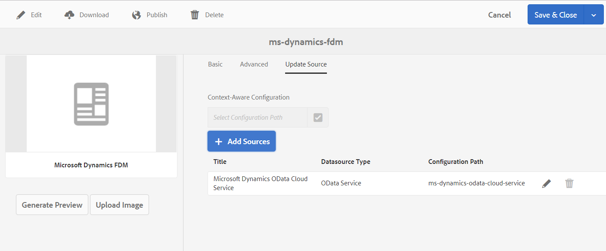

# Create Form Data Model (FDM) {#create-form-data-model}

<!--and interactive communication-->

| Version | Article link |
| -------- | ---------------------------- |
| AEM 6.5  |    [Click here](https://experienceleague.adobe.com/docs/experience-manager-65/forms/form-data-model/create-form-data-models.html)                  |
| AEM as a Cloud Service     | This article        |

 

A **Form Data Model (FDM)** in [!DNL Experience Manager Forms] defines how data is structured and exchanged between forms and back-end systems. [!DNL Experience Manager Forms] data integration provides an intuitive user interface to create and work with form data models. A Form Data Model (FDM) relies on data sources for the exchange of data; however, you can create a Form Data Model (FDM) **with or without a data source**. This flexibility lets you begin designing and testing forms even before back-end connectivity is available, then bind data sources later without rebuilding the model.

There are two approaches to create a Form Data Model (FDM), depending on whether you have configured data sources:

* **Using preconfigured data sources**: If you have configured data sources as described in [Configure data sources](configure-data-sources.md), you can select them while creating a Form Data Model (FDM). Selecting configured data sources brings all data model objects, properties, and services from the selected data sources available for use in the Form Data Model (FDM). This approach is ideal when your integration endpoints are already established and you want the FDM to reflect live schema, operations, and services from those systems.

* **Without data sources**: If you have not configured data sources for your Form Data Model (FDM), you can still create the Form Data Model (FDM) without data sources. You can use the Form Data Model (FDM) to author Adaptive Forms and test them using sample data. When data sources become available, you can bind the Form Data Model (FDM) with data sources, and this binding automatically propagates to the associated Adaptive Forms — so forms built against sample data continue to work once real back-end connectivity is added.

<!--and interactive communications-->

>[!NOTE]
>
>**Prerequisite:** You must be a member of both the **fdm-author** and **forms-user** groups to create and work with a Form Data Model (FDM). Without membership in both groups, the FDM authoring capabilities are unavailable. Contact your [!DNL Experience Manager] administrator to become a member of the **fdm-author** and **forms-user** groups.

## Create Form Data Model (FDM) {#data-sources}

Before creating a Form Data Model (FDM), ensure that you have configured the data sources you intend to use in the Form Data Model (FDM) as described in [Configure data sources](configure-data-sources.md). A Form Data Model (FDM) provides a unified layer that connects [!DNL Adobe Experience Manager] Forms to one or more configured data sources, allowing you to bind form fields to backend data and invoke data source services. Do the following to create a Form Data Model (FDM) based on configured data sources:

1. In the [!DNL Experience Manager] author instance, navigate to **[!UICONTROL Forms > Data Integrations]**.
1. Select **[!UICONTROL Create > Form Data Model]**.
1. In the Create Form Data Model dialog:

    * Specify a name for the form data model (FDM).
    * (**Optional**) Specify a title, description, and tags for the form data model (FDM).
    * (**Optional and applicable only if data sources are configured**) Select the tick icon next to the **[!UICONTROL Data Source Configuration]** field and select the configuration node where cloud services for the data sources you want to use reside. As a result, the list of data sources available for selection on the next page is restricted to those available in the selected configuration node. However, any [!DNL Experience Manager] user profile data sources are listed by default. If you do not select a configuration node, data sources from all configuration nodes are listed.

1. Select **[!UICONTROL Next]**.

1. (**Applicable only if data sources are configured**) The **[!UICONTROL Select Datasource]** screen lists the available data sources. Select the data sources you want to use in the form data model.
1. Select **[!UICONTROL Create]**, and on the confirmation dialog, select **[!UICONTROL Open]** to open the Form Data Model editor.

    ![A Form Data Model with three data sources - a RESTful service, [!DNL Experience Manager] user profile, and an RDBMS](assets/fdm-ui.png)

    The Form Data Model editor UI includes the following components:

   A. **[!UICONTROL Data Sources]** Lists the data sources in a form data model. Expand a data source to view its data model objects and services.

   B. **[!UICONTROL Refresh Data Source Definitions]** Fetches any changes in data source definitions from the configured data sources and updates them in the Data Sources tab of the Form Data Model editor. This ensures the model reflects the current state of connected data sources.

   C. **[!UICONTROL Model]** Content area where added data model objects appear.

   D. **[!UICONTROL Services]** Content area where added data source operations or services appear.

   E. **[!UICONTROL Toolbar]** Tools to work with the form data model (FDM). The toolbar shows more options depending on the selected object in the form data model (FDM).

   F. **[!UICONTROL Add Selected]** Adds the selected data model objects and services to the form data model.

For more information about the Form Data Model editor and how you can work with it to edit and configure a form data model (FDM), see [Work with form data model](work-with-form-data-model.md).

## Update data sources {#update}

<!--and interactive communications-->

Follow these steps to add, replace, or delete data sources in an existing **Form Data Model (FDM)** in [!DNL Adobe Experience Manager] Forms. Keeping data sources current ensures that Adaptive Forms built on the model continue to read from and write to the correct systems.

1. Go to **[!UICONTROL Forms > Data Integrations]**, select the **Form Data Model (FDM)** in which you want to add or update data sources, and select **[!UICONTROL Properties]**.
1. In the Form Data Model properties, go to the **[!UICONTROL Update Source]** tab.

   In the **[!UICONTROL Update Source]** tab, you can select a configuration context and then add, replace, or delete data sources:

    * **Select a configuration context:** Select the browse icon in the **[!UICONTROL Context-Aware Configuration]** field and select a configuration node where the cloud configuration for the data source you want to add resides. This determines which cloud configurations are visible. If you do not select a node, cloud configurations residing only in the `global` node are listed when you select **[!UICONTROL Add Sources]**.

    * **Add a new data source:** Select **[!UICONTROL Add Sources]** and select the data sources to add to the **Form Data Model (FDM)**. All data sources configured in `global` and in the selected configuration node, if any, are displayed. This adds the selected data sources so their data model objects become available for binding in the model.

    * **Replace an existing data source:** To replace an existing data source with another data source of the same type, select the **[!UICONTROL Edit]** icon for the data source and select from the list of available data sources. Replacing with a source of the same type preserves the existing data model structure so dependent bindings remain valid.
      

    * **Delete an existing data source:** To delete an existing data source, select the **[!UICONTROL Delete]** icon for the data source. The Delete icon is disabled because a data model object from that data source is already added and in use in the **Form Data Model (FDM)**, which prevents removal of dependencies that are still referenced.

1. Select **[!UICONTROL Save & Close]** to save the updates.

>[!NOTE]
>
>Once you add new data sources or update existing data sources in a **Form Data Model (FDM)**, update the binding references, as appropriate, in the Adaptive Forms that use the updated **Form Data Model (FDM)**. This ensures that fields continue to map correctly and that form data is read from and written to the intended sources.

## Context aware configurations for specific run modes {#runmode-specific-context-aware-config}

[!UICONTROL Form Data Model (FDM)] uses [Sling context-aware configurations](https://experienceleague.adobe.com/docs/experience-manager-core-components/using/developing/context-aware-configs.html) to supply different data source parameters, enabling connections to data sources that vary across [!DNL Experience Manager] run modes. This capability lets a single deployment target distinct endpoints depending on whether it runs in **Development**, **Stage**, or **Production**.

When [!UICONTROL Form Data Model (FDM)] uses cloud configurations to store parameters, those parameters, when checked in and deployed through source control (Cloud-Manager GIT repository), create a single cloud configuration with identical parameters across all run modes (**Development, Stage, and Production**). When your use case requires different data sets for test and production environments, use data source parameters (for example, a data source URL) that are specific to each [!DNL Experience Manager] run mode.

To achieve this, create an **OSGi configuration** that contains data source parameter-value pairs. This ensures the OSGi values take precedence, overriding the same pair from the [!UICONTROL Form Data Model (FDM)] cloud configuration at run time. Because OSGi configurations support these run modes by default, you can override a data source parameter to a different value based on run mode, allowing each environment to resolve to its own endpoint.

To enable deployment-specific cloud configurations in [!UICONTROL Form Data Model (FDM)]:

1. Create cloud configuration on local development instance. For detailed steps, see [How to configure data sources](/help/forms/configure-data-sources.md).

1. Store your cloud configuration to file system.
    1. Create package with filter `/conf/{foldername}/settings/cloudconfigs/fdm`. Use the same `{foldername}` as in step 1. And replace `fdm` with `azurestorage` for Azure storage configuration.
    1. Build and download package. For details, see [package actions](/help/implementing/developing/tools/package-manager.md).

1. Integrate cloud configuration in [!DNL Experience Manager] Archetype Project.
    1. Unzip the downloaded package.
    1. Copy `jcr_root` folder and put it your `ui.content` > `src` > `main` > `content`.
    1. Update `ui.content` > `src` > `main` > `content` > `META-INF` > `vault` > `filter.xml` to contain filter `/conf/{foldername}/settings/cloudconfigs/fdm`. For details, see [ui.content module of AEM Project Archetype](https://experienceleague.adobe.com/docs/experience-manager-core-components/using/developing/archetype/uicontent.html). When this archetype project is deployed through the Cloud Manager (CM) pipeline, the same cloud configuration is installed on all environments (or run modes). To change the value of fields (like URL) of cloud configurations based on environment, use the OSGi configuration discussed in the following step.

1. Create an Apache Sling context aware configuration. To create the OSGi configuration:
    1. **Set up OSGi configuration files in [!DNL Experience Manager] Archetype project.**
       Create OSGi Factory Configuration files with PID `org.apache.sling.caconfig.impl.override.OsgiConfigurationOverrideProvider`. Create a file with the same name under each run mode folder where the values need to be changed per run mode. This ensures each run mode applies its own overriding values. For details, see [Configuring OSGi for [!DNL Adobe Experience Manager]](/help/implementing/deploying/configuring-osgi.md#creating-sogi-configurations).

    1. **Set the OSGi configuration JSON.** Configure the Apache Sling Context-Aware Configuration Override Provider so that environment-specific values are applied automatically at deployment. To use Apache Sling Context-Aware Configuration Override Provider:
        1. On your local development instance `/system/console/configMgr`, select the factory OSGi configuration with the name **[!UICONTROL Apache Sling Context-Aware Configuration Override Provider: OSGi configuration]**.
        1. Provide a description.
        1. Select **[!UICONTROL enabled]**.
        1. Under overrides, provide the fields that need to be changed based on the environment in Sling override syntax. For details, see [Apache Sling Context-Aware Configuration - Override](https://sling.apache.org/documentation/bundles/context-aware-configuration/context-aware-configuration-override.html#override-syntax). For example, `cloudconfigs/fdm/{configName}/url="newURL"`.
        Add multiple overrides by selecting **[!UICONTROL +]**.
        1. Select **[!UICONTROL Save]**.
        1. To get the OSGi Configuration JSON, follow the steps in [Generating OSGi Configurations using the AEM SDK Quickstart](/help/implementing/deploying/configuring-osgi.md#generating-osgi-configurations-using-the-aem-sdk-quickstart).
        1. Place the JSON in the OSGi Factory Configuration Files created in the previous step.
        1. Change the value of `newURL` in the override configuration to the correct target value for each environment (or runmode), so that each environment resolves to its own URL.
        1. To change a secret value based on runmode, create a secret variable using the [Cloud Manager (CM) API](/help/implementing/deploying/configuring-osgi.md#cloud-manager-api-format-for-setting-properties) and later reference it in the [OSGi Configuration](/help/implementing/deploying/configuring-osgi.md#secret-configuration-values).
        When this archetype project is deployed through the Cloud Manager (CM) pipeline, the override provides different values on different environments (or run modes). As a result, a single codebase resolves to environment-specific configuration at runtime. This ensures that development, staging, and production instances each receive the correct URL and secret values without manual code changes.
        
        >[!NOTE]
        >
        >[!DNL Adobe Managed Service] users can encrypt the secret values using crypto support. For details, see [encryption support for configuration properties](https://experienceleague.adobe.com/docs/experience-manager-65/administering/security/encryption-support-for-configuration-properties.html#enabling-encryption-support), and place the encrypted text in the value after [context-aware configurations are available in service pack 6.5.13.0](https://experienceleague.adobe.com/docs/experience-manager-65/forms/form-data-model/create-form-data-models.html#runmode-specific-context-aware-config).

1. Refresh the data source definitions using the option to refresh data source definitions in the [Form Data Model editor](#data-sources) to refresh the Form Data Model (FDM) cache through the FDM user interface (UI) and get the latest configuration. This ensures the FDM cache reflects the newly applied override values.

## Next steps {#next-steps}

You now have a **Form Data Model (FDM)** with data sources added to it. With the data sources connected, the next stage is to refine and extend the **Form Data Model (FDM)** so it accurately represents the data your form needs to capture and process.

Edit the **Form Data Model (FDM)** to perform the following tasks:

- Add and configure data model objects and services.
- Add associations between data model objects to define how related data connects.
- Edit properties of existing data model objects.
- Add custom data model objects and properties to model data that is not available in the connected data sources.
- Generate sample data to test and preview how the form data model behaves.

These configuration steps let you tailor the **Form Data Model (FDM)** to your specific business requirements before binding it to a form.

For more information, see [Work with form data model](work-with-form-data-model.md).
