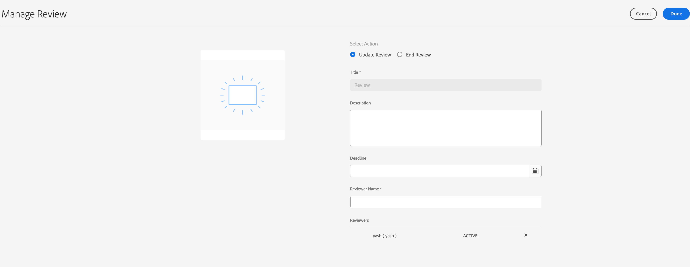

# Creating and managing reviews for assets in forms{#creating-and-managing-reviews-for-assets-in-forms}

## Review {#review}

A review is a mechanism that allows one or more reviewers to comment on an asset that is available in a form.

## Setting up a review {#setting-up-a-review}

1.  Navigate to the Forms tab and select a form.
1.  If the Form does not have a review in progress, a Start Review  icon appears in the Action bar. Click on the Start Review  icon.
1.  Enter the following information:

    * Title: Mandatory, It can contain alphanumeric characters, hyphen, or underscore.
    * Description: Optional, description of the purpose / content for review.
    * Deadline: Optional, the date on which the review ends. When past the deadline the task appears as 'Overdue'.
    * Reviewers: A minimum of one is mandatory. Typing a group name or a username lists all matching names except the service users group. select a name and click Add.

1.  Click on the Start to start a review.

>[!NOTE]
>
>* Admin can access any groups associated with the Form users.
>* Service Users group is not available to selection for review.

### Actions that occur when a review is set up {#actions-that-occur-when-a-review-is-set-up}

This section describes what happens when a review is created or set up.

1. A new review task is created and assigned to the selected reviewer. 
1. All reviewers are assigned a review task. The task appears in their Notifications section. A reviewer can click a notification, or go to the Inbox to view the task. A reviewer can click to open the review task, to view the form, and start adding comments.

   

   Reviewer Notification Alert

1. The comment box is available to the reviewers of the Form. Others can view the comments, but cannot write comments.

## Managing a review {#managing-a-review}

>[!NOTE]
>
>Only reviews that are in progress can be modified. Reviews that are complete cannot be modified.

1. Navigate to the Forms tab and select a form.  

1. If an asset has a review in progress and you are the initiator of the review, a Manage Review  icons appears in the Action bar. Only review initiator can manage (Update/End) the review.

   Click the Manage Review icon.

   For user other than initiator the Manage Review icon is disabled. 

1. You get a screen that displays information:

    * **Title**: Cannot be edited.  
    
    * **Description**: Available for editing.  
    
    * **Deadline**: Available for editing. One can modify the deadline to any date and time beyond the current date and time.  
    
    * **Reviewer Name**: Available for editing. You can add or remove reviewers. If a task is overdue, you can add reviewers only after extending the deadline beyond the current date.

1. Edit the necessary fields, and then click Done.

   

   Review updated state in Task Manager

1. To end the review, click End Review.

### Actions that occur when a review is modified {#actions-that-occur-when-a-review-is-modified}

This section describes, what happens on Review Update/End:

1. If the Review description is modified, the corresponding task of reviewers and the initiator is updated.
1. If the Review deadline is modified, the corresponding task for the reviewers is updated with the new date.   

1. If a reviewer is removed:

   

   Removing a reviewer

    1. If incomplete, the assigned task is terminated.
    1. The reviewer can no longer comment on the form.

1. If a reviewer is added:

   

   Adding a reviewer

    1. A review task is created and assigned to the newly added reviewer.
    1. The newly added reviewer can add comments about the form.

1. When a review ends:

    1. **Reviewers**: For each reviewer, the incomplete task related to the review is terminated. The task no longer appears as 'Pending' in the reviewer's Notifications section.
    1. **Initiator**: The task assigned to the Review initiator is marked complete. The task is removed from the Notification section of the review initiator.
    1. **All**: The review appears in the Previous Reviews section. No further comments can be added.

   

