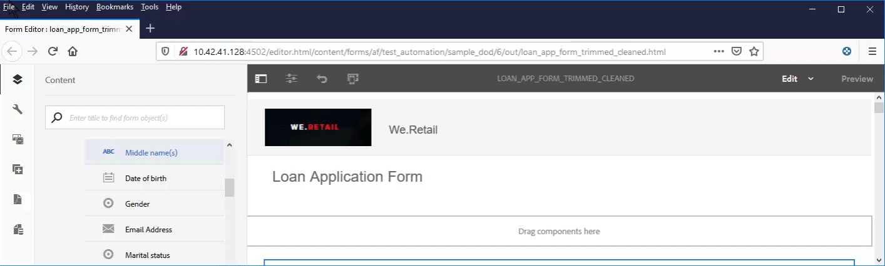
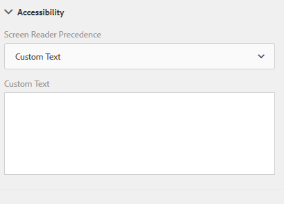
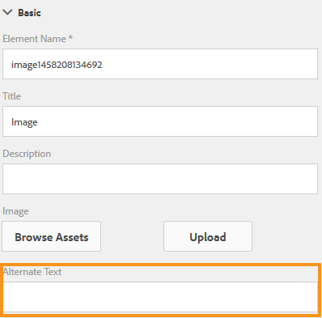

# Creating accessible Adaptive Forms{#creating-accessible-adaptive-forms}

## Introduction {#introduction}

An **accessible form** is a form that everyone can use, including users with special needs and disabilities. Adaptive Forms include built-in accessibility features and capabilities—such as support for **assistive technologies**, keyboard navigation, screen-reader-compatible labeling, and configurable color contrast—that enhance usability for users with different abilities. Building accessibility into Adaptive Forms serves two connected purposes: it opens content to the widest possible audience, and it satisfies legal and regulatory obligations. Because many jurisdictions mandate conformance to recognized accessibility standards when supplying digital documents, accessibility is not merely a best practice but a compliance **requirement** in those geographies. **[!DNL AEM Forms]** helps form developers meet these accessibility standards.

While authoring an Adaptive Form, form authors must address the following considerations to build an accessible Adaptive Form:

* **Test with the Accessible Name and Description Inspector (ANDI)** — Validate the form using the ANDI accessibility testing tool to confirm that every control exposes an accessible name and description, ensuring assistive technologies can interpret each field correctly.
* **Provide proper labels for form controls** — Associate clear, descriptive labels with every input, checkbox, and selection control. This ensures screen readers announce the purpose of each field and allows all users to understand what information is required.
* **Provide text equivalents for images** — Supply alternative text for images and non-text content so that users who cannot see the images still receive the same information through assistive technology.
* **Provide sufficient color contrast** — Ensure adequate contrast between text and background colors. Sufficient contrast makes content legible for users with low vision or color-vision deficiencies.
* **Ensure form controls are keyboard accessible** — Make every control operable using the keyboard alone. This is essential for users who cannot use a mouse and rely on keyboard navigation or other input devices.

## Prerequisite

Creating an accessible Adaptive Form requires two essential tools: an accessibility inspection tool and an accessibility-optimized form theme. Together, these tools enable you to build forms that comply with accessibility standards and function correctly for users relying on assistive technologies such as screen readers.

**Required tools:**

- **Accessible Name and Description Inspector (ANDI)** — an accessibility testing tool that inspects each form element to verify that it exposes a correct accessible name and description. ANDI helps you identify components that assistive technologies cannot interpret, so you can locate and correct accessibility gaps before publishing the form.
- **An Adaptive Form theme developed to fix accessibility-related issues** — a theme specifically engineered to resolve common accessibility problems. This theme applies accessible styling, focus indicators, and markup conventions across form components, ensuring the rendered form meets accessibility requirements without manual remediation of every element.

Using **ANDI** together with an accessibility-focused Adaptive Form theme ensures the form is both inspectable and correctly structured. As a result, the finished Adaptive Form is more usable for people with disabilities and more likely to satisfy accessibility conformance expectations.

### How to Download and Install ANDI: The Accessibility Testing Tool for Section 508 Compliance

The **Accessible Name and Description Inspector (ANDI)** is the recommended accessibility testing tool under the **Trusted Tester v5** guidelines of the U.S. **Department of Homeland Security**. Developed by the **Social Security Administration (SSA)** of the United States, ANDI evaluates whether web content meets **Section 508** accessibility requirements. Section 508 is the federal standard that mandates electronic and information technology be accessible to people with disabilities, ensuring equal access to digital content.

ANDI enables developers, testers, and content authors to identify and fix accessibility compliance issues directly within web content, making it a trusted reference tool for organizations that must demonstrate Section 508 conformance.

The ANDI tool performs the following core functions:

* **Detects accessibility issues** on a webpage, flagging elements that fail to meet compliance standards so they can be corrected before publication.
* **Provides actionable suggestions** to improve accessibility, guiding testers toward compliant fixes rather than simply reporting problems.
* **Identifies keyboard accessibility and color contrast issues**, because users who rely on keyboard navigation or who have low vision depend on these elements to interact with content.
* **Clearly identifies the screen reader content** in compliance with accessibility standards, allowing testers to confirm exactly what assistive technology users will hear.

ANDI operates across all major web browsers, making it broadly usable regardless of the testing environment. For detailed instructions to configure and use the tool, see [ANDI's documentation](https://www.ssa.gov/accessibility/andi/help/install.html).

### Download and install the Ultramarine-Accessible theme

The **Ultramarine-Accessible theme** is a **reference theme** for **Adobe Experience Manager (AEM)** Adaptive Forms. It demonstrates how to fix **color contrast** and other **accessibility-related issues** in an Adaptive Form, helping teams align their forms with recognized accessibility expectations. Because it is a reference theme, Adobe recommends creating a **custom theme for the production environment** based on the styles approved by your organization, then reusing the Ultramarine-Accessible theme as a working example. Perform the following steps to upload the theme to your **Adobe Experience Manager (AEM)** instance:

1. Download the theme package to your local machine so it is ready to upload.
1. Navigate to **[!UICONTROL Experience Manager]** > **[!UICONTROL Navigation]**  > **[!UICONTROL Forms]** on your AEM instance.
1. Select **[!UICONTROL Create]** > **[!UICONTROL File Upload]**. Select and upload the **Ultramarine-Accessible-Theme.zip** file. This action uploads the theme to your AEM instance, making it available to apply to your Adaptive Forms.

Once uploaded, the theme appears among the available themes in [!DNL AEM Forms] and can be applied to an Adaptive Form or used as a starting point for building an organization-approved production theme.

## Make an Adaptive Form accessible

Making an Adaptive Form accessible requires attention to four key aspects: **keyboard navigation**, **color contrast**, **meaningful alternate text for images**, and **appropriate labels for form controls**. Together, these four aspects ensure that people who rely on assistive technologies — including screen readers, keyboard-only navigation, and screen magnifiers — can complete a form without barriers. Accessible forms also align with widely referenced standards such as the **Web Content Accessibility Guidelines (WCAG)**, which many organizations treat as the baseline for inclusive digital experiences.

Form authors can make existing Adaptive Forms accessible by addressing each of the four aspects as described below.

### 1. Enable keyboard navigation

Keyboard navigation ensures that users who cannot operate a mouse — including many screen reader users and people with motor impairments — can move through and submit the form using only the keyboard.

- Verify that every field, button, and interactive control can receive focus and be activated using the **Tab**, **Shift+Tab**, and **Enter** keys.
- Confirm that the focus order follows a logical reading sequence, so users move through the form in the order the content is presented.
- Ensure a visible focus indicator highlights the currently selected control, because users navigating by keyboard need to see where they are on the page.

### 2. Ensure sufficient color contrast

Adequate color contrast between text and its background makes content readable for users with low vision or color vision deficiencies.

- Choose foreground and background color combinations that meet recognized contrast thresholds defined in the **Web Content Accessibility Guidelines (WCAG)**.
- Avoid conveying information through color alone; pair color cues with text, icons, or patterns so the meaning remains clear to users who cannot distinguish certain colors.
- Test the form under different display conditions to confirm that labels, instructions, and error messages remain legible.

### 3. Provide meaningful alternate text for images

Meaningful alternate (alt) text allows screen readers to describe images to users who cannot see them, ensuring no information is lost.

- Add concise, descriptive alt text to every informative image so that assistive technology can convey its purpose.
- Describe the function or content of the image rather than simply labeling it "image" or repeating the file name.
- Mark purely decorative images so that assistive technology skips them, which prevents unnecessary clutter for screen reader users.

### 4. Add appropriate labels for form controls

Clear, programmatically associated labels tell users what information each field expects, which is essential for both usability and screen reader interpretation.

- Associate a descriptive label with every input field, checkbox, radio button, and dropdown, so assistive technology announces the correct prompt.
- Use accessible descriptions and, where appropriate, **Accessible Rich Internet Applications (ARIA)** attributes to communicate required fields, formatting requirements, and validation errors.
- Ensure that instructions and error messages are linked to their corresponding controls, so users understand what to correct and why.

By addressing keyboard navigation, color contrast, alternate text, and form labels, form authors transform an existing Adaptive Form into an inclusive experience that serves a broader audience and supports compliance with established accessibility standards.

### 5. Apply an accessible theme and perform additional fixes

Apply the **Ultramarine-Accessible** theme to your existing Adaptive Form. To apply the theme:

1. Open the Adaptive Form for editing.
1. Select a component and select the parent icon. In the context menu, select **[!UICONTROL Adaptive Form Container]** and then select the configure icon.
1. Select the **Ultramarine-Accessible** theme in the properties browser and select **[!UICONTROL Save]** icon.
1. Refresh the browser window. The theme is applied to the Adaptive Form.

#### Additional accessibility fixes after applying the theme

After applying the accessible theme, perform the additional fixes listed below. These fixes are in addition to the accessibility fixes already covered by the accessible theme:

1. Add a meaningful alternate text for the logo image in the Adaptive Form.

    Provide a meaningful alternate text for images in the header and footer components of the Adaptive Form template. When you fix the template and use it to create an Adaptive Form, the Adaptive Forms inherit all the accessibility-related fixes applied to the header and footer of the template. For an existing Adaptive Form, make changes at the Adaptive Form level. Changes made to an Adaptive Form template do not automatically flow to an existing Adaptive Form; you must apply them directly at the Adaptive Form level. Meaningful alternate text is essential because screen readers announce this text to users who cannot see the image, allowing them to understand the purpose of the logo.

1. Add a heading component containing the form name to the Adaptive Form. If your form design specifies a company name, add a separate heading component for the company name as well.

    

    Most accessibility tools convey the hierarchy of the content to help users understand the structure of the web page. Set different heading levels for the organization name and the form name text on the Adaptive Form to provide a clear hierarchical structure to these text elements. In addition, use a Text component with an appropriate heading level before each panel and section to create a consistent hierarchy. This heading structure allows screen reader users to navigate the form by headings and understand how sections relate to one another.

1. Change the footer background color to use appropriate contrast in accordance with accessibility standards. Sufficient contrast between text and background directly improves the visibility and readability of the text, because low-vision users depend on adequate color contrast to distinguish content. You can use **ANDI (Accessible Name & Description Inspector)** to find color contrast issues in your form. Also, avoid very small font sizes, because small fonts reduce legibility for users with low vision.

1. Replace the switch and image choice components in your existing Adaptive Form with the choice (radio) component. This ensures the options are announced correctly by screen readers and are reliably operable using keyboard navigation.

1. Replace the numeric stepper component in your existing Adaptive Form with the numeric box component.

1. Replace the date input field with the date picker field.

1. Set display, validation, and edit patterns for the date picker component. Also, set a custom validation error message. For example: *You have specified an invalid date. The correct format of the date is YYYY-MM-DD.* A clear, specific error message helps all users, including those relying on assistive technology, understand and correct their input.

1. Set custom accessibility text for the date picker component. For example: *Enter your date of birth.* Screen readers read these custom accessibility texts aloud, giving users the context they need to complete the field.

1. Use a short description instead of a long description for Adaptive Form components. A long description adds a help button, and adding help buttons can create additional navigation complexity for assistive technology users. Ensure the Adaptive Form does not have any help button.

1. Add custom accessibility text to all read-only cells of tables. Also, disable all read-only cells of tables, so that assistive technology correctly conveys that these cells are not editable.

1. Remove scribble signature fields, if any, from the Adaptive Form. Configure the Adaptive Form to use [!DNL Adobe Sign] for a seamless and accessible digital signing experience.

### 6. Provide proper labels for form controls {#provide-proper-labels-for-form-controls}

**A form control label identifies what the form component represents.** For example, the text "First name" tells users that they must enter their first name in a text field. To make this identification available to assistive technology, the accessible label must be **programmatically associated** with the form control—meaning the relationship is defined in the underlying code (not merely implied by visual placement) so that assistive tools can detect it reliably. Alternatively, the form control is configured with additional accessibility information.

Because screen readers rely on programmatic associations rather than visual layout, a control that only looks labeled on screen may still be unusable for a person who cannot see the interface. This association ensures the screen reader announces the correct label when the user navigates to the field, which reduces errors and improves form completion for users of assistive technology.

The label perceived by screen readers need not be identical to the visual caption. In some cases, authors can be more specific about the control's purpose than the visible text allows. For each field object in a form, the accessibility options specify exactly what the screen reader announces to identify the specific form field—useful when a short visual label such as "First name" needs a fuller spoken description for clarity.

**To configure the Accessibility option, follow these steps:**

1. Select a component and select .
1. Click **[!UICONTROL Accessibility]** in the sidebar to choose the desired accessibility option.

The selected accessibility option then determines the text the screen reader announces for that form field, completing the programmatic labeling of the control.

### Accessibility options in form components {#accessibility-options-in-form-components}

Each form component supports several accessibility options that determine the text announced by assistive technology, such as screen readers. Choosing the correct option ensures that users who rely on screen readers can accurately identify and complete each field.

**Custom Text** Form authors provide the content in the accessibility option Custom text field. The assistive technology, such as screen readers, uses this custom text. Create **Custom Screen Reader Text** only when using the Title or a short description is not possible, because it requires manually maintained wording separate from the visible label.

**Short description** For most components, the short description appears at runtime when the user hovers the pointer over the component. Form authors set this option in the short description field, under the help content option.

**Title** is the recommended accessibility option in most scenarios. Use this option to let Adobe Experience Manager (AEM) Forms use the visual label associated with the form field as the screen reader text. Because the Title reuses the field's existing visible label, it stays consistent with what sighted users see and reduces the risk of mismatched or outdated alternative text.

**Name** Form authors specify a value in the Name field of the Binding tab. The **Name value cannot contain spaces**.

**None** Selecting None causes the form object to not have a name in the published form. As a result, screen readers cannot announce the control to users, leaving the field effectively unlabeled. None is **not a recommended setting for form controls** and should be avoided wherever an accessible label is possible.

>[!NOTE]
>
>* Radio Button and Check-box support only two accessibility options: Custom Text and Title.
>* For XML Forms Architecture (XFA)-based Adaptive Forms, the accessibility option is inherited directly from the accessibility options set in the XML Data Package (XDP). Tool tips from the XDP are mapped to the Short Description, and Captions are mapped to the Title. The other options work as is.

### 7. Provide text equivalents for images {#provide-text-equivalents-for-images}

**Every image in a form must include alternative text (alt text).** Alt text is a written description that assistive technologies read aloud in place of the image, making visual content accessible to people who cannot see it.

While images improve comprehension for sighted users, images without descriptions reduce accessibility for people who rely on screen readers. When you add images, always provide text descriptions for every image so that no user is excluded from the information the image conveys.

Ensure that the alternative text describes both the object shown and the purpose that object serves within the form. A screen reader announces this alternative text whenever it encounters the image, allowing users to understand the image's meaning and role without seeing it. This is why **an image must always have alternative text specified** — an image left without alt text is effectively invisible to screen reader users.

**How to add alternative text to an image:**

1. Select the image component in your form.
2. Select .
3. In the sidebar, under **Properties**, specify the alternate text for the image.

### 8. Provide sufficient color contrast {#provide-sufficient-color-contrast}

<!-- See [Creating custom themes for Adaptive Forms](creating-custom-adaptive-form-themes.md), for more information about changing the color contrast and theme for the Adaptive Forms. -->

Accessibility design involves considering additional guidelines for color usage. Color contrast refers to the difference in luminance (perceived brightness) between foreground text and its background. Form authors can use colors to improve the appearance of forms, by highlighting various form components. However, improper use of color makes a form difficult or impossible to read by people with different abilities, including users with low vision or color blindness.

Users with vision impairment rely on a **high contrast between text and the background** to read digital content. This is because greater luminance difference sharpens the visual boundary between characters and the surface behind them, which is essential for readers who cannot easily distinguish subtle color differences. Because insufficient contrast reduces legibility, a form can become difficult or impossible to read for users with reduced vision. Widely recognized accessibility guidance, such as the Web Content Accessibility Guidelines (WCAG), treats adequate contrast between text and background as a core requirement for readable digital content.

To ensure sufficient color contrast, apply the following guidance:

- **Use the default font and background colors** — black text on a white background provides the strongest, most reliable contrast.
- **If you change the default colors, keep the foreground and background clearly separated in brightness** — choose either a dark foreground color on a light background color, or a light foreground color on a dark background.
- **Avoid low-contrast combinations** — pairings such as light gray text on a white background or dark text on a similarly dark background reduce legibility and should not be used.

Maintaining strong contrast ensures that all users, regardless of visual ability, can read and complete your forms.

### 9. Ensure that form controls are keyboard accessible {#ensure-that-form-controls-are-keyboard-accessible}

An accessible form is fully operable using only the keyboard or an equivalent input device — no mouse required. Users with reduced mobility or impaired vision often rely exclusively on the keyboard, and many users who can operate a mouse still prefer keyboard input for speed and efficiency. Supporting keyboard input is a foundational principle of accessible design, because it ensures that every control can be reached, activated, and completed through a predictable sequence of keystrokes. By supporting multiple input methods, you not only build accessible forms that align with recognized accessibility standards, you also create forms that better match the preferences of all users and reduce barriers to completion.

**The following keyboard shortcuts are available in [!DNL AEM Forms]** for core form navigation and submission:

| Action |Keyboard shortcut |
|---|---|
| Move the cursor forward through a form |Tab |
| Move the cursor backward through a form |Shift+Tab |
| Move to the next panel |Alt+Right Arrow |
| Move to the previous panel |Alt+Left Arrow |
| Reset the filled data in a form |Alt+R |
| Submit a form |Alt+S |

In addition, various keyboard shortcut keys are available for the **[!UICONTROL Date Picker]** component in Adaptive Forms. To enable the shortcut keys, select the **[!UICONTROL Date Picker]** component and select  to open the properties. In the **[!UICONTROL Patterns]** section, select a display pattern using the **[!UICONTROL Type]** and **[!UICONTROL Pattern]** drop-down lists. Save the properties to enable the use of shortcut keys for the **[!UICONTROL Date Picker]** component. This configuration step is required because the shortcut keys operate against the selected display pattern.

The following keyboard shortcut keys are available for the **Date Picker** component in Adaptive Forms:

| Action |Keyboard shortcut |
|---|---|
| <ul><li>Display the Date Picker component options when the tab focus highlights the calendar icon</li><li>Perform the click event when the tab focus highlights an option</li> |Space or Enter |
| Hide the Date Picker component options |Esc|
| <ul><li>Move the cursor forward through the options available in the Date Picker component.</li><li>Set tab focus on calendar icon when date input field is active</li> |Tab |
| Move the cursor backward through the options available in the Date Picker component |Shift+Tab |
| <ul><li>Display the Date Picker component options when the tab focus highlights the date input field</li><li>Move the cursor downward in the calendar available in the Date Picker component</li> |Down Arrow |
| Move the cursor upward in the calendar available in the Date Picker component |Up Arrow |
| Move the cursor backward in the calendar available in the Date Picker component |Left Arrow |
| Move the cursor forward in the calendar available in the Date Picker component |Right Arrow |
| Perform the action for the caption available between right and left navigation arrows in the calendar |Shift + Up Arrow |
| Perform the action for right navigation arrow icon  available in the calendar |Shift + Left Arrow |
| Perform the action for left navigation arrow icon  available in the calendar|Shift + Right Arrow |

## Use the accessibility tool to find remaining accessibility issues

The **Accessible Name and Description Inspector (ANDI)** is an accessibility testing tool that identifies and helps resolve accessibility compliance issues in an Adaptive Form. Ensuring an Adaptive Form is accessible allows users of assistive technologies, such as screen readers, to perceive, navigate, and interact with form fields, which supports compliance with widely adopted accessibility standards and delivers a more inclusive experience for all users.

To use the **ANDI** tool to find and address accessibility issues in an Adaptive Form, follow these steps:

1. Open the Adaptive Form in **preview mode**.
2. Click the bookmarked **ANDI tool icon**. The **ANDI** tool then analyzes the Adaptive Form and inspects elements for missing or incorrect accessible names, descriptions, and related attributes, displaying the accessibility issues it detects. For details on how to use the tool, see [ANDI's documentation](https://www.ssa.gov/accessibility/andi/help/howtouse.html).
3. Review and fix the issues reported by **ANDI**. After applying corrections, re-run the **ANDI** analysis to confirm that the reported accessibility issues have been resolved and that no new issues remain.
