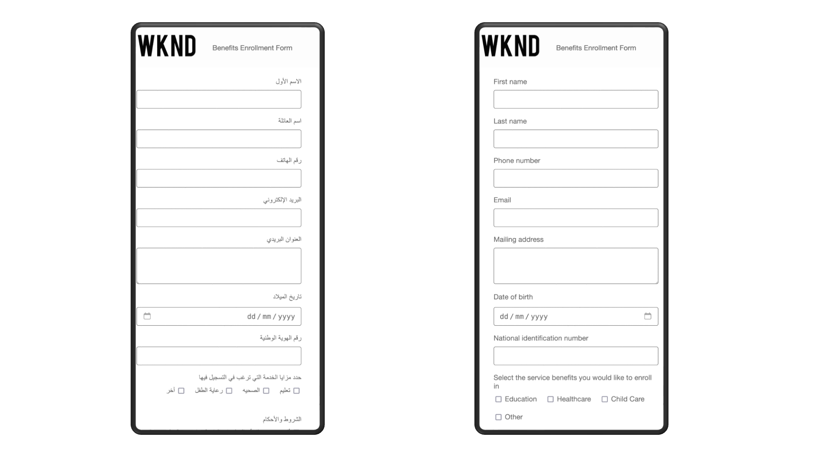

# AEM Forms Early Access Program

The AEM Forms Early Access Program program offers a unique opportunity to you to get exclusive access to cutting-edge features before anyone else, and help shape their development. The program offers you to:

* Be among the first to get access to cutting-edge technology before it hits the mainstream.
* Co-innovate with the product team, shaping the future of the product together. Use your use cases to guide development, ensuring the innovation is mature and address your real-world challenges.
* Provide feedback and help us squash issues before launch, leading to a smoother user experience upon full release. 

## How to join the Early Access program? 

If you're interested in joining our Early Access program for any Early Access innovation, simply send an email from your official address to [aem-forms-ea@adobe.com](mailto:aem-forms-ea@adobe.com)  to request access. You can request access to all or any specific innovation.  

## Early Access Innovations 

### AEM Forms AI Assistant (Gen AI)

Generative AI for Adaptive Forms brings a whole new level of power and ease to your forms development processes. With the help of intelligent AI features, you can build better forms faster than ever before. 

>[!VIDEO](https://video.tv.adobe.com/v/3435527)

The Generative AI capabilities on offer via AEM Forms AI Assistant are: 

* **AI Assistant for Product Queries**: Get instant answers to your AEM form-related questions. Our AI assistant acts as your own personal knowledge base, providing insightful guidance and recommendations directly within the platform.

* **Adaptive Form Generation**: Effortlessly create full-fledged forms with Generative AI Prompts. Our Generative AI automatically generates user-friendly forms that reduce drop-offs and personalize the experience.

* **Panel Generation for Forms**: Let AI do the heavy lifting. Generate pre-built form panels tailored to specific data collection needs. For example, generate sections for collecting payment information, customer preferences, or travel details. Save time and ensure consistency with pre-defined layouts and functionalities.

* **Changing Form Layouts**: Experiment with different layouts and designs using Generative AI Prompts. Try out different layouts like wizard or tabbed views to find the perfect fit for your form. Use Generative AI Prompts to optimize your forms for mobile responsiveness and create visually engaging forms that users love.

* **Configure Submit Action**: Use Generative AI prompts to effortlessly configure a submit action for your form. Choose from a library of pre-built submit actions or from a list of custom submit actions, created and deployed by your own development team.

### AEM Forms Workfront Fusion Connector 

The AEM Forms Workfront Fusion Connector empowers seamless integration between Adobe Experience Manager (AEM) Forms and Adobe Workfront Fusion. Adobe Workfront serves as a work management application, centralizing the entire work lifecycle, while Workfront Fusion acts as the integration platform facilitating connectivity between Workfront and various business applications. 

Using the AEM Forms Workfront Fusion Connector, you can design workflows that are triggered automatically upon submission of an Adaptive Form. For instance, envision a scenario where a workflow is initiated to assign a specific individual the task of reviewing submitted data, allowing approval or rejection of an application based on the information captured through the adaptive form. This streamlined integration enhances efficiency and brings a new level of automation to your workflow processes.

Ready to start? The [submit an Adaptive Form to Adobe Workfront Fusion](/help/forms/submit-adaptive-form-to-workfront-fusion.md) documentation provides a step-by-step guide to use the innovation.

<!--      -->

### Conversational Forms

The Conversational Forms innovation lets you interact with forms like a friendly chatbot on any AEM Sites page. 

You can simply drag and drop the Conversational Forms component onto your AEM Sites page and get started. There's no coding required, so anyone can create engaging and user-friendly Conversational Forms experiences quickly.

Here's what more Conversational Forms bring:

* **Easy form discovery**: Find the exact form that you need through a clear, conversational interface, on any AEM Sites page. 
* **Chat-style completion**: Answer questions one at a time, just like chatting with a virtual assistant. It's fast, intuitive, and feels like a conversation.
* **Preview before you submit**: Double-check everything before hitting submit. Preview your completed form to ensure accuracy and avoid any last-minute mistakes.

Conversational Forms are more than just a new look – they're a game-changer for user experience.  Boost engagement, reduce form abandonment, and make interacting with your website a more enjoyable experience for everyone.

### WYSIWYG Authoring for Edge Delivery Services

WYSIWYG Authoring provides WYSIWYG interfaces (Universal Editor and Adaptive Forms Editor) to build and publish adaptive forms to Edge Delivery Services. WYSIWYG Authoring offers all the capabilities of [Document-based Authoring](/help/edge/docs/forms/overview.md#document-based-authoring-features), plus a wide range of additional features:

* Advanced rules editor for creating complex logic.
* Server-side extensibility for custom functionalities.
* WYSIWYG editing experience for easy form creation and visualization.
* Document of record functionality to create tamper-proof archives of submitted data.
* Integration with Adobe Sign for electronic signatures.
* Integration with various data sources for pre-populating forms and submitting data.
* Form Data Model (FDM) for defining data structure and interactions with various data sources.
* Ability to choose from multiple submit actions for handling form submissions, including submitting data to Microsoft SharePoint, Microsoft OneDrive, Adobe Workfront Fusion, Salesforce, Microsoft Dynamics, and many more data sources.

### AEM Forms to Marketo Connector

The [AEM Forms to Marketo Connector](/help/forms/integrate-form-to-marketo-engage.md) bridges the gap between your web forms (Adaptive Forms) built with Adobe Experience Manager (AEM) and your marketing automation platform, Marketo. 

When someone submits a form on your website created with AEM Adaptive Forms, the connector ensures that the submitted data is automatically sent to Marketo. This eliminates the need for manual data entry and reduces the risk of errors. 

By streamlining the data transfer process, the connector can help you improve your website's conversion rates. By automatically sending lead data to Marketo, you can ensure that qualified leads are quickly entered into your nurturing programs.

In essence, AEM Forms to Marketo Connector helps you leverage the strengths of both platforms to create a more efficient and effective marketing funnel.

Ready to start? The following articles provides detailed instructions to use the innovation.

* [Integrate Marketo Engage with AEM Forms](/help/forms/integrate-form-to-marketo-engage.md)
* [Integrate an Adaptive Form with Marketo Engage](/help/forms/integrate-adaptive-form-with-marketo-engage.md) 
* [Configure Marketo Engage ad data source for existing Adaptive Forms](/help/forms/use-marketo-engage-data-source-in-form.md)
* [Submit an existing Adaptive Form to Marketo Engage](/help/forms/submit-adaptive-form-to-marketo-engage.md)

### Value Realization Dashboard

Track and analyze your forms' performance with the Value Realization Dashboard. This analytics tool helps you make data-driven decisions to optimize your forms strategy.

**Key features:**

* Monitor form submissions, document renditions, and form creation/publication metrics
* Track form fragment usage and reuse across your organization
* Identify trends, peak periods, and improvement opportunities

The dashboard provides insights through two main sections:

* **Form & Documents activity over time**: Tracks submissions, renditions, and form creation/publication
* **Fragment Usage**: Monitors fragment adoption and reuse

For detailed information:

* [Understanding your value realization dashboard](/help/forms/aem-forms-value-realization-dashboard.md)
* [Interpreting form & documents usage insights](/help/forms/interpreting-form-usage-insights-from-your-vr-dashboard.md)

## Additional Early Access Innovations

### HTML email Templates in Adaptive Forms

Adaptive Forms allows you use [HTML email templates](/help/forms/html-email-templates-in-adaptive-forms.md). HTML email templates enable you to send rich, personalized, and visually appealing emails when a form is submitted. These emails can be customized with form data and enhanced using various email tags, such as images and links. With Adaptive Forms, you can either upload a file containing an HTML template or use a plain-text editor to create these templates.

### RESTful Web Services Submit Action

Adaptive Forms can now seamlessly send captured data to authenticated external REST endpoints with the new RESTful Web Services Submit Action: 

* Standards Supported: Swagger 2.0 & 3.0 for easy API integration
* Secure Authentication: OAuth 2.0, Basic Auth, API Key, & Custom Authentication
* Flexible Data Formats: Multi-Part Form Data, JSON, & URL-encoded (Key-Value Pairs)

### Right-to-left (RTL) languages support

Adaptive Forms can now be displayed in a Right-to-Left (RTL) language, allowing a more inclusive user experience and ease of use. 

This functionality caters to languages like Arabic, Hebrew, and Urdu, which are written and read from Right-to-Left (RTL), fostering better comprehension and completion rates for forms. 

The Right-to-Left (RTL) languages support in Adaptive Forms help you: 

* **Expands user base**: Businesses can now reach over 2 billion people globally who are more comfortable with RTL languages.

* **Deliver enhanced user experience**: Forms render flawlessly with natural text flow from right to left, proper UI element alignment, and intuitive layouts mirroring user reading habits. This reduces confusion and increases form completion rates.

* **Deliver mobile responsive experiences**: Forms remain accessible on any device due to inherent mobile responsiveness, ensuring a smooth experience across desktops, tablets, and smartphones.

Overall, RTL language support in Adaptive Forms empowers businesses to design truly global forms, boosting reach, engagement, and inclusivity.

Ready to start? [Adaptive Forms RTL documentation](/help/forms/supporting-new-language-localization-core-components.md) provides a step-by-step guide to use the RTL innovation.

### Enhanced bot protection methods

AEM Forms has enhanced its security features by adding support for two popular CAPTCHA solutions: Cloudflare Turnstile and hCaptcha. This adds to the already available Google reCAPTCHA, providing users with more choice and flexibility in protecting their forms from bots and spam submissions.

* **Cloudflare Turnstile**: This frictionless CAPTCHA verifies users through a simple challenge that doesn't require explicit interaction. It seamlessly integrates into your forms, improving the user experience.
* **hCaptcha**: This privacy-focused CAPTCHA offers a user-friendly alternative with a focus on data privacy. It aims to strike a balance between security and user experience.
* **Google reCAPTCHA**: AEM Forms continue to support both reCAPTCHA v2 and reCAPTCHA Enterprise, offering a reliable and well-established solution.

By offering multiple CAPTCHA options, AEM Forms have empowered you to select the solution that best aligns with your specific needs. 

Ready to integrate any of these CAPTCHA solution with your Adaptive Forms? Our documentation provides detailed instructions for each: [Cloudflare Turnstile](https://experienceleague.adobe.com/en/docs/experience-manager-cloud-service/content/forms/adaptive-forms-authoring/authoring-adaptive-forms-core-components/create-an-adaptive-form-on-forms-cs/integrate-adaptive-forms-turnstile-core-components), [hCaptcha](https://experienceleague.adobe.com/en/docs/experience-manager-cloud-service/content/forms/adaptive-forms-authoring/authoring-adaptive-forms-core-components/create-an-adaptive-form-on-forms-cs/integrate-adaptive-forms-hcaptcha-core-components), and [Google reCAPTCHA](https://experienceleague.adobe.com/en/docs/experience-manager-cloud-service/content/forms/adaptive-forms-authoring/authoring-adaptive-forms-core-components/create-an-adaptive-form-on-forms-cs/captcha-adaptive-forms-core-components).

### Doc Assurance APIs

AEM Forms Doc Assurance APIs are a set of tools within the AEM Forms Cloud Service Communication APIs that allow you to manage the security and user interaction of your PDF documents.

Here's a breakdown of what Doc Assurance APIs can do:

* **Encrypt and decrypt documents**: Protect your documents by making their contents unreadable with encryption. You have control over what parts of the PDF are encrypted, including the entire document, specific content, metadata, or attachments.

* **Digitally sign documents**: Add digital signatures to your documents for validation and tamper-proof verification. This can be used for certification purposes or to ensure document integrity 

* **Reader Extend your documents (Apply or edit usage rights of PDF documents)**: Enables your organization to easily share interactive PDF documents by extending the functionality of Adobe Reader with additional usage rights. 

    The Reader Extension (Usage Rights) APIs adds usage rights to a PDF document. This action activates features that are not usually available when a PDF document is opened using Adobe Reader, such as adding comments to a document, filling forms, and saving the document. Third-party users do not require additional software or plug-ins to work with rights-enabled documents.

    When PDF documents have the appropriate usage rights added, recipients can do enabled activities from within Adobe Reader. 

Overall, [Doc Assurance APIs](https://developer.adobe.com/experience-manager-forms-cloud-service-developer-reference/references/docassurance/) help you improve document security and compliance by adding an extra layer of control.

### Forms Service APIs

Forms service generates interactive PDF forms for data capture. It can also be used to import/export data to/from an existing interactive PDF form and validate submitted data. Here's a breakdown of its functionalities: 

* **Rendering Forms**: Generate an interactive PDF form from a template created using AEM Forms Designer and, optionally, XML data. This essentially produces a fillable PDF form optionally pre-filled with data.

* **Data Extraction and Import**: Import data into an existing PDF form as well as extract data from a filled PDF form. Both XDP and XML data formats are supported, and importing to non-XFA PDF forms (also known as AcroForms) additionally supports FDF and XFDF data.

* **Data Validation**: : Validate submitted data, in XDP or XML format, against a template created using AEM Forms Designer.

### Doc Generation API

The document generation API includes an optional feature that allows the direct upload of generated PDFs to Azure Blob Storage. Some key benefits of uploading PDFs directly to Azure Blob Storage using the document generation API are:

* **Seamless Integration with Cloud Storage**:
Directly uploading generated PDFs to Azure Blob Storage eliminates the need for additional manual or programmatic steps to transfer files, streamlining workflows and enhancing efficiency.

* **Centralized Document Management**:
Storing PDFs in Azure Blob Storage allows for centralized management of documents, making it easier to organize, retrieve, and manage generated files across various use cases.

* **Improved Security**: By leveraging Azure's built-in security features, such as encryption at rest and role-based access control (RBAC), sensitive documents remain protected during storage.

* **Customizable Storage Paths**: The ability to define custom directory paths ensures generated PDFs are stored in organized and application-specific locations, improving file management.

## See also

* [Latest Innovations in AEM Forms](/help/forms/latest-innovations.md)

* [Capabilities of AEM Forms as a Cloud Services](/help/forms/home.md)

* [Difference between AEM 6.5 Forms (AMS and on-prem) and AEM Forms as a Cloud Services (AEM CS Forms)](/help/forms/notable-changes.md)

