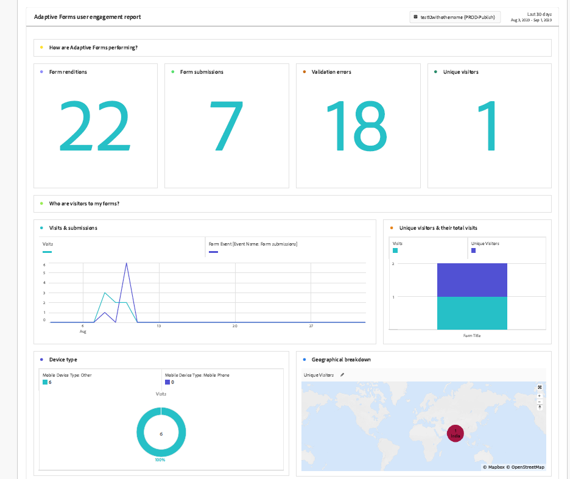
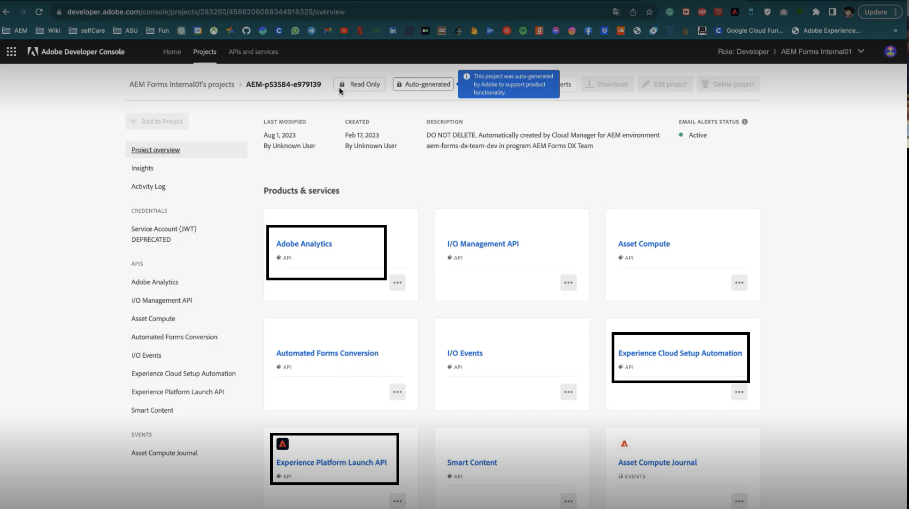
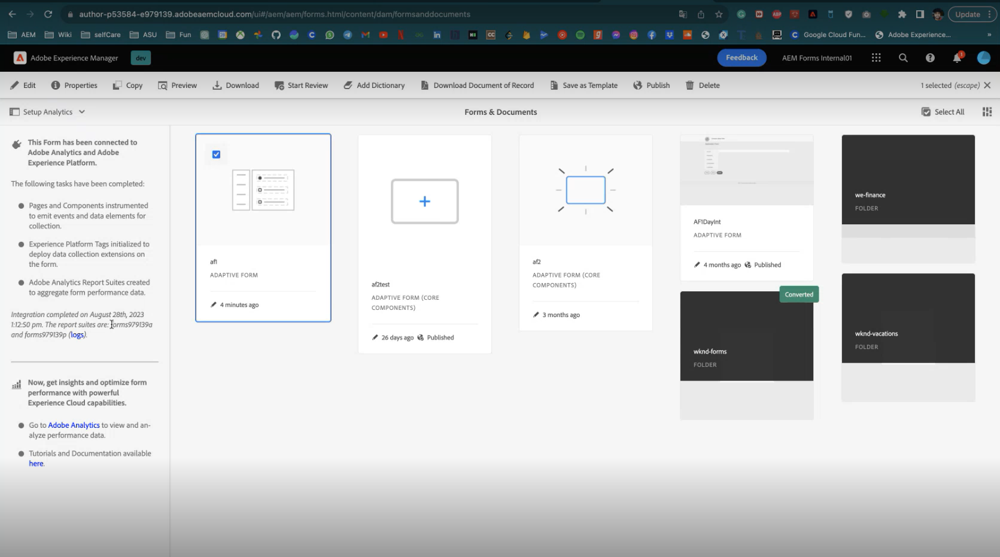
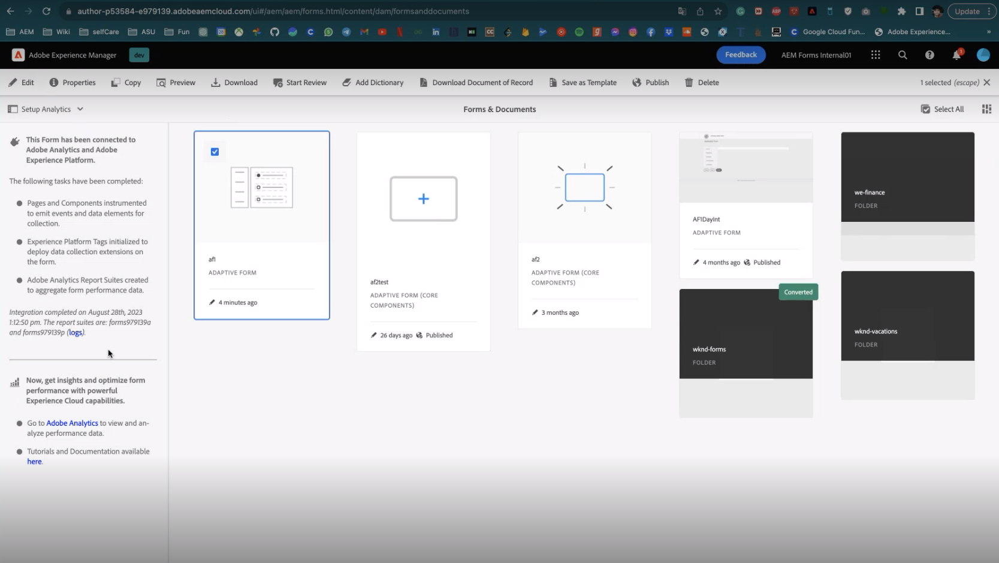

# Enable Adobe Analytics for an Adaptive Form using Experience Cloud Setup Automation {#integrate-adobe-analytics-to-aem-forms-with-experience-cloud-setup-automation}

| Version | Article link |
| -------- | ---------------------------- |
| AEM as a Cloud Service     | This article   |
| AEM 6.5  |    [Click here](https://experienceleague.adobe.com/docs/experience-manager-65/forms/integrate-aem-forms-with-experience-cloud-solutions/configure-analytics-forms-documents.html)                  |

Experience Cloud Setup Automation helps to connect Adobe Analytics to Adaptive Forms which aids in fast track analytics of user interaction with your forms and offering insights into visitor interactions and engagement. Experience Cloud Setup Automation also helps monitoring form performance which involves assessing metrics like completion times and drop-off points. This analysis helps optimize forms for better user experience while distinguishing user behavior based on login status, for example, anonymous users, to identify general trends and patterns.

## Advantages of integrating Adobe Analytics with Adaptive Forms {#advantages-of-integrating-adobe-analytics-with-aem-forms}

* **Insights into end-user behavior**: Adobe Analytics helps to get insights about end-user behavior,  reveals user actions, drop-offs, and completion rates, enabling a deeper understanding of how individuals engage with forms.
* **Enabling non-technical business users to gain insights**: Adobe Analytics through its easy to use interface empowers even non-technical users to access and interpret form usage data, fostering data-driven decisions for enhancing enrollment experiences.
* **Optimizing data capture experience based on usage**: Organizations easily identify pain points in data capture, leading to targeted improvements that enhance form usability and increase successful submissions.

## Scope of Adaptive Forms usage metrics {#scope-of-adaptive-forms-usage-metrics}

Adobe Analytics offers a comprehensive array of Adaptive Forms performance metrics designed to provide valuable insights into form usage and offers a fast track analytics. These metrics are:

* **Form renditions, Form submissions, Validation errors, and Unique visitors**, allowing you to assess the usage and effectiveness of your forms.

* **Visitor insights** which encompass visit and submission frequencies, and unique visitor counts, offering a comprehensive view of your form audience.

* **Device type** data which informs you about the devices users employ to access your forms.

* **Geographical breakdown** reveals the regional distribution of your form users.

* **Traffic sources** and **Popular forms** metrics which consist of the top referring domains and most-visited forms, help you understand where your traffic originates and which forms are the most popular.

* **User activity on top forms** provides insights into field visits, form renditions, validation errors, abandoned forms, and form submissions, allowing you to analyze user behavior.

* **Timeline for time spent on forms** which offers a timeline-based view of user engagement with your forms.

* **Areas requiring visitor assistance** metrics which include help views, validation error instances, and field visit frequencies, highlighting where users may need assistance in filling out forms.

{width="100%"}


For a detailed information about each metric, visit [Viewing and Understanding AEM Forms Analytics Reports](/help/forms/view-understand-aem-forms-analytics-reports.md)

## Prerequisites {#prerequisites}

<!--
Analytics, Data Collection (Formerly Adobe Launch), and Experience Manager (experience.adobe.com)
-->

Experience Cloud Setup Automation requires an **Adobe Analytics license**, **Data Collection (Formerly Adobe Launch)** to manage tracking scripts, and **Experience Manager Forms license** for streamlined data aggregation and insight generation.

If you have an active license for **Adobe Analytics** and **Experience Manager Forms**, and you have integration with **Data Collection (Formerly Adobe Launch)**, you should verify their availability within your developer console.

To verify the aforementioned are available for your Forms as a Cloud Service environment, visit the [developer console](https://developer.adobe.com/console/projects), navigate to project and search your project with the program id - environment id, for instance, for the environment with URL `https://author-p45913-e175111-cmstg.adobeaemcloud.com/index.html`, program id - environment id is `p45913-e175111`. Ensure that the Experience Cloud Setup Automation, Adobe Analytics, and Experience Platform Launch API are listed. If these are listed, you can enable Adobe Analytics for a fast track analytics of your Adaptive Forms.

{width="100%"}

<!-- 
>[!NOTE]
> If you have an active licenses for Experience Cloud Setup Automation, Adobe Analytics, and Experience Platform Launch API, you should verify their availability within your developer console.
-->

<!-- For more information about your available integrations, see [troubleshooting Adaptive Forms with Analytics Integration](https://experienceleague.adobe.com/docs/experience-manager-65/forms/integrate-aem-forms-with-experience-cloud-solutions/view-understand-aem-forms-analytics-reports.html)
-->

## Configure Adobe Analytics {#configure-adobe-analytics}

Perform the below listed steps to enable and configure Adobe Analytics for a fast track analytics of your Adaptive Forms:

* [Enable Adobe Analytics for Adaptive Forms based on Foundation Components](#integrate-adobe-analytics-with-aem-forms-for-foundation-component)
* [Enable Adobe Analytics for Adaptive Forms based on Core Components](#integrate-adobe-analytics-with-aem-forms-for-core-components)

>[!VIDEO](https://video.tv.adobe.com/v/3424577/enable-adobe-analytics/?quality=12&learn=on)


<!--
>[!NOTE]
>
> This is the demo video for **Foundation Component**. In **Core Component** you are required to perform similar steps but the container is not chosen for forms.
-->

### Enable Adobe Analytics with Adaptive Forms for Foundation Component {#integrate-adobe-analytics-with-aem-forms-for-foundation-component}

1. Create a configuration container for cloud services:
    1. Go to **[!UICONTROL Tools > General > Configuration Browser]**.
    1. Select or create a Configuration Container, and enable the folder for **[!UICONTROL Cloud Configurations]**.
    1. Select **[!UICONTROL Save & Close]** to save the configuration and exit the dialog.
1. On your AEM instance, Go to **[Forms]** >> **[Forms and Document]**.
1. Select your **[!UICONTROL Form]** >> **[!UICONTROL Properties]**, In the **[!UICONTROL Configuration Container]**, select the configuration container that you created or selected in the **[!UICONTROL Configuration Browser]** in Step 1.
1. Select the Task Panel on the Left Rail and click **Setup Analytics** and **Activate Adobe Analytics**.
1. Provide the name that you prefer for the report suite, Click **[!UICONTROL Next]** and **[!UICONTROL Save]**.
1. Once you save the project, the setup runs for some time till the  integration of Adobe Analytics with your Adaptive Form, You can also check the **integration status**.

    >[!NOTE] 
    >
    >If your setup takes longer than 15 minutes, retry to enable analytics for your forms.

1. On your AEM instance, Go to **[!UICONTROL Forms]** >> **[Forms and Document]** and select your **[!UICONTROL Form]**, you see that Adobe Analytics is integrated to your form as shown in the image below.
1. Now you can view your [Adaptive Form Adobe Analytics report](#view-adobe-analytics-report).

{width="100%"}


### Enable Adobe Analytics with Adaptive Forms for Core Components {#integrate-adobe-analytics-with-aem-forms-for-core-components}

1. On your AEM instance, Go to **[!UICONTROL Forms]** >> **[!UICONTROL Forms and Document]** and select your **[!UICONTROL Form]**.
1. Select the Task Panel on the Left and click **Setup Analytics** and **Activate Adobe Analytics**.
1. Provide the name that you prefer for the report suite, Click **[!UICONTROL Next]** and **[!UICONTROL Save]**.
1. Once you save the project, the setup runs for some time till the  integration of Adobe Analytics with your Adaptive Form, You can also check the **integration status**.

    >[!NOTE] 
    >
    >If your setup takes longer than 15 minutes, retry to enable analytics for your forms.

1. On your AEM instance, Go to **[!UICONTROL Forms]** >> **[!UICONTROL Forms and Document]** and select your **[!UICONTROL Form]**, you see that Adobe Analytics is integrated to your form.
1. Now you can view your [Adaptive Form Adobe Analytics report](#view-adobe-analytics-report).

## View Adaptive Forms Adobe Analytics report {#view-adobe-analytics-report}

1. On your AEM instance, Go to **[!UICONTROL Forms]** >> **[!UICONTROL Forms and Document]**.
1. Select your form, you see that Adobe Analytics is integrated as shown on the left, to the Forms activated for Adobe Analytics.

    {width="100%"}

1. Click **Adobe Analytics** to view your report and analyze performance data.

To connect an Adaptive Form with Adobe Analytics using the manual method, visit [Integrate AEM Forms with Adobe Analytics](/help/forms/integrate-aem-forms-with-adobe-analytics.md).

## Enable Analytics to Adaptive Forms in Sites {#Connect-Analytics-to-Adaptive-Forms-in-Sites}

Configuring fast track analytics for your Adaptive Form in AEM Sites help you to track user interactions and form submissions on your Form in Sites page. By seamlessly integrating analytics in your Sites Forms, you gain valuable insights into user behavior, conversion rates, and areas for improvement in your form.

### Prerequisites {#Prerequisites-to-connect-forms-analytics-to-sites}

To connect and enable analytics in Adaptive Forms for AEM Sites, you must ensure that your AEM Sites have an active Adobe Analytics.

### Connect Adaptive Forms in Sites to enable Analytics {#Connect-analytics-to-adaptive-forms}

To connect Adaptive Form in an AEM Sites page to enable Analytics for a fast track analytics, include the `customfooterlibs` client library to the AEM Sites page using the AEM Archetype/Git Repository and deployment pipeline.

1. Open your [AEM Forms Archetype or Cloned Git Repository](https://experienceleague.adobe.com/docs/experience-manager-core-components/using/developing/archetype/overview.html) project in a text editor. For example, Visual Studio Code.

1. Navigate to the page of your Sites where your adaptive form exists, for example, In this demo project we have `ui.apps/src/main/content/jcr_root/apps/corecomponents/components/page/.content.xml`.

1. Copy the value of `sling:resourceSuperType`. For instance, the value is `core/wcm/components/page/v3/page`.

    {width="100%"}

1. Create the similar structure at the location `ui.apps/src/main/content/jcr_root/apps` same as `core/wcm/components/page/v3/page`.

    {width="100%"}

1. Add a `customfooterlibs.html` file.

   ```
   // customheaderlibs.html
   <sly data-sly-use.page="com.adobe.cq.wcm.core.components.models.Page">
   <sly data-sly-test="${page.data && page.dataLayerClientlibIncluded}" data-sly-call="${clientlib.js @ categories='core.forms.components.commons.v1.datalayer', async=true}"></sly>
   </sly>
   ```

    The `customfooterlibs.html` is used for JavaScript.

1. [Run the pipeline](https://experienceleague.adobe.com/docs/experience-manager-cloud-service/content/sites/administering/site-creation/enable-front-end-pipeline.html) to deploy the changes.

### Enable Form Analytics rules to Forms in Sites {#bind-forms-analytics-rules-to-forms-in-sites}

1. Visit the **Adobe Experience Platform Data Collection**.
1. Click **Tags** located on the left-hand side.
1. Search your project with the program id as shown in the image below, for instance, for the environment with URL `https://author-p45921-e175111-cmstg.adobeaemcloud.com/index.html`, program id is `45921`.

    {width="100%"}

1. Add configuration for **Form Rules** and **Data Elements** as given below:

#### Add Form Rules {#form-rules}

1. Select your form and add **New property** located on the upper right, or click your form.
1. On the properties page, click **Rules** and select events for your form, In the example image below, it is **Form Events**. 

    {width="100%"}

1. Select all the events of your form and **copy** that is located on the upper right rail.
1. Once you copy, a **Copy Rule** pop-up appears where you search your Sites page with the project-id, to paste the Form Rules.
   
    {width="100%"}

1. Click **copy** to paste the form rules to the Sites page.

#### Add Data Elements {#data-elements}

1. Select your form and add **New property** located on the upper right, or click your form.
1. On the properties page, click **Data Elements** and select events for your form.
1. Select all the events of your form and **copy** located on the upper right rail.
1. Once you copy, a **Copy Rule** pop-up appears where you search your Sites page with the project-id, to paste the Form Rules.
1. Click **copy** to paste the form rules to the Sites page.

    {width="100%"}

Once you bind your Form and Sites rules through the aforementioned steps, Perform the following steps to enable Analytics to your Adaptive Form in Sites page:

1. Click **Publishing Flow** on the left.
1. Click **Add Library** and enter the name you prefer.
1. In the **Environment** drop-down on the right, select **development**.
1. Click **Add All Changed Resources**. 
1. Click **Save and Build to Development**.

{width="100%"}


<!--

## Best Practices

1.    Verify that Adobe Analytics is enabled on all the forms activated for Adobe Analytics.

1.    Check the Adobe Analytics report periodically to gain insights into user behavior and form performance. For instance, you may set the cadence to 15 days or the period you prefer to choose for report analysis. This enables you to improve the forms enrollment experience.

1.    Enable Analytics for all or most of your forms for tracking and analyzing user interaction with your forms and to gain insights into visitor interactions and engagement.

1. Check your forms performance after you update your form fields or components.

1.    Share Analytics report with your peer groups for review, you can schedule your report for a later time.

-->

## See Also {#see-also}

* [View and understand Adaptive Forms analytics reports](/help/forms/view-understand-aem-forms-analytics-reports.md)
* [Add an Adaptive Form to an AEM Sites page or Experience Fragment](/help/forms/create-or-add-an-adaptive-form-to-aem-sites-page.md)
* [Integrate AEM Forms with Adobe Analytics](/help/forms/integrate-aem-forms-with-adobe-analytics.md)
