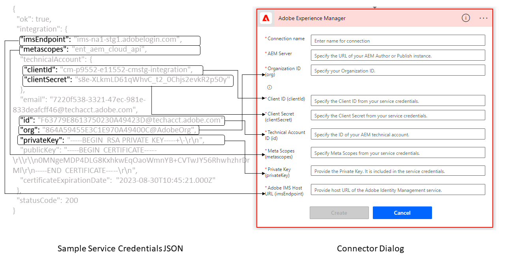

# Frequently asked questions {#frequently-asked-questions}

* **Can I use Code Editor to create rules?**
You can use the Visual Editor to create the rules. The Code Editor is not available on [!DNL Forms] as a Cloud Service. If your Adaptive Form uses rule scripts developed using code editor, use the [Migration Utility](migrate-to-forms-as-a-cloud-service.md) to convert your code scripts to custom functions. You can use custom functions with Visual Editor to continue obtaining the results obtained with Code Editor.

* **Can I create an XFA-based Adaptive Form on Cloud Service instances?**
Yes, you can create an XFA-based Adaptive Form on Cloud Service instance. However, support for XFA-based Adaptive Forms is not available for AEM Forms as a Cloud Service SDK (Local development environment). If you intend to use XFA-based Adaptive Forms with AEM Forms as a Cloud Service SDK, contact Adobe Support with details of your use case and specific requirements.

<!-- * **Can I use an XDP as a Document of Record (DoR) template? Is Forms Designer included in AEM Forms as a Cloud Service license?** 

  Yes, you can use an XDP as a Document of Record template on Cloud Service instances. However, support to use XDP as a Document of Record template is not available for AEM Forms as a Cloud Service SDK (Local development environment). -->

* **Can I migrate content from an On-Premise or [!DNL Adobe-Managed Services] environments to [!DNL Forms] as a Cloud Service environment?**
Yes, you can migrate your custom code, content, and assets from On-Premise or [!DNL Adobe-Managed Services] environments to [!DNL Forms] as a Cloud Service environment. For detailed instructions, see [Migrate to Forms as a Cloud Service](migrate-to-forms-as-a-cloud-service.md).

<!-- You can use package manager or Experience Manager UI to [export and import Forms and related assets](import-export-forms-templates.md), use the migration utility to make your existing assets compatible with [!DNL Forms] as a Cloud Service, use the [Best Practices Analyzer](https://experienceleague.adobe.com/docs/experience-manager-cloud-service/moving/cloud-migration/best-practices-analyzer/overview-best-practices-analyzer.html?lang=en#best-practices-analyzer) tool to find the features and APIs that require changes and updated before migration, and use the [Content Transfer Tools](https://docs.adobe.com/content/help/en/experience-manager-cloud-service/moving/home.html) to move your custom code without refactoring it. -->

* **Where can I get AEM [!DNL Forms] as a Cloud Service [!DNL Java™] API reference documentation?**
You can download Java™ API reference documentation from [!DNL Maven Central Repository]. To download:
    1. Go to [[!DNL Maven Central Repository]](https://mvnrepository.com/artifact/com.adobe.aem/aem-forms-sdk-api).
    1. Locate and open page containing the latest version of [!DNL Experience Manager Forms] SDK.
    1. Click the View All option to view all the files.
    1. Download and extract the `aem-forms-sdk-api-<version>-javadocs`.jar.  
    1. Open the index.html file to view the API reference documentation.

* **Where can I get [!DNL JavaScript™] API reference for Adaptive Forms?**
You can download [!DNL JavaScript™] API reference documentation from[!DNL  Maven Central Repository]. To download:
    1. Open [[!DNL Maven Central Repository]](https://mvnrepository.com/artifact/com.adobe.aem/aem-forms-sdk-api).
    1. Locate and open page containing the latest version of [!DNL Experience Manager Forms] SDK.
    1. Click the View All option to view all the files.
    1. Download and extract the `aem-forms-sdk-api-<version>-jsdoc.jar`.  
    1. Open the index.html file to view the API reference documentation.

* **Can I continue using existing themes and templates?**
Yes, you can continue using themes created with AEM 6.4 Forms and AEM 6.5 Forms after you use the [Migration Utility](migrate-to-forms-as-a-cloud-service.md) to move them to [!DNL AEM Forms] as a Cloud Service.

  You can also create a project based on [!DNL AEM Forms] as a Cloud Service [Archetype](setup-local-development-environment.md#forms-cloud-service-local-development-environment) and use included sample themes and templates.

* **Can I produce schema-compliant data?**
Yes, you can create Adaptive Forms to produce schema-compliant data.

<!-- * **Can I pass custom parameters to the prefill service?**
Custom parameters are planned for an upcoming release. -->

* **Can I cache secured content?**
Caching secured content features is disabled, by default. To enable the feature, you can perform the instructions provided at [Caching Secured Content](https://experienceleague.adobe.com/docs/experience-manager-dispatcher/using/configuring/permissions-cache.html).

* **I have a localized Adaptive Form; it is not rendering localized version? What could be the cause and how to resolve it?**

  URL convention of localized Adaptive Forms now supports specifying a locale in the URL. New URL convention enables caching localized forms on a Dispatcher or CDN. On Cloud Service environment, use the URL format `http://host:port/content/forms/af/<afName>.<locale>.html` to request a localized version of an Adaptive Form instead of `http://host:port/content/forms/af/afName.html?afAcceptLang=<locale>`. Adobe recommends using Dispatcher or CDN caching. It helps improve rendering speed of prefilled forms.

* **I have updated an Adaptive Form; the updated version is not available for customers to use?**
By default, CDN refreshes cache after every 5 minutes, wait for 5 minutes, and then check for the updated version.

* **Can I use the Signature step in an Adaptive Form to create an in-browser signing experience?**
No, the Signature step is not available for [!DNL Forms] as a Cloud Service. Remove the Signature step in your Adaptive Forms. Instead of Signature step, allow the users to Sign an Adaptive Form after submission. It helps you continue providing an in-browser signing experience.

* **Can I use the Verify step in an Adaptive Form?**
No, the Verify step is not available for [!DNL Forms] as a Cloud Service. Remove the verify step from your existing Adaptive Forms before moving such forms to a Cloud Service environment.

* **Can I add charts to an Adaptive Form?**
Yes, you can add charts to Adaptive Forms. Adaptive Forms provides a chart component. You can use it to add charts to an Adaptive Form.

* **Can I connect a Form Data Model to a relational database model?**
You can connect a Form Data Model to [!DNL RESTful web services], [!DNL SOAP-based web services], [!DNL OData services], and Experience Manager user profile as data sources. <!--Support to connect a Form Data Model with a relational database is not available.-->  

* **Can I use custom certificates with Form Data Model (FDM) for authentication?**
Form Data Model (FDM) does not provide a method to use custom certificates for authentication. So, the custom certificates like x509 and 2-way SSL are not supported.  

* **Can I use Forms Portal submit action Adaptive Forms?**

  You can modify your existing Adaptive Forms to use [Submit to REST endpoint](configuring-submit-actions.md#submit-to-rest-endpoint), [Send email](configuring-submit-actions.md#send-email), [Submit using Form Data Model (FDM)](configuring-submit-actions.md#submit-using-form-data-model), and [Invoke an AEM Workflow](configuring-submit-actions.md#invoke-an-aem-workflow) Submit actions. Forms Portal and Forms Portal submit action are not available yet. Keep an eye on monthly release notes for the availability of the features.

* **Can I use [!DNL AEM Forms] app with [!DNL AEM Forms] as a Cloud Service?**

  Adaptive Forms offer a responsive design. These forms change the appearance, design, and interactivity based on the underlying device. You can continue using Adaptive Forms on mobile device while keeping a watch on monthly release notes for the availability of the features.
  
* **Which features are not part of the initial GA release?**
  Forms Portal, [!DNL AEM Forms] app, integration with Adobe Analytics, and integration with Adobe Target are not part of the initial GA release. Look for monthly release notes for information on new features.

* **I have designed a [JSON schema to create an adaptive form](adaptive-form-json-schema-form-model.md). The JSON schema defines events for some components of adaptive forms. Does AEM Forms as a Cloud Service supports events?**
  Create the Adaptive Form based on the JSON schema on Experience Manager 6.5 Forms environment and use the [Migration utility](migrate-to-forms-as-a-cloud-service.md) to migrate such Adaptive Forms to AEM Forms as a Cloud Service. The utility converts such events into client libraries and you can continue using Adaptive Forms with events in a Cloud Service environment.

<!-- 

* **Is there any AEM Forms as a Cloud Service connector for Microsoft Power Automate?**

  Yes, Adobe provides an Adobe Experience Manager connector to access [Adobe Experience Manager Forms - Communication capabilities](https://experienceleague.adobe.com/docs/experience-manager-cloud-service/content/forms/using-communications/aem-forms-cloud-service-communications-introduction.html) through Microsoft Power Automate. You can create a PDF document that is based on a form design and XML form data or create PostScript (PS), Printer Command Language (PCL), Zebra Printing Language (ZPL) and other Printer Definition Language documents. 

  You can get started with Adobe Experience Manager easily with just a few steps:

  1. Generate the Service credentials: Use Adobe Experience Manager Developer Console to [generate](https://experienceleague.adobe.com/docs/experience-manager-learn/getting-started-with-aem-headless/authentication/service-credentials.html?#generate-service-credentials) the service credentials.  
  
  1. Setup your connection: Add your service credentials to the Adobe Experience Manager Connector. You can get crdential from service credential JSON and copy these credential details to your one-time connection setup:

    * AEM Server
    * Organization ID 
    * Client ID
    * Client Secret
    * Technical Account ID
    * Meta Scopes
    * Private Key - base64 encoded keys are accepted
    * Adobe IMS Host URL

      
    
    

    A sample Service Credential JSON file fields mapped to Adobe Experience Manager connector for Microsoft Power Automate.

    -->
