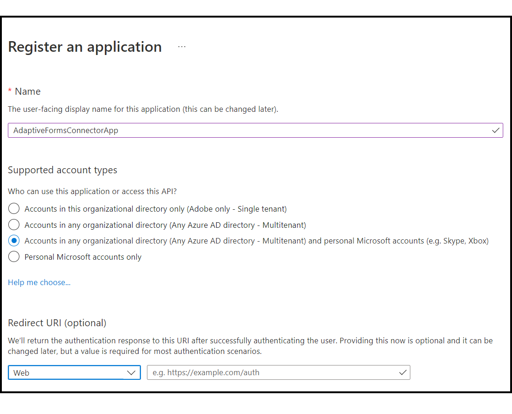

# Connect an Adaptive Form with Microsoft Power Automate {##connect-adaptive-form-with-power-automate}

You can configure an Adaptive Form to run a Microsoft® Power Automate Cloud Flow on submission. The configured Adaptive Form sends captured data, attachments, and Document Of Record to Power Automate Cloud Flow for processing. It helps you build custom data capture experience while harnessing the power of Microsoft® Power Automate to build business logics around captured data and automate customer workflows. Here are a few examples of what you can do after integrating an Adaptive Form with Microsoft Power Automate: 

* Use Adaptive Forms data in a Power Automate business processes
* Use Power Automate to send captured data to more than 500 data sources or any publicly available API  
* Peform complex calculations on captured data
* Save Adaptive Forms data to storage systems at a predefined schedule

Adaptive Forms editor provides the **Invoke a Microsoft Power Automate flow** submit action to send adaptive forms data, attachments, and Document Of Record are sent to Power Automate Cloud Flow. To use the Submit action to send captured data to Microsoft Power Automate, [Connect your Forms as a Cloud Service instance with Microsoft Power Automate](forms-microsoft-power-automate-integration.md#connect-forms-server-with-power-automate)  

## Prerequistes

The following are required to connect an Adaptive Form with Microsoft Power Automate: 

* Microsoft Power Automate license: A separate Microsoft license is available for Experience Manager Forms customer to use MS Power Automate Flow.
* A Microsoft Power Automate flow to accept Adaptive Form submit data.
* A Power Automate user with Admin privileges.
* A Experience Manager users with Forms Author and Forms Admin privileges.

# Connect your Forms as a Cloud Service instance with Microsoft Power Automate {#connect-forms-server-with-power-automate}

Perform the following actions to connect your Forms as a Cloud Service instance with Microsoft Power Automate:

1. Create a Microsoft Power Automate Application
1. Create Microsoft Power Automate Dataverse Cloud Configuration.
1. Create Microsoft Power Automate Flow Service Cloud Configuration
1. Publish the Microsoft Power Automate Dataverse Cloud Configuration.

## Create Microsoft Power Automate Application {#ms-power-automate-application}

1. Login to [Azure Portal](https://portal.azure.com/).
1. Select [!UICONTROL Azure Active Directory] from the left navigation.
1. On the Default directory page, select [!UICONTROL App registrations] from the left panel.
1. On the App registrations page, click New Registrations.
1. Specify Name, Supported account types, and Redirect URI on the page. In the Redirect URI, specify the following and click Save.
    * `https://[Forms as a Cloud Service Server]/libs/fd/powerautomate/content/dataverse/config.html`
    * `https://[Forms as a Cloud Service Server]/libs/fd/powerautomate/content/dataverse/config.html`

    

    >[!NOTE]
    >You can also specify additonal Redirect URIs, if required, from the Authentication page.
    >

1. On the Authentication page, enable the following options, and click Save.

    * Access tokens (used for implicit flows)
    * ID tokens (used for implicit and hybrid flows)

1. On the API permissions page, click Add a permission. 
1. Under Microsft APIs, select the Flow Service, and select the following permissions. 
    * Flows.Manage.All
    * Flows.Read.All

    Click Add permissions to save the permissions.
1. On the API permissions page, click Add a permission. Select APIs my organization uses and search `DataVerse`.
1. Enable user_impersonation and Click Add permissions.
1. On the Certificates & secrets page, click New client secret. On the Add a Client Secret screen, provide a description and time peiod for the secret to expire, and click Add. A secret string is generated. 
1. Keep a note of your organization specific [Dynamics environment URL](https://docs.microsoft.com/en-us/power-automate/web-api#compose-http-requests).

# Create Microsoft Power Automate Dataverse Cloud Configuration {#microsoft-power-automate-dataverse-cloud-configuration}

1. On AEM Forms author instance, navigate to **[!UICONTROL Tools]**  &gt; **[!UICONTROL General]** &gt; **[!UICONTROL Configuration Browser]**.
1. On the **[!UICONTROL Configuration Browser]** page, tap **[!UICONTROL Create]**.
1. In the **[!UICONTROL Create Configuration]** dialog, specify a **[!UICONTROL Title]** for the configuration, enable **[!UICONTROL Cloud Configurations]**, and tap **[!UICONTROL Create]**. It creates a configuration container to store  Cloud Services. Ensure that the folder name does not contain any space.
1. Navigate to **[!UICONTROL Tools]**  &gt; **[!UICONTROL Cloud Services]** &gt; **[!UICONTROL Microsoft Power Automate Dataverse]** and open the configuration container you created in the previous step.

   >[!NOTE]
   >
   >When you create an Adaptive Form, specify the container name in the **[!UICONTROL Configuration Container]** field.  
1. On the configuration page, tap **[!UICONTROL Create]** to create [!DNL Microsoft Power Automate Flow Service] configuration in AEM Forms.
1. On the **[!UICONTROL Configure Flow Service for Microsoft Power Automate]** page, Specify the **[!UICONTROL Client ID]** (also referred to as Application ID), **[!UICONTROL Client Secret]**, **[!UICONTROL OAuth URL]** and **[!UICONTROL Dynamic Environment URL]**. Use the Client ID, Client Secret, OAuth URL, and Dynamic Environment URL of [Microsoft Power Automate Application](#ms-power-automate-application) you created in the previous section. Use Endpoints option in Microsoft Power Automate application UI to find OAuth URL

  
  Use Endpoints option in Microsoft Power Automate application UI to find OAuth URL

1. Tap **[!UICONTROL Connect]** . If asked, login to your Microsoft Aure Account. Tap **[!UICONTROL Save]**.

# Create Microsoft Power Automate Flow Service Cloud Configuration.

1. Navigate to **[!UICONTROL Tools]**  &gt; **[!UICONTROL Cloud Services]** &gt; **[!UICONTROL Microsoft Power Automate Flow Service]** and open the configuration container you created in the previous section.

   >[!NOTE]
   >
   >When you create an Adaptive Form, specify the container name in the **[!UICONTROL Configuration Container]** field.  
1. On the configuration page, tap **[!UICONTROL Create]** to create [!DNL Microsoft Power Automate Flow Service] configuration in AEM Forms.
1. On the **[!UICONTROL Configure Dataverse for Microsoft Power Automate]** page, Specify the **[!UICONTROL Client ID]** (also referred to as Application ID), **[!UICONTROL Client Secret]**, **[!UICONTROL OAuth URL]** and **[!UICONTROL Dynamic Environment URL]**. Use the Client ID, Client Secret, OAuth URL, and Dynamic Environment URL of [Microsoft Power Automate Application](#ms-power-automate-application) you created in the previous section. Use Endpoints option in Microsoft Power Automate application UI to find OAuth URL

1. Tap **[!UICONTROL Connect]** . If asked, login to your Microsoft Aure Account. Tap **[!UICONTROL Save]**.

# Publish the Microsoft Power Automate Dataverse Cloud Configuration {publish-microsoft-power-automate-dataverse-cloud-configuration}

1. Navigate to **[!UICONTROL Tools]**  &gt; **[!UICONTROL Cloud Services]** &gt; **[!UICONTROL Microsoft Power Automate Dataverse]** and open the configuration container you created in the previous [Create Microsoft Power Automate Dataverse Cloud Configuration](#microsoft-power-automate-dataverse-cloud-configuration) section.

1. Select the `dataverse` configuration and tap **[!UICONTROL Publish]. 
1. On the Publish page, select **[!UICONTROL All Configurations] and tap **[!UICONTROL Publish]. 