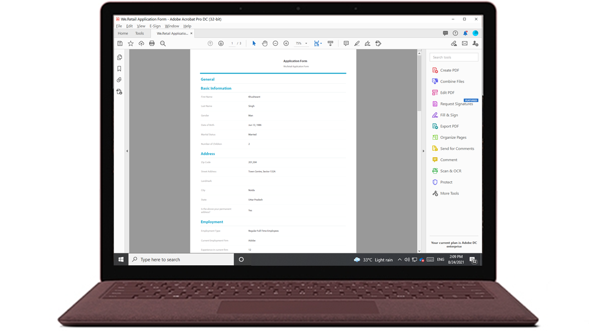
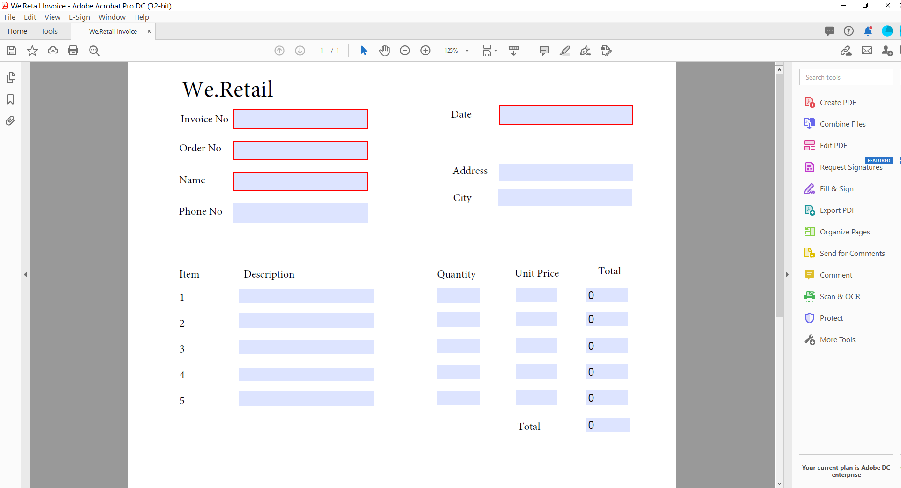
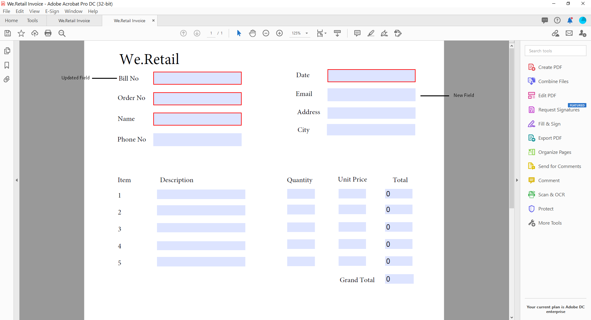
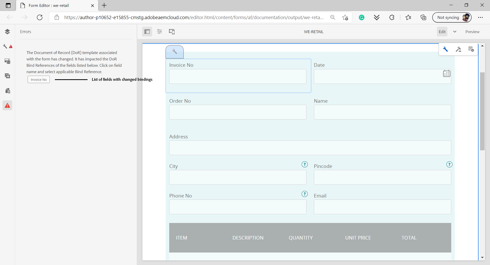
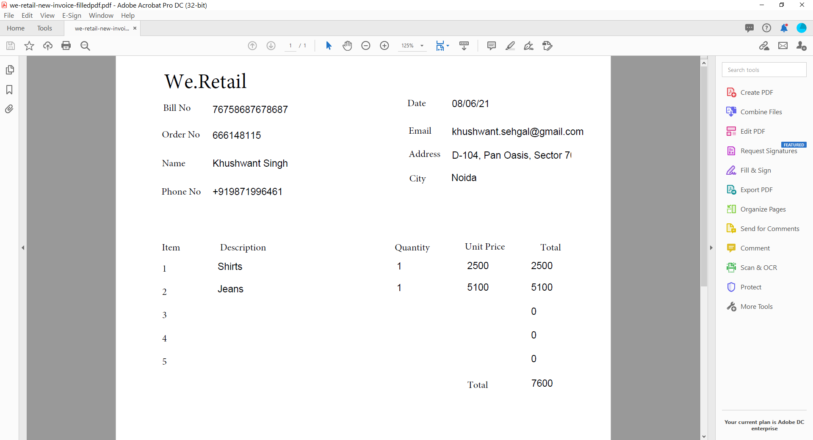
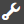
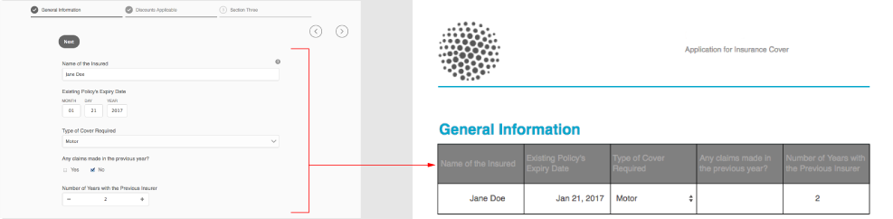
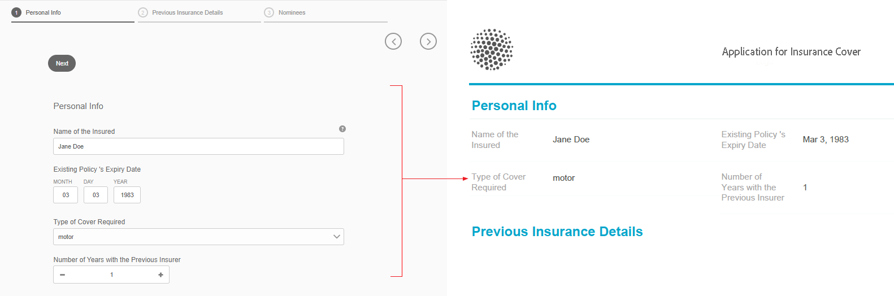
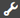

# Generate a Submission PDF (Document of Record) for Adaptive Forms (Core Components)

## Overview {#overview}

When a form is filled or submitted, you can keep a record of the form, in print or in the document format. This record is called a Submission PDF (formerly Document of Record, or DoR). It is a print-friendly PDF of the submitted form. You can also refer to the Submission PDF for the information customers have filled at a later date or use the Submission PDF to archive forms and content together in PDF format.

## Applicability and use cases

### Insurance

## Can AEM Forms generate insurance claim documents?

Yes. AEM Forms supports Submission PDF (formerly Document of Record) generation, enabling insurers to produce PDFs and records based on submitted form data.

## Are documents generated by AEM Forms suitable for audits?

Yes. AEM Forms supports consistent document generation, controlled access, and traceability, which are important for audit and compliance requirements.

To create a Submission PDF, an XFA or Acroform based template is merged with data collected via an adaptive form. You can generate a Submission PDF automatically or on-demand. The on-demand option lets you specify a custom XFA or Acroform based template to provide a custom appearance to your Submission PDF.

You can:

* [Generate an XFA-based Submission PDF](#generate-an-XFA-based-document-of-record)
* [Generate an Acroform-based (Acrobat Form PDF) Submission PDF](#generate-an-Acroform-based-document-of-record)
* [Auto generate a Submission PDF](#auto-generate-a-document-of-record)

## Before you start {#components-to-automatically-generate-a-document-of-record}

Before you start learn and ready the assets required for a Submission PDF:

**Base template:** An XFA template (XDP file) created in Forms Designer or an Acrobat Form (AcroForm). [Base template](#base-template-of-a-document-of-record) is used to specify styling and branding information for a Submission PDF. Upload your XFA template (XDP file) to your AEM Forms instance before.

**Adaptive Form:** An Adaptive Form for which the Submission PDF is to be generated.

## Generate an XFA-based Submission PDF {#generate-an-XFA-based-document-of-record}

Upload your XFA template (XDP file) to your AEM Forms instance. Perform the following steps to configure an Adaptive Form to use XFA template (XDP file) as template for Submission PDF:

1. In Experience Manager author instance, click **[!UICONTROL Forms]** &gt; **[!UICONTROL Forms and Documents].**
1. Select a Form or Create an Adaptive Form, and click **[!UICONTROL Properties]**.
1. In the Properties window, select **[!UICONTROL Form Model]**.
1. On the  **[!UICONTROL Form Model]** tab, in the **[!UICONTROL Select From]** drop-down, select **[!UICONTROL Form Data Model]**, **[!UICONTROL Schema]** or **[!UICONTROL None]**. You can also select a form model when you create a form.
1. In the Document of Record Template Configuration section of the Form Model tab, select **Associate Form Template as Document of Record Template**. On selecting this option, all XFA template (XDP files) available on your machine are displayed. Select the appropriate file. Also, ensure same schema (data schema) is used for Adaptive Form and selected XFA template (XDP file).  
1. Click **[!UICONTROL Done]**

Your Adaptive Form is now configured to use an XDP file as template for Submission PDF. The next step is to [bind Adaptive Form components with corresponding template fields](#bind-adaptive-form-components-with-template-fields).

## Generate an Acroform-based Submission PDF {#generate-an-Acroform-based-document-of-record}

Upload your Adobe Acrobat PDF (Acroform) to your AEM Forms instance. Perform the following steps to configure an Adaptive Form to use Adobe Acrobat PDF (Acroform) as template for Submission PDF:

1. In Experience Manager author instance, click **[!UICONTROL Forms]** &gt; **[!UICONTROL Forms and Documents].**
1. Select a Form or **[!UICONTROL Create an Adaptive Form]**, and click **[!UICONTROL Properties]**.
1. In the Properties window, select **[!UICONTROL Form Model]**.
1. On the  **[!UICONTROL Form Model]** tab, in the **[!UICONTROL Select From]** drop-down, select **[!UICONTROL Form Data Model]**, **[!UICONTROL Schema]** or **[!UICONTROL None]**. You can also select a form model when you create a form.
1. In the Document of Record Template Configuration section of the Form Model tab, select **Associate Form Template as Document of Record Template**. On selecting this option, all Acrobat PDF's (Acroform) available on your machine are displayed. Select the Acroform you want to use.
1. Click **[!UICONTROL Done]**

Your Adaptive Form is now configured to use an Acroform as template for Submission PDF. The next step is to [bind Adaptive Form components with corresponding template fields](#bind-adaptive-form-components-with-template-fields).

## Automatically generate a Submission PDF {#auto-generate-a-document-of-record}

When an Adaptive Form is configured to automatically generate a Submission PDF, every time a form is changed, its Submission PDF is updated immediately. For example, if a field is removed from an existing adaptive form, the corresponding field is also removed and is not visible in the Submission PDF. There are many other advantages of automatically generating a Submission PDF:

* Form developers do not have to maintain data bindings manually. Auto-generated Submission PDF takes care of data binding related updates.
* Form developers do not have to manually hide fields which are marked exclude from Submission PDF. Auto-generated Submission PDF are pre-configured to exclude such fields.
* Auto-generated Submission PDF option saves time required to create a Form template for Submission PDF.
* Auto-generated Submission PDF option lets you use different styling and appearances using different base templates. It helps select best style and appearance for Submission PDF for your organization. If you do not specify styling, system styles are set as default.
* Auto-generated Submission PDF ensures any change in form is immediately reflected in the Submission PDF.

Perform the following steps to configure an Adaptive Form to automatically generate a Submission PDF:

1. In Experience Manager author instance, click **[!UICONTROL Forms]** &gt; **[!UICONTROL Forms and Documents].**
1. Select a Form or Create an Adaptive Form, and click **[!UICONTROL Properties]**.
1. In the Properties window, select **[!UICONTROL Form Model]**.
1. On the  **[!UICONTROL Form Model]** tab, in the **[!UICONTROL Select From]** drop-down, select **[!UICONTROL Form Data Model]**, **[!UICONTROL Schema]** or **[!UICONTROL None]**. You can also select a form model when you create a form.
1. In the Document of Record Template Configuration section of the Form Model tab, select **Generate Document of Record**.
1. Click **[!UICONTROL Done]**

## Bind Adaptive Form components with template fields {#bind-adaptive-form-components-with-template-fields}

 Bind Adaptive Form fields with template fields to display captured form data in corresponding Submission PDF field. To bind Adaptive Form components with corresponding Submission PDF template fields:

1. Open the Adaptive Form, configured to use a custom form template for editing.

1. Select an Adaptive Form component and click open Configure  icon. It opens properties browser.

1. In the properties browser, browse and select a field.

   * (For AcroForm template) the **[!UICONTROL Document of Record Bind Reference field]** property.
   * (For XFA template) the **[!UICONTROL Data Model Bind Reference]** property.

1. Click **[!UICONTROL Save]**.

<!-- 
In the following video, Adaptive Form components are bound with corresponding Acroform template fields and the Document of Record is sent as an email attachment.
-->

You can use submit actions such as "Send Email", "Invoke an AEM workflow", "Invoke a Power Automate flow", and other [Submit Actions](configuring-submit-actions.md) to receive a Submission PDF.

>[!NOTE]
>
> You can save the Submission PDF for any Form Data Model by using **[!UICONTROL Document of Record Bind Reference field]** property.

## Incremental updates to Submission PDF template {#document-of-record-template-incremental-updates}

Adaptive forms and corresponding Submission PDF templates can evolve over the period of time. You can choose to add, remove, or modify fields to an Adaptive Form or a Submission PDF template.

When you change a Submission PDF template and upload the changed template to AEM Forms, the Adaptive Forms editor automatically detects the changed bindings and informs you about the adaptive form components that require new bindings. It lets you make incremental updates to a Submission PDF template.

For example, an Organization, *We.Retail*, has an AcroForm-based Submission PDF template, *we-retail-invoice.pdf*. The template looks like the following:

After using the template for some time, organization decides to rename `invoice-number` field to `bill-number` field and capture email address of buyers. A developer updates name of the `invoice-number` field and adds an email field to the template. He also creates a new version of the template called  *we-retail-invoice-v2.pdf*.

<!--

The developer uploads and applies to the updated template to the adaptive form. The adaptive form automatically detects and displays list of fields where binding has changed.

The form developer binds Adaptive Forms fields with corresponding Document of Record template.

-->

>[!VIDEO](assets/we-retail-binding.mp4)

Now, when the Adaptive Form is submitted, an updated Submission PDF is generated.

## Key considerations when working with the Submission PDF {#key-considerations-when-working-with-document-of-record}

Keep in mind the following considerations and limitations when working on the Submission PDF for Adaptive Forms.

* Submission PDF templates do not support rich text. Therefore, any rich text in the static Adaptive Form or in the information filled in by the user appears as plain text in the Submission PDF.
* Document fragments in an Adaptive Form do not appear in the Submission PDF. However, Adaptive Form Fragments are supported.
* Content binding in the Submission PDF generated for XML Schema based Adaptive Form is not supported.
* Localized version of Submission PDF is created on demand for a locale when the user requests the rendering of the Submission PDF. Localization of Submission PDF occurs along with localization of Adaptive Form. <!-- For more information on localization of Document of Record and Adaptive Forms see Using AEM translation workflow to localize Adaptive Forms and Document of Record.-->

<!-- ## Configure an adaptive form to generate  Document of Record {#adaptive-form-types-and-their-documents-of-record}

While creating an adaptive form, in the Form Model tab of Adaptive Form properties, select one the following option: 

* **None**
  Select the option to create an Adaptive Form without a form model. When the option is selected, the Document of Record is automatically generated for your Adaptive Form.

* **[Associate form template as a Document of Record template](creating-adaptive-form.md#create-an-adaptive-form-based-on-an-xfa-form-template)**
  Select the option to use an XFA Form as a template for Document of Record. 

* **[Generate Document of Record](creating-adaptive-form.md#create-an-adaptive-form-based-on-xml-or-json-schema)**
  Select the option to use an XFA Form as a template. When the option is selected, the Document of Record is automatically generated for your Adaptive Form. When you use an XML schema as a template for an Adaptive Form, ensure that the adaptive form and associated XFA Form use the same XML schema as your Adaptive Form

When you select a form model, configure Document of Record using options available under Document of Record Template Configuration. See [Document of Record Template Configuration](#document-of-record-template-configuration). -->

## Mapping of Adaptive Form elements {#mapping-of-adaptive-form-elements}

The following table describes Adaptive Form components and corresponding XFA components and if those appear in a Submission PDF.

### Fields {#fields}

<table>
 <tbody>
  <tr>
   <th>Adaptive Form component</th>
   <th>Corresponding XFA component</th>
   <th>Included by default in Submission PDF template?</th>
   <th>Notes</th>
  </tr>
  <tr>
   <td>Button</td>
   <td>Button</td>
   <td>false</td>
   <td> </td>
  </tr>
  <tr>
   <td>Check box</td>
   <td>Check Box</td>
   <td>true</td>
   <td> </td>
  </tr>
  <tr>
   <td>Date picker</td>
   <td>Date/Time Field</td>
   <td>true</td>
   <td> </td>
  </tr>
  <tr>
   <td>Drop-down list</td>
   <td>Drop-down List</td>
   <td>true</td>
   <td> </td>
  </tr>
  <tr>
   <td>Numeric box</td>
   <td>Numeric Field</td>
   <td>true</td>
   <td> </td>
  </tr>
  <tr>
   <td>Radio Button</td>
   <td>Radio Button</td>
   <td>true</td>
   <td> </td>
  </tr>
  <tr>
   <td>Text box</td>
   <td>Text Field</td>
   <td>true</td>
   <td> </td>
  </tr>
  <tr>
   <td>Reset button</td>
   <td>Reset Button</td>
   <td>false</td>
   <td> </td>
  </tr>
  <tr>
   <td>Submit button</td>
   <td>
Email Submit Button
 
HTTP Submit Button
 </td>
   <td>false</td>
   <td> </td>
  </tr>
  <tr>
   <td>File Attachment</td>
   <td> </td>
   <td>false</td>
   <td>Not available in Submission PDF template. Only available in Submission PDF through attachments.</td>
  </tr>
 </tbody>
</table>

### Containers {#containers}

<table>
 <tbody>
  <tr>
   <th>Adaptive Form component</th>
   <th>Corresponding XFA component</th>
   <th>Notes</th>
  </tr>
  <tr>
   <td>Panel  </td>
   <td>Subform  </td>
   <td>Repeatable panel maps to repeatable subform.</td>
  </tr>
 </tbody>
</table>

### Static components {#static-components}

| Adaptive Form component |Corresponding XFA component |Notes |
|---|---|---|
| Image |Image |The TextDraw and Image components, whether bound or unbound, always appear in the Submission PDF for an XSD-based Adaptive Form, unless excluded using the Submission PDF settings. |
| Text |Text ||

### Tables {#tables}

The Adaptive Forms table components such as header, footer, and row map to corresponding XFA components. You can map repeatable panels to tables in Submission PDF.

## Base template of a Submission PDF {#base-template-of-a-document-of-record}

Base template provides styling and appearance information to Submission PDF. It lets you customize default appearance of auto generated Submission PDF. For example, you can use a base template to add your company logo in the header and copyright information in the footer of the Submission PDF.

The master page from a base template is used as a master page for the Submission PDF template. The masterpage can have information such as a page header, page footer, and page number that you can apply to the Submission PDF. You can apply such information to the Submission PDF using the base template for autogeneration of the Submission PDF. Using a base template enables you to change the default properties of fields.

Always follow [Base template conventions](#base-template-conventions) when you design base template.

## Base template conventions {#base-template-conventions}

A base template is used to define the header, footer, styling, and appearance of a Submission PDF. The header and footer can include information like the company logo and copyright text. The first master page in the base template is copied and used as a master page for the Submission PDF, which contains a header, footer, page number, or any other information that should appear across all pages in the Submission PDF. If you use a base template which does not conform to base template conventions, the first master page from the base template is still used in the Submission PDF template. It is highly recommended that you design your base template as per its conventions, and use it for auto-generation of Submission PDF.

**Master page conventions**

* In the base template, name the root subform as `AF_METATEMPLATE` and the master page as `AF_MASTERPAGE`.

* The master page with the name `AF_MASTERPAGE` located under the `AF_METATEMPLATE` root subform is preferred for extracting header, footer, and styling information.

* If `AF_MASTERPAGE` is absent, the first master page present in the base template is used.

**Styling conventions for fields**

* To apply style on the fields in the Submission PDF, the base template provides fields located in the `AF_FIELDSSUBFORM` subfrom under the `AF_METATEMPLATE` root subform.

* The properties of these fields are applied to the fields in the Submission PDF. These fields should follow the `AF_<name of field in all caps>_XFO` naming convention. For example, the field name for check box should be `AF_CHECKBOX_XFO`.

To create a base template, do the following in Forms Designer.

1. Click **[!UICONTROL File]** &gt; **[!UICONTROL New]**.
1. Select the **[!UICONTROL Based on a template]** option.

1. Select the **[!UICONTROL Forms - Document of Record]** category.
1. Select **[!UICONTROL DoR Base Template]**.
1. Click **[!UICONTROL Next]** and provide the required information.

1. (Optional) Modify the styling and appearance of fields that you want to apply on the fields in the Submission PDF.
1. Save the form.

You can now use the saved form as a base template for a Submission PDF. Do not modify or remove any scripts present in the base template.

**Modifying base template**

* Do not apply any styling over fields in the base template, it is advisable to remove those fields from the base template so any upgrades to the base template are automatically picked up.
* While modifying base template, do not remove, add, or modify scripts.

Strictly follow above mentioned conventions and instructions to design a base template.

## Customize the branding information in Submission PDF {#customize-the-branding-information-in-document-of-record}

While generating a Submission PDF, you can change branding information for the Submission PDF on the Document of Record tab. The Document of Record tab includes options such as logo, appearance, layout, header and footer, disclaimer, and whether or not you want to include unselected check box and radio button options.

To localize the branding information that you enter in the Document of Record tab, ensure that the locale of the browser is set appropriately. To customize the branding information of Submission PDF, perform the following steps:

1. Select a panel (root panel) in the Submission PDF and then select .
1. Select . The Document of Record tab appears.
1. Select either the default template or a custom template for rendering the Submission PDF. If you select the default template, a thumbnail preview of the Submission PDF appears below the Template drop-down.
1. Based on whether you select a default or a custom template, some of the following properties, or all properties, appear in the Document of Record tab. Specify the below mentioned properties to define the appearance of the Submission PDF:

    1. **Basic Properties**: 
        * **Template**:  If you want to select a custom template, browse and select an XDP on your [!DNL AEM Forms] server. If you want to use a template that is not available on your [!DNL AEM Forms] server, you should first upload the XDP to your [!DNL AEM Forms] server.
        * **Accent Color**: The color in which header text and separator lines are rendered in the Submission PDF.
        * **Font Family**: Font family of the text in the Submission PDF.

          >[!NOTE]
          >
          > AEM Forms offers a variety of built-in fonts that seamlessly integrate with PDF files. To see the list of supported fonts, [click here](/help/forms/supported-out-of-the-box-fonts.md).

        * **Include form objects that are not bound to data model**: Setting the property includes unbound fields from Schema based Adaptive Form in the Submission PDF.

          <!-- **Exclude hidden fields from the Document of Record**: Setting the property identifies the hidden fields for exclusion from Document of Record.-->

        * **Hide description of panels**: Setting the property excludes description of the panel/table from the Submission PDF. Applicable for panel and table.

    1. **Form Field Properties**: 

       * **For Check Box and Radio Button components, show only the selected values**: Setting the property displays only selected values of check box and radio button in [!UICONTROL Document of Record].
       * **Separator for multiple value(s)**: You can choose any separator such as comma or line break to display multiple values.
       * **Options Alignment**: You can select the desired alignment (Horizontal, Vertical, Same as adaptive Form) to set the alignment for the fields such as check box or radio button to be displayed on [!UICONTROL Document of Record]. By default, the vertical alignment is set for the fields in [!UICONTROL Document of Record]. Setting the properties from the [!UICONTROL Form Field Properties] of DoR overwrites the properties set in the [!UICONTROL Item Alignment] for the fields on an Adaptive Form. In case, you select [!UICONTROL Same as Aaptive form] option, the alignment as configured in an Adaptive Form author instance is used for [!UICONTROL Document of Record] fields.  
       * **Number of options for horizontal alignment**:You can set the number of options to be displayed on the Submission PDF for the horizontal alignment. 

       **Display labels for multi-select dropdown**

        This feature is available through the Early Access program. To request access, send an email from your official address to [aem-forms-ea@adobe.com](mailto:aem-forms-ea@adobe.com). 

       The Submission PDF displays human-readable labels for multi-select dropdown components. For example, if a user selects "California" and "New York" from a dropdown, the Submission PDF shows the selected labels instead of the internal values such as `CA` and `NY`.

    1. **Master Page Properties**:

       * **Logo Image**: You can either choose to use the logo image from the Adaptive Form, choose one from DAM, or upload one from your computer.
       * **Form Title**: Title of the DoR.
       * **Header Text**: Text that appears at the header section of the Submission PDF.
       * **Disclaimer Label**: Label of disclaimer.
       * **Disclaimer**: Text which specifies the scope of rights and obligations on the Submission PDF.
       * **Disclaimer Text**: Text of disclaimer.

1. To save the branding changes, select **[!UICONTROL Done]**.

>[!NOTE]
> 
> To display a custom form title in your Submission PDF, edit the **Custom Form Title** in **Document of Record Properties** > **Master Page Properties**. This custom title:
> 
> * Appears in the header of the generated PDF
> * Appears as the Title in the PDF's document properties
> * Appears as the Initial View Title when the PDF is opened

## Table and column layouts for panels in Submission PDF {#table-and-column-layouts-for-panels-in-document-of-record}

Your Adaptive Form may be a lengthy one with several form fields. You may not want to save a Submission PDF as an exact copy of the Adaptive Form. Now you can choose a table or column layout for saving one or more Adaptive Form panels in the Submission PDF.

Before generating a Submission PDF, in a panel's settings, select Layout For The Document of Record for that panel as Table or Column. The fields in the panel get organized accordingly in the Submission PDF.

Fields in a panel rendered in a table layout in the Submission PDF

Fields in a panel rendered in a column layout in the Submission PDF

## Submission PDF settings {#document-of-record-settings}

Submission PDF settings let you choose options you want to include in the Submission PDF. For example, a bank accepts name, age, social security number, and phone number in a form. The form generates a bank account number, and branch details. You can choose to display only the name, social security number, bank account, and branch details in Submission PDF.

Setting of the Document of Record component are available under its properties. To access the properties a component, select the component and click  in the overlay. The properties are listed in the sidebar, and you can find the following settings in it.

**Field level settings**

* **Exclude From Document of Record**: Setting the property true excludes the field from Submission PDF. This is script-able property named `excludeFromDoR`. Its behavior depends on **Exclude fields from DoR if hidden** form level property.

* **Display panel as table:** Setting the property displays panel as table in Submission PDF if panel has less than 6 fields in it. Applicable for panel only.
* **Exclude title from Document of Record:** Setting the property excludes title of the panel/table from Submission PDF. Applicable for panel and table only.
* **Exclude description from Document of Record:** Setting the property excludes description of the panel/table from Submission PDF. Applicable for panel and table only.
* **Exclude hidden fields from Document of Record**: Selecting this property excludes hidden fields from the Submission PDF. It applies to all form fields. By default, the **Exclude hidden fields from Document of Record** option is not selected.

**Form level settings**

* **Include unbound fields in DoR:** Setting the property includes unbound fields from Schema based Adaptive Form in Submission PDF. By default it is true.

## Frequently Asked Questions {#faq}

**Q: Changes are not appearing in the Submission PDF.**
**Ans:** Open the form in the Adaptive Forms editor, make a minor edit (for example, adjust a field label or reorder a field), and save the form. This regenerates the Submission PDF template and the changes appear in the next generated PDF.

## See Also {#see-also}

{{see-also}}

<!-- 

**Exclude fields from DoR if hidden:** Set the property to exclude the hidden fields from Document of Record at form submission. When you enable [Revalidate on server](/help/forms/configuring-submit-actions.md#server-side-revalidation-in-adaptive-form-server-side-revalidation-in-adaptive-form), the server recomputes the hidden fields before excluding those fields from the Document of Record.

-->

