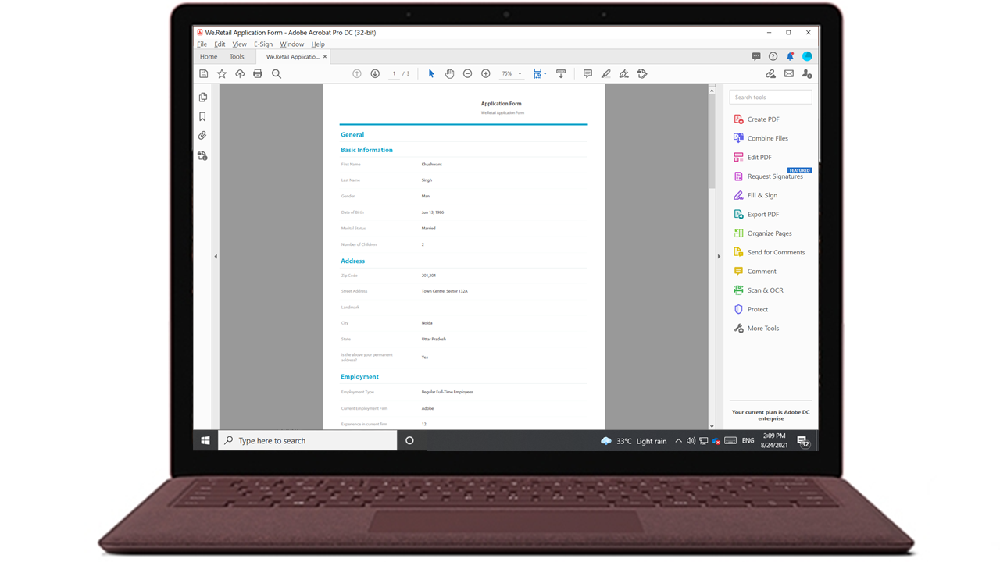
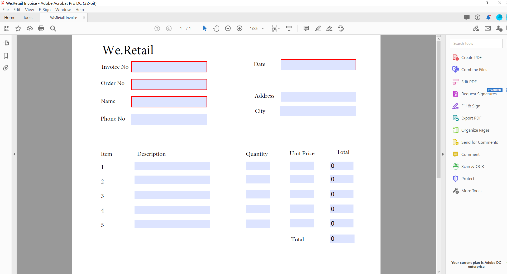
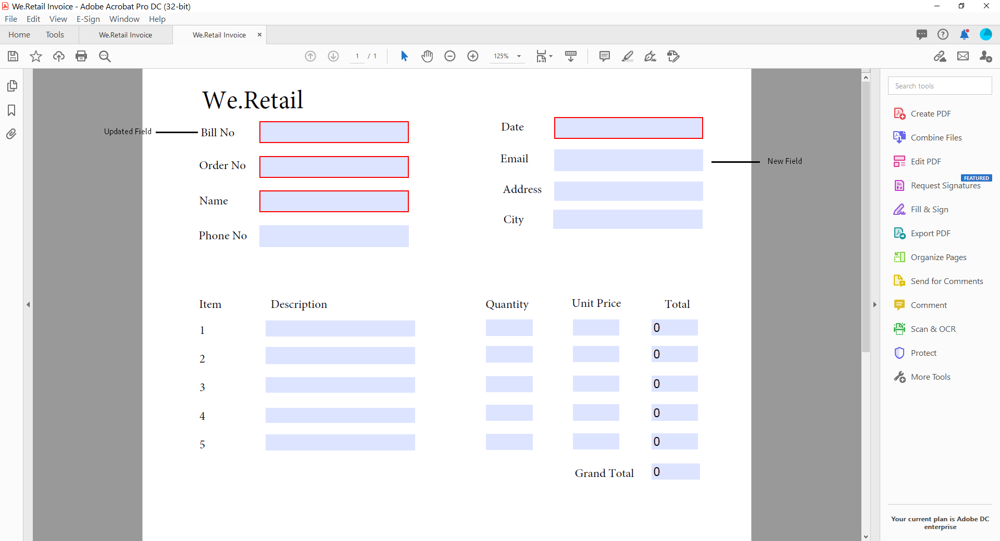
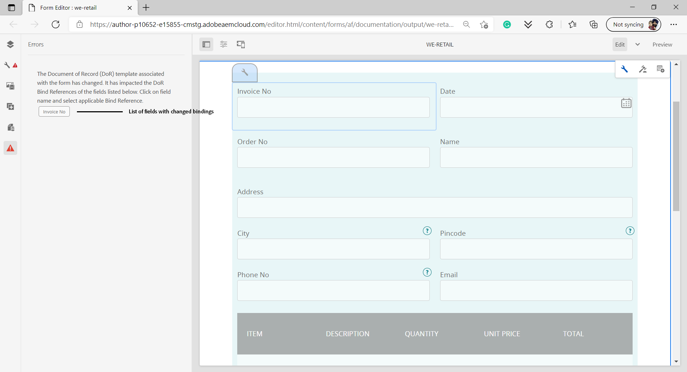
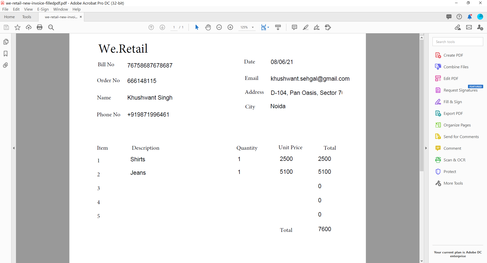

# Generate Document of Record for Adaptive Forms

>[!NOTE]
>
> Adobe recommends using the modern and extensible data capture [Core Components](https://experienceleague.adobe.com/docs/experience-manager-core-components/using/adaptive-forms/introduction.html) for [creating new Adaptive Forms](/help/forms/creating-adaptive-form-core-components.md) or [adding Adaptive Forms to AEM Sites pages](/help/forms/create-or-add-an-adaptive-form-to-aem-sites-page.md). These components represent a significant advancement in Adaptive Forms creation, ensuring impressive user experiences. This article describes older approach to author Adaptive Forms using foundation components.


| Version | Article link |
| -------- | ---------------------------- |
| AEM 6.5  |    [Click here](https://experienceleague.adobe.com/docs/experience-manager-65/forms/adaptive-forms-advanced-authoring/generate-document-of-record-for-non-xfa-based-adaptive-forms.html)                  |
| AEM as a Cloud Service     | This article         |

## Overview {#overview}

When a form is filled or submitted, you can keep a record of the form, in print or in document format. This record is referred as a Document of Record (DoR). It is a print-friendly copy of the submitted form. You can also refer the document of record for the information customers have filled at a later date or use the Document of Record to archive forms and content together in PDF Format.  



To create a Document of Record, an XFA or Acroform based template is merged with data collected via an adaptive form. You can generate a Document of Record automatically or on-demand.
The on-demand option lets you specify a custom XFA or Acroform based template to provide a custom appearance to your Document of Record.

You can:

* [Generate an XFA-based Document of Record](#generate-an-XFA-based-document-of-record)
* [Generate an Acroform-based (Acrobat Form PDF) Document of Record](#generate-an-Acroform-based-document-of-record)
* [Auto generate a Document of Record](#auto-generate-a-document-of-record)

## Before you start {#components-to-automatically-generate-a-document-of-record}

Before you start learn and ready the assets required for a Document of Record:

**Base template:** An XFA template (XDP file) created in Forms Designer or an Acrobat Form (AcroForm). [Base template](#base-template-of-a-document-of-record) is used to specify styling and branding information for a Document of Record. Upload your XFA template (XDP file) to your AEM Forms instance before

**Adaptive Form:** An Adaptive Form for which the Document of Record is to be generated.

## Generate an XFA-based Document of Record {#generate-an-XFA-based-document-of-record}

Upload your XFA template (XDP file) to your AEM Forms instance. Perform the following steps to configure an Adaptive Form to use XFA template (XDP file) as template for Document of Record:

1. In Experience Manager author instance, click **[!UICONTROL Forms]** &gt; **[!UICONTROL Forms and Documents].**
1. Select a form, and click **[!UICONTROL Properties]**.
1. In the Properties window, select **[!UICONTROL Form Model]**.
1. On the  **[!UICONTROL Form Model]** tab, in the **[!UICONTROL Select From]** drop-down, select **[!UICONTROL Schema]** or **[!UICONTROL None]**. You can also select a form model when you create a form.
1. In the Document of Record Template Configuration section of the Form Model tab, select **Associate Form Template as Document of Record Template**. On selecting this option, all XFA template (XDP files) available on your machine are displayed. Select the appropriate file. Also, ensure same schema (data schema) is used for Adaptive Form and selected XFA template (XDP file).  
1. Click **[!UICONTROL Done.]**

Your Adaptive Form is now configured to use an XDP file as template for Document of Record. The next step is to [bind Adaptive Form components with corresponding template fields](#bind-adaptive-form-components-with-template-fields).

## Generate an Acroform-based Document of Record {#generate-an-Acroform-based-document-of-record}

Upload your Adobe Acrobat PDF (Acroform) to your AEM Forms instance. Perform the following steps to configure an Adaptive Form to use Adobe Acrobat PDF (Acroform) as template for Document of Record:

1. In Experience Manager author instance, click **[!UICONTROL Forms]** &gt; **[!UICONTROL Forms and Documents].**
1. Select a form, and click **[!UICONTROL Properties]**.
1. In the Properties window, select **[!UICONTROL Form Model]**.
1. On the  **[!UICONTROL Form Model]** tab, in the **[!UICONTROL Select From]** drop-down, select **[!UICONTROL Schema]** or **[!UICONTROL None]**. You can also select a form model when you create a form.
1. In the Document of Record Template Configuration section of the Form Model tab, select **Associate Form Template as Document of Record Template**. On selecting this option, all Acrobat PDF (Acroform) available on your machine are displayed. Select the appropriate file.
1. Click **[!UICONTROL Done.]**

Your Adaptive Form is now configured to use an Acroform as template for Document of Record. The next step is to [bind Adaptive Form components with corresponding template fields](#bind-adaptive-form-components-with-template-fields).

## Automatically generate a Document of Record {#auto-generate-a-document-of-record}

When an Adaptive Form is configured to automatically generate a Document of Record, every time a form is changed, its Document of Record is updated immediately. For example, if a field is removed from an existing adaptive form, the corresponding field is also removed and is not visible in the Document of Record. There are many other advantages of automatically generating Document of Record. :

* Form developers do not have to maintain data bindings manually. Auto-generated Document of Record takes care of data binding related updates.
* Form developers do not have to manually hide fields which are marked exclude from Document of Record. Auto-generated Document of Record are pre-configured to exclude such fields.
* Auto-generated Document of Record option saves time required to create a Form template for Document of Record.
* Auto-generated Document of Record option lets you use different styling and appearances using different base templates. It helps select best style and appearance for Document of Record for your organization. If you do not specify styling, system styles are set as default.
* Auto-generated Document of Record ensures any change in form is immediately reflected in Document of Record.

Perform the following steps to configure an Adaptive Form to automatically generate a Document of Record:

1. In Experience Manager author instance, click **[!UICONTROL Forms]** &gt; **[!UICONTROL Forms and Documents].**
1. Select a form, and click **[!UICONTROL Properties]**.
1. In the Properties window, select **[!UICONTROL Form Model]**.
1. On the  **[!UICONTROL Form Model]** tab, in the **[!UICONTROL Select From]** drop-down, select **[!UICONTROL Schema]** or **[!UICONTROL None]**. You can also select a form model when you create a form.
1. In the Document of Record Template Configuration section of the Form Model tab, select **Generate Document of Record**.
1. Click **[!UICONTROL Done.]**

## Bind Adaptive Form components with template fields {#bind-adaptive-form-components-with-template-fields}

 Bind Adaptive Form fields with template fields to display captured form data in corresponding Document of Record Field. To bind Adaptive Form components with corresponding document of record template fields:

1. Open the Adaptive Form, configured to use a custom form template for editing.

1. Select an Adaptive Form component and click open Configure  icon. It opens properties browser.

1. In the properties browser, browse and select a field.

   * (For AcroForm template) the **[!UICONTROL Document of Record Bind Reference field]** property.
   * (For XFA template) the **[!UICONTROL Data Model Bind Reference]** property.

1. Click **[!UICONTROL Save]**.

<!-- 
In the following video, Adaptive Form components are bound with corresponding Acroform template fields and the Document of Record is sent as an email attachment.
-->

You can use Send Email, Experience Manager Workflow submit action in conjunction with [Document of Record step, and other submit actions](configuring-submit-actions.md) to receive a Document of Record.  

## Incremental updates to Document of Record template {#document-of-record-template-incremental-updates}

Adaptive forms and corresponding document of record templates can evolve over the period of time. You can choose to add, remove, or modify fields to an Adaptive Form or a Document of Record template.

When you change a Document of Record template and upload the changed Document of Record template to AEM Forms, the Adaptive Forms editor automatically detects the changed bindings and informs you about the adaptive form components that require new bindings. It lets you make incremental updates to a Document of Record template.

For example, an Organization, *We.Retail*, has an AcroForm-based Document of Record template, *we-retail-invoice.pdf*. The template looks like the following:



After using the template for some time, organization decides to rename `invoice-number` field to `bill-number` field and capture email address of buyers. A developer updates name of the `invoice-number` field and adds an email field to the template. He also creates a new version of template called  *we-retail-invoice-v2.pdf*.



The developer uploads and applies to the updated template to the adaptive form. The adaptive form automatically detects and displays list of fields where binding has changed.



The form developer binds Adaptive Forms fields with corresponding Document of Record template.
>[!VIDEO](assets/we-retail-binding.mp4)

Now, when the Adaptive Form is submitted an updated  Document of Record of record is created.



## Key considerations when working with Document of Record {#key-considerations-when-working-with-document-of-record}

Keep in mind the following considerations and limitations when working on Document of Record for Adaptive Forms.

* Document of Record templates do not support rich text. Therefore, any rich text in the static Adaptive Form or in the information filled in by the user appears as plain text in the Document of Record.
* Document fragments in an Adaptive Form do not appear in the Document of Record. However, Adaptive Form Fragments are supported.
* Content binding in Document of Record generated for XML Schema based Adaptive Form is not supported.
* Localized version of Document of Record is created on demand for a locale when the user requests the rendering of the Document of Record. Localization of Document of Record occurs along with localization of Adaptive Form. <!-- For more information on localization of Document of Record and Adaptive Forms see Using AEM translation workflow to localize Adaptive Forms and Document of Record.-->

<!-- ## Configure an adaptive form to generate  Document of Record {#adaptive-form-types-and-their-documents-of-record}

While creating an adaptive form, in the Form Model tab of Adaptive Form properties, select one the following option: 

* **None**
  Select the option to create an Adaptive Form without a form model. When the option is selected, the Document of Record is automatically generated for your Adaptive Form.

* **[Associate form template as a Document of Record template](creating-adaptive-form.md#create-an-adaptive-form-based-on-an-xfa-form-template)**
  
  Select the option to use an XFA Form as a template for Document of Record. 

* **[Generate Document of Record](creating-adaptive-form.md#create-an-adaptive-form-based-on-xml-or-json-schema)**
  Select the option to use an XFA Form as a template. When the option is selected, the Document of Record is automatically generated for your Adaptive Form. When you use an XML schema as a template for an Adaptive Form, ensure that the adaptive form and associated XFA Form use the same XML schema as your Adaptive Form
  

When you select a form model, configure Document of Record using options available under Document of Record Template Configuration. See [Document of Record Template Configuration](#document-of-record-template-configuration). -->

## Mapping of Adaptive Form elements {#mapping-of-adaptive-form-elements}

The following table describes Adaptive Form components and corresponding XFA components and if those appear in a Document of Record.

### Fields {#fields}

<table>
 <tbody>
  <tr>
   <th>Adaptive Form component</th>
   <th>Corresponding XFA component</th>
   <th>Included by default in Document of Record Template?</th>
   <th>Notes</th>
  </tr>
  <tr>
   <td>Button</td>
   <td>Button</td>
   <td>false</td>
   <td> </td>
  </tr>
  <tr>
   <td>Check box</td>
   <td>Check Box</td>
   <td>true</td>
   <td> </td>
  </tr>
  <tr>
   <td>Date picker</td>
   <td>Date/Time Field</td>
   <td>true</td>
   <td> </td>
  </tr>
  <tr>
   <td>Drop-down list</td>
   <td>Drop-down List</td>
   <td>true</td>
   <td> </td>
  </tr>
  <tr>
   <td>Scribble Signature</td>
   <td>Signature Scribble</td>
   <td>true</td>
   <td> </td>
  </tr>
  <tr>
   <td>Numeric box</td>
   <td>Numeric Field</td>
   <td>true</td>
   <td> </td>
  </tr>
  <tr>
   <td>Password box</td>
   <td>Password Field</td>
   <td>false</td>
   <td> </td>
  </tr>
  <tr>
   <td>Radio Button</td>
   <td>Radio Button</td>
   <td>true</td>
   <td> </td>
  </tr>
  <tr>
   <td>Text box</td>
   <td>Text Field</td>
   <td>true</td>
   <td> </td>
  </tr>
  <tr>
   <td>Reset button</td>
   <td>Reset Button</td>
   <td>false</td>
   <td> </td>
  </tr>
  <tr>
   <td>Submit button</td>
   <td><p>Email Submit Button</p> <p>HTTP Submit Button</p> </td>
   <td>false</td>
   <td> </td>
  </tr>
  <tr>
   <td>Terms and conditions</td>
   <td> </td>
   <td>true</td>
   <td> </td>
  </tr>
  <tr>
   <td>File Attachment</td>
   <td> </td>
   <td>false</td>
   <td>Not available in Document of Record template. Only Available in Document of Record through attachments.</td>
  </tr>
 </tbody>
</table>

### Containers {#containers}

<table>
 <tbody>
  <tr>
   <th>Adaptive Form component</th>
   <th>Corresponding XFA component</th>
   <th>Notes</th>
  </tr>
  <tr>
   <td>Panel<br /> </td>
   <td>Subform<br /> </td>
   <td>Repeatable panel maps to repeatable subform.</td>
  </tr>
 </tbody>
</table>

### Static components {#static-components}

| Adaptive Form component |Corresponding XFA component |Notes |
|---|---|---|
| Image |Image |The TextDraw and Image components, whether bound or unbound, always appear in the Document of Record for an XSD-based Adaptive Form, unless excluded using the Document of Record settings. |
| Text |Text |

### Tables {#tables}

The Adaptive Forms table components such as header, footer, and row map to corresponding XFA components. You can map repeatable panels to tables in Document of Record.

## Base template of a Document of Record {#base-template-of-a-document-of-record}

Base template provides styling and appearance information to Document of Record. It lets you customize default appearance of auto generated Document of Record. For example, you can use base template to add your company logo in the header and copyright information in the footer of the Document of Record.

The master page from base template is used as a master page for Document of Record template. The master page can have information such as page header, page footer, and page number that you can apply to Document of Record. You can apply such information to Document of Record using base template for auto generation of Document of Record. Using base template enables you to change default properties of fields.

Always follow [Base template conventions](#base-template-conventions) when you design base template.

## Base template conventions {#base-template-conventions}

A base template is used to define header, footer, styling, and appearance for a Document of Record. The header and footer can include information like the company logo and copyright text. The first master page in the base template is copied and used as a master page for the Document of Record, which contains header, footer, page number, or any other information that should appear across all pages in the Document of Record. If you use a base template which does not conform to base template conventions, the first master page from the base template is still used in Document of Record template. It is highly recommended that you design your base template as per its conventions, and use it for auto generation of Document of Record.

**Master page conventions**

* In the base template, name the root subform as `AF_METATEMPLATE` and the master page as `AF_MASTERPAGE`.

* The master page with the name `AF_MASTERPAGE` located under the `AF_METATEMPLATE` root subform is preferred for extracting header, footer, and styling information.

* If `AF_MASTERPAGE` is absent, the first master page present in the base template is used.

**Styling conventions for fields**

* To apply style on the fields in the Document of Record, the base template provides fields located in the `AF_FIELDSSUBFORM` subfrom under the `AF_METATEMPLATE` root subform.

* The properties of these fields are applied to the fields in the Document of Record. These fields should follow the `AF_<name of field in all caps>_XFO` naming convention. For example, the field name for check box should be `AF_CHECKBOX_XFO`.

To create a base template, do the following in Forms Designer.

1. Click **[!UICONTROL File]** &gt; **[!UICONTROL New]**.
1. Select the **[!UICONTROL Based on a template]** option.

1. Select the **[!UICONTROL Forms - Document of Record]** category.
1. Select **[!UICONTROL DoR Base Template]**.
1. Click **[!UICONTROL Next]** and provide the required information.

1. (Optional) Modify the styling and appearance of fields that you want to apply on the fields in the Document of Record.
1. Save the form.

You can now use the saved form as a base template for Document of Record. Do not modify or remove any scripts present in the base template.

**Modifying base template**

* If do not apply any styling over fields in base template, it is advisable to remove those fields from base template so any upgrades to base template are automatically picked up.
* While modifying base template, do not remove, add, or modify scripts.

Strictly follow above mentioned conventions and instructions to design a base template.

## Customize the branding information in Document of Record {#customize-the-branding-information-in-document-of-record}

While generating a Document of Record, you can change branding information for the Document of Record on the Document of Record tab. The Document of Record tab includes options such as logo, appearance, layout, header and footer, disclaimer, and whether or not you want to include unselected check box and radio button options.

To localize the branding information that you enter in the Document of Record tab, ensure that the locale of the browser is set appropriately. To customize the branding information of Document of Record, perform the following steps:

1. Select a panel (root panel) in the Document of Record and then select .
1. Select . The Document of Record tab appears.
1. Select either the default template or a custom template for rendering the Document of Record. If you select the default template, a thumbnail preview of the Document of Record appears below the Template drop-down.
1. Based on whether you select a default or a custom template, some of the following properties, or all properties, appear in the Document of Record tab. Specify the below mentioned properties to define the appearance of the Document of Record:

    1. **Basic Properties**: 
        * **Template**:  If you choose to select a custom template, browse a select an XDP on your [!DNL AEM Forms] server. If you want to use a template that is not already on your [!DNL AEM Forms] server, you should first upload the XDP to your [!DNL AEM Forms] server.
         * **Accent Color**: The color in which header text and separator lines are rendered in the document or record PDF.
         * **Font Family**: Font family of the text in the Document of Record PDF.

            >[!NOTE]
            >
            > AEM Forms offers a variety of built-in fonts that seamlessly integrate with PDF files. To see the list of supported fonts, [click here](/help/forms/supported-out-of-the-box-fonts.md).

         * **Include form objects that are not bound to data model**: Setting the property includes unbound fields from Schema based Adaptive Form in Document of Record. 
         * **Exclude hidden fields from the Document of Record**: Setting the property identifies the hidden fields for exclusion from Document of Record.
         * **Hide description of panels**: Setting the property excludes description of the panel/table from Document of Record. Applicable for panel and table.

         

    2. **Form Field Properties**: 
        * **For Check Box and Radio Button components, show only the selected values**: Setting the property displays only selected values of check box and radio button in [!UICONTROL Document of Record].
        * **Separator for multiple value(s)**: You can choose any separator such as comma or line break to display multiple values.
        * **Options Alignment**: You can select the desired alignment (Horizontal, Vertical, Same as adaptive Form) to set the alignment for the fields such as check box or radio button to be displayed on [!UICONTROL Document of Record]. By default, the vertical alignment is set for the fields in [!UICONTROL Document of Record]. Setting the properties from the [!UICONTROL Form Field Properties] of DoR overwrites the properties set in the [!UICONTROL Item Alignment] for the fields on an Adaptive Form. In case, you select [!UICONTROL Same as Aaptive form] option, the alignment as configured in an Adaptive Form author instance is used for [!UICONTROL Document of Record] fields.  
        * **Number of options for horizontal alignment**:You can set the number of options to be displayed on the Document of Record for the horizontal alignment. 
        
        

    3. **Master Page Properties**:
        * **Logo Image**: You can either choose to use the logo image from the Adaptive Form, choose one from DAM, or upload one from your computer.
        * **Form Title**: Title of the DoR.
        * **Header Text**: Text that appears at the header section of the Document of Record.
        * **Disclaimer Label**: Label of disclaimer.
        * **Disclaimer**: Text which specifies the scope of rights and obligations on the Document of Record.
        * **Disclaimer Text**: Text of disclaimer.

        
  
   >[!NOTE]
   >
   >If you are using an Adaptive Form template created with a version of Designer prior to 6.3, for Accent Color and Font Family properties to work, ensure that the following is present in your Adaptive Form template under the root subform:

   ```xml
   <proto>
   <font typeface="Arial"/>
   <fill>
   <color value="4,166,203"/>
   </fill>
   <edge>
   <color value="4,166,203"/>
   </edge>
   </proto>
   ```

1. To save the branding changes, select **[!UICONTROL Done]**.

## Document of Record Support in Adaptive Form Editor {#dor-support-in-adaptiveform}

You can configure the [!UICONTROL Document of Record] template directly from the Adaptive Form editor or Adaptive Form template editor. 

Perform the following steps from the author instance of Adaptive Form editor: 

1.  Select the **[!UICONTROL Adaptive Form container (Root)]** component.
1. Click  icon to open the **[!UICONTROL Properties]** of the Adaptive Form container.
1. Open the **[!UICONTROL Document of Record Template]** tab and select from the following options:
   * **[!UICONTROL None]**: When this option is selected no [!UICONTROL Document of Record] template created for your Adaptive Form.

    * **[!UICONTROL Associate Form Template as Document of Record Template]**:When this option is selected, XFA Form is used as a template for Document of Record.

    * **[!UICONTROL Generate Document of Record]**: When this option is selected, the [!UICONTROL Document of Record] template is automatically generated for your Adaptive Form. 
    
1. Select  to save the properties.

  

>[!NOTE]
>
>When [!UICONTROL Document of Record] template is created using an Adaptive Form Template editor, then only two options are available under [!UICONTROL Document of Record Template] tab as [!UICONTROL None] and [!UICONTROL Generate Document of Record].

## Table and column layouts for panels in Document of Record {#table-and-column-layouts-for-panels-in-document-of-record}

Your Adaptive Form may be a lengthy one with several form fields. You may not want to save a Document of Record as an exact copy of the Adaptive Form. Now you can choose a table or column layout for saving one or more Adaptive Form panels in the Document of Record PDF.

Before generating a Document of Record, in a panel's settings, select Layout For The Document of Record for that panel as Table or Column. The fields in the panel get organized accordingly in the Document of Record.


Fields in a panel rendered in a table layout in the Document of Record


Fields in a panel rendered in a column layout in the Document of Record

## Document of Record settings {#document-of-record-settings}

Document of Record settings let you choose options you want to include in the Document of Record. For example, a bank accepts name, age, social security number, and phone number in a form. The form generates a bank account number, and branch details. You can choose to display only the name, social security number, bank account, and branch details in Document of Record.

Setting of the Document of Record component are available under its properties. To access the properties a component, select the component and click  in the overlay. The properties are listed in the sidebar, and you can find the following settings in it.

**Field level settings**

* **Exclude From Document of Record**: Setting the property true excludes the field from Document of Record. This is script-able property named `excludeFromDoR`. Its behavior depends on **Exclude fields from DoR if hidden** form level property.

* **Display panel as table:** Setting the property displays panel as table in Document of Record if panel has less than 6 fields in it. Applicable for panel only.
* **Exclude title from Document of Record:** Setting the property excludes title of the panel/table from Document of Record. Applicable for panel and table only.
* **Exclude description from Document of Record:** Setting the property excludes description of the panel/table from Document of Record. Applicable for panel and table only.

**Form level settings**

* **Include unbound fields in DoR:** Setting the property includes unbound fields from Schema based Adaptive Form in Document of Record. By default it is true.
* **Exclude fields from DoR if hidden:** Set the property to exclude the hidden fields from Document of Record at form submission. When you enable [Revalidate on server](/help/forms/configuring-submit-actions.md#server-side-revalidation-in-adaptive-form-server-side-revalidation-in-adaptive-form), the server recomputes the hidden fields before excluding those fields from the Document of Record.

## Use a custom XCI file

An XCI file helps you set various properties of a document. Forms as a Cloud Service has a master XCI file. You can use a custom XCI file to override one or more default properties specified in the master XCI file. For example, you can choose to embed a font into a document or enable tagged property for all the documents. The following table specifies the XCI options:

|XCI option|Description|
|--- |--- |
|config/present/pdf/creator|Identifies the document creator using the Creator entry in the Document Information dictionary. For information about this dictionary, see the [PDF Reference guide](https://opensource.adobe.com/dc-acrobat-sdk-docs/acrobatsdk/).|
|config/present/pdf/producer|Identifies the document producer using the Producer entry in the Document Information dictionary. For information about this dictionary, see the [PDF Reference guide](https://opensource.adobe.com/dc-acrobat-sdk-docs/acrobatsdk/).|
|config/present/layout|Controls whether the output is a single panel or paginated.|
|config/present/pdf/compression/level|Specifies the degree of compression to use when generating a PDF document.|
|config/present/pdf/fontInfo/embed|Controls font embedding in the output document.|
|config/present/pdf/scriptModel|Controls whether XFA-specific information is included in the output PDF document.|
|config/present/common/data/adjustData|Controls whether the XFA application adjusts the data after merging.|
|config/present/pdf/renderPolicy|Controls whether the generation of page content is done on the server or deferred to the client.|
|config/present/common/locale|Specifies the default locale used in the output document.|
|config/present/destination|When contained by a present element, specifies the output format. When contained by an openAction element, specifies the action to perform upon opening the document in an interactive client.|
|config/present/output/type|Specifies either the type of compression to apply to a file or the type of output to produce.|
|config/present/common/temp/uri|Specifies the Form URI.|
|config/present/common/template/base|Supplies a base location for URIs in the form design. When this element is absent or empty, the location of the form design is used as the base.|
|config/present/common/log/to|Controls the location that log data or output data is written to.|
|config/present/output/to|Controls the location that log data or output data is written to.|
|config/present/script/currentPage|Specifies the initial page when the document is opened.|
|config/present/script/exclude|Informs Forms as a Cloud Service which events to ignore.|
|config/present/pdf/linearized|Controls whether the output PDF document is linearized.|
|config/present/script/runScripts|Controls which set of scripts Forms as a Cloud Service executes.|
|config/present/pdf/tagged|Controls the inclusion of tags into the output PDF document. Tags, in the context of PDF, are additional information included in a document to expose the logical structure of the document. Tags assist accessibility aids and reformatting. For example, a page number may be tagged as an artifact so that a screen reader does not enunciate it in the middle of the text. Although tags make a document more useful, they also increase the size of the document and the processing time to create it.|
|config/present/pdf/fontInfo/alwaysEmbed|Specifies a font that is embedded into the output document.|
|config/present/pdf/fontInfo/neverEmbed|Specifies a font that must never be embedded into the output document.|
|config/present/pdf/pdfa/part|Specifies the version number of the PDF/A specification that the document conforms to.|
|config/present/pdf/pdfa/amd|Specifies the amendment level of the PDF/A specification.|
|config/present/pdf/pdfa/conformance|Specifies the conformance level with the PDF/A specification.|
|config/present/pdf/version|Specifies the version of PDF document to generate|
|config/present/pdf/version/map|Specifies the fall back fonts for the document|

>[!NOTE]
>
> AEM Forms offers a variety of built-in fonts that seamlessly integrate with PDF files. To see the list of supported fonts, [click here](/help/forms/supported-out-of-the-box-fonts.md).


### Use a custom XCI file in your Forms as a Cloud Service environment

  1. Add the custom XCI file to your development project.
  1. Specify the following [inline property](/help/implementing/deploying/configuring-osgi.md):

        ```JSON
         {
          "xciFilePath": "[path of XCI file]"
         }
        ```

        For example,

        ```JSON
         {
          "xciFilePath": "/content/dam/formsanddocuments/customMinionProBoldAndTagged.xci"
         }
        ```

  1. Deploy the project to your Cloud Service environment.

### Use a custom XCI file in your local Forms as a Cloud Service development environment

  1. Upload the XCI file to your local development environment.
  1. Open Cloud Service SDK configuration manager. The default URL is: <http://localhost:4502/system/console/configMgr>.
  1. Locate and open the **[!UICONTROL Adaptive Forms and Interactive Communication Web Channel]** configuration.
  1. Specify path of the XCI file and click **[!UICONTROL Save]**.


## See Also {#see-also}

{{see-also}}
