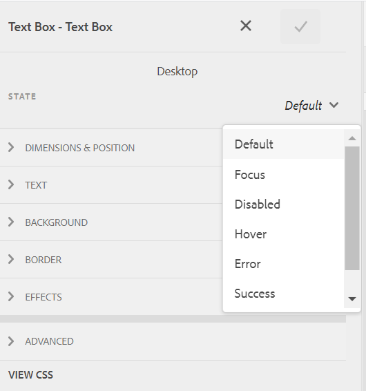
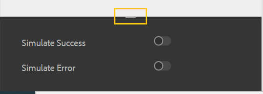

# Inline styling of Adaptive Form components {#inline-styling-of-adaptive-form-components}

>[!NOTE]
>
> Adobe recommends using the modern and extensible data capture [Core Components](https://experienceleague.adobe.com/docs/experience-manager-core-components/using/adaptive-forms/introduction.html) for [creating new Adaptive Forms](/help/forms/creating-adaptive-form-core-components.md) or [adding Adaptive Forms to AEM Sites pages](/help/forms/create-or-add-an-adaptive-form-to-aem-sites-page.md). These components represent a significant advancement in Adaptive Forms creation, ensuring impressive user experiences. This article describes older approach to author Adaptive Forms using foundation components.

| Version | Article link |
| -------- | ---------------------------- |
| AEM 6.5  |    [Click here](https://experienceleague.adobe.com/docs/experience-manager-65/forms/adaptive-forms-basic-authoring/inline-style-adaptive-forms.html)                  |
| AEM as a Cloud Service     | This article         |

You can define the overall appearance and style of an Adaptive Form by specifying styles using [theme editor](themes.md). Also, you can apply inline CSS styles to individual Adaptive Form components and preview the changes on the fly. Inline styles override styling provided in the theme.

## Apply inline CSS properties {#apply-inline-css-properties}

To add inline styles to a component:

1. Open your form in the form editor, and change the mode to styling mode. To change the mode to styling mode, in the page toolbar, select  &gt; **[!UICONTROL Style]**.
1. Select a component in the page, and select the edit button . Styling properties open in the sidebar.

   You can also select components from the form hierarchy tree in the sidebar. Form hierarchy tree is available as Form Objects in the sidebar.

   In the [!UICONTROL Style] mode, you can see components listed under Form Objects. However, Form Objects list in the sidebar lists components such as fields and panels. Fields and panels are generic components that can contain components such as text-box and radio-buttons.

   When you select a component from the sidebar, you see all the subcomponents listed and the properties of the selected component. You can select a specific subcomponent and style it.

1. Click a tab in the sidebar to specify CSS properties. You can specify properties such as:

    * [!UICONTROL Dimensions & Position] (Display setting, padding, height, width, margin, position, z-index, float, clear, overflow)
    * [!UICONTROL Text] (Font family, weight, color, size, line height, and alignment)
    * [!UICONTROL Background] (Image and gradient, background color)
    * [!UICONTROL Border] (Width, style, color, radius)
    * [!UICONTROL Effects] (Shadow, Opacity)
    * [!UICONTROL Advanced] (Lets you write custom CSS for the component)

1. Similarly, you can apply styles for other parts of a component such as [!UICONTROL Widget], [!UICONTROL Caption], and [!UICONTROL Help].
1. Select **[!UICONTROL Done]** to confirm the changes or **[!UICONTROL Cancel]** to discard the changes.

## Example: inline styles for a field component {#example-inline-styles-for-a-field-component}

The following images depict a text field before and after inline styles are applied to it.

Text box component before applying inline style properties

Notice the change in text box style as shown in the following image after applying the following CSS properties.

<table>
 <tbody>
  <tr>
   <td>
Selector
 </td>
   <td>
CSS property
 </td>
   <td>
Value
 </td>
   <td>
Effect
 </td>
  </tr>
  <tr>
   <td>
Field
 </td>
   <td>
border
 </td>
   <td>
Border width =2px
 
Border style=Solid
 
Border color=#1111
 </td>
   <td>
Creates a Black 2-px wide border around the field
 </td>
  </tr>
  <tr>
   <td>
Text box
 </td>
   <td>
background-color
 </td>
   <td>
#6495ED
 </td>
   <td>
Changes the background color to CornflowerBlue (#6495ED)
 
Note: You can specify a color name or its hexadecimal code in the value field.
 </td>
  </tr>
  <tr>
   <td>
Label
 </td>
   <td>
Dimensions &amp; Position &gt; width
 </td>
   <td>
100px
 </td>
   <td>
Fixes the width as 100px for the label
 </td>
  </tr>
  <tr>
   <td>Field Help Icon</td>
   <td>Text &gt; Font Color</td>
   <td>#2ECC40</td>
   <td>Changes the color of the help icon face.</td>
  </tr>
  <tr>
   <td>
Long description
 </td>
   <td>
text-align
 </td>
   <td>
center
 </td>
   <td>
Aligns the long description for help to center
 </td>
  </tr>
 </tbody>
</table>

Text box component after applying inline style properties

Following the steps above, you can select and style other components, such as panels, submit buttons, and radio buttons.

>[!NOTE]
>
>Styling properties vary based on the component you select.

## Copy and paste styles {#copy-paste-styles}

You can also copy and paste a style from one component to another component in an Adaptive Form. In the **[!UICONTROL Style]** mode, select the component and select the Copy icon .

Select the other component of the same type and select the Paste icon  to paste the copied style. You can also select the Clear Style icon  to clear the applied style.

## Set styles for different states of a component {#set-styles-for-states}

You can set styles for different states of a component type. The different states include: [!UICONTROL Focus], [!UICONTROL Disabled], [!UICONTROL Hover], [!UICONTROL Error], [!UICONTROL Success], and [!UICONTROL Mandatory].

To define styling for a state of a component:

1. In the **[!UICONTROL Style]** mode, select the component and select the Edit icon .

1. Select the state for the component using the **[!UICONTROL State]** drop-down list.

   

1. Define the styling for the selected state of the component and select  to save the properties.

You can also simulate the success and error states. Select the Expand icon to view the **[!UICONTROL Simulate Success]** and **[!UICONTROL Simulate Error]** options.

## See Also {#see-also}

{{see-also}}

<!--

>[!MORELIKETHIS]
>
>* [Use themes in Adaptive Form Core Components ](/help/forms/using-themes-in-core-components.md)

-->