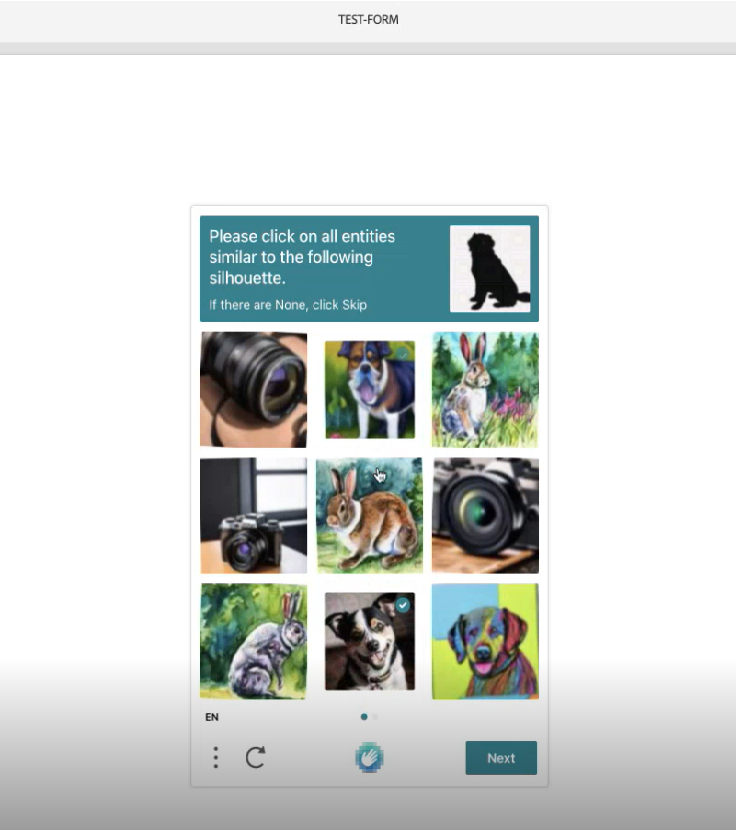

# Connect your AEM Forms environment with hCaptcha {#connect-your-forms-environment-with-hcaptcha-service}

hCaptcha service protects your forms from bots, spam, and automated abuse. It poses a checkbox widget challenge and evaluates the user response to determine if it’s a human or a bot interacting with the form. It prevents the user to proceed if the test fails and helps make online transactions secure by keeping bots from posting spam or malicious activities.

AEM Forms as a Cloud Service supports hCaptcha in Adaptive Forms Core Components. You can use it to present a checkbox widget challenge on form submission.

<!-- -->

## Prerequisites to integrate AEM Forms environment with hCaptcha {#prerequisite}

To configure hCaptcha with AEM Forms, you need to obtain [hCaptcha sitekey and secret key](https://docs.hcaptcha.com/switch/#get-your-hcaptcha-sitekey-and-secret-key) from the hCaptcha website.

## Steps to configure hCaptcha {#steps-to-configure-hcaptcha}

To integrate AEM Forms with hCaptcha service, perform the following steps:

1. Create a Configuration Container on your AEM Forms as a Cloud Service environment. A Configuration Container holds Cloud Configurations used to connect AEM to external services. To create and configure a Configuration Container to connect your AEM Forms environment with hCaptcha:
    1. Open your AEM Forms as a Cloud Service instance. 
    1. Go to **[!UICONTROL Tools > General > Configuration Browser]**.  
    1. In the Configuration Browser, you can select an existing folder or create a folder. You can create a folder and enable the Cloud Configurations option for it or Enable the Cloud Configurations option for an existing folder:

        * To create a folder and enable the Cloud Configurations option for it: 
            1. In the Configuration Browser, click **[!UICONTROL Create]**. 
            1. In the Create Configuration dialog, specify a name, title, and select the **[!UICONTROL Cloud Configurations]** option. 
            1. Click **[!UICONTROL Create]**.
        * To enable the Cloud Configurations option for an existing folder:
            1. In the Configuration Browser, select the folder and select **[!UICONTROL Properties]**.
            1. In the Configuration Properties dialog, enable **[!UICONTROL Cloud Configurations]**.
            1. Select **[!UICONTROL Save & Close]** to save the configuration and exit the dialog.

1. Configure the Cloud Service: 
    1. On your AEM author instance, go to  &gt; **[!UICONTROL Cloud Services]** and select **[!UICONTROL hCaptcha]**.
        
    1. Select a Configuration Container, created or updated, as described in the previous section. Select **[!UICONTROL Create]**.
        
    1. Specify **[!UICONTROL Title]**, **[!UICONTROL Name]**, **[!UICONTROL Site Key]**, and **[!UICONTROL Secret Key]** for hCaptcha service (Obtained in Step 1). Select **[!UICONTROL Create]**.

        

    >[!NOTE]
    > Users need not to modify [Client-side JavaScript validation URL](https://docs.hcaptcha.com/#add-the-hcaptcha-widget-to-your-webpage) and [Server-side validation URL](https://docs.hcaptcha.com/#verify-the-user-response-server-side) as they are already prefilled for hCaptcha validation.

   Once the hCAPTCHA service is configured, it is available for use in an [Adaptive Form based on Core Components](https://experienceleague.adobe.com/en/docs/experience-manager-core-components/using/adaptive-forms/introduction).

## Use hCaptcha in an Adaptive Forms Core Components {#using-hCaptcha-core-components}

1. Open your AEM Forms as a Cloud Service instance. 
1. Go to **[!UICONTROL Forms]** > **[!UICONTROL Forms and Documents]**.
1. Select an Adaptive Form and select **[!UICONTROL Properties]**. For the **[!UICONTROL Configuration Container]** option, select the Configuration Container that contains the Cloud Configuration which connects AEM Forms with hCaptcha and select **[!UICONTROL Save & Close]**.

    If you do not have such a Configuration Container, see section [Connect your AEM Forms environment with hCaptcha](#connect-your-forms-environment-with-hcaptcha-service) to learn how to create a Configuration Container.

    

1. Select an Adaptive Form and select **[!UICONTROL Edit]**. The Adaptive Form opens in Adaptive Forms Editor. 
1. From the component browser, drag-drop or add the **[!UICONTROL Adaptive Form hCaptcha]** component onto the Adaptive Form.
1. Select the **[!UICONTROL Adaptive Form hCaptcha]** component and click properties  icon. It opens the properties dialog. Specify the following properties:

    

    * **[!UICONTROL Name]:** Specify the name for your Captcha component, you can identify a form component easily with its unique name both in the form and in the rule editor.
    * **[!UICONTROL Title]:** Specify the title for your Captcha component.
    * **[!UICONTROL Configuration Settings]:** Select a Cloud Configuration configured for hCaptcha.
    * **Captcha Size:** You can select the display size of the hCaptcha challenge dialog. Use the **[!UICONTROL Compact]** option to display a small sized and the **[!UICONTROL Normal]** option to display a relatively large-size hCaptcha challenge dialog or **[!UICONTROL Invisible]** to validate hCaptcha without explicitly rendering the checkbox widget on the user interface.
    * **[!UICONTROL Validation Message]:** Provide a validation message for your Captcha validation on form submission.
    * **[!UICONTROL Script Validation Message]** - This option allows you to enter a message to be displayed if the script validation fails.
        >[!NOTE]
        >You can have multiple Cloud Configurations in your environment for a similar purpose. So, choose the service carefully. If no service is listed, see [Connect your AEM Forms environment with hCaptcha](#connect-your-forms-environment-with-hcaptcha-service) to learn how to create a Cloud Service that connects your AEM Forms environment with hCaptcha service.
    * **Error Message:** Provide the error message to display to the user when the Captcha submission fails.

1. Select **[!UICONTROL Done]**.

Now, only legitimate forms, in which the form filler successfully clears the challenge posed by the hCaptcha service are allowed for the form submission.

## Frequently Asked Questions

* **Q: Can I use more than one Captcha component in an Adaptive Form?**
* **Ans:** Using more than one Captcha component in an Adaptive Form is not supported. Also, it is not recommended to use a Captcha component in a fragment or a panel marked for lazy loading.

## See Also {#see-also}

{{see-also}}
