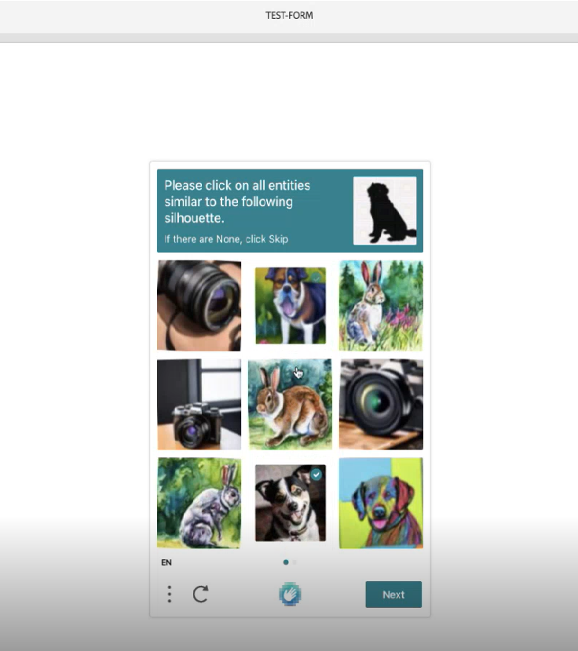
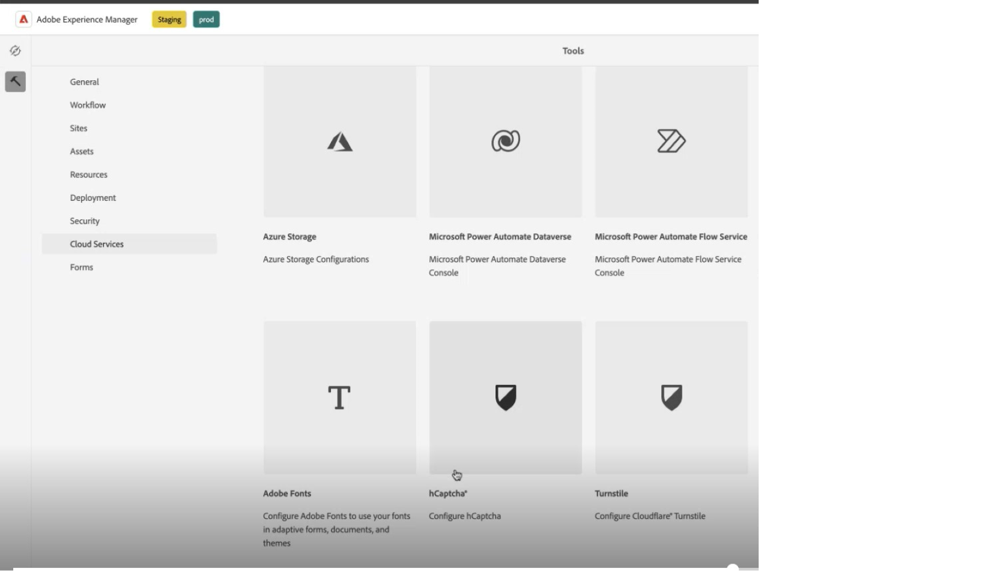
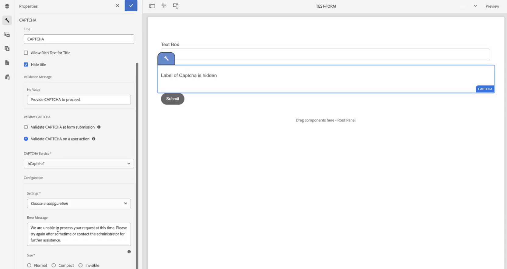

# Connect your AEM Forms environment with hCaptcha {#connect-your-forms-environment-with-hcaptcha-service}

hCaptcha service protects your forms from bots, spam, and automated abuse. It poses a checkbox widget challenge and evaluates the user response to determine if it’s a human or a bot interacting with the form. It prevents the user to proceed if the test fails and helps make online transactions secure by keeping bots from posting spam or malicious activities.

<!-- -->

AEM Forms as a Cloud Service supports hCaptcha in Adaptive Forms. You can use it to present a checkbox widget challenge to the user on form submission.

## Prerequisites to integrate AEM Forms environment with hCaptcha {#prerequisite}

To configure hCaptcha with AEM Forms, you need to obtain [hCaptcha sitekey and secret key](https://docs.hcaptcha.com/switch/#get-your-hcaptcha-sitekey-and-secret-key) from the hCaptcha website.

## Steps to configure hCaptcha {#steps-to-configure-hcaptcha}

1. Create a Configuration Container on your AEM Forms as a Cloud Service environment. A Configuration Container holds Cloud Configurations used to connect AEM to external services. To create and configure a Configuration Container to connect your AEM Forms environment with hCaptcha:
    1. Open your AEM Forms as a Cloud Service instance. 
    1. Go to **[!UICONTROL Tools > General > Configuration Browser]**.  
    1. In the Configuration Browser, you can select an existing folder or create a folder. You can create a folder and enable the Cloud Configurations option for it or enable the Cloud Configurations option for an existing folder:

        * **To create a folder and enable the Cloud Configurations option for it**:
            1. In the Configuration Browser, click **[!UICONTROL Create]**. 
            1. In the Create Configuration dialog, specify a name, title, and select the **[!UICONTROL Cloud Configurations]** option. 
            1. Click **[!UICONTROL Create]**.
        * To enable the Cloud Configurations option for an existing folder:
            1. In the Configuration Browser, select the folder and select **[!UICONTROL Properties]**.
            1. In the Configuration Properties dialog, enable **[!UICONTROL Cloud Configurations]**.
            1. Select **[!UICONTROL Save & Close]** to save the configuration and exit the dialog. 

1. Configure the Cloud Service: 
    1. On your AEM author instance, go to  &gt; **[!UICONTROL Cloud Services]** and select **[!UICONTROL hCaptcha]**.
        
    1. Select a Configuration Container, created or updated, as described in the previous section. Select **[!UICONTROL Create]**.
        
    1. Specify **[!UICONTROL Title]**, **[!UICONTROL Name]**, **[!UICONTROL Site Key]**, and **[!UICONTROL Secret Key]** for hCaptcha service (Obtained in Step 1). Select **[!UICONTROL Create]**.

        

  >[!NOTE]
  > Users need not to modify [Client-side JavaScript validation URL](https://docs.hcaptcha.com/#add-the-hcaptcha-widget-to-your-webpage) and [Server-side validation URL](https://docs.hcaptcha.com/#verify-the-user-response-server-side) as they are already prefilled for hCaptcha validation. For some countries, the endpoints may differ, visit [hCaptcha FAQs](https://docs.hcaptcha.com/faq#does-hcaptcha-support-access-by-users-in-china) for more information.

Once the hCAPTCHA service is configured, it is available for use in an Adaptive Form.

## Use hCaptcha in an Adaptive Form{#using-hCaptcha-foundation-components}

1. Open your AEM Forms as a Cloud Service instance. 
1. Go to **[!UICONTROL Forms]** > **[!UICONTROL Forms and Documents]**.  
1. Select an Adaptive Form and select **[!UICONTROL Properties]**. For the **[!UICONTROL Configuration Container]** option, select the Configuration Container that contains the Cloud Configuration that connects AEM Forms with hCaptcha, and select **[!UICONTROL Save & Close]**.

    If you do not have such a Configuration Container, see section [Connect your AEM Forms environment with hCaptcha](#connect-your-forms-environment-with-hcaptcha-service) to learn how to create a Configuration Container.

    

1. Select an Adaptive Form and select **[!UICONTROL Edit]**. The Adaptive Form opens in Adaptive Forms Editor. 
1. From the component browser, drag-drop the **[!UICONTROL Captcha]** component onto the Adaptive Form.
1. Select the **[!UICONTROL Captcha]** component and click on properties  icon. It opens the properties dialog.

    

    Specify the following properties:

    * **[!UICONTROL Title]:** Specify the title for your Captcha component, you can identify a form component easily with its unique name both in the form and in the rule editor.
    * **[!UICONTROL Validation Message]:** Provide a validation message for your Captcha validation on form submission.
    * **[!UICONTROL Validate Captcha]:** You can select one of the options to validate Captcha: 
        * At form Submission 
        * On a user action.
    * **[!UICONTROL Captcha Service]:** Select your Captcha service, here you select hCaptcha service.
    * **[!UICONTROL Captcha Configuration]:** Select a Cloud Configuration configured for hCaptcha.
        >[!NOTE]
        >You can have multiple Cloud Configurations in your environment for a similar purpose. So, choose the service carefully. If no service is listed, see [Connect your AEM Forms environment with hCaptcha](#connect-your-forms-environment-with-hcaptcha-service) to learn how to create a Cloud Service that connects your AEM Forms environment with hCaptcha service.

    * **Error Message:** Provide the error message to display to the user when the Captcha submission fails.
    * **Captcha Size:** You select the display size of the hCaptcha challenge dialog. Use the **[!UICONTROL Compact]** option to display a small sized and the **[!UICONTROL Normal]** option to display a relatively large-size hCaptcha challenge dialog or **[!UICONTROL Invisible]** to validate hCaptcha without explicitly rendering the checkbox widget on the user interface.

1. Select **[!UICONTROL Done]**.

Now, only legitimate forms, in which the form filler successfully clears the challenge posed by the hCaptcha service are allowed for the form submission.

## Frequently Asked Questions

* **Q: Can I use more than one Captcha component in an Adaptive Form?**
* **Ans:** Using more than one Captcha component in an Adaptive Form is not supported. Also, it is not recommended to use a Captcha component in a fragment or a panel marked for lazy loading.

## See Also {#see-also}

{{see-also}}
