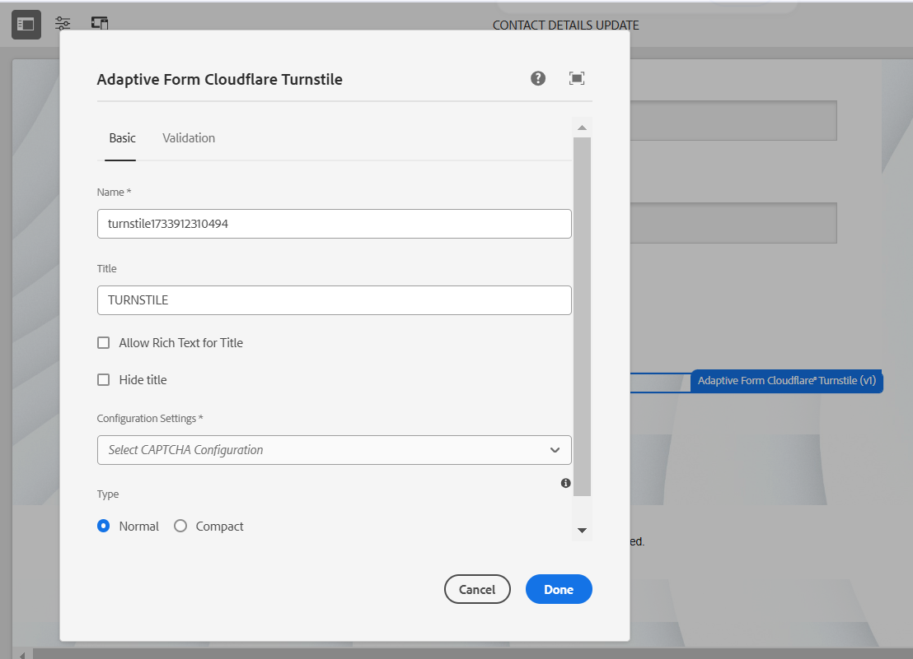

# Connect your AEM Forms environment with Turnstile {#connect-your-forms-environment-with-turnstile-service}

 This feature is under the Early Adopter Program. You can write to aem-forms-ea@adobe.com from your official email id to join the early adopter program and request access to the capability. 

CAPTCHA (Completely Automated Public Turing test to tell Computers and Humans Apart) is a program commonly used in online transactions to distinguish between humans and automated programs or bots. It poses a challenge and evaluates user response to determine if it's a human or a bot interacting with the site. It prevents the user to proceed if the test fails and helps make online transactions secure by keeping bots from posting spam or malicious purposes. 

AEM Forms as a Cloud Service supports the following CAPTCHA solutions: 

* [Turnstile](/help/forms/integrate-adaptive-forms-turnstile-core-components.md)
* [Google reCAPTCHA](/help/forms/captcha-adaptive-forms-core-components.md)
* [hCaptcha](/help/forms/integrate-adaptive-forms-hcaptcha-core-components.md)  

<!-- -->

## Integrate AEM Forms environment with Turnstile Captcha

Cloudflare's Turnstile Captcha is a security measure that aims to protect forms and sites from automated bots, malicious attacks, spams and unwanted automated traffic. It presents a checkbox on form submission to verify that they are human, before allowing them to submit the form. AEM Forms as a Cloud Service supports Turnstile Captcha in Adaptive Forms Core Components.

### Prerequisites to integrate AEM Forms environment with Turnstile Captcha {#prerequisite}

To configure Turnstile for AEM Forms Core Components, you need to obtain the [Turnstile sitekey and secret key](https://developers.cloudflare.com/turnstile/get-started/) from the Turnstile website.

### Configure Turnstile {#steps-to-configure-hcaptcha}

To integrate AEM Forms with the Turnstile service, perform the following steps:

1. Create a Configuration Container on your AEM Forms as a Cloud Service environment. A Configuration Container holds Cloud Configurations used to connect AEM to external services. To create and configure a Configuration Container to connect your AEM Forms environment with Turnstile, follow the steps given below:
    1. Open your AEM Forms as a Cloud Service instance. 
    1. Go to **[!UICONTROL Tools > General > Configuration Browser]**.  
    1. In the Configuration Browser, either create a new folder and enable Cloud Configurations for it or enable Cloud Configurations for an existing folder as explained below:

        * To create a **new folder** and enable the Cloud Configurations for it by following the steps:
            1. In the Configuration Browser, click **[!UICONTROL Create]**. 
            1. In the Create Configuration dialog, specify a name, title, and select the **[!UICONTROL Cloud Configurations]** option. 
            1. Click **[!UICONTROL Create]**.
        * To enable the Cloud Configurations option for an **existing folder**:
            1. In the Configuration Browser, select your existing folder and click **[!UICONTROL Properties]**.
            1. In the Configuration Properties dialog, enable **[!UICONTROL Cloud Configurations]**.
            1. Click **[!UICONTROL Save & Close]** to save the configuration and exit.

1. Configure the Cloud Service: 
    1. On your AEM author instance, go to  &gt; **[!UICONTROL Cloud Services]** and click **[!UICONTROL Turnstile]**.
        
    1. Select a Configuration Container, created or updated, as described in the previous section. Select **[!UICONTROL Create]**.
        
    1. Specify **[!UICONTROL Widget Type]** as managed, non-interactive or invisible. To know more about Widget Type, visit [Turnstile Widget](https://developers.cloudflare.com/turnstile/concepts/widget/).
    1. Specify **[!UICONTROL Title]**, **[!UICONTROL Name]**, **[!UICONTROL Site Key]**, and **[!UICONTROL Secret Key]** for Turnstile service [obtained in the prerequisite](#prerequisite). 
    1. Click **[!UICONTROL Create]**.

        

    >[!NOTE]
    >
    > Users need not to modify Client-side JavaScript validation URL and Server-side validation URL as they are already prefilled for Turnstile validation.

   Once the Turnstile Captcha service is configured, it is available for use in an [Adaptive Form based on Core Components](https://experienceleague.adobe.com/en/docs/experience-manager-core-components/using/adaptive-forms/introduction).

## Use Turnstile in an Adaptive Form {#using-turnstile-core-components}

1. Open your AEM Forms as a Cloud Service instance. 
1. Go to **[!UICONTROL Forms]** > **[!UICONTROL Forms and Documents]**.
1. Select your Adaptive Form and click **[!UICONTROL Properties]**. In the **[!UICONTROL Configuration Container]** section, select the Configuration Container that contains the Cloud Configuration which connects AEM Forms with Turnstile.
1. Click **[!UICONTROL Save & Close]**.

    If you do not have a Configuration Container, see section [Configure Turnstile](#steps-to-configure-hcaptcha) to learn how to create a Configuration Container.

    

1. Select an Adaptive Form and click **[!UICONTROL Edit]** to open a form in the editor.
1. From the component browser, drag-drop or add the **[!UICONTROL Adaptive Form Turnstile]** component onto the adaptive form.
    
1. Select the **[!UICONTROL Adaptive Form Turnstile]** component and click properties  icon. It opens the properties dialog. Specify the following properties:

    

    * **[!UICONTROL Name]:** Specify the name for your Captcha component, you can identify a form component easily with its unique name both in the form and in the rule editor.
    * **[!UICONTROL Title]:** Specify the title for your Captcha component. you can allow Rich Text for the title and also you can hide the title, by ticking the checkboxes.
    * **[!UICONTROL Configuration Settings]:** Select a Cloud Configuration configured for Turnstile Captcha service.
        
        >[!NOTE]
        >
        >* You can have multiple Cloud Configurations in your environment for a similar purpose. So, choose the service carefully. If no service is listed, see the section, [Configure Turnstile](#steps-to-configure-hcaptcha), to learn how to create a Configuration Container to connect your AEM Forms environment with Turnstile service.

    * **[!UICONTROL Validation]:** Provide Captcha validation in the form of an error message:

        * **Error Message:** Provide the error message to display to the user when the Captcha submission fails. 
            
            >[!NOTE]
            >
            >* An error message appears only if the CAPTCHA is filled on the client side.
            
1. Click **[!UICONTROL Done]**.

Now, only legitimate forms, in which the form filler successfully clears the challenge posed by the Turnstile service are allowed for the form submission.

## Frequently Asked Questions

* **Q: Can I use more than one Captcha component in an Adaptive Form?**
* **Ans:** Using more than one Captcha component in an Adaptive Form is not supported. Also, it is not recommended to use a Captcha component in a fragment or a panel marked for lazy loading.

## See Also {#see-also}

{{see-also}}
