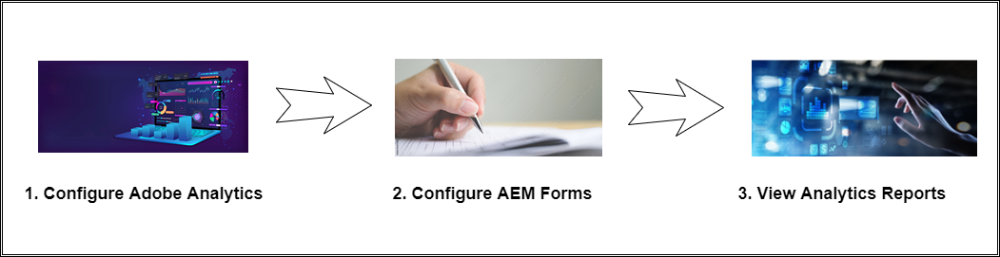
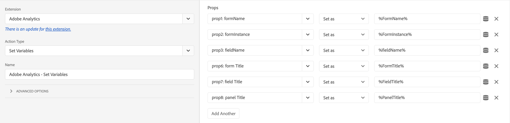
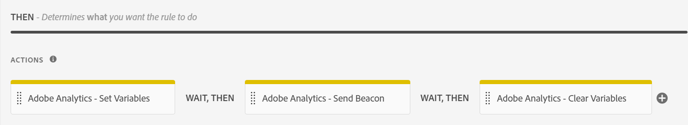
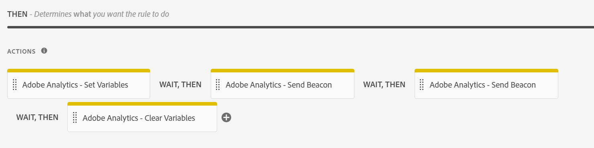
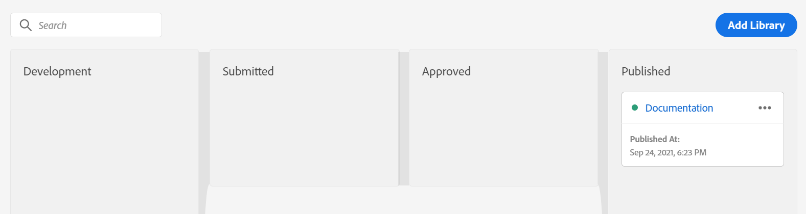
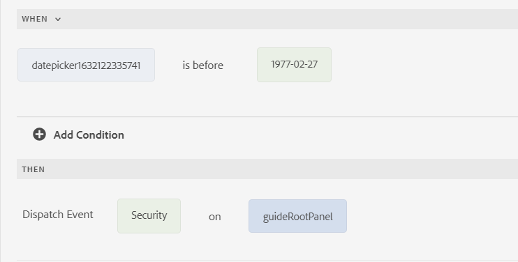

# Form Analytics with Adobe Analytics and AEM Forms - Complete Guide {#integrate-aem-forms-with-adobe-analytics}

## What is Form Analytics?

Form analytics is the process of collecting, measuring, and analyzing data about how users interact with your forms. It provides insights into user behavior, identifies bottlenecks in the form completion process, and helps optimize forms for better conversion rates.

Form analytics goes beyond simple submission tracking to provide comprehensive insights into every aspect of the user experience. By analyzing how users interact with individual form fields, navigation patterns, and completion behaviors, organizations can make data-driven improvements that significantly impact business outcomes.

### Core Form Analytics Concepts

**User Interaction Tracking**
Form analytics captures detailed information about how users engage with forms, including time spent on each field, mouse movements, scroll behavior, and interaction patterns. This granular data helps identify usability issues and optimization opportunities.

**Behavioral Pattern Analysis**
By analyzing user behavior patterns across multiple form sessions, organizations can identify common user journeys, typical abandonment points, and successful completion paths. This analysis enables targeted improvements that address real user needs.

**Performance Measurement**
Form analytics provides quantitative metrics that measure form effectiveness, including conversion rates, completion times, error frequencies, and user satisfaction indicators. These metrics enable objective assessment of form performance and optimization impact.

### Why Form Analytics Matters for Business

Form analytics transforms raw user interaction data into actionable business insights that drive measurable improvements across key business metrics:

**Conversion Rate Optimization**
Form abandonment is a critical business challenge that directly impacts revenue and lead generation. Research shows that 68% of users abandon forms before completion, making form analytics essential for identifying drop-off points. Form analytics enables targeted conversion optimization strategies that can significantly increase form performance. Effective conversion optimization through form analytics delivers measurable improvements in lead generation and customer acquisition.

**User Experience Improvement**
Understanding user struggles and pain points allows organizations to create smoother, more intuitive form experiences. This leads to higher customer satisfaction, reduced support costs, and improved brand perception.

**Data-Driven Decision Making**
Rather than relying on assumptions or best practices, form analytics provides concrete data about user behavior analysis. This enables evidence-based conversion optimization that delivers significantly better results than intuition-based changes. User behavior analysis through form performance tracking ensures optimization efforts focus on actual user needs rather than assumptions.

**ROI Measurement and Justification**
Form analytics quantifies the impact of optimization efforts, providing clear metrics that demonstrate business value. Organizations can measure the direct correlation between form improvements and business outcomes like lead generation, sales conversion, and customer acquisition costs.

**Competitive Advantage**
Superior form experiences become a competitive differentiator in customer acquisition. Organizations using form analytics can create best-in-class user experiences that outperform competitors and drive market share growth.

### Key Form Analytics Metrics

Effective form analytics focuses on metrics that directly impact business outcomes and provide actionable insights for optimization:

**Primary Success Metrics**

- **Form Conversion Rate**: The percentage of form views that result in successful submissions - the ultimate measure of form effectiveness
- **Form Abandonment Rate**: Where and why users drop off, providing direct insight into user experience issues
- **Completion Time**: How long users take to complete forms, indicating complexity and user experience quality

**Detailed Performance Indicators**

- **Field-Level Analytics**: Which specific fields cause problems, enabling targeted optimization efforts
- **Error Rate Analysis**: Validation issues and user mistakes that prevent successful form completion
- **Help Usage Patterns**: When and where users need assistance, indicating areas for improvement

**Advanced Behavioral Metrics**

- **Conversion Funnel Analysis**: User journey through multi-step forms, showing progression and drop-off patterns
- **Device and Browser Performance**: Technical factors affecting completion across different user environments
- **User Engagement Depth**: Time spent on forms, field interaction patterns, and user attention indicators

**Business Impact Metrics**

- **Lead Quality Correlation**: How form completion behavior relates to lead conversion and customer value
- **Traffic Source Performance**: Which marketing channels drive the highest-quality form submissions
- **Seasonal and Campaign Impact**: How form performance varies with marketing activities and external factors

## Business Benefits of Form Analytics

Implementing form analytics delivers measurable business value across multiple dimensions. Organizations that leverage form analytics typically see significant improvements in conversion rates, user satisfaction, and operational efficiency.

### 1. Reduce Form Abandonment and Increase Conversions

Form abandonment is a critical business challenge that directly impacts revenue and lead generation:

- **Identify Drop-off Points**: Track exactly where users abandon forms to pinpoint problematic fields or sections
- **Optimize Form Flow**: Rearrange, simplify, or remove fields that cause the highest abandonment rates  
- **A/B Test Improvements**: Test different form variations and measure their impact on completion rates
- **Mobile Optimization**: Identify mobile-specific issues that prevent form completion
- **Real-time Monitoring**: Get immediate alerts when form performance degrades

**Business Impact**: Companies typically see significant improvement in form conversion rates after implementing analytics-driven optimizations.

### 2. Enhance User Experience and Satisfaction

Form analytics provides deep insights into user behavior and pain points:

- **Reduce Completion Time**: Identify fields that take too long to complete and streamline the process
- **Minimize User Frustration**: Track error patterns and validation issues to improve form usability
- **Optimize Field Order**: Arrange fields in the most logical and user-friendly sequence
- **Improve Help and Guidance**: Identify where users need assistance and provide targeted help
- **Cross-device Experience**: Ensure consistent performance across desktop, tablet, and mobile devices

**Business Impact**: Improved user experience leads to higher customer satisfaction scores and increased brand loyalty.

### 3. Make Data-Driven Form Improvements

Replace guesswork with concrete data when optimizing forms:

- **Evidence-Based Decisions**: Use actual user behavior data rather than assumptions to guide improvements
- **Measure Optimization Impact**: Quantify the results of form changes with before/after analytics
- **Prioritize Improvements**: Focus on changes that will have the biggest impact on business metrics
- **Continuous Optimization**: Establish ongoing improvement cycles based on performance data
- **Stakeholder Reporting**: Provide concrete metrics to demonstrate form performance and ROI

**Business Impact**: Data-driven optimization typically delivers significantly better results than intuition-based changes.

### 4. Increase Lead Quality and Sales Efficiency

Form analytics helps optimize not just quantity but quality of form submissions:

- **Lead Scoring Integration**: Correlate form behavior with lead quality and conversion potential
- **Source Attribution**: Understand which traffic sources generate the highest-quality form submissions
- **Progressive Profiling**: Optimize multi-step forms to gather more qualified leads
- **Segmentation Insights**: Identify patterns in high-value customer form behavior
- **Sales Handoff Optimization**: Provide sales teams with context about lead form interactions

**Business Impact**: Higher quality leads result in improved sales conversion rates and reduced customer acquisition costs.

### 5. Operational Efficiency and Cost Reduction

Form analytics drives operational improvements across the organization:

- **Reduce Support Tickets**: Identify and fix common form issues that generate customer service calls
- **Automate Optimization**: Set up automated alerts and optimization rules based on performance thresholds
- **Resource Allocation**: Focus development resources on forms and fields with the highest business impact
- **Compliance Monitoring**: Track form performance for regulatory and accessibility compliance
- **Integration Efficiency**: Optimize form-to-system integrations based on submission patterns

**Business Impact**: Operational improvements can significantly reduce form-related support costs.

### 6. Competitive Advantage Through Superior Forms

Form analytics enables organizations to create best-in-class form experiences:

- **Benchmark Performance**: Compare form performance against industry standards and competitors
- **Innovation Opportunities**: Identify unique optimization opportunities that competitors may miss
- **Customer Retention**: Superior form experiences contribute to overall customer satisfaction and retention
- **Market Differentiation**: Use form analytics insights to create competitive advantages in user experience
- **Scalable Optimization**: Apply successful form patterns across multiple products and campaigns

**Business Impact**: Superior form experiences can become a significant competitive differentiator in customer acquisition.

## Form Analytics Use Cases and Examples

Understanding how form analytics applies to real-world scenarios helps organizations identify optimization opportunities and implement effective measurement strategies. Here are common use cases across different industries and form types.

### E-commerce and Retail Forms

**Checkout and Payment Forms**

- **Challenge**: High cart abandonment during checkout process directly impacts revenue
- **Form Analytics Solution**: Track field-by-field completion rates and form performance to identify friction points
- **Common Findings**: Credit card fields, shipping address validation, and account creation steps often cause form abandonment
- **Conversion Optimization Results**: Retailers typically see significant improvement in checkout completion after analytics-driven form performance optimization
- **User Behavior Analysis**: Track cart abandonment patterns to understand when and why customers leave during checkout
- **Business Impact**: Reduced form abandonment translates directly to increased revenue and improved customer acquisition costs

**Product Registration and Warranty Forms**

- **Challenge**: Low product registration rates affecting customer support and marketing
- **Analytics Solution**: Monitor completion rates and identify optional vs. required field impact
- **Optimization Strategy**: Reduce required fields and improve mobile experience
- **Business Impact**: Higher registration rates improve customer lifetime value and support efficiency

### Lead Generation and B2B Forms

**Contact and Demo Request Forms**

- **Challenge**: Balancing lead quality with form completion rates and minimizing form abandonment
- **Form Analytics Solution**: Track correlation between form performance, form length, and lead conversion quality
- **Key Insights**: Progressive profiling often outperforms long single-page forms for conversion optimization
- **User Behavior Analysis**: Monitor how form length impacts completion rates and lead quality scores
- **Conversion Optimization Results**: B2B companies see significant improvement in qualified lead generation through form performance optimization
- **Business Impact**: Better form analytics leads to higher-quality leads and improved sales conversion rates

**Webinar and Event Registration**

- **Challenge**: Maximizing event attendance while gathering necessary information
- **Analytics Solution**: Monitor registration completion vs. actual attendance rates
- **Common Patterns**: Shorter forms increase registrations but may reduce attendance quality
- **Best Practice**: Use analytics to find optimal balance between form length and attendee quality

### Financial Services Forms

**Loan and Credit Applications**

- **Challenge**: Complex multi-step applications with high abandonment rates
- **Analytics Solution**: Track completion rates at each step and identify drop-off points
- **Critical Insights**: Document upload and income verification steps often cause abandonment
- **Optimization Strategy**: Provide clear progress indicators and save-and-resume functionality
- **Regulatory Considerations**: Analytics must comply with financial data privacy requirements

**Insurance Quote and Claims Forms**

- **Challenge**: Gathering detailed information while maintaining user engagement
- **Analytics Solution**: Monitor time-to-completion and field-level engagement
- **Key Findings**: Auto-population and smart defaults significantly improve completion rates
- **Business Impact**: Improved form completion directly correlates with policy conversion rates

### Healthcare and Medical Forms

**Patient Registration and Intake Forms**

- **Challenge**: Collecting comprehensive medical information efficiently
- **Analytics Solution**: Track completion rates across different patient demographics
- **Accessibility Focus**: Monitor performance across different devices and accessibility tools
- **Optimization Priority**: Mobile optimization critical for patient satisfaction
- **Compliance Requirements**: HIPAA compliance essential for all analytics implementations

**Appointment Scheduling Forms**

- **Challenge**: Reducing no-shows while simplifying booking process
- **Analytics Solution**: Correlate form completion behavior with appointment attendance
- **Key Insights**: Confirmation and reminder preferences significantly impact attendance
- **Integration Opportunity**: Connect form analytics with appointment management systems

### Educational Institution Forms

**Application and Enrollment Forms**

- **Challenge**: Managing complex multi-step applications with document requirements
- **Analytics Solution**: Track completion rates across different application stages
- **Critical Metrics**: Time-to-completion and save-and-resume usage patterns
- **Optimization Focus**: Mobile experience increasingly important for student applications
- **Seasonal Considerations**: Performance varies significantly during application periods

**Course Registration and Feedback Forms**

- **Challenge**: Maximizing student engagement with administrative processes
- **Analytics Solution**: Monitor completion rates and identify user experience issues
- **Key Insights**: Integration with student portals improves completion rates
- **Continuous Improvement**: Regular analytics review essential for semester-over-semester optimization

### Common Form Analytics Scenarios

**Multi-Step Form Optimization**

Multi-step forms typically achieve 86% higher conversion rates than single-page forms when properly optimized:

- **Step-by-Step Analysis**: Track completion rates at each form step
- **Progress Indicator Impact**: Measure how progress bars affect completion rates
- **Save-and-Resume Usage**: Monitor how draft saving affects final completion
- **Mobile vs. Desktop Performance**: Compare completion rates across devices

**Field-Level Performance Analysis**

- **Required vs. Optional Fields**: Analyze impact of field requirements on completion
- **Field Order Optimization**: Test different field sequences for optimal flow
- **Validation Error Patterns**: Identify common user mistakes and improve validation
- **Help Text Effectiveness**: Measure impact of field guidance on completion rates

**Seasonal and Campaign Performance**

- **Traffic Source Analysis**: Compare form performance across marketing channels
- **Seasonal Variations**: Track how form performance changes throughout the year
- **Campaign Integration**: Correlate form analytics with marketing campaign performance
- **A/B Testing Integration**: Use analytics to measure test variations and optimize continuously

## Real-World Form Analytics Implementation Scenarios

Understanding specific implementation scenarios helps organizations apply form analytics effectively across different business contexts. These real-world examples demonstrate how form performance tracking and conversion optimization deliver measurable business results.

### E-commerce Checkout Optimization

**Scenario**: Online retailer experiencing high cart abandonment during checkout

- **Form Analytics Implementation**: Track cart abandonment at form level with field-by-field analysis
- **Key Findings**: Payment form completion dropped significantly at credit card verification step
- **Conversion Optimization Strategy**: Simplified payment form, added progress indicators, optimized mobile experience
- **Results**: Substantially reduced form abandonment and increased revenue
- **User Behavior Analysis**: Identified mobile users had higher abandonment rates, leading to mobile-first redesign

### Lead Generation Form Optimization

**Scenario**: B2B software company struggling with low-quality leads from contact forms

- **Form Performance Challenge**: High form completion rates but poor lead-to-customer conversion
- **Analytics Solution**: Correlate form completion behavior with lead quality and sales outcomes
- **Optimization Approach**: Implemented progressive profiling and lead scoring integration
- **Business Impact**: Significant improvement in lead quality and increase in sales-qualified leads
- **Conversion Optimization**: Reduced form abandonment while improving lead qualification

### Registration and Onboarding Optimization

**Scenario**: SaaS platform with high signup abandonment during onboarding process

- **User Behavior Analysis**: Track signup completion rates and identify onboarding bottlenecks
- **Form Analytics Insights**: Significant user abandonment occurred during account verification step
- **Optimization Strategy**: Streamlined verification process, added save-and-resume functionality
- **Results**: Substantially increased signup completion and improved user activation rates
- **Long-term Impact**: Better onboarding completion correlated with higher customer lifetime value

## Form Analytics Features in Adobe Analytics

Adobe Analytics provides enterprise-grade form tracking capabilities that enable organizations to capture detailed insights about user interactions with their forms. The seamless integration with AEM Forms offers both powerful out-of-the-box analytics and sophisticated customization options that scale with business needs.

### Why Choose Adobe Analytics for Form Analytics

**Enterprise-Scale Performance**
Adobe Analytics handles millions of form interactions without performance degradation, making it ideal for high-traffic websites and complex enterprise environments. The platform's robust infrastructure ensures reliable data collection even during peak usage periods.

**Advanced Segmentation Capabilities**
Unlike basic form analytics tools, Adobe Analytics enables sophisticated user segmentation based on behavior, demographics, traffic sources, and custom business criteria. This allows for targeted optimization strategies that address specific user groups and scenarios.

**Real-Time Insights and Alerting**
Monitor form performance as it happens with real-time dashboards and automated alerting. Identify and respond to issues immediately, preventing potential revenue loss from form problems or performance degradation.

### Out-of-the-Box Tracking Capabilities

AEM Forms integrates seamlessly with [Adobe Analytics](https://experienceleague.adobe.com/docs/analytics-learn/tutorials/overview.html?lang=en) to automatically capture and track performance metrics for your published forms. You can monitor the behavior of both authenticated and anonymous users without additional configuration.

Before implementing form analytics, ensure your [AEM Forms environment is properly configured](/help/forms/setup-forms-cloud-service.md) and you have [created your adaptive forms](/help/forms/creating-adaptive-form-core-components.md) using either Core Components or [Foundation Components](/help/forms/creating-adaptive-form.md).

**Comprehensive Form Event Tracking:**

Adobe Analytics automatically captures a complete picture of user form interactions:

- **Form Renders**: Track form impressions and views to understand reach and initial engagement
- **Form Submissions**: Monitor successful completions with detailed submission context and user journey data
- **Form Abandonment Analysis**: Capture precise abandonment points with field-level granularity and user session context
- **Validation Error Tracking**: Record error types, frequency, and resolution patterns to identify usability issues
- **Help Content Usage**: Monitor when users access help resources, indicating areas of confusion or complexity
- **Field-Level Interactions**: Track individual field engagement, time spent, and interaction patterns
- **Draft Save Behavior**: Understand user intent and form complexity through save-and-resume usage patterns
- **Cross-Session Tracking**: Follow users across multiple form sessions to understand completion journeys

**Advanced Behavioral Insights:**

- **Time-on-Field Analysis**: Measure how long users spend on each form field to identify complexity issues
- **Mouse Movement Patterns**: Track user hesitation and engagement through cursor behavior analysis
- **Scroll Depth Tracking**: Understand how users navigate through long forms and identify optimal form length
- **Error Recovery Patterns**: Analyze how users respond to and recover from validation errors

### Custom Event Tracking

Beyond standard form events, Adobe Analytics enables sophisticated custom tracking:

- **Business-Specific Metrics**: Define custom events using the rule editor to track organization-specific form interactions
- **User Journey Mapping**: Create custom events to track complex user paths through multi-step forms
- **Conversion Funnel Analysis**: Set up custom events to measure specific conversion points and drop-off stages
- **Integration Events**: Track form interactions with external systems and APIs

### Advanced Reporting Features

Adobe Analytics provides enterprise-grade reporting capabilities for form performance:

- **Real-Time Dashboards**: Monitor form performance and user interactions as they happen
- **Segmentation Analysis**: Analyze form performance across different user groups, traffic sources, and demographics
- **Funnel Visualization**: Visualize user progression through multi-step forms and identify optimization opportunities
- **Cohort Analysis**: Track form performance improvements over time and measure optimization impact
- **Cross-Device Tracking**: Understand how users interact with forms across different devices and sessions

### Integration Advantages

The Adobe Analytics and AEM Forms integration provides unique advantages:

- **Unified Data Platform**: Combine form analytics with broader website and marketing analytics
- **Adobe Experience Cloud Integration**: Leverage connections with Adobe Target, Campaign, and other Experience Cloud solutions
- **Enterprise Security**: Built-in compliance with data privacy regulations and enterprise security requirements
- **Scalable Architecture**: Handle high-volume form interactions without performance impact
- **Professional Support**: Access to Adobe's enterprise support and optimization services

After implementing the integration steps outlined in this article, you can configure and view comprehensive reports in [!DNL Adobe Analytics], as demonstrated in the following video:

>[!VIDEO](https://video.tv.adobe.com/v/337262)

## Key Form Analytics Metrics to Track

Successful form analytics implementation requires focusing on metrics that directly impact business outcomes. Understanding which metrics to prioritize helps organizations make data-driven decisions and optimize form performance effectively.

### Primary Performance Metrics

**Form Conversion Rate**

- **Definition**: Percentage of form views that result in successful submissions
- **Calculation**: (Form Submissions / Form Views) × 100
- **Business Impact**: Directly correlates with lead generation and revenue goals
- **Optimization Target**: Varies by industry and form complexity

**Form Abandonment Rate**

- **Definition**: Percentage of users who start but don't complete forms
- **Calculation**: (Form Starts - Form Completions) / Form Starts × 100
- **Critical Insights**: Identifies user experience issues and optimization opportunities
- **Benchmark**: High abandonment rates typically indicate significant usability problems

**Average Completion Time**

- **Definition**: Mean time users spend completing forms from start to submission
- **Analysis Focus**: Identify forms that take too long and may frustrate users
- **Optimization Goal**: Balance thoroughness with user experience efficiency
- **Segmentation**: Compare completion times across devices, user types, and traffic sources

### Field-Level Analytics

**Field Abandonment Rates**

- **Measurement**: Percentage of users who abandon forms at specific fields
- **Optimization Value**: Identifies problematic fields that need simplification or removal
- **Common Issues**: Complex validation requirements, unclear instructions, or technical problems
- **Action Items**: Prioritize optimization efforts on fields with highest abandonment rates

**Field Interaction Patterns**

- **Click-Through Rates**: Percentage of users who engage with specific form fields
- **Time-on-Field**: Average time users spend on individual fields
- **Error Rates**: Frequency of validation errors for specific fields
- **Help Usage**: How often users access help content for particular fields

**Field Completion Rates**

- **Progressive Analysis**: Track completion rates as users move through form fields
- **Drop-off Identification**: Pinpoint exact locations where users abandon forms
- **Optimization Priority**: Focus improvements on fields with steepest completion rate declines

### User Experience Metrics

**Error Rate Analysis**

- **Validation Errors**: Frequency and types of form validation failures
- **Technical Errors**: System-level issues affecting form functionality
- **User Error Patterns**: Common mistakes users make when completing forms
- **Resolution Tracking**: Monitor how error rate improvements impact overall conversion

**Mobile vs. Desktop Performance**

Mobile forms typically experience 30% higher abandonment rates compared to desktop versions, making device-specific optimization crucial:

- **Device-Specific Conversion Rates**: Compare form performance across device types
- **Responsive Design Impact**: Measure how mobile optimization affects completion rates
- **Touch Interface Usability**: Analyze mobile-specific interaction patterns
- **Cross-Device Journey**: Track users who start forms on one device and complete on another

**Page Load and Performance Metrics**

Forms that load in under 3 seconds have 70% higher completion rates than slower forms:

- **Form Load Time**: Time required for forms to fully render and become interactive
- **Field Response Time**: Latency between user input and system response
- **Submission Processing Time**: Duration from form submission to confirmation
- **Performance Impact**: Correlation between load times and abandonment rates

### Advanced Analytics Metrics

**User Segmentation Analysis**

- **Traffic Source Performance**: Compare form conversion rates across marketing channels
- **Geographic Performance**: Analyze form completion rates by location and language
- **User Type Analysis**: Compare performance between new and returning users
- **Demographic Insights**: Understand how different user groups interact with forms

**Conversion Funnel Analysis**

- **Multi-Step Form Progression**: Track user advancement through complex forms
- **Stage-by-Stage Conversion**: Measure completion rates at each form step
- **Funnel Optimization**: Identify and address bottlenecks in form progression
- **A/B Testing Integration**: Compare funnel performance across form variations

**Business Impact Metrics**

- **Lead Quality Scoring**: Correlate form completion behavior with lead conversion rates
- **Revenue Attribution**: Connect form submissions to actual business outcomes
- **Customer Lifetime Value**: Analyze long-term value of users acquired through different forms
- **Cost Per Acquisition**: Calculate marketing efficiency based on form performance data

The following figure illustrates the actions that you need to perform before viewing reports in [!DNL Adobe Analytics]:



## Setting Up Form Analytics for AEM Forms

Implementing form analytics with Adobe Analytics and AEM Forms requires systematic configuration across multiple components. This section provides comprehensive setup guidance, prerequisites, and best practices for successful implementation.

### Prerequisites and Requirements

Before beginning the form analytics implementation, ensure your environment meets the following requirements:

>[!NOTE]
>
>If you encounter issues during setup, refer to our comprehensive [AEM Forms troubleshooting guide](/help/forms/troubleshooting-installation-and-configuration.md) for installation and configuration problems.

**Adobe Experience Cloud Access**

- Valid Adobe Experience Cloud organization with Adobe Analytics licensing
- Administrative access to Adobe Analytics and AEM Forms environments
- Adobe Launch (Data Collection) access for tag management and configuration

**AEM Forms Environment**

- [AEM Forms as a Cloud Service](/help/forms/setup-forms-cloud-service.md) or AEM Forms 6.5+ (on-premises/AMS installations)
- Forms authoring and publishing capabilities enabled
- Ensure [Forms option is available](/help/forms/troubleshooting-installation-and-configuration.md#forms-option-is-unavailable) in your AEM environment
- [Adaptive Forms Core Components](/help/forms/creating-adaptive-form-core-components.md) or [Foundation Components](/help/forms/creating-adaptive-form.md) available

**Technical Requirements**

- Modern web browsers with JavaScript enabled for form analytics tracking
- HTTPS protocol implementation for secure data transmission
- Appropriate firewall and network configurations for Adobe Analytics data collection

**Permissions and Access**

- Adobe Analytics Administrator role for report suite configuration
- AEM Forms Author permissions for form configuration and publishing
- Adobe Launch Developer access for tag implementation and rule creation

### Step-by-Step Implementation Guide

#### 1. Configure Adobe Analytics {#Configure-adobe-analytics}

Before configuring [!DNL Adobe Analytics], create:

- An Adobe ID to log on to [Adobe Experience Cloud](https://experience.adobe.com/#/home).
- A [report suite](https://experienceleague.adobe.com/docs/analytics/admin/manage-report-suites/new-report-suite/t-create-a-report-suite.html).


### Install AEM Forms and [!DNL Adobe Analytics] extensions {#install-extensions}

Perform the following steps to configure AEM Forms and [Adobe Analytics](https://experienceleague.adobe.com/docs/experience-platform/tags/extensions/adobe/analytics/overview.html) extensions:

1. Log on to Adobe Experience Cloud and select an appropriate name for the company.

1. Select **[!UICONTROL Launch/Data Collection]** and select **[!UICONTROL Go to Launch/Data Collection]**.

1. Select **[!UICONTROL New property]** and specify a name for the configuration.

1. Specify a domain name and select **[!UICONTROL Save]** to save the property.

1. Select the configuration name available in the list of Tag Properties.

1. In the **[!UICONTROL Authoring]** section, select **[!UICONTROL Extensions]**.

1. Select **[!UICONTROL Catalog]** and select **[!UICONTROL Install]** for the **[!UICONTROL Adobe Experience Manager Forms]** extension. **[!UICONTROL Adobe Experience Manager Forms]** displays in the list of installed extensions available in the **Installed** tab.

1. Select **[!UICONTROL Install]** for the **[!UICONTROL Adobe Analytics]** extension.
1. Select the report suite name in the **[!UICONTROL Development Report Suites]**, **[!UICONTROL Staging Report Suites]**, and **[!UICONTROL Product Report Suites]** drop-down lists and select **[!UICONTROL Save]** to save the extension.

### Configure data elements {#configure-data-elements}

You can select any of the configured data elements in a rule created for an event. When an event occurs on an adaptive form, AEM Forms send these data elements to [!DNL Adobe Analytics].

After installing the **[!UICONTROL Adobe Experience Manager Forms]** extension, you can create the following data elements:

<table>
 <tbody>
  <tr>
   <td>FieldName</th>
   <td>FieldTitle</th>
   <td>FormInstance</th>
  </tr>
  <tr>
   <td>FormName<br /> </td>
   <td>FormTitle<br /> </td>
   <td>PageName</td>
  </tr>
  <tr>
   <td>PageURL<br /> </td>
   <td>PanelTitle<br /> </td>
   <td>TimeSpent</td>
  </tr>
 </tbody>
</table>

Perform the following steps to configure data elements:

1. In the **[!UICONTROL Authoring]** section, select **[!UICONTROL Data Elements]**.

1. Select **[!UICONTROL Create New Data Element]**.

1. Specify a name for the Data Element. For example, Form Title for FormTitle data element type.

1. Specify **[!UICONTROL Adobe Experience Manager Forms]** as the Extension name.

1. Select the **[!UICONTROL Data Element Type]**.

1. Select **[!UICONTROL Save]** to save the data element.

>[!VIDEO](https://video.tv.adobe.com/v/337472)

### Configure rules {#configure-rules}

Perform the following steps to create rules based on the **[!UICONTROL Adobe Experience Manager Forms]** extension:

1. In the **[!UICONTROL Authoring]** section, select **[!UICONTROL Rules]**.

1. Select **[!UICONTROL Create New Rule]**.

1. Specify a name for the Rule. For example, Form Submit to record form submissions.

1. In the **[!UICONTROL Events]** section, select **[!UICONTROL Add]**.

1. Specify **[!UICONTROL Adobe Experience Manager Forms]** as the Extension name.

1. Select the event type. The input for the **[!UICONTROL Name]** field populates automatically based on the selected event type.

1. Select **[!UICONTROL Keep Changes]** to save the event.

1. In the **[!UICONTROL Actions]** section, select **[!UICONTROL Add]**.

1. Specify **[!UICONTROL Adobe Analytics]** as the Extension name.

1. Select **[!UICONTROL Set Variables]** as the Action Type. The options available in the drop-down list include:

   - **[!UICONTROL Set Variables]**: Use this action type to define the event type for which the selected data elements are sent from AEM Forms to [!DNL Adobe Analytics].

   - **[!UICONTROL Send Beacon]**: Use this action type to send data from AEM Forms to [!DNL Adobe Analytics].

   - **[!UICONTROL Clear Variables]**: Use this action type to clear the data trail so that the event registers only once in [!DNL Adobe Analytics].

     The recommended approach is to use the **[!UICONTROL Set Variables]** action type to configure the event and data elements, then use **[!UICONTROL Send Beacon]** to send data, and then use **[!UICONTROL Clear Variables]** to clear the data trail.

1. In the **[!UICONTROL Props]** section, map the report suite options available in the drop-down list with the data elements defined using [Configure data elements](#configure-data-elements).

   For example, to send **Form Title** data element from AEM Forms to [!DNL Adobe Analytics] when you submit a form:
   1. In the **[!UICONTROL Props]** section, select a prop for Form Title available in the report suite and then select  to map it to Form Title created in [Configure data elements](#configure-data-elements).

      

   1. Select **[!UICONTROL Add Another]** to add more data elements to the list.

1. In the **[!UICONTROL Events]** section, select an event from the options available in the report suite and select **[!UICONTROL Keep Changes]**.

1. In the **[!UICONTROL Actions]** section, select + and specify **[!UICONTROL Adobe Analytics]** as the Extension name.

1. Select **[!UICONTROL Send Beacon]** as the Action Type. In the right pane, Select **[!UICONTROL s.t()]** to send data to [!DNL Adobe Analytics] and treat it as a page view or **[!UICONTROL s.tl()]** to send data to [!DNL Adobe Analytics] and do not treat it as a page view. Select **[!UICONTROL Keep Changes]**.

1. In the **[!UICONTROL Actions]** section, select + and specify **[!UICONTROL Adobe Analytics]** as the Extension name.

1. Select **[!UICONTROL Clear Variables]** as the Action Type. Select **[!UICONTROL Keep Changes]**. After performing these steps, the **[!UICONTROL Actions]** section displays as:
   

    Customize the **[!UICONTROL Actions]** section according to your requirements. For example, you can define two **Send Beacon** steps in an Action flow to send data to [!DNL Adobe Analytics] and treat it as a page view in one step and send data to [!DNL Adobe Analytics] and do not treat it as a page view in the second step.

   

1. Select **[!UICONTROL Save]** to save the rule. 
   
   You can create rules for all event types, such as Abandon, Error, Field Visit, Help, Render, Save, and Submit.

>[!VIDEO](https://video.tv.adobe.com/v/337425)


### Publish flows {#publish-flow}

After creating the data elements and using them in rules, publish the configuration to collect form data in [!DNL Adobe Analytics].

Perform the following steps to publish the configuration:

1. In the **[!UICONTROL Publishing]** section, select **[!UICONTROL Publishing Flow]**.

1. Select **[!UICONTROL Add Library]** and specify a name and select the environment for the library.

1. Select **[!UICONTROL Add All Changed Resources]** and then select **[!UICONTROL Save & Build to Development]**.

1. In the **[!UICONTROL Development]** section, select  and then select **[!UICONTROL Approve & Publish to Production]**.

1. Confirm that the changes and the publishing flow soon displays in the **[!UICONTROL Published]** section.



## 2. Configure AEM Forms {#configure-aem-forms}

Before creating an Adobe Launch configuration, create an [Adobe IMS Configuration using Adobe Launch as the Cloud Solution](https://experienceleague.adobe.com/docs/experience-manager-learn/sites/integrations/experience-platform-launch/connect-aem-launch-adobe-io.html).

### Create Adobe Launch Configuration {#create-adobe-launch-configuration}

Perform the following steps to create an Adobe Launch configuration:

1. On the AEM Forms Author instance, navigate to **[!UICONTROL Tools]** &gt; **[!UICONTROL Cloud Services]** &gt; **[!UICONTROL Adobe Launch Configurations]**.

1. Select a folder to create the configuration and select **[!UICONTROL Create]**.

1. Specify a title for the configuration in the **[!UICONTROL Title]** field.

1. Select the [associated Adobe IMS configuration](https://experienceleague.adobe.com/docs/experience-manager-learn/sites/integrations/experience-platform-launch/connect-aem-launch-adobe-io.html).

1. Select the name of the company used while [configuring Adobe Analytics](#Configure-adobe-analytics).

1. Select the name of the property created while [configuring Adobe Analytics](#install-extensions).

1. Select **[!UICONTROL Save & Close]**.

1. Publish the configuration.

### Enable [!DNL Adobe Analytics] for an adaptive form {#enable-analytics-adaptive-form}

To use the [!DNL Adobe Launch] configuration in an existing Adaptive Form:

1. On the AEM Forms Author instance, navigate to **[!UICONTROL Adobe Experience Manager]** > **[!UICONTROL Forms]** > **[!UICONTROL Forms & Documents]**.
1. Select the Adaptive Form and select **[!UICONTROL Properties]**.
1. In the **[!UICONTROL Basic]** tab, select the [configuration container](#create-adobe-launch-configuration) used while creating the Adobe Launch configuration.
1. Select **[!UICONTROL Save & Close]**. The Adaptive Form is enabled for [!DNL Adobe Analytics].
1. Publish the form.

After you enable [!DNL Adobe Analytics] for an adaptive form, you can [validate](https://experienceleague.adobe.com/docs/launch-learn/implementing-in-websites-with-launch/implement-solutions/analytics.html?lang=en#validate-the-page-view-beacon) if there is an appropriate data event flow between AEM Forms and [!DNL Adobe Analytics]. The integration of AEM Forms with Adobe Analytics is complete. You can now [configure and view reports in Adobe Analytics](#view-reports-adobe-analytics).

### Create rules to capture custom events (Optional) {#capture-custom-events}

Create rules on specific fields of an adaptive form using a rule editor to send Analytics data from an adaptive form to [!DNL Adobe Analytics].

In a two-stage process, you define a rule on a field in an adaptive form. The rule dispatches an event. The name of the event is mapped to a custom capture event in Adobe Launch.

To create rules using a rule editor in an adaptive form:

1. Select the field and select  to open the rule editor page.
1. Define a condition in the [!UICONTROL When] section of the rule.
1. In the [!UICONTROL Then] section of the rule, select **[!UICONTROL Dispatch Event]** from the **[!UICONTROL Select Action]** drop-down list.
1. Specify the name of the event in the **[!UICONTROL Type Event Name]** field.

For example, if the date of birth is before a certain date, AEM Forms dispatches the **Security** event.



To map the event to a custom capture event in [!DNL Adobe Analytics]:

1. [Create a rule](#configure-rules).

1. In the **[!UICONTROL Events]** section, select **[!UICONTROL Add]**.

1. Specify **[!UICONTROL Adobe Experience Manager Forms]** as the Extension name.

1. Select **[!UICONTROL Capture Custom Event]** from the **[!UICONTROL Event Type]** drop-down list.

1. Specify the name of the event that you specified in step 4 while creating a rule using the rule editor.

1. Select **Keep Changes** and perform the rest of the actions specified in [Configure Rules](#configure-rules).

## 3. Configure and view reports in [!DNL Adobe Analytics] {#view-reports-adobe-analytics}

After configuring an adaptive form to send event data to [!DNL Adobe Analytics], you can start viewing reports in [!DNL Adobe Analytics]:

1. Select  and select **[!UICONTROL Analytics]**.

1. Select **[!UICONTROL Create Project]** and select **[!UICONTROL Blank project]**.

1. Select the report suite name from the drop-down list at the top-right of the freeform.

1. Specify **Form Title** in the **[!UICONTROL Search dimension items]** text to view all form titles.

1. Drop the adaptive form title to the **[!UICONTROL Drop a segment here (or any other component)]** text box.

1. From the **[!UICONTROL Metrics]** section, drop the events to track to **[!UICONTROL Drop a metric here (or any other component)]** text box.

1. Select  and drop a chart type to the Freeform section. Similarly, you can add multiple chart types to the Freeform section.

1. Select the Ctrl + S keys and specify a name to save the project.

<!--

## Add AEM Forms and Adobe Analytics integration specific rules to Dispatcher {#forms-specific-rules-to-dispatcher}

Add AEM Forms and Adobe Analytics integration specific rules to filter the data traffic that is sent to the backend.

Perform the following steps to add AEM Forms and Adobe Analytics integration specific rules to Dispatcher for Experience Manager Forms as a Cloud Service:

1. Open your AEM Project and navigate to `\src\conf.dispatcher.d\filters`.
1. Open `filters.any` file for editing and add the following rule at the end of the file:

     ```json
     /00XX { /type "allow" /path "/content/forms/af/*" /method "POST" /selectors '(analyticsconfigparser)' /extension '(jsp|json)' }
     ```

1. Save and close the file.
1. Compile and deploy the project to your [!DNL AEM Forms] as a Cloud Service environment.


## Limitations {#limitations}

* Adobe Analytics can track form metrics only for authenticated users.

-->

## Advanced Form Analytics Configuration

Beyond basic setup, Adobe Analytics offers advanced configuration options that enable sophisticated form tracking and analysis capabilities. These advanced features help organizations gain deeper insights and implement complex analytics scenarios.

### Custom Events and Tracking

**Creating Custom Form Events**

Custom events enable tracking of business-specific interactions that go beyond standard form analytics:

- **Business Process Events**: Track form interactions that align with specific business workflows
- **User Engagement Events**: Measure advanced user behaviors like form preview, field help usage, or section completion
- **Integration Events**: Monitor form interactions with external systems, APIs, or third-party services
- **Performance Events**: Track custom performance metrics like form load times or field response rates

**Implementation Approach**

1. **Define Business Requirements**: Identify specific form interactions that provide business value
2. **Create Custom Variables**: Set up custom eVars and props in Adobe Analytics for business-specific data
3. **Configure Rule Editor**: Use AEM Forms rule editor to trigger custom events based on form interactions
4. **Map to Analytics Events**: Connect custom form events to Adobe Analytics event tracking
5. **Validate Implementation**: Test custom events to ensure accurate data collection and reporting

### Advanced Reporting Setup

**Multi-Dimensional Analysis Configuration**

- **Cross-Form Analysis**: Compare performance across different form types and business processes
- **User Journey Mapping**: Track user interactions across multiple forms and touchpoints
- **Attribution Modeling**: Understand how different marketing channels contribute to form completions
- **Cohort Analysis**: Analyze form performance improvements over time and user segments

**Real-Time Reporting Configuration**

- **Live Dashboard Setup**: Configure real-time form performance monitoring
- **Alert Configuration**: Set up automated alerts for form performance issues or anomalies
- **Performance Thresholds**: Define acceptable performance ranges and monitoring triggers
- **Stakeholder Reporting**: Create automated reports for different organizational roles and responsibilities

### Integration with Other Adobe Tools

**Adobe Target Integration**

- **Form A/B Testing**: Test different form variations and measure performance impact
- **Personalization**: Deliver personalized form experiences based on user behavior and analytics data
- **Optimization**: Use analytics insights to inform Target optimization strategies
- **Conversion Optimization**: Combine form analytics with broader conversion optimization efforts

**Adobe Campaign Integration**

- **Lead Nurturing**: Use form analytics data to inform email marketing and lead nurturing campaigns
- **Segmentation**: Create user segments based on form completion behavior and engagement patterns
- **Campaign Attribution**: Track how marketing campaigns influence form performance and completion rates
- **Lifecycle Marketing**: Integrate form analytics with broader customer lifecycle marketing strategies

## Form Analytics Reports and Insights

Understanding how to interpret and act on form analytics data is crucial for successful optimization. This section covers key reports, dashboard configuration, and actionable insights extraction.

### Understanding Your Analytics Dashboard

**Key Performance Indicators (KPIs) Dashboard**

- **Form Conversion Funnel**: Visualize user progression through form completion process
- **Abandonment Analysis**: Identify specific points where users leave forms incomplete
- **Performance Trends**: Track form performance changes over time and identify patterns
- **Comparative Analysis**: Compare performance across different forms, time periods, and user segments

**Operational Metrics Dashboard**

- **Real-Time Form Activity**: Monitor current form usage and completion rates
- **Error Rate Monitoring**: Track validation errors and technical issues affecting form performance
- **Device and Browser Performance**: Analyze form performance across different technical environments
- **Geographic Performance**: Understand how form performance varies by location and language

### Key Reports to Monitor

**Daily Performance Reports**

- **Form Completion Summary**: Daily overview of form submissions, abandonment rates, and conversion metrics
- **Error Analysis**: Daily tracking of form errors, validation issues, and technical problems
- **Traffic Source Performance**: Analysis of how different marketing channels drive form completions
- **Mobile vs. Desktop Performance**: Comparative analysis of form performance across device types

**Weekly Trend Analysis**

- **Performance Trend Identification**: Week-over-week analysis of form performance improvements or declines
- **User Behavior Patterns**: Weekly analysis of user interaction patterns and engagement trends
- **Optimization Impact Measurement**: Assessment of how form changes affect performance metrics
- **Competitive Benchmarking**: Comparison of form performance against industry standards and benchmarks

**Monthly Strategic Reports**

- **ROI Analysis**: Monthly assessment of form analytics impact on business outcomes and revenue
- **User Experience Insights**: Comprehensive analysis of user experience improvements and optimization opportunities
- **Integration Performance**: Analysis of how form analytics integration affects broader marketing and business processes
- **Strategic Recommendations**: Data-driven recommendations for form optimization and business process improvements

### Actionable Insights Extraction

**Performance Optimization Insights**

- **Field-Level Optimization**: Identify specific form fields that need improvement or removal
- **User Experience Enhancement**: Discover user experience issues and implement targeted improvements
- **Conversion Rate Optimization**: Use analytics data to implement changes that improve form completion rates
- **Technical Performance Optimization**: Address technical issues that affect form loading and submission performance

**Business Process Insights**

- **Lead Quality Analysis**: Understand how form completion behavior correlates with lead quality and conversion
- **Marketing Attribution**: Identify which marketing channels and campaigns drive the highest-quality form submissions
- **Customer Journey Optimization**: Use form analytics to improve broader customer acquisition and retention processes
- **Resource Allocation**: Make data-driven decisions about where to invest form optimization resources

## Troubleshooting Form Analytics Issues

Even with careful implementation, form analytics configurations can encounter issues that affect data collection and reporting accuracy. This section provides systematic troubleshooting guidance for common problems.

### Common Setup Problems

**Data Collection Issues**

- **Missing Form Data**: Verify Adobe Launch configuration and ensure proper tag deployment
- **Incomplete Event Tracking**: Check rule configuration and ensure all form events are properly mapped
- **Data Latency**: Understand normal data processing delays and identify abnormal reporting delays
- **Cross-Domain Tracking**: Resolve issues with form analytics across different domains or subdomains

>[!TIP]
>
>For additional troubleshooting guidance, see our [AEM Forms troubleshooting collection](/help/forms/troubleshooting-installation-and-configuration.md) and [form creation troubleshooting](/help/forms/form-creation-failing.md) guides.

**Configuration Problems**

- **Report Suite Mapping**: Ensure forms are sending data to the correct Adobe Analytics report suite
- **Variable Configuration**: Verify that custom variables (eVars, props) are properly configured and mapped
- **Rule Logic Issues**: Debug Adobe Launch rules that may not be triggering correctly
- **Permission Problems**: Resolve access issues that prevent proper configuration or data viewing

### Data Discrepancy Resolution

**Analytics vs. Form System Discrepancies**

- **Submission Count Differences**: Reconcile differences between Adobe Analytics and AEM Forms submission counts
- **User Behavior Tracking**: Address discrepancies in user interaction tracking between systems
- **Time Zone and Date Issues**: Resolve reporting discrepancies caused by time zone configuration differences
- **Data Sampling**: Understand when and how Adobe Analytics data sampling affects form analytics accuracy

**Cross-Platform Data Consistency**

- **Mobile vs. Desktop Tracking**: Ensure consistent data collection across different device types and platforms
- **Browser Compatibility**: Address tracking issues specific to certain browsers or browser versions
- **Third-Party Integration**: Resolve data consistency issues with external systems and integrations
- **Real-Time vs. Historical Data**: Understand and address differences between real-time and processed historical data

### Performance Optimization

**Analytics Performance Impact**

- **Page Load Performance**: Minimize the impact of analytics tracking on form loading times
- **Data Collection Efficiency**: Optimize data collection to reduce bandwidth usage and improve user experience
- **Real-Time Processing**: Configure real-time analytics processing for time-sensitive form analytics needs
- **Scalability Considerations**: Ensure analytics configuration can handle high-volume form usage without performance degradation

**System Integration Performance**

- **API Performance**: Optimize integrations between AEM Forms and Adobe Analytics for better performance
- **Data Processing Efficiency**: Improve data processing workflows to reduce latency and improve reporting timeliness
- **Resource Utilization**: Monitor and optimize system resource usage for analytics data collection and processing
- **Network Optimization**: Configure network settings to optimize data transmission between systems

## Form Analytics Best Practices

Implementing form analytics successfully requires following established best practices that ensure accurate data collection, meaningful insights, and sustainable optimization processes.

>[!TIP]
>
>Before implementing analytics, ensure your forms are properly configured using [AEM Forms best practices](/help/forms/introduction-forms-authoring.md) and appropriate [submit actions](/help/forms/configuring-submit-actions.md).

### Implementation Guidelines

**Strategic Planning**

- **Business Objective Alignment**: Ensure form analytics implementation aligns with specific business goals and KPIs
- **Stakeholder Engagement**: Involve key stakeholders in planning to ensure analytics meets organizational needs
- **Phased Implementation**: Implement form analytics in phases to manage complexity and ensure successful deployment
- **Success Metrics Definition**: Clearly define what success looks like and how it will be measured

**Technical Implementation**

- **Configuration Documentation**: Maintain comprehensive documentation of analytics configuration for future reference and troubleshooting
- **Testing Protocols**: Implement thorough testing procedures to ensure accurate data collection before production deployment
- **Version Control**: Use version control for analytics configuration changes to enable rollback if issues arise
- **Performance Monitoring**: Continuously monitor analytics implementation performance and impact on form functionality

### Privacy Considerations

**Data Privacy Compliance**

- **GDPR Compliance**: Ensure form analytics implementation complies with European data protection regulations
- **CCPA Compliance**: Implement California Consumer Privacy Act requirements for form data collection and user rights
- **Industry-Specific Regulations**: Address healthcare (HIPAA), financial (PCI DSS), and other industry-specific privacy requirements
- **User Consent Management**: Implement proper consent mechanisms for analytics data collection and processing

**Data Security**

- **Data Encryption**: Ensure all form analytics data is encrypted in transit and at rest
- **Access Controls**: Implement appropriate access controls for analytics data and reporting
- **Data Retention**: Establish and enforce appropriate data retention policies for form analytics information
- **Audit Trails**: Maintain audit trails for analytics data access and configuration changes

### Optimization Strategies

**Continuous Improvement Process**

- **Regular Performance Review**: Establish regular review cycles to assess form analytics performance and identify optimization opportunities
- **A/B Testing Integration**: Use form analytics data to inform A/B testing strategies and measure optimization impact
- **User Feedback Integration**: Combine quantitative analytics data with qualitative user feedback for comprehensive optimization insights
- **Cross-Functional Collaboration**: Foster collaboration between marketing, UX, development, and analytics teams for holistic optimization

**Advanced Analytics Utilization**

- **Predictive Analytics**: Use historical form analytics data to predict user behavior and optimize form experiences proactively
- **Machine Learning Integration**: Leverage machine learning capabilities to identify patterns and optimization opportunities in form analytics data
- **Real-Time Optimization**: Implement real-time form optimization based on current analytics performance and user behavior
- **Cross-Channel Integration**: Integrate form analytics with broader customer journey analytics for comprehensive user experience optimization

## Frequently Asked Questions (FAQ)

This comprehensive FAQ section addresses common questions about form analytics implementation, troubleshooting, and optimization to help users at all experience levels.

### Getting Started Questions

**Q: What is the difference between form analytics and general website analytics?**

A: Form analytics specifically focuses on user interactions within forms, providing detailed insights into field-level behavior, completion patterns, and abandonment points. While general website analytics tracks page views and overall user journeys, form analytics offers granular data about form-specific user experiences, validation errors, field completion times, and conversion funnel analysis within forms themselves.

**Q: Do I need technical expertise to implement form analytics with Adobe Analytics?**

A: Basic implementation can be accomplished with moderate technical knowledge, but advanced configurations benefit from technical expertise. Adobe provides automated setup options through Experience Cloud Setup Automation for simpler implementations. For complex enterprise deployments with custom events and advanced reporting, collaboration with developers or Adobe consultants is recommended.

**Q: How long does it take to see meaningful data from form analytics?**

A: Initial data appears within 24-48 hours of implementation, but meaningful insights typically require 2-4 weeks of data collection to identify patterns and trends. For statistical significance in A/B testing and optimization decisions, allow 4-6 weeks of data collection, depending on your form traffic volume.

**Q: What's the minimum traffic volume needed for effective form analytics?**

A: Form analytics can provide value at any traffic level, but statistical significance for optimization decisions typically requires at least 100 form submissions per week. For A/B testing and advanced analysis, 500+ weekly submissions provide more reliable insights. Lower-traffic forms can still benefit from qualitative insights about user behavior patterns and error identification.

### Implementation and Configuration Questions

**Q: Can I track forms across multiple domains or subdomains?**

A: Yes, Adobe Analytics supports cross-domain form tracking through proper configuration of the Adobe Analytics tracking code and Adobe Launch implementation. Ensure consistent report suite configuration and cross-domain tracking setup to maintain data integrity across different domains.

**Q: How do I handle form analytics for multi-step or wizard-style forms?**

A: Multi-step forms require special configuration to track progression through each step. Implement custom events for step completion, configure funnel analysis to visualize drop-off points between steps, and use custom variables to track user paths through the form wizard. Adobe Analytics provides specific guidance for multi-page form tracking.

**Q: What happens to analytics data if a user completes a form offline or with JavaScript disabled?**

A: Adobe Analytics requires JavaScript for data collection, so users with JavaScript disabled won't be tracked. For offline scenarios, implement fallback tracking mechanisms or server-side analytics collection. Consider the impact on data completeness and implement alternative tracking methods for critical business processes.

**Q: How do I track form performance across different devices and browsers?**

A: Adobe Analytics automatically captures device and browser information with form analytics data. Configure custom reports to analyze form performance by device type, browser, operating system, and screen resolution. Use this data to identify device-specific optimization opportunities and ensure consistent form experiences across platforms.

### Data Analysis and Optimization Questions

**Q: What form abandonment rate should I consider problematic?**

A: Form abandonment rates vary significantly by industry and form complexity. Simple contact forms typically have lower abandonment rates, while complex multi-step forms and e-commerce checkout processes tend to have higher rates. Unusually high abandonment rates for your specific form type and industry indicate optimization opportunities.

**Q: How do I identify which form fields cause the most abandonment?**

A: Use Adobe Analytics field-level tracking to analyze completion rates for each form field. Look for significant drop-offs at specific fields, longer-than-average time spent on particular fields, and high error rates for certain field types. Heat mapping and user session recordings can provide additional context for field-level optimization.

**Q: Should I optimize for form completion speed or thoroughness?**

A: Balance depends on your business goals. For lead generation, optimize for completion while maintaining lead quality. For detailed data collection (surveys, applications), focus on user experience improvements that reduce friction without sacrificing data quality. Use A/B testing to find the optimal balance for your specific use case.

**Q: How do I measure the ROI of form analytics implementation?**

A: Calculate ROI by measuring improvements in conversion rates, lead quality, and operational efficiency. Track metrics like: increased form completion rates, reduced support tickets related to form issues, improved lead-to-customer conversion rates, and decreased customer acquisition costs. Quantify these improvements against the cost of analytics implementation and ongoing optimization efforts.

### Technical and Troubleshooting Questions

**Q: Why am I seeing discrepancies between Adobe Analytics and my form system submission counts?**

A: Common causes include: JavaScript errors preventing analytics tracking, users submitting forms multiple times, bot traffic affecting one system but not the other, timezone differences in reporting, and data processing delays. Implement validation rules, bot filtering, and ensure consistent timezone settings across systems.

**Q: How do I handle form analytics for single-page applications (SPAs)?**

A: SPAs require special configuration for form analytics because traditional page load events don't occur. Implement custom event tracking for form interactions, use Adobe Analytics SPA tracking capabilities, configure virtual page views for form steps, and ensure proper event firing for dynamic form elements.

**Q: What should I do if form analytics is impacting page load performance?**

A: Optimize analytics implementation by: loading analytics scripts asynchronously, implementing lazy loading for non-critical tracking, reducing the number of custom variables and events, using efficient rule configurations in Adobe Launch, and monitoring Core Web Vitals to ensure analytics doesn't negatively impact user experience.

**Q: How do I ensure form analytics compliance with privacy regulations?**

A: Implement privacy compliance by: obtaining proper user consent for analytics tracking, anonymizing or pseudonymizing personal data, implementing data retention policies, providing opt-out mechanisms, ensuring GDPR/CCPA compliance in data collection and processing, and working with legal teams to ensure regulatory compliance.

### Advanced Implementation Questions

**Q: Can I integrate form analytics with other Adobe Experience Cloud solutions?**

A: Yes, Adobe Analytics integrates seamlessly with other Experience Cloud solutions. Connect with Adobe Target for form A/B testing and personalization, integrate with Adobe Campaign for lead nurturing based on form behavior, use Adobe Audience Manager for advanced segmentation, and leverage Adobe Experience Platform for comprehensive customer journey analysis.

**Q: How do I set up predictive analytics for form abandonment?**

A: Implement predictive analytics by: collecting comprehensive user behavior data, using Adobe Analytics machine learning capabilities, implementing real-time scoring models, setting up automated interventions for high-risk abandonment scenarios, and continuously refining models based on performance data.

**Q: What's the best approach for tracking form analytics in a mobile app?**

A: Mobile app form analytics requires Adobe Analytics Mobile SDK implementation. Configure mobile-specific events and variables, implement offline data collection and synchronization, track mobile-specific interactions (touch events, device orientation), and ensure proper attribution across app sessions and web interactions.

**Q: How do I create custom dashboards for different stakeholders?**

A: Create role-specific dashboards by: identifying key metrics for each stakeholder group (executives, marketers, developers), using Adobe Analytics Workspace to build custom visualizations, implementing automated reporting schedules, creating drill-down capabilities for detailed analysis, and providing training on dashboard interpretation and usage.

### Troubleshooting Quick Fixes

**Common Issues and Solutions:**

| Issue | Quick Fix | Detailed Solution |
|-------|-----------|-------------------|
| No data appearing | Check Adobe Launch deployment | Verify tag implementation and rule configuration |
| Incorrect submission counts | Validate event firing | Review rule logic and data element mapping |
| Missing field-level data | Configure field tracking | Set up custom variables for field interactions |
| Cross-domain issues | Update tracking configuration | Implement proper cross-domain tracking setup |
| Mobile tracking problems | Check mobile implementation | Verify responsive design and mobile-specific events |
| Performance impact | Optimize loading strategy | Implement asynchronous loading and efficient rules |

>[!MORELIKETHIS]
>
>*[Enable Adobe Analytics to an Adaptive Form](/help/forms/enable-adobe-analytics-adaptive-form-using-experience-cloud-setup-automation.md)
