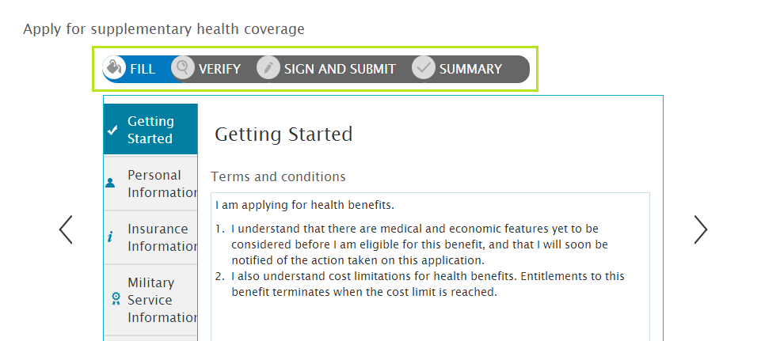

# Introduction to multi-step form sequence {#introduction-to-multi-step-form-sequence}

>[!NOTE]
>
> Adobe recommends using the modern and extensible data capture [Core Components](https://experienceleague.adobe.com/docs/experience-manager-core-components/using/adaptive-forms/introduction.html) for [creating new Adaptive Forms](/help/forms/creating-adaptive-form-core-components.md) or [adding Adaptive Forms to AEM Sites pages](/help/forms/create-or-add-an-adaptive-form-to-aem-sites-page.md). These components represent a significant advancement in Adaptive Forms creation, ensuring impressive user experiences. This article describes older approach to author Adaptive Forms using foundation components.

| Version | Article link |
| -------- | ---------------------------- |
| AEM 6.5  |    [Click here](https://experienceleague.adobe.com/docs/experience-manager-65/forms/adaptive-forms-basic-authoring/introduction-form-sequence.html)                  |
| AEM as a Cloud Service     | This article         |

Adaptive Forms enables Form Authors to create multi-step data capture experience with great ease. It comes with built-in support for creating multiple panels and associating each panel with different navigation patterns. Form Authors can group form fields in logical sections and represent a group as a panel. The overall navigation between panels is controlled using the panel layout. Authors can choose to arrange panels in different layouts, for example, placing sequentially using the Wizard layout or in an improvised manner using the Tabbed layout. For information about panel layouts, see [Layout capabilities of Adaptive Forms](layout-capabilities-adaptive-forms.md).

In a typical form filling experience, there are more steps involved than just capturing data. A complete form submission can include other steps, like signing the form digitally, verifying the information filled in the form, processing payments, and so on. It differs from case to case.

If your use case mandates a set of steps for data capturing or there are regulations that need certain steps to be followed, [!DNL Experience Manager Forms] provides a way to enforce that common structure across forms. The premeditated implementation of form structure defines the sequence of steps for a form. 

Example of a multi-step form sequence

Let us take a use case where you must create a sequence for fill, verify, sign, and confirmation steps for a form. The steps to create such a sequence is as follows:

1. Define a form template and add required panel to it. There should be one panel for each step in the sequence. However, you can include subpanels inside a panel.

   In this example, we can add the following panels:

    * **[!UICONTROL Fill]**: It contains forms fields for capturing data. Here, you can include nested subpanels to create sections for different types of information, such as personal, family, financial, and so on.   

    <!--* **[!UICONTROL Verify]**: It contains the **[!UICONTROL Verify]** component that can be used in an XFA-based Adaptive Form. It displays the information captured in the Fill panel in read-only mode for verification.-->  

    
    * **[!UICONTROL E-sign]**: It contains the **[!UICONTROL Sign]** component that can be used in an XFA-based Adaptive Form. It provides the following signing services:

        * Adobe Document Cloud eSign services
        * Scribble signature

    * **[!UICONTROL Confirmation]**: It contains the **[!UICONTROL Summary]** component that displays a message confirming the form submission after a user signs the form and reaches the Confirmation (Summary) step in the sequence. Authors can configure the text of the [!UICONTROL Summary] component, show a thank you message, show a link to the generated PDF, and so on.

1. Select the layout of the root panel as **[!UICONTROL Wizard]**.
1. Complete the remaining steps to create the form template. <!-- For more information, see [Creating a custom Adaptive Form template](custom-adaptive-forms-templates.md). -->

After you have defined the form sequence in the form template, you can use it create forms that will have the basic structure defined as the sequence in place, though you can always customize the form to suit your requirements.

## See Also {#see-also}

{{see-also}}