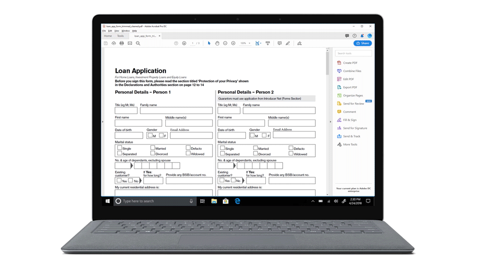
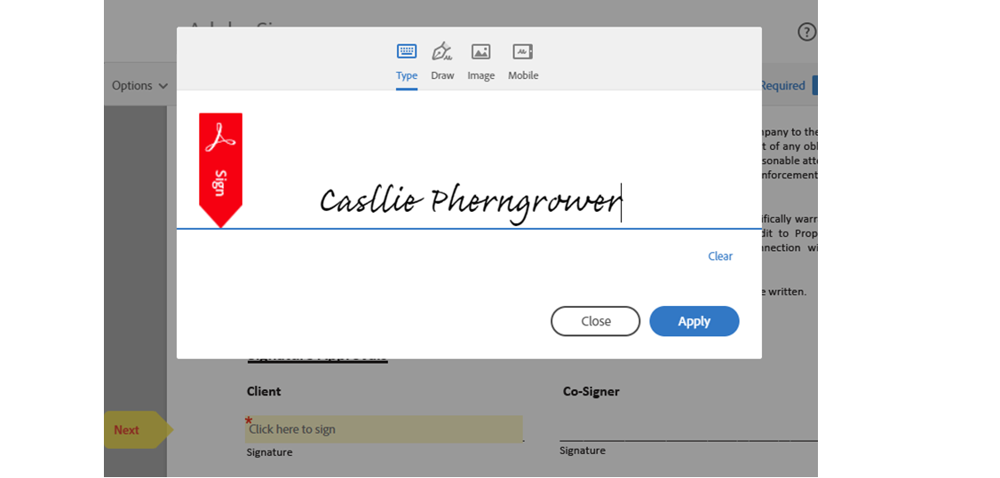
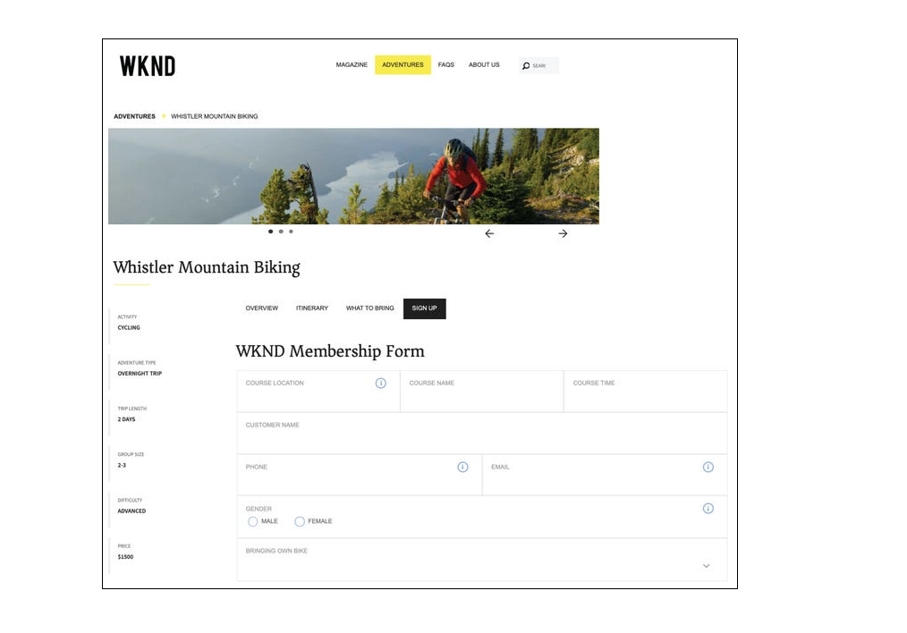
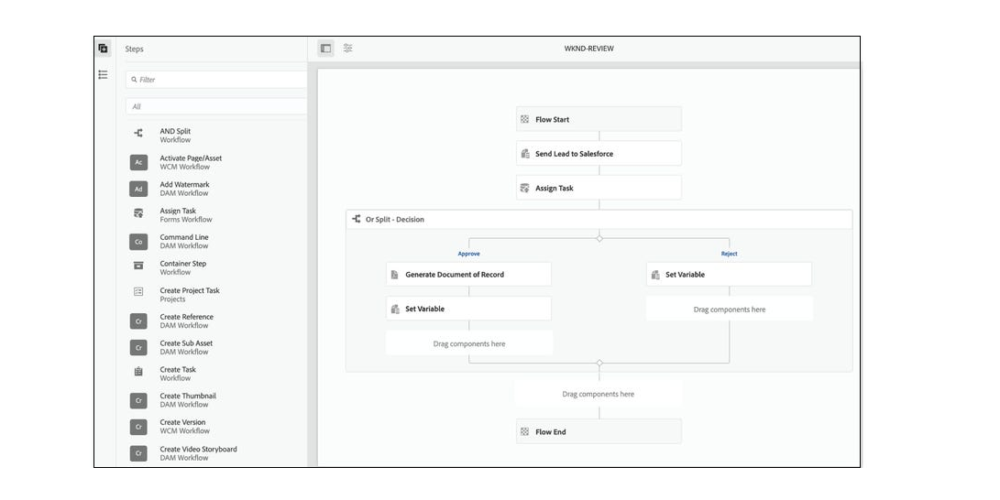
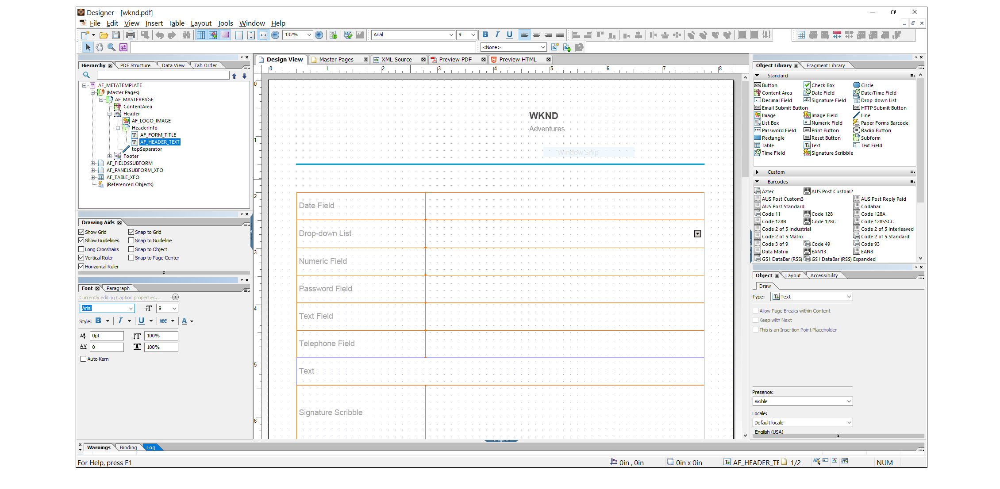
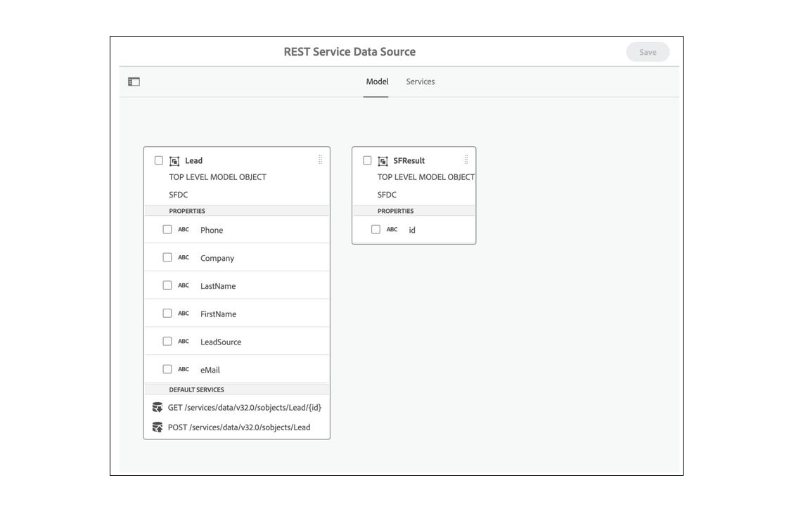
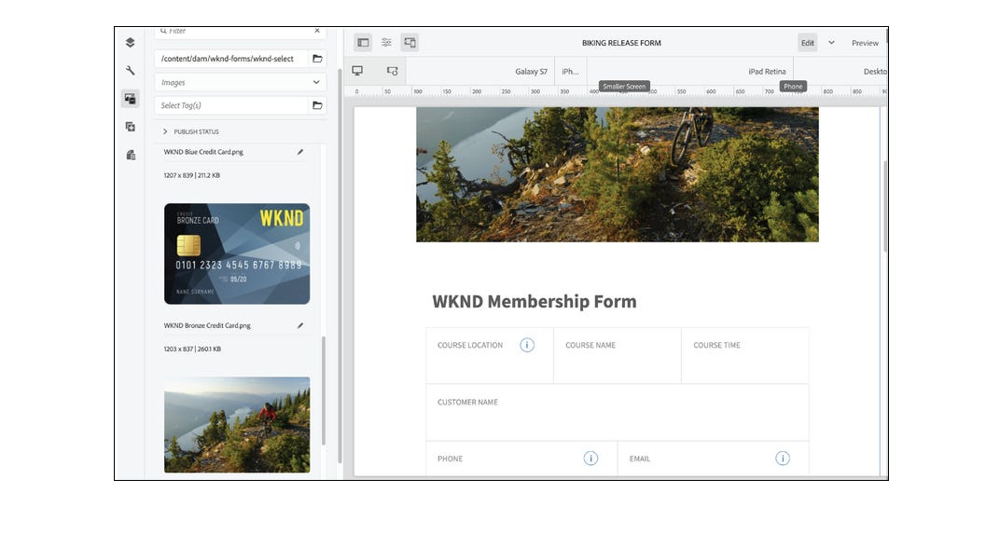

<!-- # Introduction to [!DNL AEM Forms] as a Cloud Service {#overview}

Adobe Experience Manager Forms as a Cloud Service offers a cloud-native, Platform as a Service (PaaS) solution for businesses to create, manage, publish, and update complex digital forms while integrating submitted data with back-end processes, business rules, and saving data in an external data store. The service is always current, always available, and always learning.

You can use the service to create and rollout  interactive and engaging digital forms. For example, an organization is looking to digitize their customer enrollment journey. They have multiple data sources with existing customer data, they are looking to pre-populate forms, add e-sign their forms, and archive filled forms as PDF files. Besides, the organization has multiple print forms (PDF forms), they are also looking to convert all of their print forms to digital forms.

The organization can use [!DNL AEM Forms] as a Cloud Service to create digital forms, connect forms to existing data sources, integrate forms with [!DNL Adobe Sign] to add e-signatures to forms, and generate Document of Record (DoR) to archive filled forms as PDF files. The organization can also use the service to convert their existing PDF forms to digital forms. 

An organization can sign up for [!DNL AEM Forms] as a Cloud Service and start using all these features without waiting to buy and set up a local infrastructure. The service also frees the organizations from the cycle of upgrades as it is always up to date and always offers the latest feature.  -->

# Latest innovations {#latest-innovations}

Some of the latest innovations in AEM Forms as a Cloud Service include:

| Feature| Details| 
|---|---|
|Headless Adaptive Forms | Create and manage [Headless Adaptive Forms](https://experienceleague.corp.adobe.com/docs/experience-manager-headless-adaptive-forms/using/overview.html) within the Adobe Experience Manager platform. Enable your developers to create, publish, and manage interactive forms that can be accessed and interacted with through APIs, rather than through a traditional graphical user interface.     These forms are designed to be submitted without the need for a traditional HTML form interface. In other words, they allow you to submit form data programmatically via an API or backend code with and without any visible form elements on the front end.     Headless forms are useful in various scenarios, such as when building single-page applications, progressive web apps, or mobile applications, where a traditional HTML form interface may not be necessary or practical. By allowing developers to submit form data directly through APIs or backend code, headless forms help streamline workflows and improve the overall performance of web applications.| 
|Core Components |The [Adaptive Forms Core Components](https://experienceleague.adobe.com/docs/experience-manager-core-components/using/adaptive-forms/introduction.html#features) are a set of 24 open-source, BEM-compliant components that are built on the foundation of the Adobe Experience Manager WCM Core Components. They are specifically designed to be used for creating Adaptive Forms, which are forms that adapt to the device, browser and screen size of the user.     These components can be used to create exceptional data capture and enrollment experiences by providing a wide range of form field options, including text fields, checkboxes, drop-down menus, and more. They also include features like validation, conditional logic, and responsive design, which can be used to create forms that are user-friendly and easy to use.      Additionally, as these components are open-source, developers have the ability to easily customize and extend the components to match the specific needs of their organization. And, These components are built on BEM methodology which ensures that they are scalable and maintainable. | 
|Microsoft PowerAutomate Connector | AEM Forms Power Automate Connector allows you to integrate Adobe Experience Manager (AEM) Forms with Microsoft Power Automate (previously known as Microsoft Flow). Power Automate is a cloud-based service that allows you to create automated workflows between different applications and services.      With AEM Form Power Automate Connector, you can create workflows that automatically trigger based on submission of an Adaptive Form. For example, you could create a workflow that automatically sends an email notification to a specific person when a user submits a form or create a task in Microsoft Planner when a user completes a form.       The AEM Forms Power Automate Connector  is a powerful tool that enables you to automate and integrate your Adaptive Forms with other applications and services that connect with Microsoft Power Automate, allowing you to work with a wider range of tools. You can create workflows tailored to your specific needs, with the ability to add custom actions, conditions, and triggers. In addition, Power Automate provides detailed analytics and reporting, allowing you to monitor and optimize your workflows over time. | 
|Microsoft Storage Connectors | AEM Forms Microsoft Storage Connectors for <a href="https://experienceleague.corp.adobe.com/docs/experience-manager-cloud-service/content/forms/adaptive-forms-authoring/authoring-adaptive-forms-foundation-components/configure-submit-actions-and-metadata-submission/configuring-submit-actions.html#submit-to-sharedrive">OneDrive</a>, <a href="https://experienceleague.corp.adobe.com/docs/experience-manager-cloud-service/content/forms/adaptive-forms-authoring/authoring-adaptive-forms-foundation-components/configure-submit-actions-and-metadata-submission/configuring-submit-actions.html?#submit-to-sharedrive"> SharePoint, </a> and <a href="https://experienceleague.corp.adobe.com/docs/experience-manager-cloud-service/content/forms/adaptive-forms-authoring/authoring-adaptive-forms-foundation-components/configure-submit-actions-and-metadata-submission/configuring-submit-actions.html?#submit-to-azure-blob-storage"> Azure Blob Storage </a> are connectors that allow you to integrate Adobe Experience Manager (AEM) Forms with Microsoft OneDrive and SharePoint. With this connector, you can upload data files and attachments to OneDrive and SharePoint directly from Adaptive Forms.     OneDrive and SharePoint can integrate with other business applications, such as CRM systems, accounting software, and project management tools. This enables you to streamline your business processes, reduce manual data entry, and improve overall efficiency.| 
|Wizard UI | The Adaptive Forms Wizard UI is a powerful tool for creating adaptive forms quickly and easily. Its user-friendly interface and customization options make it accessible to all users, regardless of their level of technical expertise.     Wizard UI simplifies the process of creating adaptive forms by guiding users step by step through the form creation process. The Wizard-UI is divided into multiple tabs, with each tab clearly providing options to configure an Adaptive Form. A form author progress through the tabs in a linear fashion to select options such as templates, submit actions, and data sources for form components.     The wizard interface streamlines the process of discovering all the essential options for an Adaptive Form and makes form creation easier, even for users who are not familiar with the technology.| 
|Fast Track Analytics| Form analytics can provide valuable insights into the performance of forms by measuring user engagement, optimizing conversion rates, monitoring form performance, and improving user experience.  By tracking user behavior and feedback, analytics can identify areas of the form that are causing frustration or confusion, guiding improvements to the form's design and functionality.     By using Fast Track Analytics, you can enable Forms Analytics with a single flip of button. Fast Track Analytics enable you to connect AEM Forms as a Cloud Service with Experience Platform tags and Adobe Analytics to  capture and track performance metrics for your published forms.         Forms as a Cloud Service provides an Adobe Analytics report OOTB. It helps you easily understand performance of your forms. The form-level metrics provide you an insight into how the form is performing on multiple key performance indicators (KPIs) like, renditions, visitors, submissions, Average fill time.     It also provides details on average number of times users accessed the in-context help for the fields in the panel to help you aceatain the fields that make users stop and seek information before providing information. You can further simplify such fields or help content to improve conversions.| 

<!-- 

# Key features and capabilities {#key-features}

[!DNL AEM Forms] as a Cloud Service provides several cloud-native capabilities such as a cloud-native architecture, auto-scaling, zero downtime for upgrades, a CDN (Content Delivery Network), cloud-native development environment, and ability to self-Service the environments via Cloud Manager. You can use the service to: 

* [Create Adaptive Forms](creating-adaptive-form.md#strong-create-an-adaptive-form-strong) that automatically render for a user's device and browser.

    

* [Create pixel-perfect PDF forms](use-forms-designer.md#create-an-adaptive-form) that look almost like paper.

* Use [Automated Forms Conversion service](https://experienceleague.adobe.com/docs/aem-forms-automated-conversion-service/using/introduction.html) to convert a PDF Form to an Adaptive Form. It helps you accelerate digitization and modernization of data capture experiences of your organization.

    

* [Create business processes](aem-forms-workflow-step-reference.md#create-form-centric-workflows). For example, You can create and trigger an approval and rejection workflow on submission of an Adaptive Form.

In addition to above [!DNL AEM Forms] as a Cloud Service offers the following features and capabilities:

* An easy-to-use graphical user interface to let business users easily import, manage, preview, and publish forms
* A responsive forms directory with powerful search features using keywords, tags, and metadata
* Dynamic detection of a user's device and location to render the form appropriately across web and mobile channels
* [Integration with Adobe Sign](adobe-sign-integration-adaptive-forms.md) services or Scribble to electronically sign documents containing confidential information
* Ability to [connect the service to various types of data sources](data-integration.md#create-an-adaptive-form) to send and retrieve data. The service supports sending and retrieving data from RESTful web services, SOAP-based web services, and OData enabled services.
* Integration with AEM Sites. It allows to embed an adaptive form in an AEM Sites page. You can also integrate an adaptive form to any webpage. 
* Ability to create a Document of Record (DoR) to keep a record of the information that you provide and submit in an Adaptive Form so that you can refer to it later. A DoR is a PDF version of a form. It includes both a template and data. The service provides a default DoR template and tools to develop a custom template.
* Ability to create Adaptive Forms to produce schema-compliant data. It helps you submit captured data to existing processes and data sources without any or minimal modifications.
* Ability to create a prefill service to fill a form with existing customer data based on a criteria. It helps fasten the form filling process and reduce the abandon rate.

<!-- 

## Enterprise-class forms {#enterprise-class-forms}

You can create enterprise class forms (Adaptive Forms) and deliver beautiful, interactive, responsive, and personalized experiences to your customers. These forms change behavior and appearance based on the underlying device. You can also use themes and templates with Adaptive Forms to mandate a uniform structure and appearance for all the forms of an organization or a department.

## Automatic conversion of PDF forms to Adaptive Forms {#automatic-conversion-of-pdf-forms-to-adaptive-forms}

You can use Automated Forms Conversion service to convert a PDF Form to an Adaptive Form. It helps you accelerate digitization and modernization of data capture experiences of your organization.

## Data Integration {#data-integration}

You can connect the service to various types of data sources to send and retrieve data. The service supports sending and retrieving data from RESTful web services, SOAP-based web services, and OData enabled services.

## Integration with [!DNL Adobe Sign] {#integration-with-adobe-sign}

 You can integrate the service with [!DNL Adobe Sign] and add [!DNL Adobe Sign] fields to an Adaptive Form. It allows your users to e-sign an Adaptive Form and use [!DNL Adobe Sign] with AEM Workflows. You can use AEM Workflows to develop a business logic and send forms and documents to recipients for signatures based on the business logic.

## Integration with [!DNL AEM Sites] {#integration-with-aem-sites}

You can embed an adaptive form in an AEM Sites or an external webpage. The service provides a component out of the box to integrate an adaptive forms to an AEM Sites page.

## Business Processes Automation {#bpa}

You can use AEM Workflows to create business processes and automate operations. For example, You can create and trigger an approval and rejection workflow on submission of an Adaptive Form. 

## Document of Record {#dor}

You can create a Document of Record (DoR) to keep a record of the information that you provide and submit in an Adaptive Form so that you can refer to it later. A DoR is a PDF version of a form. It includes both a template and data. The service provides a default DoR template and tools to develop a custom template.

## Rule editor {#rule-editor}

Rule editor empowers you to build dynamism and interactivity to Adaptive Forms. These rules define actions to trigger on form objects based on preset conditions, user inputs, and user actions on the form. It helps  streamline the form filling experience while ensuring accuracy and speed.
  

## WYSIWYG editors {#wysiwyg-editor} 

The service provides several WYSIWYG editors: Adaptive Forms editor, Theme editor, and Template editor. These help you create and edit forms and related assets in WYSIWYG manner. The editors also provide out-of-the-box options to simulate views for popular mobile devices, tablets, and desktop screen configurations.

## Schema-compliant data {#schema-complaint-data}

You can create Adaptive Forms to produce schema-compliant data. It helps you submit captured data to existing processes and data sources without any or minimal modifications.

## Prefill a form

You can create a prefill service to fill a form with existing customer data based on a criteria. It helps fasten the form filling process and reduce the abandon rate.

## Submit Actions

A Submit Action allows you to persist and process captured data. The service provides several Submit Actions out-of-the-box. You can use these Submit Actions to send submitted data to a REST endpoint, database, or an AEM Workflow. You can also email submitted data along with attachments and Document of Record(DoR). You can also develop a custom Submit Action to perform an action specific to your business.

* **Emulators:** You can view an Adaptive Form in an in-built emulator. It helps you simulate how an Adaptive Form appears on different devices to an end user. It provides out-of-the-box options to simulate views for popular mobile devices, tablets, and desktop screen configurations. 

In addition to standard [!DNL AEM Forms] features, [!DNL AEM Forms] as a Cloud Service provides several cloud-native capabilities such as a cloud-native architecture, auto-scaling, zero downtime for upgrades, a CDN (Content Delivery Network), cloud-native development environment, and ability to self-Service the environments via Cloud Manager. -->
