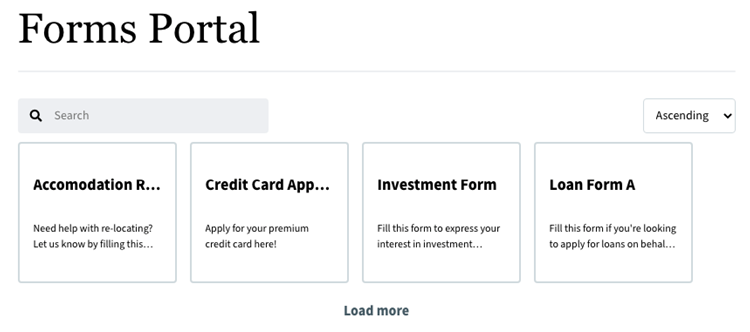
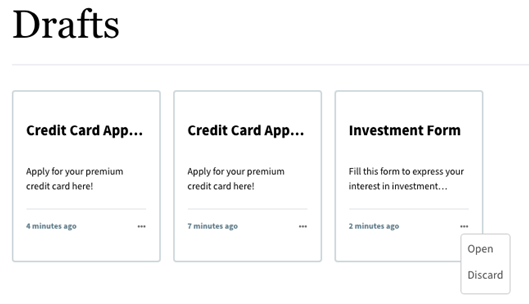
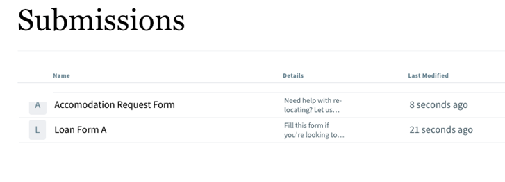
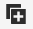

# List forms on the Sites page

Imagine a user visiting the bank’s website in search of an account opening form. The bank uses the Forms Portal component to help users quickly find the form by entering specific keywords or filtering by categories such as 'New Accounts' or 'Personal Banking' and allows users to easily locate the desired form without having to scroll through lengthy lists.

The **Search & Lister** component of the Forms Portal allows you to display and list forms on a Sites page. Users can configure and present a comprehensive list of forms based on specific criteria to meet organizational requirements. Anonymous users can visit the Sites page to view and browse the available forms. The listed forms can be sorted in ascending or descending order using the **Sort By** drop-down option located in the upper-right corner of the screen.



## Pre-requisite

Before exploring the various capabilities of a Forms Portal component, ensure that Core Components are enabled for your environment. For detailed instructions on how to enable Core Components for your environment, [click here](/help/forms/enable-adaptive-forms-core-components.md).

<!--
## Enable Forms Portal components for your existing environment

To enable out-of-the-box Forms Portal components on existing AEM Forms as a Cloud Service, perform the following steps:

1. **Clone Cloud Manager Git repository on your local development instance:**  Your Cloud Manager Git repository contains a default AEM project. It is based on [AEM Archetype](https://github.com/adobe/aem-project-archetype/). Clone your Cloud Manager Git Repository using Self-Service Git Account Management from Cloud Manager UI to bring the project on your local development environment. For details on accessing the repository, see [Accessing Repositories](https://experienceleague.adobe.com/docs/experience-manager-cloud-manager/using/managing-code/accessing-repos.html).  

1. **Create [!DNL Experience Manager Forms] as a [Cloud Service] project:** Create [!DNL Experience Manager Forms] as a [Cloud Service] project based on [AEM Archetype 50](https://github.com/adobe/aem-project-archetype/releases/tag/aem-project-archetype-50) or later. The archetype help developers easily start developing for [!DNL AEM Forms] as a Cloud Service. It also includes some sample themes and templates to help you started quickly.

    To create [!DNL Experience Manager Forms] as a Cloud Service project, open the command prompt and run the below command. To include [!DNL Forms] specific configurations, themes, and templates, set `includeForms=y`.  

    ```shell
    mvn -B archetype:generate -DarchetypeGroupId=com.adobe.aem -DarchetypeArtifactId=aem-project-archetype -DarchetypeVersion=30 -DaemVersion="cloud" -DappTitle="My Site" -DappId="mysite" -DgroupId="com.mysite" -DincludeForms="y"
    ```

    Also, change `appTitle`, `appId`, and `groupId`, in the above command to reflect your environment.

    After the project is ready, update the `<core.forms.components.version>x.y.z</core.forms.components.version>` property in the top-level `pom.xml` of the Archetype project to reflect the latest version of [core-forms-components](https://github.com/adobe/aem-core-forms-components) in your `AEM Archetype` project. 
 
1. **Deploy the project to your local development environment:** You can use the following command to deploy to your local development environment

    `mvn -PautoInstallPackage clean install`

    For the complete list of commands, see [Building and Installing](https://experienceleague.adobe.com/docs/experience-manager-core-components/using/developing/archetype/using.html?lang=en#building-and-installing)

1. [Deploy the archetype to your [!DNL AEM Forms] as a Cloud Service environment](https://experienceleague.adobe.com/docs/experience-manager-cloud-service/content/implementing/developing/aem-project-content-package-structure.html#embeddeds). -->

After deploying the latest Core Components to your environment, the Forms Portal components become accessible in your authoring environment.

## List forms on the Sites Page

To add the **Search & Lister** portal component to your Sites page, perform the following steps:

1. Open the AEM Sites page in an **Edit** mode. 
1. Go to the **[!UICONTROL Page Information]** > **[!UICONTROL Edit Template]**
    

1. Click the **[!UICONTROL Policy]** and select the **[!UICONTROL Search & Lister]**  checkbox under the **[AEM Archetype Project Name] - Forms and Communications Portal**.

    

1. Click **[!UICONTROL Done]**.
1. Now, re-open the AEM Sites page in the authoring mode.
1. Locate the section within the page editor that allows you to add the Forms Portal component. 

1. Click the **Add** icon. The icon is a plus sign (+) that signifies the option to add new components.
    
    Clicking the **Add** icon displays an **Insert New Component** dialog box that displays various components for insertion.

    >[!NOTE]
    >
    > Alternatively, you can also drag and drop the component.

1. Browse the available components in the dialog box and select the desired component from the list. For example, select the **Search and Lister** component from the list to add the **Search & Lister** Forms Portal component. 

    

Now, configure the properties of the **Search and Lister** component.

## Understand the properties of the Search and Lister component

You can easily customize **Search and Lister** component properties using the Configure Dialog for a seamless user experience. To configure, select the component and then select the . The **[!UICONTROL Search and Lister]** dialog opens.

### Display tab


1. In **[!UICONTROL Title]**, specify the title for the Search & Lister component. An indicative title enables the users to perform a quick search across the list of forms.
1. From the **[!UICONTROL Layout]** list, select the layout to represent the forms in the card or list format.
1. Select **[!UICONTROL Hide Search]** and **[!UICONTROL Hide Sorting]** to hide the search and sort by features.
1. In **[!UICONTROL Tooltip]**, provide the tooltip that appears when you hover over the component. 

### Asset tab


1. In the **[!UICONTROL Asset Folder]** tab, specify the location from where the forms are pulled and listed on the page. 
1. Using the **[!UICONTROL Add another location]**, you can configure multiple folder locations.

### Results tab


In the **[!UICONTROL Results]** tab, configure the maximum number of forms to display per page. The default is eight forms per page.

## View forms on the Sites page using the Search & Lister component

To view the list of forms, use the **Search & Lister** Forms Portal component. Preview the AEM Sites page to see the list of forms from the **Assets** folder displayed on the screen. You can also search for a specific form using the search bar.


<!--
## Configure Azure Storage for Adaptive Forms {#configure-azure-storage-adaptive-forms}

[[!DNL Experience Manager Forms] Data Integration](data-integration.md) provides [!DNL Azure] storage configuration to integrate forms with [!DNL Azure] storage services. The Form Data Model (FDM) can be used to create Adaptive Forms that interact with [!DNL Azure] server to enable business workflows.

### Create Azure Storage Configuration {#create-azure-storage-configuration}

Before executing these steps, ensure that you have an Azure storage account and an access key to authorize access to the [!DNL Azure] storage account.

1. Navigate to **[!UICONTROL Tools]** &gt; **[!UICONTROL Cloud Services]** &gt; **[!UICONTROL Azure Storage]**.
1. Select a folder to create the configuration and select **[!UICONTROL Create]**.
1. Specify a title for the configuration in the **[!UICONTROL Title]** field.
1. Specify the name of the [!DNL Azure] storage account in the **[!UICONTROL Azure Storage Account]** field.

### Configure Unified Storage Connector for Forms Portal {#configure-usc-forms-portal}

Perform the following steps to configure Unified Storage Connector for AEM Workflows:

1. Navigate to **[!UICONTROL Tools]** &gt; **[!UICONTROL Forms]** &gt; **[!UICONTROL Unified Storage Connector]**.
1. In the **[!UICONTROL Forms Portal]** section, select **[!UICONTROL Azure]** from the **[!UICONTROL Storage]** drop-down list.
1. Specify the [configuration path for the Azure storage configuration](#create-azure-storage-configuration) in the **[!UICONTROL Storage Configuration Path]** field.
1. Select **[!UICONTROL Publish]** and then select **[!UICONTROL Save]** to save the configuration.

## Enable Forms Portal Components {#enable-forms-portal-components}

To use any core component (including the out-of-the-box portal components) in an Adobe Experience Manager (AEM) site, you must create a proxy component and enable it for your site. For creating a proxy component and enabling portal components, see [Using Core Components](https://experienceleague.adobe.com/docs/experience-manager-core-components/using/get-started/using.html?lang=en#create-proxy-components). 

Once a portal component is enabled, you can use it in the author instance of your sites page.

## Add and Configure Forms Portal Components {#configure-forms-portal-components}

You can create and customize Forms Portal on websites authored using AEM by adding and configuring the portal components. Ensure that the [components are enabled](#enable-forms-portal-components) before using them in the Forms Portal.

To add a component, either drag and drop the component from the Components pane to the layout container on the page, or select the add icon on the layout container and add the component from the [!UICONTROL Insert New Component] dialog.

### Configure Drafts & Submissions Component {#configure-drafts-submissions-component}

The Drafts & Submissions component displays forms that are saved as draft for completing later and submitted forms. To configure, select the component and then select the . In the [!UICONTROL Drafts and Submissions] dialog, specify the title to indicate the form listing as draft or submitted forms. Also select whether the component should list draft forms or submitted forms in card or list format.





### Configure Search & Lister Component {#configure-search-lister-component}

The Search & Lister component is used to list adaptive forms on a page and to implement search on the listed forms. 


To configure, select the component and then select the . The [!UICONTROL Search and Lister] dialog opens.

1. In the [!UICONTROL Display] tab, configure the following:
    * In **[!UICONTROL Title]**, specify the title for the Search & Lister component. An indicative title enables the users perform quick search across the list of forms.
    * From the **[!UICONTROL Layout]** list, select the layout to represent the forms in card or list format.
    * Select **[!UICONTROL Hide Search]** and **[!UICONTROL Hide Sorting]** to hide the search and sort by features.
    * In **[!UICONTROL Tooltip]**, provide the tooltip that appears when you hover over the component. 
1. In the [!UICONTROL Asset Folder] tab, specify the location from where the forms are pulled and listed on the page. You can configure multiple folder locations.
1. In the [!UICONTROL Results] tab, configure the maximum number of forms to display per page. The default is eight forms per page.

### Configure Link Component {#configure-link-component}

The link component enables you to provide links to an adaptive form on the page. To configure, select the component and then select the . The [!UICONTROL Edit Link Component] dialog opens.

1. In the [!UICONTROL Display] tab, provide the link caption and tooltip to ease identification of the forms represented by the link.
1. In the [!UICONTROL Asset Info] tab, specify the repository path where the asset is stored. 
1. In the [!UICONTROL Query Params] tab, specify the additional parameters in the key-value pair format. When the link is clicked, these additional parameters and passed along with the form.

## Configure Asynchronous Form Submission Using Adobe Sign {#configure-asynchronous-form-submission-using-adobe-sign}

You can configure to submit an adaptive form only when all the recipients have completed the signing ceremony. Follow the steps below to configure the setting using Adobe Sign.

1. In the author instance, open an Adaptive Form in the edit mode.
1. From the left pane, select the Properties icon and expand the **[!UICONTROL ELECTRONIC SIGNTATURE]** option.
1. Select **[!UICONTROL Enable Adobe Sign]**. Various configuration options display. 
1. In the [!UICONTROL Submit the form] section, select the **[!UICONTROL after every recipient completes signing ceremony]** option to configure the Submit Form action, where the form is first sent to all the recipients for signing. Once all the recipients have signed the form, only then the form is submitted. 

## Save Adaptive Forms As Drafts {#save-adaptive-forms-as-drafts}

You can save forms as Drafts for completing them later. There are two ways in which a form is saved as a draft:

* Create a "Save Form" rule on a form component, for example, a button. On clicking the button, the rule triggers and the form are saved a draft.
* Enable Auto-Save feature, which saves the form as per the specified event or after a configured interval of time.

### Create Rules to Save an Adaptive Form as Draft {#rule-to-save-adaptive-form-as-draft}

To create a "Save Form" rule on a form component, for example, a button, follow the steps below:

1. In the author instance, open an Adaptive Form in edit mode.
1. From the left pane, select  and drag the [!UICONTROL Button] component to the form.
1. Select the [!UICONTROL Button] component and then select the . 
1. Select the [!UICONTROL Edit Rules] icon to open the Rule Editor. 
1. Select **[!UICONTROL Create]** to configure and create the rule.
1. In the [!UICONTROL When] section, select "is clicked" and in the [!UICONTROL Then] section, select the "Save Form" options.
1. Select **[!UICONTROL Done]** to save the rule.

### Enable Auto-save {#enable-auto-save}

You can configure the auto-save feature for an adaptive form as follows:

1. In the author instance, open an Adaptive Form in edit mode.
1. From the left pane, select the  and expand the [!UICONTROL AUTO-SAVE] option.
1. Select the **[!UICONTROL Enable]** check box to enable auto-save of the form. You can configure the following:
* By default, the [!UICONTROL Adaptive Form Event] is set to "true", which implies that the form is auto-saved after every event.
* In [!UICONTROL Trigger], configure to trigger auto-save based on the occurrence of an event or after a specific interval of time.
-->


## Next Steps

In the next article, let us learn [how to save forms as drafts and list them on a Sites page using the Drafts & Submissions Forms Portal component](/help/forms/save-core-component-based-form-as-draft.md).

## Related articles

{{forms-portal-see-also}}

## See Also {#see-also}

{{see-also}}
