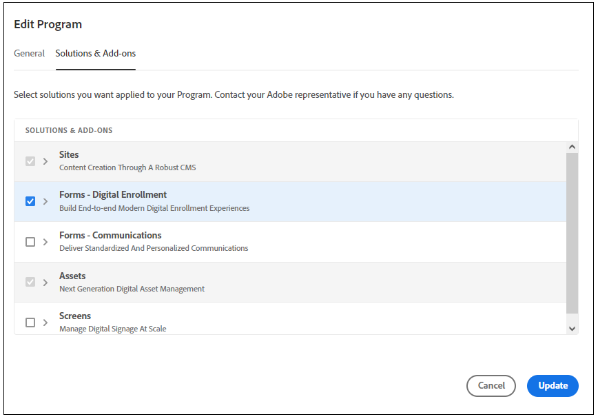

# Migrate from an [!DNL AEM Forms] (On-Premise and AMS environments) to [!DNL AEM Forms] as a Cloud Service  {#Harden-your-AEM-Forms-as-a-Cloud-Service-environment}

| Version | Article link |
| -------- | ---------------------------- |
| AEM 6.5  |    [Click here](https://experienceleague.adobe.com/docs/experience-manager-65/forms/upgrade-aem-forms/upgrade.html)                  |
| AEM as a Cloud Service     | This article         |

You can migrate or upgrade your Adaptive Forms, themes, templates, and cloud configurations from <!-- AEM 6.3 Forms AEM 6.4 Forms on OSGi and --> AEM 6.5 Forms on OSGi to [!DNL AEM] as a Cloud Service. Before migrating these assets, use the Migration Utility to convert the format used in the earlier versions to the format used in [!DNL AEM] as a Cloud Service.
Let's get started with the migration journey to AEM as a Cloud Service | Adobe Experience Manager. When you run Migration Utility, the following assets are updated:

* Custom components for Adaptive Forms
* Adaptive Forms templates and themes
* Cloud configurations
* Code editor scripts are converted to reusable functions and applied to visual rules.

## Considerations to migrate to Forms as a Cloud Service {#consideration}

To migrate from AEM 6.5 Forms to AEM Cloud Service, it is important to take into account the following points:

*   The service helps migrate content from only [!DNL AEM Forms] on OSGi environments. Migrating content from [!DNL AEM Forms] on JEE to a Cloud Service environment is not supported.

*   (Only for versions previous to AEM 6.5 Forms) Adaptive Forms based on out-of-the-box templates and themes available in AEM 6.3 Forms or previous version are not supported on [!DNL AEM Forms] as a Cloud Service.

*   Adobe Experience Manager Forms as a Cloud Service brings some notable changes to existing features in comparison to Adobe Experience Manager 6.5 Forms (On-Premise and Adobe-Managed Service) environments. Before proceeding with migrating to the service, [learn about these noteable changes](notable-changes.md) and the [feature level differences](https://experienceleague.adobe.com/docs/experience-manager-cloud-service/content/migration-journey/cloud-migration/best-practices-analyzer/using-best-practices-analyzer.html?lang=en#viewing-report) to decide to migrate based on features your organization requires. 

 

<!-- 
## Difference with AEM 6.5 Forms 

| Feature         | Difference with AEM 6.5 Forms    |
|--------------|-----------|
| HTML5 Forms (Mobile Forms)     | The service does not support HTML5 Forms (Mobile Forms). If you render your XDP-based forms as HTML5 Forms, you can continue using the feature on AEM 6.5 Forms. |
| Adaptive Forms     | <li><b>XSD-Based Adaptive Forms:</b> The service does not support HTML5 Forms (Mobile Forms). If you render your XDP-based forms as HTML5 Forms, you can continue using the feature on AEM 6.5 Forms. </li> <li><b> Adaptive Form templates:</b> Use build pipeline and corresponding Git repository of your program to import existing Adaptive Form templates. </li><li><b>Rule editor:</b> AEM Forms as a Cloud Service provides a hardened [Rule editor](rule-editor.md#visual-rule-editor). The code editor is not available on Forms as a Cloud Service. The migration utility helps you migrate your forms that have custom rules (created in code editor). The utility converts such rules into custom functions supported on Forms as a Cloud Service. You can use the reusable functions with Rule editor to continue obtaining results obtained with rule scripts  The `onSubmitError` or `onSubmitSuccess` functions are now available as actions the Rule Editor. </li> <li><b>Drafts and submissions:</b> The service does not retain metadata for drafts and submitted Adaptive Forms. </li> <li><b> Prefill Service:</b> By default, the prefill service merges data with an Adaptive Form at client as opposed to merging data on Server in AEM 6.5 Forms. The feature helps improve the time required to prefill an Adaptive Form. You can always configure to run the merge action on the Adobe Experience Manager Forms Server. </li><li><b>Submit actions:</b> The **Email as PDF** action is not available. The **Email** submit action provide options to send attachments and attach Document of Record (DoR) with email. </li>|
| Form Data Model | <li>Forms data model supports only HTTP and HTTPs endpoints to submit data. </li><li>Forms as a Cloud Service allows to use Microsoft Azure Blob, Microsoft Sharepoint, Microsoft OneDrive, and services supporting general CRUD (Create, Read, Update, and Delete) operations as data stores. The service does not support JDBC connector, Mutual SSL for Rest connector, and x509 certificate-based authentication for SOAP data sources. </li>|
| Automated Forms Conversion Service     | The service does not provide meta-model for Automated Forms Conversion Service. You can [download it from Automated Forms Conversion Service documentation](https://experienceleague.adobe.com/docs/aem-forms-automated-conversion-service/using/extending-the-default-meta-model.html?lang=en#default-meta-model).|
|Configurations|<li>Email support only HTTP and HTTPs protocols, by default. [Contact the support team](https://experienceleague.adobe.com/docs/experience-manager-cloud-service/implementing/developing/development-guidelines.html#sending-email) to enable ports for sending emails and to enable SMTP protocol for your environment. </li> <li>If you use custom bundles, recompile your code with latest version of adobe-aemfd-docmanager before using these bundles with Forms as a Cloud Service.</li> |
| Document Manipulation APIs (Assembler Service)| The service does not support operations dependent on other services or applications: <li>Conversion of documents in a non-PDF format to a PDF format is not supported. For example, Microsoft Word to PDF, Microsoft Excel to PDF, and HTML to PDF are not supported</li><li>Adobe Distiller-based conversions are not supported. For example, PostScript(PS) to PDF</li><li>Forms Service-based conversions are not supported. For example, XDP to PDF Forms.</li><li>The service does not support converting a Signed PDF or Transparent PDF to another PDF format.</li>| -->

## Prerequisites {#prerequisites}

To ensure a smooth transition from AEM Forms 6.5 to AEM as a Cloud Service environment, it is important to consider the following prerequisites:

* Enable [Forms - Digital Enrollment](https://experienceleague.adobe.com/docs/experience-manager-cloud-manager/using/getting-started/setting-up-program.html?#editing-program) option on for your Forms Cloud Service program and [run the pipeline](https://experienceleague.adobe.com/docs/experience-manager-cloud-manager/using/how-to-use/deploying-code.html). 

    

* In a Cloud Service environment, the Migration Utility works in conjunction with the Content Transfer Tool. The Migration Utility makes [!DNL AEM Forms] assets compatible with Cloud Service and the content transfer tool migrates the content from your [!DNL AEM Forms] environment to an [!DNL AEM] as a Cloud Service environment. Before using the Migration Utility, learn the process of [moving to AEM as a Cloud Service](https://experienceleague.adobe.com/docs/experience-manager-cloud-service/moving/home.html). The process uses the following tool:
  * [Content Transfer Tool](https://experienceleague.adobe.com/docs/experience-manager-cloud-service/moving/cloud-migration/content-transfer-tool/overview-content-transfer-tool.html?#cloud-migration): The Content Transfer Tool helps you prepare and transfer content from existing environment to a Cloud Service environment. It helps users to easily upgrade from AEM Forms to cloud environment.   
* Accounts with administrator privileges on [!DNL AEM Forms] as a Cloud Service and your local [!DNL AEM Forms] environment.
* Download and install Best Practice Analyzer, Content Transfer Tool, and [!DNL AEM Forms] Migration Utility from [Software Distribution Portal.](https://experience.adobe.com/#/downloads/content/software-distribution/en/aemcloud.html)

* Run the [Best Practices Analyzer](https://experienceleague.adobe.com/docs/experience-manager-cloud-service/moving/cloud-migration/best-practices-analyzer/overview-best-practices-analyzer.html?lang=en#cloud-migration) tool and fix the reported issue. For the possible issues related to migrating from Adobe Experience Manager Forms to Adobe Experience Manager Forms as a Cloud Service, see [AEM Pattern Detection for Forms as a Cloud Service](https://experienceleague.adobe.com/docs/experience-manager-cloud-service/content/migration-journey/cloud-migration/best-practices-analyzer/using-best-practices-analyzer.html?lang=en#viewing-report).  

<!-- * Download the latest [compatibility package](https://experienceleague.adobe.com/docs/experience-manager-release-information/aem-release-updates/forms-updates/aem-forms-releases.html?lang=en#aem-65-forms-releases) for your [!DNL AEM Forms] version. -->

## Migrate [!DNL AEM 6.5 Forms] assets to AEM Cloud Service {#use-the-migration-utility}

Perform the following steps to make your [!DNL AEM Forms] assets compatible with Cloud Service and transfer them to an [!DNL AEM] as a Cloud Service environment.

1. Create a [clone](https://experienceleaguecommunities.adobe.com/t5/adobe-experience-manager/correct-method-to-clone-the-aem-environment/qaq-p/363487) of your existing [!DNL AEM Forms] environment.

    >[!NOTE]
    >
    > When you migrate from 6.5 to cloud service, it is recommended to use a cloned environment to run the Content Transfer Tool and the Migration Utility. Content Transfer Tool and Migration Utility make some changes to the content and assets. So, do not run the Content Transfer Tool or the Migration Utility on a production environment.

1. Log in to your cloned environment with administrative privileges.

1. Download and install the [Content Transfer Tool](https://experienceleague.adobe.com/docs/experience-manager-cloud-service/moving/cloud-migration/content-transfer-tool/overview-content-transfer-tool.html?#cloud-migration) and [!DNL AEM Forms] as a Cloud Service Migration Utility from [Software Distribution Portal](https://experience.adobe.com/#/downloads/content/software-distribution/en/aemcloud.html) on the cloned environment. You can use AEM Package Manager to install the tool and the utility.

1. Navigate to **[!UICONTROL Tools]** > **[!UICONTROL Operations]** > **[!UICONTROL Content Migration]**.

1. Open the **[!UICONTROL Prepare Forms for migration]** card. The browser displays five options:
    * **[!UICONTROL AEM Forms Assets Migration]**
    * **[!UICONTROL Adaptive Forms Custom Components Migration]**
    * **[!UICONTROL Adaptive Forms Templates Migration]**
    * **[!UICONTROL AEM Forms Cloud Configurations Migration]**
    * **[!UICONTROL Code Editor Script Migration]**

1. Use the option one-after another to make your [!DNL AEM Forms] assets compatible with [!DNL AEM] as a Cloud Service:

    1. Select **[!UICONTROL AEM Forms Assets Migration]**, and in the next screen, select **[!UICONTROL Start Migration]**. It makes Adaptive Forms and themes on your [!DNL AEM Forms] environment compatible with [!DNL AEM] as a Cloud Service .

    1. Select **[!UICONTROL Adaptive Forms Custom Components Migration]** and in the Custom Components Migration page, select **[!UICONTROL Start Migration]**. It makes any custom component developed for Adaptive Forms and component overlays on your [!DNL AEM Forms] environment compatible with [!DNL AEM] as a Cloud Service .

    1. Select **[!UICONTROL Adaptive Forms Template Migration]** and in the Custom Components Migration page, select **[!UICONTROL Start Migration]**. It makes Adaptive Form templates at `/apps` or `/conf` and created using AEM Template Editor compatible with [!DNL AEM] as a Cloud Service .

    1. Select **[!UICONTROL AEM Forms Cloud Configurations Migration]** and then on the Configuration Migration page, select **[!UICONTROL Start Migration]**. It updates and moves the following Cloud Services to a new location:

        * Form Data Model Cloud Service
        * Google reCAPTCHA Cloud Service
        * [!DNL Adobe Sign] Cloud Service
        * Adobe Fonts Cloud Service

    1. Select **[!UICONTROL Code Editor Script Migration]**, specify a location to save reusable functions, and select **[!UICONTROL Start Migration].

    The Cloud Service does not support rule editor scripts. The **[!UICONTROL Code editor script migration]** tool converts all rule scripts on your environment to reusable functions and applies the reusable functions to visual editor at appropriate location. These reusable functions are saved in the form of client libraries and help you keep existing functionality intact. The tool automatically applies the generated reusable functions to corresponding Adaptive Forms.

    AEM Form migration to Cloud Service, use the [Package Manager](https://experienceleague.adobe.com/docs/experience-manager-65/administering/contentmanagement/package-manager.html?lang=en#contentmanagement) to export the reusable functions (Client Libraries) to a package.

1. [Deploy](https://experienceleague.adobe.com/docs/experience-manager-cloud-service/implementing/deploying/overview.html?lang=en#deploying-content-packages-via-cloud-manager-and-package-manager) the reusable functions (Client Libraries) package, [custom code, components, configurations](https://experienceleague.adobe.com/docs/experience-manager-learn/cloud-service/cloud-manager/devops/deploy-code.html#cloud-manager), custom locale-specific libraries to your [!DNL AEM] as a Cloud Service environment.

    <!-- 1. Install the latest [Compatibility Package](https://experienceleague.adobe.com/docs/experience-manager-cloud-service/moving/cloud-migration/content-transfer-tool/overview-content-transfer-tool.html?#cloud-migration) to your cloned [!DNL AEM Forms] environment. -->

1. Run the [Content Transfer Tool](https://experienceleague.adobe.com/docs/experience-manager-cloud-service/moving/cloud-migration/content-transfer-tool/overview-content-transfer-tool.html?#cloud-migration). While specifying parameters on the **[!UICONTROL Create Migration Set]** screen, specify the path of Adaptive Forms, themes, templates, Form Data Model (FDM), Cloud Services, Custom Components and other AEM Forms-specific assets to the **[!UICONTROL Paths to be included]** option. It adds specified [!DNL AEM Forms] assets to migration set. 

## Paths of various AEM Forms-specific assets 

When you migrate from AEM Forms 6.5 to the cloud service, you can locate the AEM Forms-specific assets at:

* **Adaptive Forms**: You can find Adaptive forms at `/content/dam/formsanddocuments/`and `/content/forms/af`. For example, for an adaptive form titled WKND Registration add paths `/content/dam/formsanddocuments/wknd-registration` and `/content/forms/af/wknd-registration`. 
* **Form Data Model**: You can find all the Form Data Model (FDM) at `/content/dam/formsanddocuments-fdm`. For example, `/content/dam/formsanddocuments-fdm/ms-dynamics-fdm`.

* **Client libraries**: The default path of client libraries is `/etc/clientlibs/fd/theme`. 

* **Adaptive Form templates**: The default path of templates is `/conf/<template folder>`. For example, for a template titled basic add path `/conf/ReferenceEditableTemplates/settings/wcm/templates/basic`.

* **Adaptive Form themes and Client libraries**: The default path of themes is ` /content/dam/formsanddocuments-themes/` and default path of client libraries is `/etc/clientlibs/fd/theme`. For example, for a template titled WKND Theme add path ` /content/dam/formsanddocuments-themes/wkndtheme` and client libraries for the theme at `/etc/clientlibs/reference-themes/wkndtheme-3-0`. You can also have themes and client libraries at other custom paths.

* **Cloud Configurations**: You can find Cloud Configurations at `/conf/`. For example, Form Data Model (FDM) cloud configuration is at `/conf/global/settings/cloudconfigs/fdm`.

* **Workflow Model**: You can find AEM Workflow Models at `/conf/global/settings/workflow/models/`. For example, for an workflow model titled WKND Registration add path `/conf/global/settings/workflow/models/wknd-registration`

You can add top level folder paths listed below or specific folder paths as described below. It enables you to migrate a certain asset and all the assets and forms at once, when you upgrade to cloud service from AEM forms 6.5.

* `/content/dam/formsanddocuments-fdm`
* `/content/dam/formsanddocuments/themes`
* `/content/forms/af`
* `/etc/clientlibs/fd/theme`

When you migrate AEM Workflow models from AEM Forms 6.5 to Cloud Service, specify the following paths:

* `/conf/global/settings/workflow/models/`
* `/conf/global/settings/workflow/launcher`
* `/var/workflow/models`

## See next

* [Notable changes for existing Adobe Experience Manager 6.5 Forms users](https://experienceleague.adobe.com/docs/experience-manager-cloud-service/content/forms/forms-overview/notable-changes.html)
* [Onboard to AEM Forms as a Cloud Service](https://experienceleague.adobe.com/docs/experience-manager-cloud-service/content/forms/setup-configure-migrate/setup-forms-cloud-service.html)
* [Create your first Adaptive Form on Cloud Service](https://experienceleague.adobe.com/docs/experience-manager-cloud-service/content/forms/adaptive-forms-authoring/authoring-adaptive-forms-foundation-components/create-an-adaptive-form-on-forms-cs/creating-adaptive-form.html)

## Additional Information

The migration utility helps you to migrate Adaptive Forms based on foundation components. In addition, Forms as a Cloud Service supports Adaptive Forms Core Components. So, you can:

* [Create Core Component based standalone Adaptive Forms](/help/forms/creating-adaptive-form-core-components.md)
* [Create Core Component based Adaptive Form directly in an AEM Sites page](/help/forms/create-or-add-an-adaptive-form-to-aem-sites-page.md)

To learn more about AEM Forms as a Cloud Service, you can refer:

* [Introduction to AEM Forms Cloud Service](/help/forms/home.md)
* [Innovations in AEM Forms Cloud Service](/help/forms/latest-innovations.md)