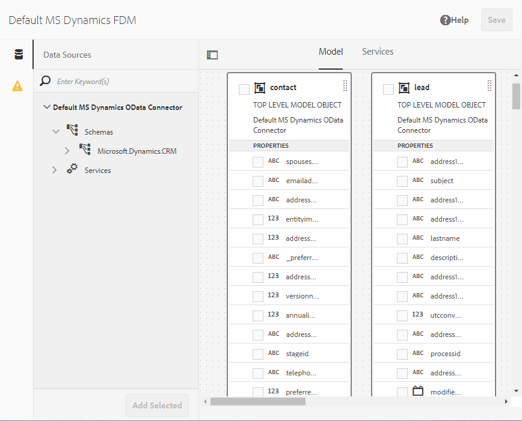

# [!DNL Microsoft Dynamics] OData configuration {#microsoft-dynamics-odata-configuration}

| Version | Article link |
| -------- | ---------------------------- |
| AEM 6.5  |    [Click here](https://experienceleague.adobe.com/docs/experience-manager-65/forms/form-data-model/ms-dynamics-odata-configuration.html)                  |
| AEM as a Cloud Service     | This article        |

 

[!DNL Microsoft Dynamics] is a Customer Relationship Management (CRM) and Enterprise Resource Planning (ERP) software that provides enterprise solutions for creating and managing customer accounts, contacts, leads, opportunities, and cases. [[!DNL Experience Manager Forms] Data Integration](data-integration.md) provides an OData cloud service configuration to integrate Forms with both online and on-premises [!DNL Microsoft Dynamics] server. It enables you to create Form Data Model (FDM) based on the entities, attributes, and services defined in [!DNL Microsoft Dynamics] service. The Form Data Model (FDM) can be used to create Adaptive Forms that interact with [!DNL Microsoft Dynamics] server to enable business workflows. For example:

* Query [!DNL Microsoft Dynamics] server for data and prepopulate Adaptive Forms
* Write data into [!DNL Microsoft Dynamics] on Adaptive Form submission
* Write data in [!DNL Microsoft Dynamics] through custom entities defined in Form Data Model (FDM) and conversely

<!--[!DNL Experience Manager Forms] add-on package also includes reference OData configuration that you can use to quickly integrate [!DNL Microsoft Dynamics] with [!DNL Experience Manager Forms].-->

<!--When the package is installed, the following entities and services are available on your [!DNL Experience Manager Forms] instance:

* MS Dynamics OData Cloud Service (OData Service)-->
<!--* Form Data Model with preconfigured [!DNL Microsoft Dynamics] entities and services.-->

<!-- Preconfigured [!DNL Microsoft Dynamics] entities and services in a Form Data Model are available on your [!DNL Experience Manager Forms] instance only if the run mode for the [!DNL Experience Manager] instance is set as `samplecontent` (default). -->  MS Dynamics OData Cloud Service (OData Service) is available with all run modes. For more information on configuring run modes for an [!DNL Experience Manager] instance, see [Run Modes](https://experienceleague.adobe.com/docs/experience-manager-cloud-service/implementing/deploying/overview.html#runmodes).

AEM as a Cloud Service offers various out of the box submit actions for handling form submissions. You can learn more about these options in the [Adaptive Form Submit Action](/help/forms/configure-submit-actions-core-components.md)  article.


## Prerequisites {#prerequisites}

Before you begin to set up and configure [!DNL Microsoft Dynamics], ensure that you have:

<!--* Installed the [[!DNL Experience Manager Forms] add-on package](installing-configuring-aem-forms-osgi.md) -->
* Configured [!DNL Microsoft Dynamics] 365 online or installed an instance of one of the following [!DNL Microsoft Dynamics] versions:

    * [!DNL Microsoft Dynamics] 365 on-premises
    * [!DNL Microsoft Dynamics] 2016 on-premises

* [Registered the application for [!DNL Microsoft Dynamics] online service with [!DNL Microsoft Azure] Active Directory](https://docs.microsoft.com/en-us/dynamics365/customer-engagement/developer/walkthrough-register-dynamics-365-app-azure-active-directory). Take a note of the values for the client ID (also referred to as application ID) and client secret for the registered service. These values are used while [configuring cloud service for your [!DNL Microsoft Dynamics] service](#configure-cloud-service-for-your-microsoft-dynamics-service).

## Set Reply URL for registered [!DNL Microsoft Dynamics] application {#set-reply-url-for-registered-microsoft-dynamics-application}

Do the following to set the Reply URL for registered [!DNL Microsoft Dynamics] application:

>[!NOTE]
>
>Use this procedure only while integrating [!DNL Experience Manager Forms] with online [!DNL Microsoft Dynamics] server.

1. Go to [!DNL Microsoft Azure] Active Directory account and add the following cloud service configuration URL in **[!UICONTROL Reply URLs]** settings for your registered application:

   `https://[server]:[port]/libs/fd/fdm/gui/components/admin/fdmcloudservice/createcloudconfigwizard/cloudservices.html`

   

1. Save the configuration.

## Configure [!DNL Microsoft Dynamics] for IFD {#configure-microsoft-dynamics-for-ifd}

[!DNL Microsoft Dynamics] uses claims-based authentication to provide access to data on [!DNL Microsoft Dynamics] CRM server to external users. To enable this, do the following to configure [!DNL Microsoft Dynamics] for Internet-facing deployment (IFD) and configure claim settings.

>[!NOTE]
>
> Use this procedure only while integrating [!DNL Experience Manager Forms] with on-premises [!DNL Microsoft Dynamics] server.

1. Configure [!DNL Microsoft Dynamics] on-premises instance for IFD as described in [Configure IFD for [!DNL Microsoft Dynamics]](https://technet.microsoft.com/en-us/library/dn609803.aspx).
1. Run the following commands using Windows PowerShell to configure claim settings on IFD-enabled [!DNL Microsoft Dynamics]:

   ```shell
   Add-PSSnapin Microsoft.Crm.PowerShell
    $ClaimsSettings = Get-CrmSetting -SettingType OAuthClaimsSettings
    $ClaimsSettings.Enabled = $true
    Set-CrmSetting -Setting $ClaimsSettings
   ```

   See [App registration for CRM on-premises (IFD)](https://msdn.microsoft.com/sl-si/library/dn531010(v=crm.7).aspx#bkmk_ifd) for details.

## Configure OAuth client on AD FS machine {#configure-oauth-client-on-ad-fs-machine}

Do the following to register an OAuth client on Active Directory Federation Services (AD FS) machine and grant access on AD FS machine:

>[!NOTE]
>
>Use this procedure only while integrating [!DNL Experience Manager Forms] with on-premises [!DNL Microsoft Dynamics] server.

1. Run the following command:

   `Add-AdfsClient -ClientId “<Client-ID>” -Name "<name>" -RedirectUri "<redirect-uri>" -GenerateClientSecret`

   Where:

    * `Client-ID` is a client ID you can generate using any GUID generator.
    * `redirect-uri` is the URL to the [!DNL Microsoft Dynamics] OData cloud service on [!DNL Experience Manager Forms]. The default cloud service installed with the [!DNL Experience Manager Forms] is deployed at the following URL:
      `https://'[server]:[port]'/libs/fd/fdm/gui/components/admin/fdmcloudservice/createcloudconfigwizard/cloudservices.html`

1. Run the following command to grant access on AD FS machine:

   `Grant-AdfsApplicationPermission -ClientRoleIdentifier “<Client-ID>” -ServerRoleIdentifier <resource> -ScopeNames openid`

   Where:

    * `resource` is the [!DNL Microsoft Dynamics] organization URL.

1. [!DNL Microsoft Dynamics] uses HTTPS protocol. To invoke AD FS endpoints from [!DNL Forms] server, install [!DNL Microsoft Dynamics] site certificate to Java certificate store using the `keytool` command on the computer running [!DNL Experience Manager Forms].

## Configure cloud service for your [!DNL Microsoft Dynamics] service {#configure-cloud-service-for-your-microsoft-dynamics-service}

An OData service is identified by its service root URL. To configure an OData service in [!DNL Experience Manager] as a Cloud Service, ensure that you have service root URL for the service, and do the following:

<!--The **MS Dynamics OData Cloud Service (OData Service)** configuration comes with default OData configuration. To configure it to connect with your [!DNL Microsoft Dynamics] service, do the following.-->

>[!NOTE]
>
>For step-by-step guide to configure [!DNL Microsoft Dynamics 365], online or on-premises, see [[!DNL Microsoft Dynamics] OData Configuration](ms-dynamics-odata-configuration.md).

1. Go to **[!UICONTROL Tools > Cloud Services > Data Sources]**. Select to select the folder where you want to create a cloud configuration.

   See [Configure folder for cloud service configurations](#cloud-folder) for information about creating and configuring a folder for cloud service configurations.

1. Select **[!UICONTROL Create]** to open the **[!UICONTROL Create Data Source Configuration wizard]**. Specify a name and optionally a title for the configuration, select **[!UICONTROL OData Service]** from the **[!UICONTROL Service Type]** drop-down, optionally browse and select a thumbnail image for the configuration, and select **[!UICONTROL Next]**.
   In the **[!UICONTROL Authentication Settings]** tab:

    1. Enter the value for the **[!UICONTROL Service Root]** field. Go to the Dynamics instance and navigate to **[!UICONTROL Developer Resources]** to view the value for the Service Root field. For example, https://&lt;tenant-name&gt;/api/data/v9.1/

    1. Select **[!UICONTROL OAuth 2.0]** as the authentication type.

    1. Replace the default values in the **[!UICONTROL Client Id]** (also referred to as **Application ID**), **[!UICONTROL Client Secret]**, **[!UICONTROL OAuth URL]**, **[!UICONTROL Refresh Token URL]**, **[!UICONTROL Access Token URL]**, and **[!UICONTROL Resource]** fields with values from your [!DNL Microsoft Dynamics] service configuration. It is mandatory to specify the dynamics instance URL in the **[!UICONTROL Resource]** field to configure [!DNL Microsoft Dynamics] with a form data model (FDM). Use the Service Root URL to derive the dynamics instance URL. For example, [https://org.crm.dynamics.com](https://org.crm.dynamics.com/).

    1. Specify **[!UICONTROL openid]** in the **[!UICONTROL Authorization Scope]** field for authorization process on [!DNL Microsoft Dynamics].

       
 Form Data Model (FDM)
1. Click **[!UICONTROL Connect to OAuth]**. You are redirected to [!DNL Microsoft Dynamics] login page.
1. Log in with your [!DNL Microsoft Dynamics] credentials and accept to allow the cloud service configuration to connect to [!DNL Microsoft Dynamics] service. It is a one-time task to establish Form Data Model (FDM) the cloud service and the service.

   You are the Form Data Model he cloud service configuration page, which displays a message that OData configuration is successfully saved.

The MS Dynamics OData Cloud Service (OData Service) cloud service is configured and connected with your Dynamics service. Form Data Model (FDM)

## Create Form Data Model (FDM) {#create-form-data-model}

<!--When you install the [!DNL Experience Manager Forms] package, a form data model, **[!DNL Microsoft Dynamics] FDM**, is deployed on your [!DNL Experience Manager] instance. By default, the Form Data Model uses [!DNL Microsoft Dynamics] service configured in the MS Dynamics OData Cloud Service (OData Service) as its data source.

On opening the Form Data Model for the first time, it connects to the configured [!DNL Microsoft Dynamics] service and fetches entities from your [!DNL Microsoft Dynamics] instance. The "contact" and "lead" entities from [!DNL Microsoft Dynamics] are already added in the form data model.

To review the form data model, go to **[!UICONTROL Form Data Model egrations]**. Select **[!DNL Microsoft Dynamics] FDM** and click **[!UICONTROL Edit]** to open the Form Data Model in edit mode. Alternatively, you can open the Form Data Model directly from the following URL:

`https://'[server]:[port]'/aem/fdm/editor.html/content/dam/formsanddocuments-fdm/ms-dynamics-fdm`
 Form Data Model 
-->

After configuring MS Dynamics OData cloud service, you can use the service while creating form data model (FDM). For more information, see [Create form data model (FDM)](create-form-data-models.md).

Next, you can create an Adaptive Form based Form Data Model (FDM) and use it in various Adaptive Form use cases, such as:

* Prefill Adaptive Form by querying information from [!DNL Microsoft Dynamics] entities and services
* Invoke [!DNL Microsoft Dynamics] server operations defined in a Form Data Model (FDM) using Adaptive Form rules
* Write submitted form data to [!DNL Microsoft Dynamics] entities

<!--It is recommended to create a copy of the Form Data Model provided with the [!DNL Experience Manager Forms] package and configure data models and services to suit your requirements. It will ensure that any future updates to the package do not override your form data model.-->

You can [configure the Form Data Model Submit Action](/help/forms/using-form-data-model.md) for an Adaptive Form to send data to Microsoft Dynamics OData.

For more information about creating and using Form Data Model (FDM) in business workflows, see [Data Integration](data-integration.md).

## Related Articles

{{af-submit-action}}
