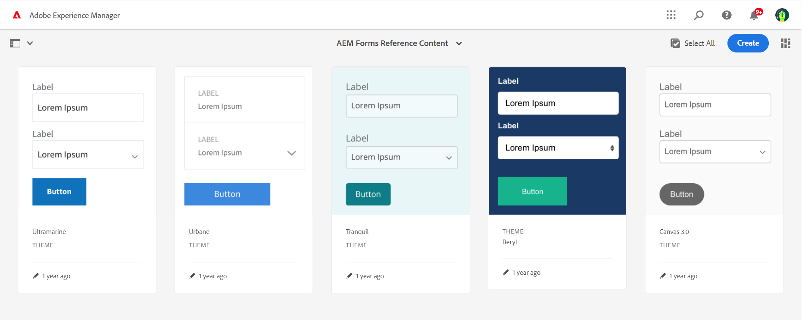
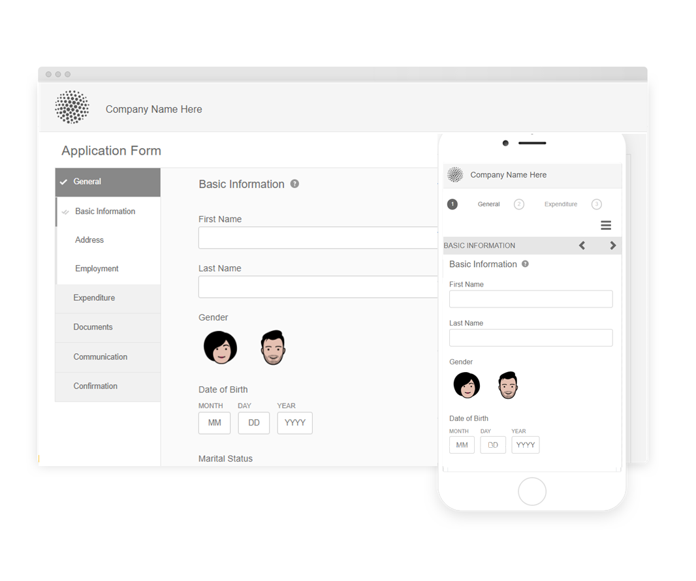
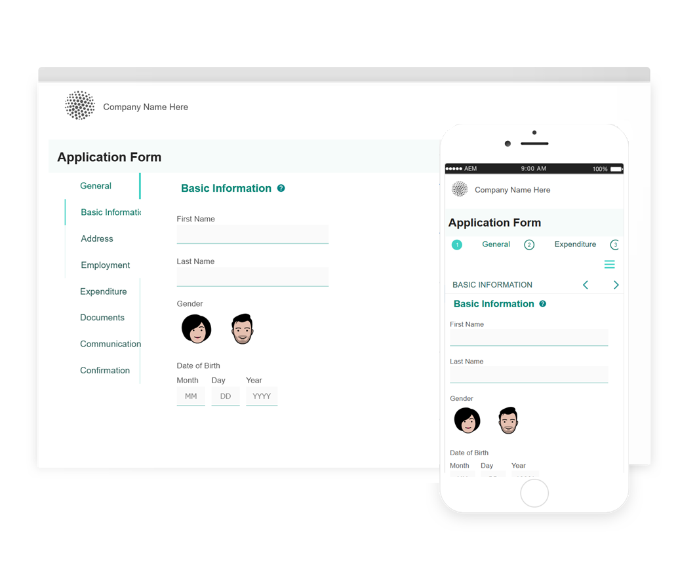
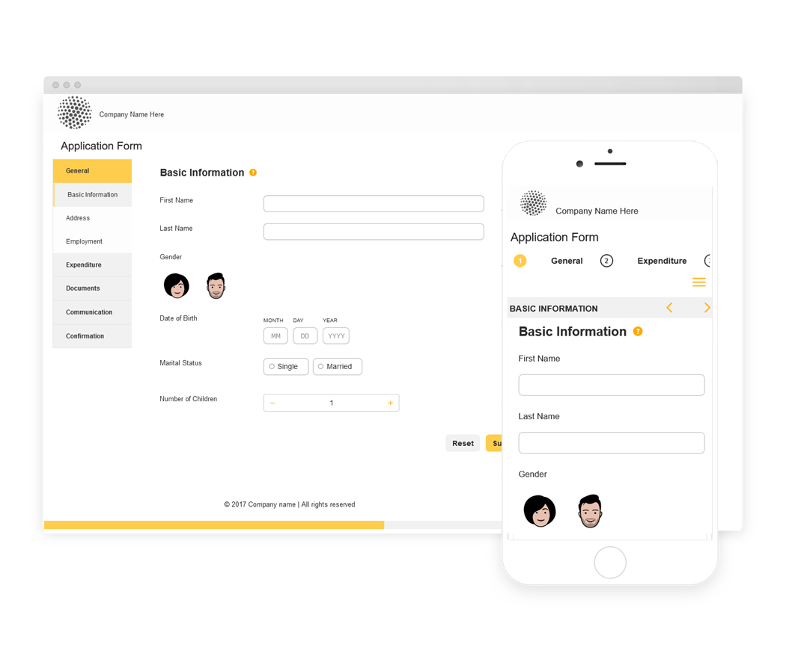

# Reference Themes, Templates, and Form Data models {#reference-themes-templates-and-data-models}

| Applies to | Article link |
| -------- | ---------------------------- |
|  Adaptive Form based on Core Components   | [Click here](https://experienceleague.adobe.com/docs/experience-manager-core-components/using/adaptive-forms/sample-themes-templates-form-data-models-core-components.html)   |
|  Adaptive Form based on Foundation Components | This article |

>[!NOTE]
>
> Adobe recommends using the modern and extensible data capture [Core Components](https://experienceleague.adobe.com/docs/experience-manager-core-components/using/adaptive-forms/introduction.html) for [creating new Adaptive Forms](/help/forms/creating-adaptive-form-core-components.md) or [adding Adaptive Forms to AEM Sites pages](/help/forms/create-or-add-an-adaptive-form-to-aem-sites-page.md). These components represent a significant advancement in Adaptive Forms creation, ensuring impressive user experiences. This article describes older approach to author Adaptive Forms using foundation components.

AEM Forms as a Cloud Service provides multiple reference themes, templates, and form data model (FDM) to help you start quickly with creating Adaptive Forms. You can download the [reference content package from software distribution portal](https://experience.adobe.com/#/downloads/content/software-distribution/en/aemcloud.html?package=/content/software-distribution/en/details.html/content/dam/aemcloud/public/aem-forms-reference-content.ui.content-2.1.0.zip) and use the [Package Manager](/help/implementing/developing/tools/package-manager.md) to install the [reference content package](https://experience.adobe.com/#/downloads/content/software-distribution/en/aemcloud.html?package=/content/software-distribution/en/details.html/content/dam/aemcloud/public/aem-forms-reference-content.ui.content-2.1.0.zip) on your production, development, or local development environment to get these reference assets to your environment. 

The themes, templates, and form data model (FDM) included the reference content package are:

|Themes | Templates | Form Data Model (FDM) |
---------|----------|---------
| Canvas 3.0 |Basic | Microsoft Dynamics 365 |
| Tranquil   |Blank | Salesforce |
| Urbane |   |  |
| Ultramarine |  |  |
| Beryl  |  |  |
| Healthcare |  |   |
| FSI |   |   |

## Reference Themes {#reference-themes}

[Themes](/help/forms/themes.md) let you style your forms without deep knowledge of CSS. You can get the following themes by installing the [Reference content package](https://experience.adobe.com/#/downloads/content/software-distribution/en/aemcloud.html?package=/content/software-distribution/en/details.html/content/dam/aemcloud/public/aem-forms-reference-content.ui.content-2.1.0.zip):

* Beryl
* Canvas 3.0 
* Tranquil
* Urbane
* Ultramarine
* Healthcare
* FSI (Financial Servcies & Insurance)

Each theme contains a unique and elegant style that you can use to create delightful adaptive forms for your users. It contains unique styling for selectors such as panel, text box, numeric box, radio button, table, and switch. Stylings in these themes are based on requirement. For example, in a particular scenario you require a minimalist theme with clean fonts. Liberty theme lets you achieve that look.

Themes included in this package are responsive, and styling in these themes is defined for mobile and desktop displays. Most modern browsers on a variety of devices can render forms applied with one of these themes without any hassle.

For more information on installing the package, see [How to Work With Packages](/help/implementing/developing/tools/package-manager.md).

## Beryl {#beryl}

Beryl theme emphasizes use of background image, transparency, and large, flat icons. In the screenshot below, you can see how the Beryl theme looks, and how it can enhance the styling of your form.

## Canvas 3.0 {#canvas}

Canvas 3.0 is the default theme for Adaptive Forms, and emphasizes use of basic colors, transparency, and flat icons. In the screenshot below, you can see how the Canvas 3.0 theme looks.

## Tranquil {#tranquil}

Tranquil theme provides light and dark shades of the Tranquil color scheme to highlight different components of a form. For example, radio buttons, panels, and tabs get a different shade of green.

## Urbane {#urbane}

Urbane theme emphasizes a minimalist and functional look for your form. When you apply the Urbane theme to your form, you can see that components are flat. The panels get thin outlines to create a modern look.

## Ultramarine {#ultramarine}

Ultramarine theme uses deep blue shades to highlight components such as tabs, panels, text boxes, and buttons.

## Healthcare {#healthcare}

Healthcare theme uses deep green shades to highlight components such as tabs, panels, text boxes, and buttons.

## FSI (Financial Servcies & Insurance)

FSI theme emphasizes a minimalist and functional look for your form. When you apply the FSI theme to your form, you can see that panel components are yellow. 

## Reference Templates {#reference-templates}

[Templates](/help/forms/themes.md) let you define initial form structure, content, and actions for your forms. You can get the following templates by installing the [Reference content package](https://experience.adobe.com/#/downloads/content/software-distribution/en/aemcloud.html?package=/content/software-distribution/en/details.html/content/dam/aemcloud/public/aem-forms-reference-content.ui.content-2.1.0.zip):

* Basic
* Blank

Basic template helps you quickly create an enrollment form. You can also use it to preview functionality of Adaptive Forms foundation components. It provides a wizard layout for section-by-section presentation of data. Use the Blank template to start creating an Adaptive Form from on a blank canvas. 

## Reference Form Data Model (FDM) {#reference-models}

The Adaptive Forms can then interact with Microsoft Dynamics 365 and Salesforce servers to enable business workflows. For example:

* Write data into Microsoft Dynamics 365 and Salesforce on Adaptive Form submission.
* Write data in Microsoft Dynamics 365 and Salesforce through custom entities defined in Form Data Model (FDM) and conversely.
* Query Microsoft Dynamics 365 and Salesforce server for data and prepopulate Adaptive Forms.
* Read data from Microsoft Dynamics 365 and Salesforce server.

You can get the following Form Data Model (FDM) by installing the [Reference content package](https://experience.adobe.com/#/downloads/content/software-distribution/en/aemcloud.html?package=/content/software-distribution/en/details.html/content/dam/aemcloud/public/aem-forms-reference-content.ui.content-2.1.0.zip):

* Microsoft&reg; Dynamics 365
* Salesforce 

For information on using these models, see [Configure Microsoft Dynamics 365 and Salesforce cloud services](https://experienceleague.adobe.com/docs/experience-manager-cloud-service/content/forms/integrate/use-form-data-model/configure-msdynamics-salesforce.html?lang=en#configure-dynamics-cloud-service)

## See Also {#see-also}

{{see-also}}