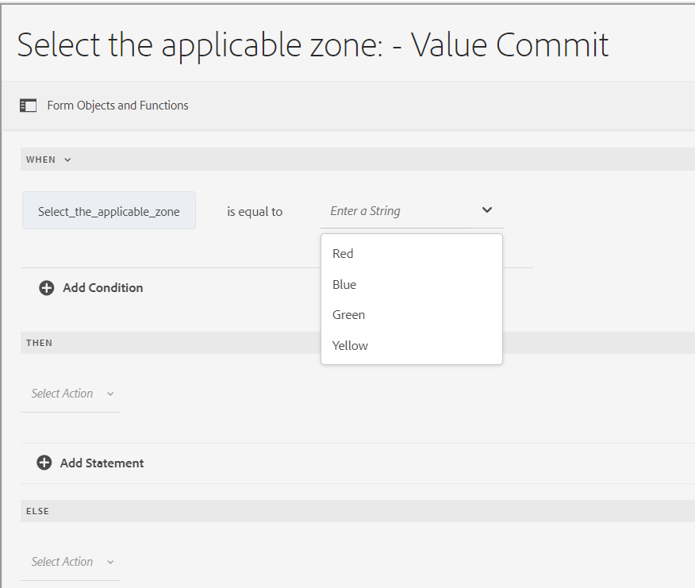
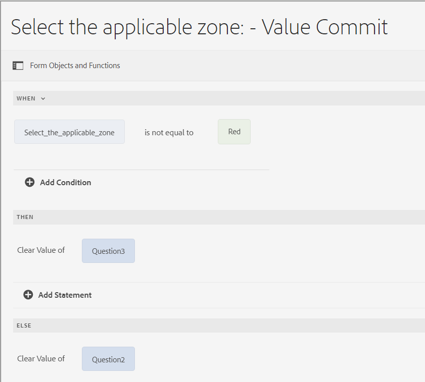
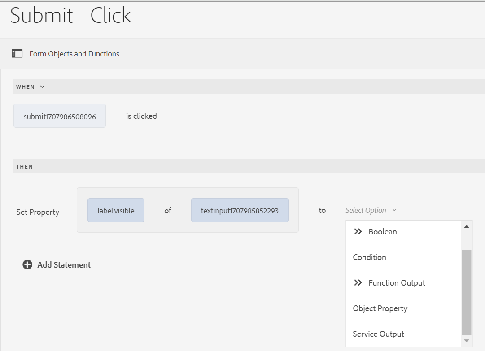
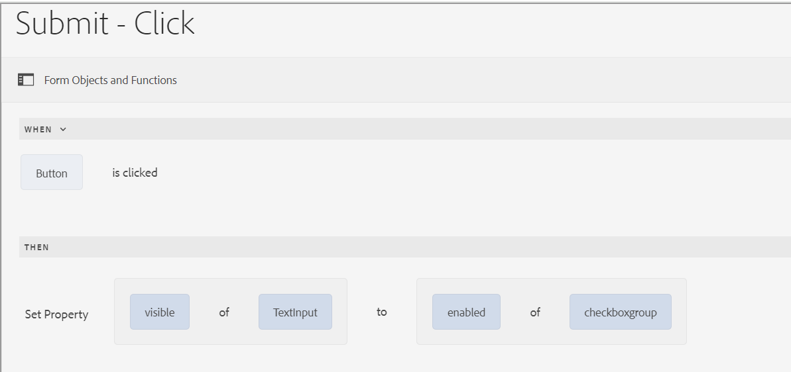
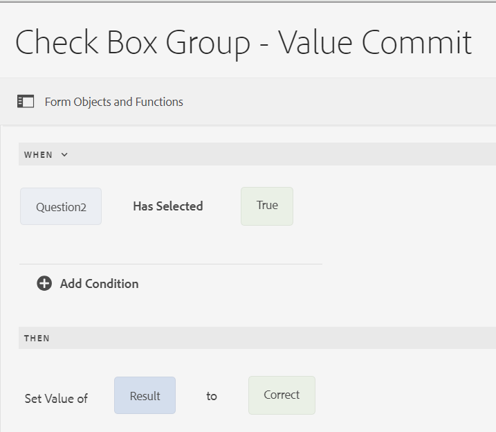

# Operator types and events in rule editor of an Adaptive Form based on Core Components

In AEM Forms as a Cloud, the rule editor includes various operator types and events that enable you to define and execute complex conditions and actions with ease.

The operator types available in the rule editor of an Adaptive Form provide a robust framework for constructing precise conditions. They allow you to manipulate data, perform calculations, and combine multiple conditions in a logical and coherent manner. Whether you are comparing values, performing arithmetic operations, or manipulating strings, these operators ensure that your rules are both flexible and powerful.

Events in the rule editor serve as the triggers that activate your rules. They define the specific actions that occur when certain conditions are met. By leveraging different types of events, you can automate responses to a wide range of scenarios, for example, user interactions, scheduled times, changes in data, and system states. With the ability to specify these triggers, you can create dynamic and responsive rules that cater to your specific requirements.

By understanding and using the available operator types and events, you can unlock the full potential of the rule editor, which enables you to create efficient, and effective rules that meet your unique needs and improve overall system functionality.

## Available operator types and events in rule editor {#available-operator-types-and-events-in-rule-editor}

The rule editor provides the following logical operators and events using which you can create rules.

* **Is Equal To**
* **Is Not Equal To**
* **Starts With**
* **Ends With**
* **Contains**
* **Does not contain**
* **Is Empty**
* **Is Not Empty**
* **Has Selected:** Returns true when the user selects a particular option for a checkbox, drop-down, radio button.
* **Is Initialized (event):** Returns true when a form object renders in the browser.
* **Is Changed (event):** Returns true when the user changes the entered value or selected option for a form object.

<!--
* **Navigation(event):** Returns true when the user clicks a navigation object. Navigation objects are used to move between panels. 
* **Step Completion(event):** Returns true when a step of a rule completes.
* **Successful Submission(event):** Returns true on successful submission of data to a form data model.
* **Error in Submission(event):**  Returns true on unsuccessful submission of data to a form data model. -->

### Available rule types in rule editor {#available-rule-types-in-rule-editor}

The rule editor provides a set of predefined rule types that you can use to write rules. Let's look at each rule type in detail. For more information about writing rules in the rule editor, see [Write rules](/help/forms/rule-editor-core-components-user-interface.md#write-rules).

#### [!UICONTROL When] {#whenruletype}

The **[!UICONTROL When]** rule type follows the **condition-action-alternate action** rule construct, or sometimes, just the **condition-action** construct. In this rule type, you first specify a condition for evaluation followed by an action to trigger if the condition is satisfied ( `True`). While using the When rule type, you can use multiple AND and OR operators to create [nested expressions](/help/forms/rule-editor-core-components-usecases.md#nested-expressions).

Using the When rule type, you can evaluate a condition on a form object and perform actions on one or more objects.

In plain words, a typical When rule is structured as follows:

`When on Object A:`

`(Condition 1 AND Condition 2 OR Condition 3) is TRUE;`

`Then, do the following:`

`Action 2 on Object B;`
`AND`
`Action 3 on Object C;

`Else, do the following:`

`Action 2 on Object C;`
_

When you have a multi-value component, such as radio buttons or list, while creating a rule for that component the options are automatically retrieved and made available to the rule creator. You need not type the option values again.

For example, a list has four options: Red, Blue, Green, and Yellow. While creating the rule, the options (radio buttons) are automatically retrieved and made available to the rule creator as the following:

While writing a When rule, you can trigger the Clear Value Of action. Clear Value Of action clears the value of the specified object. Having Clear Value of as an option in the When statement lets you create complex conditions with multiple fields. You can add the Else statement to add further conditions

>[!NOTE]
>
> When the rule type only supports single-level then-else statements.

##### Allowed Multiple fields in [!UICONTROL When] {#allowed-multiple-fields}

In the **When** condition, you have the option to add other fields apart from the field to which the rule is applied. 

For example, using the When rule type, you can evaluate a condition on different form objects and perform the action:

When:

(Object A Condition 1)

AND/OR

(Object B Condtion 2)

Then, do the following:

Action 1 on Object A

_

**Considerations while using Allowed Multiple fields in When condition feature**

* Ensure that the [core component is set to version 3.0.14 or later](https://github.com/adobe/aem-core-forms-components) to use this feature in the rule editor.
* If rules are applied to different fields within the When condition, the rule triggers even if only one of those fields is changed.

<!--
* It is not possible to add multiple fields in the When condition while applying rules to a button.

##### To enable Allowed Multiple fields in When condition feature

Allowed Multiple fields in When condition feature is disabled by default. To enable this feature, add a custom property at the template policy:

1. Open the corresponding template associated with an Adaptive Form in the template editor.
1. Select the existing policy as **formcontainer-policy**.
1. Navigate to the **[!UICONTROL Structure]**  view and, from the **[!UICONTROL Allowed Components]** list, open the **[!UICONTROL Adaptive Forms Container]** policy.
1. Go to the **[!UICONTROL Custom Properties]** tab and to add a custom property, click **[!UICONTROL Add]**.
1. Specify the **Group Name** of your choice. For example, in our case, we added the group name as **allowedfeature**.
1. Add the **key** and **value** pair as follows:
   * key: fd:changeEventBehaviour
   * value: deps
1. Click **[!UICONTROL Done]**. -->

If the allowed multiple fields in the When condition feature encounter any issues, follow the troubleshooting steps as:

1. Open the form in edit mode.
1. Open the Content browser and select the **[!UICONTROL Guide Container]** component of your Adaptive Form.
1. Click the Guide Container properties  icon. The Adaptive Form Container dialog box opens.
1. Click Done and save the dialog again.

**[!UICONTROL Hide]** Hides the specified object.

**[!UICONTROL Show]** Shows the specified object.

**[!UICONTROL Enable]** Enables the specified object.

**[!UICONTROL Disable]** Disables the specified object.

**[!UICONTROL Invoke service]** Invokes a service configured in a form data model (FDM). When you choose the Invoke Service operation, a field appears. On tapping the field, it displays all services configured in all form data model (FDM) on your [!DNL Experience Manager] instance. On choosing a Form Data Model service, more fields appear where you can map form objects with input  parameters for the specified service. You can map the output parameters through the event payload option for the specified service. You can also create rules for handling success and failure responses of the Invoke service operation using the rule editor. 

>[!NOTE]
>
> To learn more about the Invoke service, [click here](/help/forms/invoke-service-enhancements-rule-editor.md).

See the example rule for invoking Form Data Model (FDM) services. 

In addition to the Form Data Model service, you can specify a direct WSDL URL to invoke a web service. However, a Form Data Model service has many benefits and the recommended approach to invoke a service.

For more information about configuring services in form data model (FDM), see [[!DNL Experience Manager Forms] Data Integration](data-integration.md).

**[!UICONTROL Set value of]** Computes and sets the value of the specified object. You can set the object value to a string, the value of another object, the computed value using a mathematical expression or function, the value of a property of an object, or the output value from a configured Form Data Model service. When you choose the web service option, it displays all services configured in all form data model (FDM) on your [!DNL Experience Manager] instance. On choosing a Form Data Model service, more fields appear where you can map form objects with input and output parameters for the specified service.

For more information about configuring services in form data model (FDM), see [[!DNL Experience Manager Forms] Data Integration](data-integration.md).

The **[!UICONTROL Set Property]** rule type lets you set the value of a property of the specified object based on a condition action. You can set the property to one of the following:
* visible (Boolean)
* label.value (String)
* label.visible (Boolean)
* description (String)
* enabled (Boolean)
* readOnly (Boolean)
* required (Boolean)
* screenReaderText (String)
* valid (Boolean)
* errorMessage (String)
* default (Number, String, Date)
* enumNames (String[])
* chartType (String)

For example, it enables you to define rules to show the textbox when a button is clicked. You can use a custom function, a form object, object property, or a service output to define a rule.

To define a rule based on a custom function, select **[!UICONTROL Function Output]** from the drop-down list, and drag-and-drop a custom function from the **[!UICONTROL Functions]** tab. If the condition action is met, the text input box gets visible.

To define a rule based on a form object, select **[!UICONTROL Form Object]** from the drop-down list, and drag-and-drop a form object from the **[!UICONTROL Form Objects]** tab. If the condition action is met, the text input box gets visible in the Adaptive Form.

A Set Property rule based on an object property lets you make the text input box visible in an Adaptive Form based on another object property that is included in the Adaptive Form.

The following figure depicts an example of dynamically enabling the checkbox based on the hiding or showing of a textbox in an Adaptive Form:

**[!UICONTROL Clear Value Of]** Clears the value of the specified object.

**[!UICONTROL Set Focus]** Sets focus on the specified object.

**[!UICONTROL Submit Form]** Submits the form.

**[!UICONTROL Reset]** Resets the form or specified object.

**[!UICONTROL Validate]** Validates the form or specified object.

**[!UICONTROL Add Instance]** Adds an instance of the specified repeatable panel or table row.

**[!UICONTROL Remove Instance]** Removes an instance of the specified repeatable panel or table row.

**[!UICONTROL Function Output]** Defines a rule based on predefined functions or custom functions.

**[!UICONTROL Navigate to]** Navigate to other Adaptive Forms, other assets such as images or document fragments, or an external URL. <!-- For more information, see [Add button to the Interactive Communication](create-interactive-communication.md#addbuttontothewebchannel). -->

**[!UICONTROL Dispatch Event]** Triggers the specific actions or behaviors based on predefined conditions or events.

#### [!UICONTROL Set Value of] {#set-value-of}

The **[!UICONTROL Set Value of]** rule type lets you set the value of a form object depending on whether the specified condition is satisfied or not. The value can be set to a value of another object, a literal string, a value derived from a mathematical expression or a function, a value of a property of another object, or the output of a Form Data Model service. Similarly, you can check for a condition on a component, string, property, or values derived from a function or mathematical expression.

The **Set Value Of** rule type is not available for all form objects, such as panels and toolbar buttons. A standard Set Value Of rule has the following structure:

Set the value of Object A to:

(String ABC) OR
(object property X of Object C) OR
(value from a function) OR
(value from a mathematical expression) OR
(output value of a data model service);

When (optional):

(Condition 1 AND Condition 2 AND Condition 3) is TRUE;

Following example selects the value of `Question2` as `True` and sets the value of `Result` as `correct`.

Example of Set Value rule using the Form Data Model service.

#### [!UICONTROL Show] {#show}

Using the **[!UICONTROL Show]** rule type, you can write a rule to show or hide a form object based on whether a condition is satisfied or not. The Show rule type also triggers the Hide action in case the condition is not satisfied or returns `False`.

A typical Show rule is structured as follows:

`Show Object A;`

`When:`

`(Condition 1 OR Condition 2 OR Condition 3) is TRUE;`

`Else:`

`Hide Object A;`

#### [!UICONTROL Hide] {#hide}

Similar to the Show rule type, you can use the **[!UICONTROL Hide]** rule type to show or hide a form object based on whether a condition is satisfied or not. The Hide rule type also triggers the Show action in case the condition is not satisfied or returns `False`.

A typical Hide rule is structured as follows:

`Hide Object A;`

`When:`

`(Condition 1 AND Condition 2 AND Condition 3) is TRUE;`

`Else:`

`Show Object A;`

#### [!UICONTROL Enable] {#enable}

The **[!UICONTROL Enable]** rule type lets you enable or disable a form object based on whether a condition is satisfied or not. The Enable rule type also triggers the Disable action in case the condition is not satisfied or returns `False`.

A typical Enable rule is structured as follows:

`Enable Object A;`

`When:`

`(Condition 1 AND Condition 2 AND Condition 3) is TRUE;`

`Else:`

`Disable Object A;`

#### [!UICONTROL Disable] {#disable}

Similar to the Enable rule type, the **[!UICONTROL Disable]** rule type lets you enable or disable a form object based on whether a condition is satisfied or not. The Disable rule type also triggers the Enable action in case the condition is not satisfied or returns `False`.

A typical Disable rule is structured as follows:

`Disable Object A;`

`When:`

`(Condition 1 OR Condition 2 OR Condition 3) is TRUE;`

`Else:`

`Enable Object A;`

#### [!UICONTROL Validate] {#validate}

The **[!UICONTROL Validate]** rule type validates the value in a field using an expression. For example, you can write an expression to check that the text box for specifying a name does not contain special characters or numbers.

A typical Validate rule is structured as follows:

`Validate Object A;`

`Using:`

`(Expression 1 AND Expression 2 AND Expression 3) is TRUE;`

>[!NOTE]
>
>If the specified value does not comply with the Validate rule, you can display a validation message to the user. You can specify the message in the **[!UICONTROL Script validation message]** field in the component properties in the sidebar.

#### [!UICONTROL Navigate among the panels]

The **[!UICONTROL Navigate among the panels]** rule type allows you to shift focus among different panels in a form. For example, you can create an expression to move focus to the next panel. 

A typical **Navigate among the panels** rule for shifting focus to the next panel is structured as follows:

`Navigate among the panels`

`Shift focus to the next item Object A;`

`When:`

`(Condition 1 OR Condition 2 OR Condition 3) is TRUE;`

Similarly you can write **Navigate among the panels** rule for shifting focus to the previous panel:

`Navigate among the panels`

`Shift focus to the previous item Object A;`

`When:`

`(Condition 1 OR Condition 2 OR Condition 3) is TRUE;`

For more details on how to create a rule to navigate in a panel, [click here](/help/forms/rule-editor-core-components-usecases.md#navigating-between-panels-using-buttons).

#### [!UICONTROL Async Function call]

 This is a pre-release feature and accessible through our [pre-release channel](https://experienceleague.adobe.com/docs/experience-manager-cloud-service/content/release-notes/prerelease.html#new-features). 

The **[!UICONTROL Async Function call]** rule type allows you to execute asynchronous functions. It enables you to initiate a function call that operates independently of the main execution thread, allowing other processes to continue running without waiting for the asynchronous function to complete. 

A typical Async Function call rule to execute asynchronous function is structured as follows:

`When:`

`(Condition 1 OR Condition 2 OR Condition 3) is TRUE;`

`Async Function call`

`[Callback Function];`

For more information on how to use the Async Function call in the Visual Rule Editor, refer to the [Using asynchronous function calls in the rule editor](/help/forms/using-async-funct-in-rule-editor.md) article.

<!--
### [!UICONTROL Set Options Of] {#setoptionsof}

The **[!UICONTROL Set Options Of]** rule type enables you to define rules to add check boxes dynamically to the Adaptive Form. You can use a Form Data Model or a custom function to define the rule.

To define a rule based on a custom function, select **[!UICONTROL Function Output]** from the drop-down list, and drag-and-drop a custom function from the **[!UICONTROL Functions]** tab. The number of checkboxes defined in the custom function are added to the Adaptive Form.

To create a custom function, see [custom functions in rule editor](#custom-functions).

To define a rule based on a form data model:

1. Select **[!UICONTROL Service Output]** from the drop-down list.
1. Select the data model object.
1. Select a data model object property from the **[!UICONTROL Display Value]** drop-down list. The number of checkboxes in the Adaptive Form is derived from the number of instances defined for that property in the database.
1. Select a data model object property from the **[!UICONTROL Save Value]** drop-down list.

 -->

## Next Step

Let us now understand various [examples for a Rule Editor for an Adaptive Form based on Core Components](/help/forms/rule-editor-core-components-usecases.md).

## See Also

{{see-also-rule-editor}}
