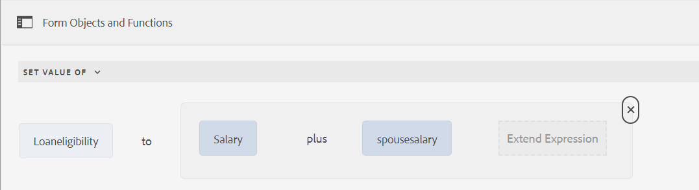

# Understanding the Rule Editor user interface

The Rule Editor user interface for Adaptive Forms based on Core Components enhances the form creation process within Adobe Experience Manager (AEM). It empowers both business users and developers to implement dynamic behavior and complex logic into forms by writing rules that trigger actions based on predefined conditions, user inputs, and interactions. This feature supports modern JavaScript functionalities, including ES10 features, and offers an intuitive visual editor that simplifies the rule-writing process. 
The Rule Editor is instrumental in streamlining the form-filling experience, ensuring both accuracy and efficiency. It allows for the validation or resetting of panels and forms, and the execution of custom functions to compute values of form objects. With its support for nested conditions and the ability to invoke Form Data Model services, the Rule Editor User Interface is a pivotal component for creating responsive, user-friendly, and adaptive forms.

## Understanding the rule editor user interface {#understanding-the-rule-editor-user-interface}

Rule editor provides a comprehensive yet simple user interface to write and manage rules. You can launch the rule editor user interface from within an Adaptive Form in authoring mode.

To launch the rule editor user interface:

1. Open an Adaptive Form in authoring mode.
1. Select the form object for which you want to write a rule, and in Component Toolbar select . The rule editor user interface appears.

   

   Any existing rules on the selected form objects are listed in this view. For information about managing existing rules, see [Manage rules](rule-editor.md#p-manage-rules-p).

1. Select **[!UICONTROL Create]** to write a new rule. The visual editor of the rule editor user interface opens by default when you launch the rule editor the first time.

   

Let's look at each component of the rule editor UI in detail.

### A. Component-rule display {#a-component-rule-display}

Displays the title of the Adaptive Form object through which you launched the rule editor and the rule type currently selected. In the above example, the rule editor is launched from an Adaptive Form object titled Question 1 and the rule type selected is When.

### B. Form objects and functions {#b-form-objects-and-functions-br}

The pane on the left in the rule editor user interface includes two tabs — **[!UICONTROL Forms Objects]** and **[!UICONTROL Functions]**.

The Form Objects tab shows a hierarchical view of all objects contained in the Adaptive Form. It displays the title and type of the objects. When writing a rule, you can drag-drop form objects onto the rule editor. While creating or editing a rule when you drag-and-drop an object or function into a placeholder, the placeholder automatically takes the appropriate value type.

The form objects that have one or more valid rules applied are marked with a Green dot. If any of the rules applied to a form object are invalid, the form object is marked with a Yellow dot.

The Functions tab includes a set of built-in functions, such as Sum Of, Min Of, Max Of, Average Of, Number Of, and Validate Form. You can use these functions to compute values in repeatable panels and table rows and use them in action and condition statements when writing rules. You can, however, create custom functions too.

Some of the list of functions are displayed in the figure:


>[!NOTE]
>
>You can perform text search on objects and functions names and titles in the Forms Objects and Functions tabs.

In the left tree of the form objects, you can select the form objects to display the rules applied to each of the objects. Not only you can navigate through the rules of the various form objects, you can also copy-paste rules between the form objects. For more information, see [Copy-paste rules](rule-editor.md#p-copy-paste-rules-p).

### C. Form objects and functions toggle {#c-form-objects-and-functions-toggle-br}

The toggle button, when tapped, toggles the form objects and functions pane.

### D. Visual rule editor {#visual-rule-editor}

Visual rule editor is the area in the visual editor mode of the rule editor user interface where you write rules. It lets you select a rule type and accordingly define conditions and actions. When defining conditions and actions in a rule, you can drag-drop form objects and functions from the Form Objects and Functions pane.

For more information about using a visual rule editor, see [Write rules](rule-editor.md#p-write-rules-p).
<!-- 
### E. Visual-code editors switcher {#e-visual-code-editors-switcher}

Users in the forms-power-users group can access code editor. For other users, code editor is not available. If you have the rights, you can switch from visual editor mode to code editor mode of the rule editor, and conversely, using the switcher right above the rule editor. When you launch rule editor the first time, it opens in the visual editor mode. You can write rules in the visual editor mode or switch to the code editor mode to write a rule script. However, note that if you modify a rule or write a rule in code editor, you cannot switch back to the visual editor for that rule unless you clear the code editor.

[!DNL Experience Manager Forms] tracks the rule editor mode you used last to write a rule. When you launch the rule editor next time, it opens in that mode. However, you can also configure a default mode to open the rule editor in the specified mode. To do so:

1. Go to [!DNL Experience Manager] web console at `https://[host]:[port]/system/console/configMgr`.
1. Click to edit **[!UICONTROL Adaptive Form Configuration Service]**.
1. choose **[!UICONTROL Visual Editor]** or **[!UICONTROL Code Editor]** from the **[!UICONTROL Default Mode for Rule Editor]** drop-down

1. Click **[!UICONTROL Save]**.
-->

### E. Done and cancel buttons {#done-and-cancel-buttons}

The **[!UICONTROL Done]** button is used to save a rule. You can save an incomplete rule. However, incomplete are invalid and do not run. Saved rules on a form object are listed when you launch the rule editor next time from the same form object. You can manage existing rules in that view. For more information, see [Manage rules](rule-editor.md#p-manage-rules-p).

The **[!UICONTROL Cancel]** button discards any changes that you made to a rule and closes the rule editor.

## Write rules {#write-rules}

You can write rules using the visual rule editor <!-- or the code editor. When you launch the rule editor the first time, it opens in the visual editor mode. You can switch to the code editor mode and write rules. However, if you write or modify a rule in code editor, you cannot switch to the visual editor for that rule unless you clear the code editor. When you launch the rule editor next time, it opens in the mode that you used last to create rule. -->

Let's first look at how to write rules using a visual editor.

+++

+++ Using visual editor {#using-visual-editor}

Let's understand how to create a rule in a visual editor using the following example form.


The Loan Requirements section in the example loan application form requires applicants to specify their marital status, salary, and if married, their spouse's salary. Based on the user inputs, the rule computes the loan eligibility amount and displays in the Loan Eligibility field. Apply the following rules to implement the scenario:

* The Spouse's Salary field is shown only when the Marital Status is Married.
* The loan eligibility amount is 50% of the total salary.

To write rules, perform the following steps:

1. First, write the rule to control the visibility of the Spouse Salary field based on the option the user selects for the Marital Status radio button.

   Open the loan application form in authoring mode. Select the **[!UICONTROL Marital Status]** component and select . Next, select **[!UICONTROL Create]** to launch the rule editor.

   

   When you launch the rule editor, the When rule is selected by default. Also, the form object (in this case, Marital Status) from where you launched the rule editor is specified in the When statement.

   While you cannot change or modify the selected object, you can use the rule drop-down, as shown below, to select another rule type. If you want to create a rule on another object, select Cancel to exit the rule editor and launch it again from the desired form object.

1. Select **[!UICONTROL Select State]** drop-down and select **[!UICONTROL is equal to]**. The **[!UICONTROL Enter a String]** field appears.

   

1. In the **[!UICONTROL Enter a String]** field in the rule, select **Married** from the drop-down menu.

   

   You have defined the condition as `When Marital Status is equal to Married`. Next, define the action to perform if this condition is True.

1. In the Then statement, select **[!UICONTROL Show]** from the **[!UICONTROL Select Action]** drop-down.

   

1. Drag-drop the **[!UICONTROL Spouse Salary]** field from the Form Objects tab on the **[!UICONTROL Drop object or select here]** field. Alternatively, select the **[!UICONTROL Drop object or select here]** field and select the **[!UICONTROL Spouse Salary]** field from the pop-up menu, which lists all form objects in the form.

   

   Next, define the action to perform if this condition is False. 
1. Click **[!UICONTROL Add Else Section]** to add another condition for the **[!UICONTROL Spouse Salary]** field, in case you select Marital Status as single. 

   


1. In the Else statement, select **[!UICONTROL Hide]** from the **[!UICONTROL Select Action]** drop-down.
    

1. Drag-drop the **[!UICONTROL Spouse Salary]** field from the Form Objects tab on the **[!UICONTROL Drop object or select here]** field. Alternatively, select the **[!UICONTROL Drop object or select here]** field and select the **[!UICONTROL Spouse Salary]** field from the pop-up menu, which lists all form objects in the form.
     

   The rule appears as follows in the rule editor.

   

1. Select **[!UICONTROL Done]** to save the rule.

<!--
1. Repeat steps 1 through 5 to define another rule to hide the Spouse Salary field if the marital Status is Single. The rule appears as follows in the rule editor.

    -->

   >[!NOTE]
   >
   > Alternatively, you can write a Show rule on the Spouse Salary field, instead of a When rules on the Marital Status field, to implement the same behavior.

   

1. Next, write a rule to compute the loan eligibility amount, which is 50% of the total salary, and display it in the Loan Eligibility field. To achieve this outcome, create **[!UICONTROL Set value Of]** rules on the Loan Eligibility field.

   In authoring mode, select the **[!UICONTROL Loan Eligibility]** field and select . Next, select **[!UICONTROL Create]** to launch the rule editor.

1. Select **[!UICONTROL Set Value Of]** rule from the rule drop-down.

   

1. Select **[!UICONTROL Select Option]** and select **[!UICONTROL Mathematical Expression]**. A field to write mathematical expression opens.

   

1. In the expression field:

    * Select or drag-drop from the Forms Object tab the **[!UICONTROL Salary]** field in the first **[!UICONTROL Drop object or select here]** field.

    * Select **[!UICONTROL Plus]** from the **[!UICONTROL Select Operator]** field.

    * Select or drag-drop from the Forms Object tab the **[!UICONTROL Spouse Salary]** field in the other **[!UICONTROL Drop object or select here]** field.

   

1. Next, select in the highlighted area around the expression field and select **[!UICONTROL Extend Expression]**.

   

   In the extended expression field, select **[!UICONTROL divided by]** from the **[!UICONTROL Select Operator]** field and **[!UICONTROL Number]** from the **[!UICONTROL Select Option]** field. Then, specify **[!UICONTROL 2]** in the number field.

   

   >[!NOTE]
   >
   >You can create complex expressions by using components, functions, mathematical expressions, and property values from the Select Option field.

   Next, create a condition, which when returns True, the expression executes.

1. Select **[!UICONTROL Add Condition]** to add a When statement.

   

   In the When statement:

    * Select or drag-drop from the Forms Object tab the **[!UICONTROL Marital Status]** field in the first **[!UICONTROL Drop object or select here]** field.

    * Select **[!UICONTROL is equal to]** from the **[!UICONTROL Select Operator]** field.

    * Select String in the other **[!UICONTROL Drop object or select here]** field and specify **[!UICONTROL Married]** in the **[!UICONTROL Enter a String]** field.

   The rule finally appears as follows in the rule editor.  

1. Select **[!UICONTROL Done]**. It saves the rule.

1. Repeat steps 7 through 14 to define another rule to compute the loan eligibility if the marital Status is Single. The rule appears as follows in the rule editor.

   

Alternatively, you can use the Set Value Of rule to compute the loan eligibility in the When rule that you created to show-hide the Spouse Salary field. The resultant combined rule when Marital Status is Single appears as follows in the rule editor.


You can write a combined rule to control visibility of the Spouse Salary field and compute loan eligibility when the Marital Status is Married using the Else condition.


+++


<!-- ### Using code editor {#using-code-editor}

Users added to the forms-power-users group can use code editor. The rule editor auto generates the JavaScript code for any rule you create using visual editor. You can switch from visual editor to the code editor to view the generated code. However, if you modify the rule code in the code editor, you cannot switch back to the visual editor. If you prefer writing rules in code editor rather than visual editor, you can write rules afresh in the code editor. The visual-code editors switcher helps you switch between the two modes.

The code editor JavaScript is the expression language of Adaptive Forms. All the expressions are valid JavaScript expressions and use Adaptive Forms scripting model APIs. These expressions return values of certain types. For the complete list of Adaptive Forms classes, events, objects, and public APIs, see [JavaScript Library API reference for Adaptive Forms](https://helpx.adobe.com/experience-manager/6-5/forms/javascript-api/index.html).

For more information about guidelines to write rules in the code editor, see [Adaptive Form Expressions](adaptive-form-expressions.md).

While writing JavaScript code in the rule editor, the following visual cues help you with the structure and syntax:

* Syntax highlights

* Auto Indentation

* Hints and suggestions for Form objects, functions, and their properties

* Auto completion of form component names and common JavaScript functions


-->

#### Custom functions in rule editor {#custom-functions}

Apart from the out-of-the-box functions like *Sum of* that are listed under **Functions Output**, you can also use custom functions in your rule editor. Rule editor supports JavaScript ECMAScript 2019 syntax for scripts and custom functions. For instructions on creating custom functions, refer to the article [Custom Functions in Adaptive Forms](/help/forms/create-and-use-custom-functions.md).

<!--

Ensure that the function you write is accompanied by the `jsdoc` above it. Adaptive Form supports the various [JavaScript annotations for custom functions](/help/forms/create-and-use-custom-functions.md#js-annotations).

For more information, see [jsdoc.app](https://jsdoc.app/).

Accompanying `jsdoc` is required:

* If you want custom configuration and description
* Because there are multiple ways to declare a function in `JavaScript,` and comments let you keep a track of the functions.

Supported `jsdoc` tags:

* **Private**
  Syntax: `@private`
  A private function is not included as a custom function.

* **Name**
  Syntax: `@name funcName <Function Name>`
  Alternatively `,` you can use: `@function funcName <Function Name>` **or** `@func` `funcName <Function Name>`.
  `funcName` is the name of the function (no spaces allowed).
  `<Function Name>` is the display name of the function.

* **Parameter**
  Syntax: `@param {type} name <Parameter Description>`
  Alternatively, you can use: `@argument` `{type} name <Parameter Description>` **or** `@arg` `{type}` `name <Parameter Description>`.
  Shows parameters used by the function. A function can have multiple parameter tags, one tag for each parameter in the order of occurrence.
  `{type}` represents parameter type. Allowed parameter types are:

    1. string
    2. number
    3. boolean
    4. scope
    5. string[]
    6. number[]
    7. boolean[]
    8. date
    9. date[]
    10. array
    11. object

   `scope` refers to a special globals object which is provided by forms runtime. It must be the last parameter and is not be visible to the user in the rule editor. You can use scope to access readable form and field proxy object to read properties, event which triggered the rule and a set of functions to manipulate the form.

   `object` type is used to pass readable field object in parameter to a custom function instead of passing the value.

   All parameter types are categorized under one of the above. None is not supported. Ensure that you select one of the types above. Types are not case-sensitive. Spaces are not allowed in the parameter name.  Parameter description can have multiple words.

* **Optional Parameter**
Syntax: `@param {type=} name <Parameter Description>` 
Alternatively, you can use: `@param {type} [name] <Parameter Description>`
By default all parameters are mandatory. You can mark a parameter optional by adding `=` in type of the parameter or by putting param name in square brackets.
   
   For example, let us declare `Input1` as optional parameter:
    * `@param {type=} Input1`
    * `@param {type} [Input1]`

* **Return Type**
  Syntax: `@return {type}`
  Alternatively, you can use `@returns {type}`.
  Adds information about the function, such as its objective.
  {type} represents the return type of the function. Allowed return types are:

    1. string
    2. number
    3. boolean
    4. string[]
    5. number[]
    6. boolean[]
    7. date
    8. date[]
    9. array
    10. object

  All other return types are categorized under one of the above. None is not supported. Ensure that you select one of the types above. Return types are not case-sensitive.

**Adding a custom function**

For example, you want to add a custom function which calculates area of a square. Side length is the user input to the custom function, which is accepted using a numeric box in your form. The calculated output is displayed in another numeric box in your form. To add a custom function, you have to first create a client library, and then add it to the CRX repository.

To create a client library and add it in the CRX repository, perform the following steps:

1. Create a client library. For more information, see [Using Client-Side Libraries](https://experienceleague.adobe.com/docs/experience-manager-cloud-service/implementing/developing/full-stack/clientlibs.html#developing).
2. In CRXDE, add a property `categories`with string type value as `customfunction` to the `clientlib` folder.

   >[!NOTE]
   >
   >`customfunction`is an example category. You can choose any name for the category you create in the `clientlib`folder.

After you have added your client library in the CRX repository, use it in your Adaptive Form. It lets you use your custom function as a rule in your form. To add the client library in your Adaptive Form, perform the following steps:

1. Open your form in edit mode.
   To open a form in edit mode, select a form and select **[!UICONTROL Open]**.
1. In the edit mode, select a component, then select  &gt; **[!UICONTROL Adaptive Form Container]**, and then select .
1. In the sidebar, under Name of Client Library, add your client library. ( `customfunction` in the example.)

   

1. Select the input numeric box, and select  to open the rule editor.
1. Select **[!UICONTROL Create Rule]**. Using options shown below, create a rule to save the squared value of the input in the Output field of your form.

   [](assets/add-custom-rule.png)
  
1. Select **[!UICONTROL Done]**. Your custom function is added.

   >[!NOTE]
   >
   > To invoke a form data model from rule editor using custom functions, [see here](/help/forms/using-form-data-model.md#invoke-services-in-adaptive-forms-using-rules-invoke-services). 

#### Function declaration supported types {#function-declaration-supported-types}

**Function Statement**

```javascript
function area(len) {
    return len*len;
}
```

This function is included without `jsdoc` comments.

**Function Expression**

```javascript
var area;
//Some codes later
/** */
area = function(len) {
    return len*len;
};
```

**Function Expression and Statement**

```javascript
var b={};
/** */
b.area = function(len) {
    return len*len;
}
```

**Function Declaration as Variable**

```javascript
/** */
var x1,
    area = function(len) {
        return len*len;
    },
    x2 =5, x3 =true;
```

Limitation: custom function picks only the first function declaration from the variable list, if together. You can use function expression for every function declared.

**Function Declaration as Object**

```javascript
var c = {
    b : {
        /** */
        area : function(len) {
            return len*len;
        }
    }
};
```

>[!NOTE]
>
>Ensure that you use `jsdoc` for every custom function. Although `jsdoc`comments are encouraged, include an empty `jsdoc`comment to mark your function as custom function. It enables default handling of your custom function.
-->

## Manage rules {#manage-rules}

Any existing rules on a form object are listed when you select the object and select . You can view the title and a preview the rule summary. Furthermore, the UI lets you expand and view the complete rule summary, change the order of rules, edit rules, and delete rules.


You can perform the following actions on the rules:

* **Expand/Collapse**: The Content column in the rule list displays the rule content. If the entire rule content is not visible in the default view, select  to expand it.

* **Reorder**: Any new rule you create is stacked at the bottom of the rule list. The rules are executed from top to bottom. The rule at the top executes first followed by other rules of the same type. For example, if you have When, Show, Enable, and When rules at the first, second, third, and fourth positions from the top, respectively, the When rule at the top gets executed first followed by the When rule at the fourth position. Then, the Show and Enable rules are executed.
  You can change the order of a rule by tapping  against it or drag-drop it to the desired order in the list.

* **Edit**: To edit a rule, select the check box next to the rule title. Options to edit and delete the rule appear. Select **[!UICONTROL Edit]** to open the selected rule in the rule editor.

* **Delete**: To delete a rule, select the rule and select **[!UICONTROL Delete]**.

* **Enable/Disable**: When you must suspend usage of a rule temporarily, you can select one or more rules and select **[!UICONTROL Disable]** in the Actions toolbar to disable them. If a rule is disabled, it does not execute at the runtime. To enable a rule that is disabled, you can select it and select Enable in the actions toolbar. The status column of the rule displays whether the rule is enabled or disabled.


## Copy-paste rules {#copy-paste-rules}

You can copy-paste a rule from one field to other similar fields to save time.

To copy-paste rules, do the following:

1. Select the form object from which you want to copy a rule, and in the component toolbar select . The rule editor user interface appears with the form object selected and the existing rules appear.

   

   For information about managing existing rules, see [Manage rules](rule-editor.md#p-manage-rules-p).

1. Select the check box next to the rule title, options to manage the rule appear. Select **[!UICONTROL Copy]**.

   

1. Select another form object to which you want to paste the rule and select **[!UICONTROL Paste]**. Further, you can edit the rule to make changes in it.

   >[!NOTE]
   >
   >You can paste a rule to another form object only if that form object supports the copied rule's event. For example, a button supports the click event. You can paste a rule with a click event to a button but not to a check box.

1. Select **[!UICONTROL Done]** to save the rule.

Let us now understand various [examples for a Rule Editor for an Adaptive Form based on Core Components](/help/forms/rule-editor-core-components-usecases.md).


## See Also

{{see-also-rule-editor}}