# Add rules to an Adaptive Form {#adaptive-forms-rule-editor}

>[!NOTE]
>
> Adobe recommends using the modern and extensible data capture **[Core Components](https://experienceleague.adobe.com/docs/experience-manager-core-components/using/adaptive-forms/introduction.html)** for [creating new Adaptive Forms](/help/forms/creating-adaptive-form-core-components.md) or [adding Adaptive Forms to AEM Sites pages](/help/forms/create-or-add-an-adaptive-form-to-aem-sites-page.md). These **Core Components** represent a significant advancement in Adaptive Forms creation, delivering more consistent, responsive, and impressive user experiences and making them the recommended foundation for new form projects. This article describes the older approach to authoring Adaptive Forms using **foundation components**, in which the **rule editor** is used to define form logic and interactive behavior.

The **rule editor** in Adobe [!DNL Experience Manager] (AEM) enables form authors to add rules to an Adaptive Form, controlling how the form behaves in response to user input. Rules apply business logic to form fields and components without requiring custom code. Using the rule editor, authors define conditions and actions that determine what happens as a user interacts with the form.

Rules in an Adaptive Form commonly perform the following functions:

- **Show or hide** form fields, panels, or components based on the values a user enters.
- **Enable or disable** fields depending on selections made elsewhere in the form.
- **Set values** dynamically, calculating or populating fields from other inputs.
- **Validate** user input to enforce required formats, ranges, or business constraints.
- **Invoke services** to fetch or submit data, connecting the form to external data sources.

Because rules encapsulate this logic within the form itself, they create dynamic, adaptive experiences that respond in real time to the user. This reduces manual scripting, improves data accuracy, and streamlines complex form workflows. The article below explains the rule editor interface for **foundation components**, while the equivalent guidance for other AEM versions and component types is linked in the table.

| Version | Article link |
| -------- | ---------------------------- |
| Adobe [!DNL Experience Manager] (AEM) as a Cloud Service (Foundation Components)    | This article         |
| Adobe [!DNL Experience Manager] (AEM) as a Cloud Service (Core Components)    | [Click here](/help/forms/rule-editor-core-components.md)       |
| AEM 6.5  |    [Click here](https://experienceleague.adobe.com/docs/experience-manager-65/forms/adaptive-forms-advanced-authoring/rule-editor.html)                  |

## Overview {#overview}

<!-- In addition, only for forms power users, rule editor provides a code editor to write rules and scripts. -->

<!-- Rule editor replaces the scripting capabilities in [!DNL Experience Manager 6.1 Forms] and earlier releases. However, your existing scripts are preserved in the new rule editor. For more information about working with existing scripts in the rule editor, see [Impact of rule editor on existing scripts](rule-editor.md#p-impact-of-rule-editor-on-existing-scripts-p). -->

The rule editor is a visual authoring tool in Adaptive Forms that enables forms business users and developers to write rules on Adaptive Form objects. Rules define actions that trigger on form objects based on preset conditions, user inputs, and user actions on the form. The rule editor streamlines the form-filling experience, ensuring accuracy and speed by automating how the form responds as users interact with it.

The rule editor provides an intuitive, simplified user interface for authoring rules, and offers a **visual editor** available to all users. Because rules execute automatically in response to conditions and inputs, they reduce manual effort and minimize data-entry errors during form completion.

### Key Actions Supported by Rules

Using rules, you can perform the following key actions on Adaptive Form objects:

* **Show or hide an object** — control visibility so users see only the fields relevant to their responses.
* **Enable or disable an object** — restrict interaction with a field based on preset conditions.
* **Set a value for an object** — populate a field automatically to reduce manual input.
* **Validate the value of an object** — enforce data accuracy by checking user input against defined criteria.
* **Execute functions to compute the value of an object** — derive values dynamically from other inputs.
* **Invoke a Form Data Model service and perform an operation** — connect the form to back-end data sources and services.
* **Set property of an object** — adjust object properties as conditions change.

### User Permissions and Access

Access to authoring and using rules is governed by user group membership:

* Users added to the **forms-power-users** group can create scripts and edit existing ones.
* Users in the **[!DNL forms-users]** group can use the scripts but cannot create or edit scripts.

This separation ensures that rule authoring remains controlled while allowing broader groups to benefit from the rules already in place.

## Difference between Rule editor in Core Components and Rule Editor in Foundation Components

The primary difference is architectural: the **Rule Editor** in **Core Components** is built for the modern, standards-based Adaptive Forms authoring model in **Adobe [!DNL Experience Manager] (AEM)**, while the **Rule Editor** in **Foundation Components** supports the older, legacy authoring model. Both let authors add dynamic, conditional logic to form fields without writing code, but they operate on different component frameworks and expose different capabilities.

### Rule Editor in Core Components

The **Rule Editor** in **Core Components** is designed to work with the newer, extensible Adaptive Forms Core Components. Because Core Components follow a standardized, style-system-friendly architecture, their rules are engineered to be **more portable, easier to maintain, and better aligned with responsive, headless, and edge-delivery scenarios**. Authors typically use it to build validation, visibility, enablement, and value-calculation rules that behave consistently across modern rendering targets. As widely acknowledged in AEM development practice, Core Components represent the forward-looking, recommended foundation for new form projects, so their Rule Editor is the environment intended to receive ongoing enhancements.

### Rule Editor in Foundation Components

The **Rule Editor** in **Foundation Components** targets the legacy Foundation Components framework. It provides the traditional capabilities long available in AEM Adaptive Forms — including conditional show/hide behavior, field enablement, required-field toggling, and scripted expressions. Unlike the Core Components editor, the Foundation Components Rule Editor is tied to the older component model, which can make its rules **less portable to modern delivery models** and more dependent on the legacy rendering stack. As a result, it is most relevant to existing forms already authored with Foundation Components.

### Key Differences at a Glance

| Aspect | Rule Editor in Core Components | Rule Editor in Foundation Components |
|--------|-------------------------------|--------------------------------------|
| **Underlying framework** | Modern Core Components model | Legacy Foundation Components model |
| **Recommended for** | New Adaptive Forms projects | Existing legacy forms |
| **Portability** | Higher — aligned with modern, responsive delivery | Lower — tied to the legacy rendering stack |
| **Future direction** | Actively recommended and forward-looking | Maintained for backward compatibility |
| **Rule types supported** | Validation, visibility, enablement, value calculation, and more | Traditional show/hide, enable, required, and scripted expressions |

### When to Use Each

- **Choose the Core Components Rule Editor** when building new Adaptive Forms, because it aligns with the modern, standardized architecture and delivers rules that carry forward cleanly into responsive and headless scenarios.
- **Use the Foundation Components Rule Editor** when maintaining or extending forms that were already built on Foundation Components, where migrating the entire form is not yet practical.

Because the two editors are bound to fundamentally different component frameworks, rules authored in one are not directly interchangeable with the other. This is why teams planning long-term Adaptive Forms strategies generally standardize on **Core Components** and their Rule Editor, reserving the **Foundation Components** Rule Editor for continuity of legacy implementations.

## Understanding a rule {#understanding-a-rule}

A rule is a combination of **actions** and **conditions**. In rule editor, actions include activities such as **hide**, **show**, **enable**, **disable**, or **compute the value** of an object in a form. Conditions are **Boolean expressions** that the rule editor evaluates by performing checks and operations on the state, value, or property of a form object. The rule editor performs actions based on the value (`True` or `False`) returned when it evaluates a condition. As a result, a condition that returns `True` triggers its associated action, while a `False` result does not.

The rule editor provides a set of predefined rule types to help you write rules. These rule types include:

- **When**
- **Show**
- **Hide**
- **Enable**
- **Disable**
- **Set Value Of**
- **Validate**

Each rule type lets you define conditions and actions in a rule. The document further explains each rule type in detail.

A rule typically follows one of the following constructs:

**Condition-Action** In this construct, a rule first defines a condition followed by an action to trigger. The construct is comparable to the if-then statement in programming languages, where a specified condition determines whether the action runs.

In rule editor, the **When** rule type enforces the condition-action construct.

**Action-Condition** In this construct, a rule first defines an action to trigger followed by conditions for evaluation. Another variation of this construct is **action-condition-alternate action**, which also defines an alternate action to trigger if the condition returns `False`.

The **Show**, **Hide**, **Enable**, **Disable**, **Set Value Of**, and **Validate** rule types in rule editor enforce the action-condition rule construct. By default, the alternate action for **Show** is **Hide**, and the alternate action for **Enable** is **Disable**, and the opposite way. You cannot change the default alternate action, because these opposite pairings are built into the rule editor to keep behavior predictable and reversible.

>[!NOTE]
>
>The available rule types, including the conditions and actions that you define in rule editor, also depend on the type of form object on which the author is creating a rule. The rule editor displays only valid rule types and options for writing condition and action statements for a particular form object type. For example, you do not see the **Validate**, **Set Value Of**, **Enable**, and **Disable** rule types for a panel object.

For more information about rule types available in the rule editor, see [Available rule types in rule editor](rule-editor.md#p-available-rule-types-in-rule-editor-p).

### Guidelines for choosing a rule construct {#guidelines-for-choosing-a-rule-construct}

You can achieve most use cases with any rule construct, but the following guidelines help you choose one construct over another. For more information about the available rules in the rule editor, see [Available rule types in rule editor](rule-editor.md#p-available-rule-types-in-rule-editor-p).

* A reliable rule of thumb is to think about the rule in the context of the object on which you are writing it. Consider a scenario where you want to hide or show **field B** based on the value a user specifies in **field A**. Here, you are evaluating a condition on **field A**, and, based on the value it returns, this triggers an action on **field B**.

  Therefore, if you are writing a rule on **field B** (the object on which you are evaluating a condition), use the **condition-action construct** or the **When rule type**. Similarly, use the **action-condition construct** or the **Show or Hide rule type** on **field A**.

* When you must perform multiple actions based on a single condition, use the **condition-action construct**, which evaluates a condition once and specifies multiple action statements.

  For example, to hide **fields B, C, and D** based on the condition that checks the value a user specifies in **field A**, write one rule with the **condition-action construct** or **When rule type** on **field A**, and specify actions to control the visibility of fields B, C, and D. Otherwise, you need three separate rules on fields B, C, and D, because each rule must independently check the condition and show or hide the respective field. The **When** rule type on one object is more efficient than the **Show or Hide** rule type on three objects. It consolidates the logic into a single rule.

* To trigger an action based on multiple conditions, use the **action-condition construct**. For example, to show and hide **field A** by evaluating conditions on **fields B, C, and D**, use the **Show or Hide rule type** on **field A**.

* Use the **condition-action** or **action-condition construct** when the rule contains one action for one condition.

* When a rule checks a condition and performs an action immediately upon providing a value in a field or exiting a field, write the rule with the **condition-action construct** or the **When rule type** on the field on which the condition is evaluated.

* The condition in the **When rule** is evaluated when a user changes the value of the object on which the When rule is applied. However, if you want the action to trigger when the value changes on the server side—for example, when prepopulating a value—write a **When rule** that triggers the action when the field is initialized.

* When writing rules for drop-down, radio button, or check box objects, the options or values of these form objects are pre-populated in the rule editor.

## Available operator types and events in rule editor {#available-operator-types-and-events-in-rule-editor}

The rule editor provides the following logical operators (conditions) and events (triggers), which form authors use to build conditional rules that control form behavior. Operators evaluate the value or state of a form object, while events respond to specific actions in the form lifecycle, such as rendering, value changes, navigation, or data submission.

### Comparison and value operators

* **Is Equal To:** Returns true when the value of a form object exactly matches a specified value.
* **Is Not Equal To:** Returns true when the value of a form object does not match a specified value.
* **Starts With:** Returns true when the value of a form object begins with a specified sequence of characters.
* **Ends With:** Returns true when the value of a form object ends with a specified sequence of characters.
* **Contains:** Returns true when the value of a form object includes a specified sequence of characters anywhere within it.
* **Is Empty:** Returns true when a form object has no value entered or selected.
* **Is Not Empty:** Returns true when a form object has a value entered or selected.
* **Has Selected:** Returns true when the user selects a particular option for a checkbox, drop-down, or radio button. This operator is used to trigger logic based on a specific choice among available options.

### Events

* **Is Initialized (event):** Returns true when a form object renders in the browser. This event runs at load time, making it useful for setting the initial state, default values, or visibility of a form object before the user interacts with it.
* **Is Changed (event):** Returns true when the user changes the entered value or selected option for a form object. This event enables real-time responses, such as updating dependent fields as soon as the user modifies input.
* **Navigation (event):** Returns true when the user clicks a navigation object. Navigation objects are used to move between panels, allowing rules to run as the user progresses through different sections of the form.
* **Step Completion (event):** Returns true when a step of a rule completes. This event lets subsequent rules execute in sequence after a preceding step has finished.
* **Successful Submission (event):** Returns true on successful submission of data to a form data model. This event is used to trigger follow-up actions, such as confirmation messages or redirects, after data is saved.
* **Error in Submission (event):** Returns true on unsuccessful submission of data to a form data model. This event enables error handling, such as displaying a failure message or prompting the user to retry.

## Available rule types in rule editor {#available-rule-types-in-rule-editor}

The rule editor provides a set of **predefined rule types** that serve as the building blocks for writing rules. Each predefined rule type is a ready-made template that defines a specific kind of logic or condition, so you do not have to construct rule structures from scratch. Predefined rule types establish consistent, reusable patterns, which reduces errors and speeds up rule creation.

This section examines each available rule type in detail, describing its purpose and typical use. Because the rule types are predefined, they enforce a standardized structure across all rules, making rules easier to read, maintain, and troubleshoot over time.

### Why use predefined rule types

Predefined rule types deliver several practical benefits:

- **Faster authoring** — You select and configure an existing type instead of building rule logic manually.
- **Consistency** — A common structure across rules ensures uniform behavior and easier maintenance.
- **Reduced errors** — Working within an established template minimizes syntax and logic mistakes.
- **Reusability** — The same rule type applies across multiple scenarios, supporting scalable rule sets.

For more information about writing rules in rule editor, see [Write rules](rule-editor.md#p-write-rules-p).

### [!UICONTROL When] {#whenruletype}

<!--Interactive Communications,-->

The **[!UICONTROL When]** rule type follows the **condition-action-alternate action** rule construct, or, in simpler cases, just the **condition-action** construct. In this rule type, you first specify a **condition** for evaluation, followed by an **action** that triggers when the condition is satisfied (evaluates to `True`). While using the When rule type, you can combine multiple **AND** and **OR** operators to build [nested expressions](#nestedexpressions).

Using the When rule type, you can evaluate a condition on a form object and perform actions on one or more objects.

In plain words, a typical When rule is structured as follows:

`When on Object A:`

`(Condition 1 AND Condition 2 OR Condition 3) is TRUE;`

`Then, do the following:`

Action 2 on Object B;
AND
Action 3 on Object C;

When you have a multi-value component, such as radio buttons or a list, [!DNL Experience Manager] automatically retrieves the options and makes them available to the rule creator while the rule for that component is being created. The rule creator does not need to type the option values again.

For example, a list has four options: Red, Blue, Green, and Yellow. While creating the rule, these options (radio buttons) are automatically retrieved and presented to the rule creator so that each value—Red, Blue, Green, and Yellow—can be selected directly within the rule builder without manual entry.

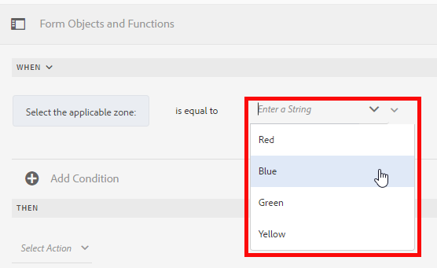

While writing a When rule, you can trigger the **Clear Value Of** action. The **Clear Value Of** action clears the value of the specified object. This ensures dependent fields reset appropriately, so having Clear Value Of as an option in the When statement lets you build complex conditions that span multiple fields.

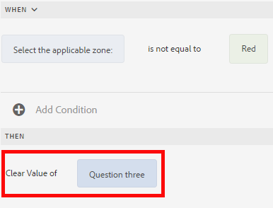

#### Actions Available in the When Rule Type

The When rule type supports the following actions:

**[!UICONTROL Hide]** Hides the specified object.

**[!UICONTROL Show]** Shows the specified object.

**[!UICONTROL Enable]** Enables the specified object.

**[!UICONTROL Disable]** Disables the specified object.

**[!UICONTROL Invoke service]** Invokes a service configured in a form data model (FDM). When you choose the Invoke Service operation, a field appears. On tapping the field, it displays all services configured across all form data models (FDM) on your [!DNL Experience Manager] instance. On choosing a Form Data Model (FDM) service, additional fields appear where you can map form objects with the input and output parameters for the specified service. See the example rule for invoking Form Data Model services.

In addition to a Form Data Model service, you can specify a direct Web Services Description Language (WSDL) URL to invoke a web service. However, because a Form Data Model (FDM) service offers many benefits, it is the recommended approach to invoke a service.

For more information about configuring services in a form data model (FDM), see [Experience Manager Forms Data Integration](data-integration.md).

**[!UICONTROL Set value of]** Computes and sets the value of the specified object. You can set the object value to a string, the value of another object, a computed value derived from a mathematical expression or function, the value of a property of an object, or the output value from a configured Form Data Model service. When you choose the web service option, it displays all services configured across all form data models (FDM) on your [!DNL Experience Manager] instance. On choosing a Form Data Model service, additional fields appear where you can map form objects with the input and output parameters for the specified service.

For more information about configuring services in a form data model (FDM), see [Experience Manager Forms Data Integration](data-integration.md).

The **[!UICONTROL Set Property]** rule type lets you set the value of a property of the specified object based on a condition action. You can set the property to one of the following:

* visible (Boolean)
* dorExclusion (Boolean)
* chartType (String)
* title (String)
* enabled (Boolean)
* mandatory (Boolean)
* validationsDisabled (Boolean)
* validateExpMessage (String)
* value (Number, String, Date)
* items (List)
* valid (Boolean)
* errorMessage (String)

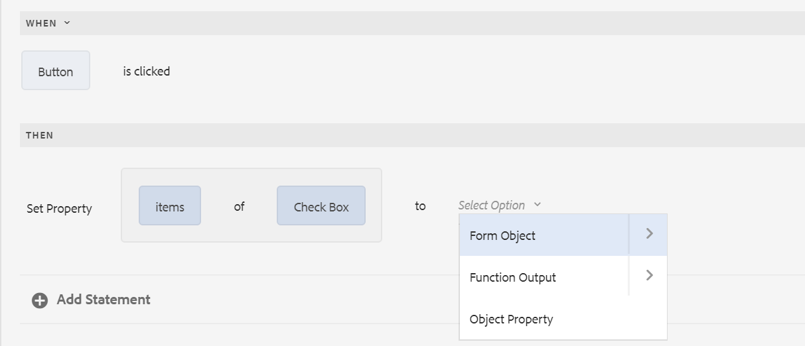

For example, the Set Property rule enables you to define rules that add check boxes dynamically to the Adaptive Form. You can use a custom function, a form object, or an object property to define such a rule.

To define a rule based on a custom function, select **[!UICONTROL Function Output]** from the drop-down list, and drag-and-drop a custom function from the **[!UICONTROL Functions]** tab. When the condition action is met, the number of checkboxes defined in the custom function are added to the Adaptive Form.

To define a rule based on a form object, select **[!UICONTROL Form Object]** from the drop-down list, and drag-and-drop a form object from the **[!UICONTROL Form Objects]** tab. When the condition action is met, the number of checkboxes defined in the form object are added to the Adaptive Form.

A Set Property rule based on an object property lets you add the number of checkboxes in an Adaptive Form based on another object property that is included in the Adaptive Form.

The following figure depicts an example of dynamically adding checkboxes based on the number of drop-down lists in the Adaptive Form:

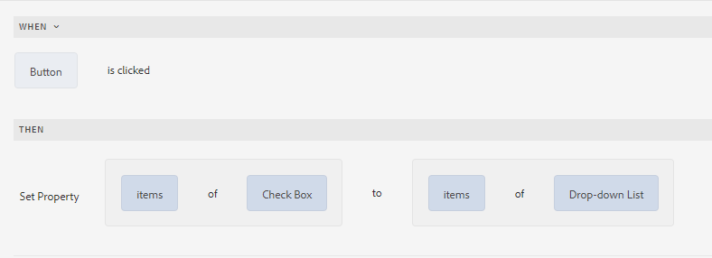

#### Adaptive Form Action Types

Each action below defines a specific behavior that can be triggered on a form object, enabling dynamic, interactive form experiences. These actions are widely used to control field values, manage focus, handle submissions, and build repeatable content structures.

**[!UICONTROL Clear Value Of]** Clears the value of the specified object. This resets a single field without affecting the rest of the form, which is useful for removing dependent or conditional entries.

**[!UICONTROL Set Focus]** Sets focus on the specified object. This directs the user's cursor to a targeted field, guiding the input flow and improving form usability.

**[!UICONTROL Save Form]** Saves the form. This preserves the user's current entries, allowing a partially completed session to be resumed later.

**[!UICONTROL Submit Forms]** Submits the form. This sends the collected data to the configured submission endpoint or workflow for processing.

**[!UICONTROL Reset Form]** Resets the form. This clears all entered values and returns every field to its default state.

**[!UICONTROL Validate Form]** Validates the form. This checks all fields against their configured rules, ensuring data is complete and correct before submission proceeds.

**[!UICONTROL Add Instance]** Adds an instance of the specified repeatable panel or table row. This enables dynamic content, allowing users to enter multiple sets of related information, such as adding additional line items or repeated field groups on demand.

**[!UICONTROL Remove Instance]** Removes an instance of the specified repeatable panel or table row. This lets users delete a previously added set of repeatable content, keeping the form free of unneeded entries.

**[!UICONTROL Navigate to]** Navigates to other Adaptive Forms, other assets such as images or document fragments, or an external URL. This supports multi-step form journeys and linking to supplementary resources, connecting one form experience to related content.

<!-- For more information, see [Add button to the Interactive Communication](create-interactive-communication.md#addbuttontothewebchannel). -->

### [!UICONTROL Set Value of] {#set-value-of}

The **[!UICONTROL Set Value of]** rule type dynamically sets the value of a form object based on whether a specified condition evaluates to TRUE or FALSE. This rule establishes a direct, condition-driven link between form objects, allowing one field to populate automatically from another source, a calculation, or backend data.

#### Supported value sources

The **[!UICONTROL Set Value of]** rule assigns a target object a value drawn from any of the following sources:

- The **value of another object** on the form
- A **literal string** (a fixed text value)
- A value **derived from a mathematical expression**
- A value **returned by a function**
- The **value of a property of another object**
- The **output of a Form Data Model service** — a service that connects the form to external data sources and returns data for use within the form

Similarly, the condition that triggers the rule can be evaluated against a **component**, a **string**, a **property**, or values derived from a **function or mathematical expression**. This flexibility lets authors build both simple value assignments and complex conditional logic within a single rule.

The **Set Value Of** rule type is **not available for certain form objects**, such as **panels and toolbar buttons**, because these objects do not hold a settable value in the same way that input fields do.

#### Standard rule structure

A standard **Set Value Of** rule follows this structure:

Set value of Object A to:

(string ABC) OR
(object property X of Object C) OR
(value from a function) OR
(value from a mathematical expression) OR
(output value of a data model service or web service);

When (optional):

(Condition 1 AND Condition 2 AND Condition 3) is TRUE;

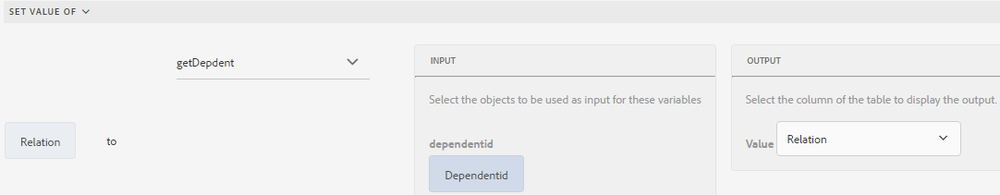

#### Example: Populating a field from a Form Data Model service

The following example takes the value in the `dependentid` field as input and sets the value of the `Relation` field to the output of the `Relation` argument of the `getDependent` **Form Data Model service**. As a result, whenever a valid `dependentid` is entered, the `Relation` field is populated automatically without manual entry.

Example of Set Value rule using Form Data Model service

>[!NOTE]
>
>You can also use the **Set Value of** rule to populate every option in a **drop-down list component** from the output of a **Form Data Model service** or a **web service**. To do this, ensure that the chosen output argument is of an **array type**, because a single scalar value cannot supply multiple drop-down options. As a result, all values returned in the array become available as selectable options in the specified drop-down list.

### [!UICONTROL Show] {#show}

The **[!UICONTROL Show]** rule type **displays or hides a form object based on whether a defined condition evaluates to True or False**. When you apply the **[!UICONTROL Show]** rule, the target object appears whenever its associated condition is satisfied, and it is automatically hidden when the condition is not satisfied. A **condition** here is a logical expression that resolves to either `True` (satisfied) or `False` (not satisfied).

This rule type is used to build **dynamic, conditional form behavior**, so that form objects appear only when they are relevant to the user. For example, a follow-up field can remain hidden until the user selects an option that makes it applicable, reducing clutter and guiding the user through the form.

#### How the Show rule works {#how-show-rule-works}

The **[!UICONTROL Show]** rule type combines two complementary actions in a single rule:

- **Show action** — displays the target object **when the condition is satisfied (returns `True`)**.
- **Hide action** — the rule **also triggers the Hide action when the condition is not satisfied or returns `False`**. As a result, you do not need to author a separate rule to hide the object; the **[!UICONTROL Show]** rule manages both states automatically.

This paired behavior ensures the object's visibility always stays synchronized with the current state of the condition, because every evaluation resolves to exactly one outcome — shown or hidden.

#### Rule structure {#show-rule-structure}

A typical **[!UICONTROL Show]** rule is structured as follows:

`Show Object A;`

`When:`

`(Condition 1 OR Condition 2 OR Condition 3) is TRUE;`

`Else:`

`Hide Object A;`

In this structure, **Object A** is shown when any one of the listed conditions is `TRUE`, because the conditions are joined with the `OR` operator. If none of the conditions are satisfied, the `Else` clause runs the **Hide** action and **Object A** is hidden.

### [!UICONTROL Hide] {#hide}

The **[!UICONTROL Hide]** rule type shows or hides a form object based on whether a specified condition is satisfied. Similar to the Show rule type, form authors can use the **[!UICONTROL Hide]** rule type to control the visibility of a form object dynamically at runtime.

The **[!UICONTROL Hide]** rule type behaves as follows:

- **Hides the object** when the defined condition is satisfied or evaluates to **`True`**.
- **Triggers the Show action** as its fallback when the condition is not satisfied or returns **`False`**. As a result, the object becomes visible instead of hidden. This built-in fallback ensures the object is never left in an undefined state, because every evaluation of the condition resolves to either a hide or a show outcome.

When multiple conditions are combined, they are joined with the **AND** operator, meaning every condition must be **`True`** for the Hide action to execute.

#### Rule Structure

A typical Hide rule is structured as follows:

`Hide Object A;`

`When:`

`(Condition 1 AND Condition 2 AND Condition 3) is TRUE;`

`Else:`

`Show Object A;`

In this structure, **Object A** is hidden only when the combined condition — **Condition 1 AND Condition 2 AND Condition 3** — evaluates to **`TRUE`**. Otherwise, the **Else** branch executes the **Show Object A** action, making the object visible.

### [!UICONTROL Enable] {#enable}

The **[!UICONTROL Enable]** rule type **enables or disables a form object based on whether a specified condition evaluates to TRUE or FALSE**. When the condition is satisfied (returns TRUE), the target object is enabled and becomes interactive for the user. When the condition is not satisfied or returns `False`, the Enable rule type **automatically triggers the Disable action**, disabling the target object.

This reciprocal behavior means a single Enable rule governs both states of an object: because the Disable action is invoked automatically whenever the condition fails, you do not need a separate rule to handle the disabled state. This ensures the object's availability stays consistently synchronized with the outcome of the condition throughout the user's interaction with the form.

The Enable rule type is commonly applied to create dynamic, conditional forms. For example, a submit button can remain disabled until all required conditions are met, or a dependent field can be enabled only when a related selection is made. This helps guide users through valid input paths and reduces incomplete or inconsistent submissions.

A typical Enable rule is structured as follows:

`Enable Object A;`

`When:`

`(Condition 1 AND Condition 2 AND Condition 3) is TRUE;`

`Else:`

`Disable Object A;`

In this structure, **Object A is enabled** only when Condition 1, Condition 2, and Condition 3 are **all TRUE simultaneously**, since the conditions are combined with the AND operator. If any one of these conditions returns **FALSE**, the `Else` clause executes and **Object A is disabled**, keeping the object's state directly tied to the combined result of every specified condition.

### [!UICONTROL Disable] {#disable}

Similar to the **[!UICONTROL Enable]** rule type, the **[!UICONTROL Disable]** rule type **disables a form object when a specified condition is satisfied**, and enables it otherwise. Disabling a form object makes it **non-interactive** — the field appears in the form but users cannot edit, select, or enter data into it until the disabling condition no longer holds.

#### How the Disable Rule Works

The **[!UICONTROL Disable]** rule type includes built-in complementary behavior: it **also triggers the [!UICONTROL Enable] action when the condition is not satisfied or returns `False`**. This means a single Disable rule manages both states of the object. When the defined condition evaluates to **`True`**, the object is **disabled**; when the condition evaluates to **`False`**, the object is automatically **enabled** again.

This dual behavior ensures the form object never remains locked in an outdated state. As a result, you do not need to author a separate Enable rule to reverse the effect — the Disable rule handles both outcomes, keeping the form's interactive state consistent with the underlying conditions in real time.

The **[!UICONTROL Disable]** rule type is commonly used to restrict user input dynamically, such as preventing entry into a field until a prerequisite selection is made, or greying out options that are not relevant based on prior responses.

#### Syntax and Structure

A typical Disable rule is structured as follows:

`Disable Object A;`

`When:`

`(Condition 1 OR Condition 2 OR Condition 3) is TRUE;`

`Else:`

`Enable Object A;`

In this structure, **Object A** is disabled when **any one** of the specified conditions (**Condition 1**, **Condition 2**, or **Condition 3**) evaluates to **`True`**, because the conditions are joined with the **OR** operator. If none of the conditions are met — the combined expression returns **`False`** — the **Else** clause executes and **Object A** is enabled.

### [!UICONTROL Validate] {#validate}

The **[!UICONTROL Validate]** rule type validates the value entered in a field by evaluating a logical **expression**. The rule executes the expression against the field's value: when the expression resolves to **TRUE**, the value is accepted, and when it resolves to **FALSE**, the value is rejected. This ensures that only data meeting your defined criteria is submitted, helping maintain **data integrity** and reducing errors caused by malformed or unexpected input.

For example, you can write an expression that verifies the text box for specifying a name contains **only alphabetic characters** — that is, it does **not** include special characters or numbers. This practical use of validation prevents invalid entries at the point of input, so downstream systems receive clean, correctly formatted data.

A typical Validate rule is structured as follows:

`Validate Object A;`

`Using:`

`(Expression 1 AND Expression 2 AND Expression 3) is TRUE;`

In this structure, multiple conditions are combined with the **AND** operator, meaning **every** expression must independently evaluate to TRUE for the overall rule to pass. If any single expression fails, the combined result is FALSE and the value does not comply. This lets you enforce several validation conditions on the same field simultaneously.

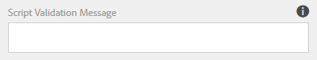

>[!NOTE]
>
>If the specified value does not comply with the Validate rule, the rule fails and you can, as a result, display a **validation message** to the user to explain the problem. You can specify this message in the **[!UICONTROL Script validation message]** field in the component properties in the sidebar.

### [!UICONTROL Set Options Of] {#setoptionsof}

The **[!UICONTROL Set Options Of]** rule type dynamically adds check boxes to an Adaptive Form. This rule type lets you define the check box options for a form field in one of two ways: from a **Form Data Model (FDM)** or from a **custom function**. Because the check boxes are generated by the rule rather than hardcoded, the options remain data-driven and update automatically when the underlying source changes.

#### Define a rule using a custom function

To define a rule based on a custom function:

1. Select **[!UICONTROL Function Output]** from the drop-down list.

   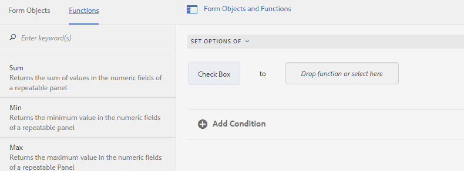

1. Drag and drop a custom function from the **[!UICONTROL Functions]** tab.

Because the check boxes are generated from the function output, the **number of check boxes added to the Adaptive Form matches the number of checkboxes defined in the custom function**. This ensures the rendered form reflects exactly what the function returns.

To create a custom function, see [custom functions in rule editor](#custom-functions).

#### Define a rule using a Form Data Model (FDM)

To define a rule based on a **Form Data Model (FDM)**:

1. Select **[!UICONTROL Service Output]** from the drop-down list.

   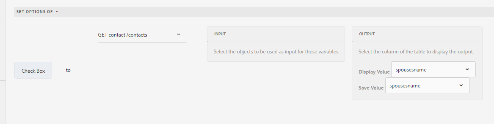

1. Select the data model object.
1. Select a data model object property from the **[!UICONTROL Display Value]** drop-down list. The number of check boxes rendered in the Adaptive Form is derived from the number of instances defined for that property in the database. This keeps the form synchronized with the data stored for that property, so the check box options reflect the current database state.
1. Select a data model object property from the **[!UICONTROL Save Value]** drop-down list. This property determines the value that is persisted when a user selects a check box.

## Understanding the rule editor user interface {#understanding-the-rule-editor-user-interface}

The **rule editor** provides a comprehensive yet straightforward user interface for writing and managing rules in an **Adaptive Form**. Rules automate form behavior—controlling actions such as showing or hiding fields, enabling or disabling components, setting values, invoking services, and validating user input—without requiring manual coding. This allows form authors to build dynamic, responsive forms directly within the authoring environment. You can launch the rule editor user interface from within an Adaptive Form in authoring mode.

### How to launch the rule editor user interface

Follow these steps to open the rule editor:

1. Open an **Adaptive Form** in authoring mode.
1. Select the form object for which you want to write a rule. In the Component Toolbar, select . The rule editor user interface appears.

   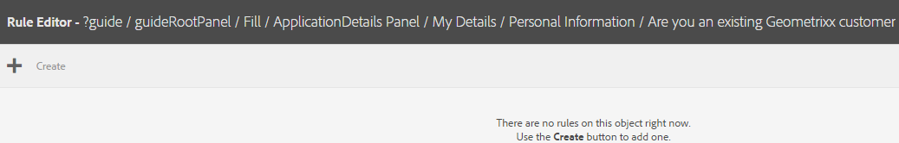

   Any existing rules on the selected form object are listed in this view. This lets you review, edit, or delete rules already applied to the object. For information about managing existing rules, see [Manage rules](rule-editor.md#p-manage-rules-p).

1. Select **[!UICONTROL Create]** to write a new rule. The **visual editor** opens by default the first time you launch the rule editor, providing a guided, menu-driven way to construct rule logic.

   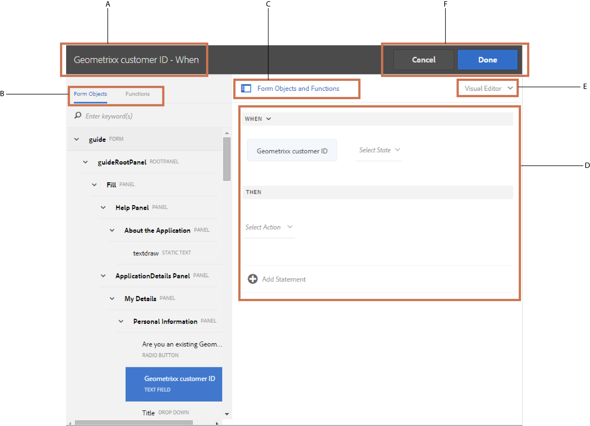

### Components of the rule editor user interface

The following sections describe each component of the rule editor user interface in detail, explaining its role in building and managing form rules.

### A. Component-rule display {#a-component-rule-display}

The **Component-rule display** identifies the Adaptive Form object through which you launched the rule editor, along with the rule type currently selected. This orientation area sits at the top of the rule editor and serves as a persistent reference point, confirming exactly which form component the rule applies to and which category of logic is being defined.

In the above example, the rule editor is launched from an Adaptive Form object titled **Salary**, and the rule type selected is **When**. This tells you that any conditions and actions you configure will be attached to the **Salary** component and evaluated as a **When** rule, meaning the logic is triggered in response to a defined event or condition on that object.

Because a single Adaptive Form can contain many components—each with its own rules—the **Component-rule display** helps you confirm you are editing logic for the intended object and rule type. As a result, it reduces the risk of applying a rule to the wrong field and provides immediate context whenever you open or return to the rule editor.

### B. Form objects and functions {#b-form-objects-and-functions-br}

The pane on the left in the rule editor user interface includes two tabs — **[!UICONTROL Forms Objects]** and **[!UICONTROL Functions]**.

The Form Objects tab shows a hierarchical view of all objects contained in the Adaptive Form, displaying both the **title** and **type** of each object. When writing a rule, you can drag-drop form objects directly onto the rule editor. When you drag-and-drop an object or function into a placeholder, the placeholder automatically takes the appropriate value type. This ensures the rule remains valid and reduces manual type configuration.

Form objects are visually flagged by rule status:

- Form objects that have one or more **valid rules applied** are marked with a **Green dot**.
- If any of the rules applied to a form object are **invalid**, that form object is instead marked with a **Yellow dot**, signaling that the rule requires correction before it will function.

The Functions tab includes a set of built-in functions that you can use to compute values in repeatable panels and table rows, and reference in action and condition statements when writing rules. These built-in functions include:

- **Sum Of** — computes the total of the specified values.
- **Min Of** — returns the minimum value.
- **Max Of** — returns the maximum value.
- **Average Of** — computes the average of the specified values.
- **Number Of** — counts the specified items.
- **Validate Form** — validates the form.

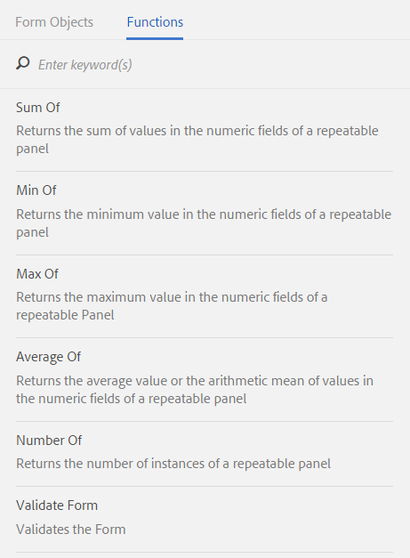

You can also create [custom functions](#custom-functions) to extend this built-in set.

>[!NOTE]
>
>You can perform text search on objects and functions names and titles in Forms Objects and Functions tabs.

In the left tree of the form objects, you can select any form object to display the rules applied to that object. Beyond navigating through the rules of the various form objects, you can also copy-paste rules between form objects, allowing you to reuse existing rule logic instead of rebuilding it. For more information, see [Copy-paste rules](rule-editor.md#p-copy-paste-rules-p).

### C. Form objects and functions toggle {#c-form-objects-and-functions-toggle-br}

Tapping the toggle button shows or hides the **Form Objects and Functions pane**. This single control switches the pane between its visible and hidden states, giving you direct command over whether the panel appears in the workspace.

The **Form Objects and Functions pane** is the panel that lists the interactive elements available for building or editing a form — such as fields, controls, and the functions that can be applied to them. Because this pane occupies space within the interface, the toggle serves a practical purpose: hiding it frees up screen area for the form canvas itself, while showing it restores immediate access to the objects and functions you need.

**Key behaviors of the toggle:**

- **Show:** Tapping the button reveals the pane, making its form objects and functions available for selection and configuration.
- **Hide:** Tapping the button again collapses the pane, maximizing the visible working area.

This toggle is especially useful when you want an uncluttered view of the form during layout and review, and then need to bring the objects and functions back into view when you resume editing.

### D. Visual rule editor {#visual-rule-editor}

The **visual rule editor** is the area within the visual editor mode of the **rule editor** user interface where you write rules. It serves as the primary workspace for building rule logic without manual scripting, letting you construct rules through a graphical, form-driven interface.

The **visual rule editor** lets you select a rule type and then define its conditions and actions accordingly. Because rule behavior depends on the selected rule type, the editor adapts the available conditions and actions to match that type, ensuring the logic you build is valid for the rule you intend to create.

**Key capabilities of the visual rule editor:**

- **Select a rule type** to determine the structure and purpose of the rule.
- **Define conditions** that specify when the rule should evaluate or trigger.
- **Define actions** that specify what the rule does when its conditions are met.
- **Drag and drop form objects and functions** directly from the **Form Objects and Functions** pane into your conditions and actions.

You can drag and drop form objects and functions from the **Form Objects and Functions** pane so that rule logic is assembled visually rather than typed by hand, which reduces manual errors and speeds up rule authoring.

For more information about using the visual rule editor, see [Write rules](rule-editor.md#p-write-rules-p).

<!-- 
### E. Visual-code editors switcher {#e-visual-code-editors-switcher}

Users in the forms-power-users group can access code editor. For other users, code editor is not available. If you have the rights, you can switch from visual editor mode to code editor mode of the rule editor, and conversely, using the switcher right above the rule editor. When you launch rule editor the first time, it opens in the visual editor mode. You can write rules in the visual editor mode or switch to the code editor mode to write a rule script. However, note that if you modify a rule or write a rule in code editor, you cannot switch back to the visual editor for that rule unless you clear the code editor.

[!DNL Experience Manager Forms] tracks the rule editor mode you used last to write a rule. When you launch the rule editor next time, it opens in that mode. However, you can also configure a default mode to open the rule editor in the specified mode. To do so:

1. Go to [!DNL Experience Manager] web console at `https://[host]:[port]/system/console/configMgr`.
1. Click to edit **[!UICONTROL Adaptive Form Configuration Service]**.
1. choose **[!UICONTROL Visual Editor]** or **[!UICONTROL Code Editor]** from the **[!UICONTROL Default Mode for Rule Editor]** drop-down

1. Click **[!UICONTROL Save]**.
-->

### E. Done and cancel buttons {#done-and-cancel-buttons}

The **[!UICONTROL Done]** button saves a rule. You can save an incomplete rule. However, incomplete rules are invalid and do not run, because they lack the conditions or actions required for execution. Saved rules on a form object are listed each time you launch the rule editor from that same form object, allowing you to review, edit, or delete them. You can manage all existing rules from that view. For more information, see [Manage rules](rule-editor.md#p-manage-rules-p).

The **[!UICONTROL Cancel]** button discards all changes made to a rule and closes the rule editor without saving.

## Write rules {#write-rules}

The visual rule editor enables users to create and manage rules through a graphical, no-code interface. Rules define the conditions and actions that control how a system responds to specific inputs, events, or data — for example, triggering an action when a condition is met. The visual rule editor presents these components visually, so rules are built by selecting and configuring elements rather than writing code by hand.

### What the visual rule editor is

The visual rule editor is a graphical tool for authoring rules without manual coding. It typically represents each rule as a combination of **conditions** (the criteria that must be satisfied) and **actions** (what happens when those conditions are met). Because the logic is displayed visually, users can review, adjust, and validate rules more easily than when editing raw code, reducing the likelihood of syntax errors.

### Writing rules with the visual editor

Writing rules in the visual editor generally follows a straightforward sequence:

1. **Open the visual rule editor** to begin creating a new rule.
2. **Define the conditions** that determine when the rule applies, selecting the relevant fields, operators, and values.
3. **Specify the actions** the rule should perform when its conditions are met.
4. **Review the rule** as it is displayed visually to confirm the logic is correct.
5. **Save the rule** so it becomes active within the system.

This visual, step-by-step approach makes rule authoring accessible to both technical and non-technical users.

### Why use the visual rule editor

The visual rule editor offers several practical benefits:

- **No-code authoring** — build rules without writing or understanding underlying code.
- **Clearer logic** — see conditions and actions laid out visually, making complex rules easier to understand.
- **Faster editing** — adjust rules quickly, since changes are made through a guided interface rather than manual code changes.
- **Fewer errors** — the structured interface helps prevent the syntax mistakes common in hand-written rules.

Using the visual rule editor is the recommended starting point for creating rules, because it provides an intuitive, guided way to translate business logic into working conditions and actions.

### Using visual editor {#using-visual-editor}

Learn how to create a rule in the visual editor using the following example loan application form. This walkthrough builds two rules: one that controls field visibility based on user input, and one that performs a mathematical calculation to derive a value.

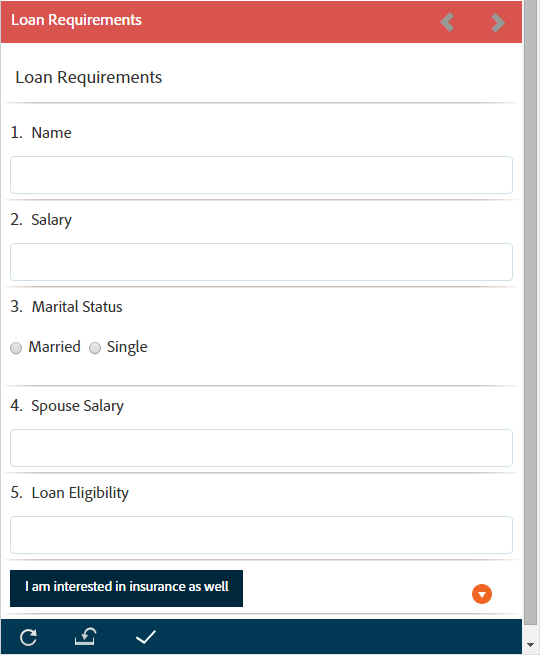

The Loan Requirements section in the example loan application form requires applicants to specify their marital status, salary, and, if married, their spouse's salary. Based on the user inputs, the rule computes the loan eligibility amount and displays it in the Loan Eligibility field. Apply the following two rules to implement the scenario:

* The Spouse's Salary field is shown only when the Marital Status is **Married**.
* The loan eligibility amount is **50% of the total salary**.

To write these rules, perform the following steps:

#### Rule 1: Control Spouse Salary field visibility

1. First, write the rule to control the visibility of the Spouse Salary field based on the option the user selects for the Marital Status radio button.

   Open the loan application form in authoring mode. Select the **[!UICONTROL Marital Status]** component and select . Next, select **[!UICONTROL Create]** to launch the rule editor.

   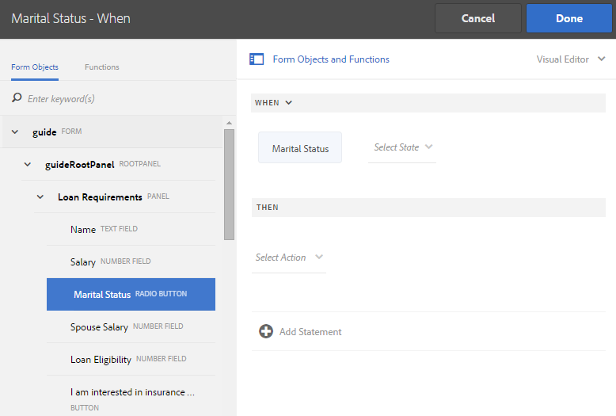

   When you launch the rule editor, the When rule is selected by default. The form object (in this case, Marital Status) from which you launched the rule editor is specified in the When statement.

   You cannot change or modify the selected object, but you can use the rule drop-down, as shown below, to select another rule type. To create a rule on another object, select Cancel to exit the rule editor and relaunch it from the desired form object.

1. Select the **[!UICONTROL Select State]** drop-down and select **[!UICONTROL is equal to]**. The **[!UICONTROL Enter a String]** field appears.

   

   In the Marital Status radio button, the **[!UICONTROL Married]** and **[!UICONTROL Single]** options are assigned **0** and **1** values, respectively. You can verify the assigned values in the Title tab of the Edit radio button dialog as shown below.

   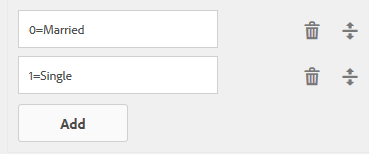

1. In the **[!UICONTROL Enter a String]** field in the rule, specify **0**.

   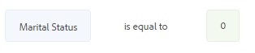

   You have defined the condition as `When Marital Status is equal to Married`. Next, define the action to perform if this condition is True.

1. In the Then statement, select **[!UICONTROL Show]** from the **[!UICONTROL Select Action]** drop-down.

1. Drag and drop the **[!UICONTROL Spouse Salary]** field from the Form Objects tab onto the **[!UICONTROL Drop object or select here]** field. Alternatively, select the **[!UICONTROL Drop object or select here]** field and select the **[!UICONTROL Spouse Salary]** field from the pop-up menu, which lists all form objects in the form.

   The rule appears as follows in the rule editor.

   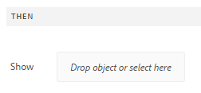

1. Select **[!UICONTROL Done]** to save the rule.

1. Repeat steps 1 through 5 to define another rule that hides the Spouse Salary field when the Marital Status is Single. The rule appears as follows in the rule editor.

   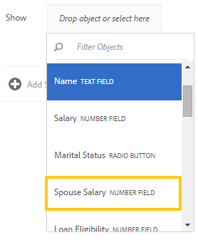

   >[!NOTE]
   >
   >Alternatively, you can write one Show rule on the Spouse Salary field, instead of two When rules on the Marital Status field, to implement the same behavior.

   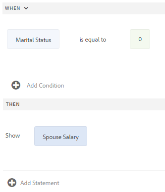

#### Rule 2: Compute loan eligibility

1. Next, write a rule to compute the loan eligibility amount, which is **50% of the total salary**, and display it in the Loan Eligibility field. This computes the applicant's borrowing capacity from combined household income. To achieve this outcome, create a **[!UICONTROL Set value Of]** rule on the Loan Eligibility field.

   In authoring mode, select the **[!UICONTROL Loan Eligibility]** field and select . Next, select **[!UICONTROL Create]** to launch the rule editor.

   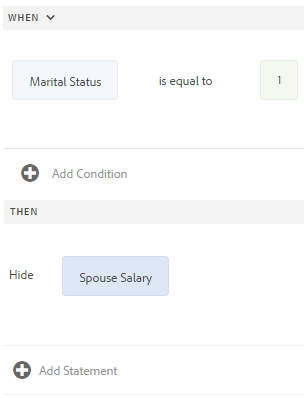

1. Select the **[!UICONTROL Set Value Of]** rule from the rule drop-down.

1. Select **[!UICONTROL Select Option]** and select **[!UICONTROL Mathematical Expression]**. A field to write a mathematical expression opens.

   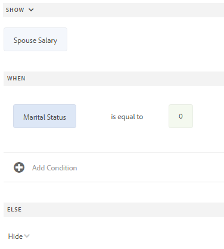

1. In the expression field, build the total-salary calculation:

    * Select or drag and drop the **[!UICONTROL Salary]** field from the Forms Object tab into the first **[!UICONTROL Drop object or select here]** field.

    * Select **[!UICONTROL Plus]** from the **[!UICONTROL Select Operator]** field.

    * Select or drag and drop the **[!UICONTROL Spouse Salary]** field from the Forms Object tab into the other **[!UICONTROL Drop object or select here]** field. This produces the total salary, the sum of the applicant's salary and the spouse's salary.

   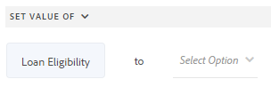

1. Extend the expression to calculate **50%** of the total salary:

    * Enclose the Salary plus Spouse Salary sum in parentheses so the addition is evaluated first.

    * Select **[!UICONTROL Multiply]** from the **[!UICONTROL Select Operator]** field.

    * Enter **0.5** in the next **[!UICONTROL Drop object or select here]** field. This multiplies the total salary by **0.5**, producing an eligibility amount equal to **50% of the total salary**.

   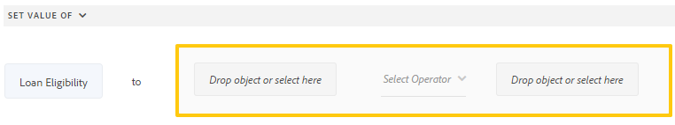

1. Select **[!UICONTROL Done]** to save the rule. The Loan Eligibility field now displays the computed amount automatically whenever the applicant enters or updates the Salary or Spouse Salary values.

   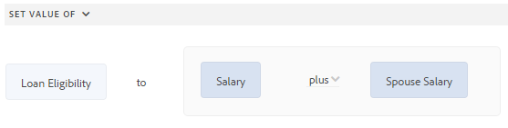

1. Next, select in the highlighted area around the expression field and select **[!UICONTROL Extend Expression]**.

   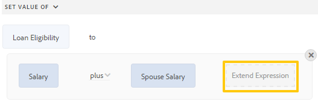

   In the extended expression field, select **[!UICONTROL divided by]** from the **[!UICONTROL Select Operator]** field and **[!UICONTROL Number]** from the **[!UICONTROL Select Option]** field. Then, specify **[!UICONTROL 2]** in the number field.

   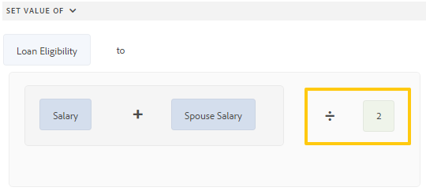

   >[!NOTE]
   >
   >You can create complex expressions by using components, functions, mathematical expressions, and property values from the Select Option field.

   Next, create a condition, which, when it returns True, executes the expression. This ensures the calculation runs only when the specified condition is met.

1. Select **[!UICONTROL Add Condition]** to add a When statement.

   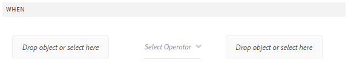

   In the When statement:

    * Select or drag-drop from the Forms Object tab the **[!UICONTROL Marital Status]** field in the first **[!UICONTROL Drop object or select here]** field.

    * Select **[!UICONTROL is equal to]** from the **[!UICONTROL Select Operator]** field.

    * Select String in the other **[!UICONTROL Drop object or select here]** field and specify **[!UICONTROL Married]** in the **[!UICONTROL Enter a String]** field.

   The rule finally appears as follows in the rule editor.  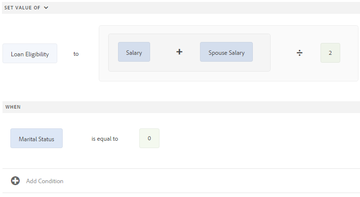

1. Select **[!UICONTROL Done]**. It saves the rule.

1. Repeat steps 7 through 14 to define another rule to compute the loan eligibility if the marital Status is Single. The rule appears as follows in the rule editor.

   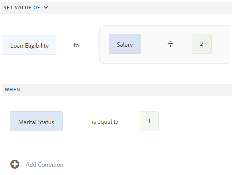

>[!NOTE]
>
>Alternatively, you can use the Set Value Of rule to compute the loan eligibility in the When rule that you created to show-hide the Spouse Salary field. The resultant combined rule when Marital Status is Single appears as follows in the rule editor.
>
>Similarly, you can write a combined rule to control visibility of the Spouse Salary field and compute loan eligibility when the Marital Status is Married.

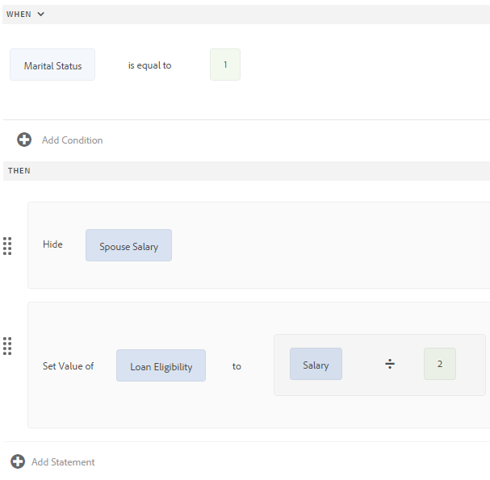

<!--
 ### Using code editor {#using-code-editor}

Users added to the forms-power-users group can use code editor. The rule editor auto generates the JavaScript code for any rule you create using visual editor. You can switch from visual editor to the code editor to view the generated code. However, if you modify the rule code in the code editor, you cannot switch back to the visual editor. If you prefer writing rules in code editor rather than visual editor, you can write rules afresh in the code editor. The visual-code editors switcher helps you switch between the two modes.

The code editor JavaScript is the expression language of Adaptive Forms. All the expressions are valid JavaScript expressions and use Adaptive Forms scripting model APIs. These expressions return values of certain types. For the complete list of Adaptive Forms classes, events, objects, and public APIs, see [JavaScript Library API reference for Adaptive Forms](https://helpx.adobe.com/experience-manager/6-5/forms/javascript-api/index.html).

For more information about guidelines to write rules in the code editor, see [Adaptive Form Expressions](adaptive-form-expressions.md).

While writing JavaScript code in the rule editor, the following visual cues help you with the structure and syntax:

* Syntax highlights

* Auto Indentation

* Hints and suggestions for Form objects, functions, and their properties

* Auto completion of form component names and common JavaScript functions

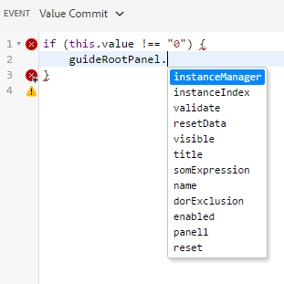
-->

#### Custom functions in rule editor {#custom-functions}

>[!NOTE]
>
> Custom functions must be compatible with ECMAScript 5 (ES5). Foundation Forms support only ES5; use of newer ECMAScript versions (ECMAScript 6, or ES6, and above) is not supported and may result in errors or unexpected behavior.

Apart from the out-of-the-box functions like *Sum of* that are listed under Functions Output, you can write custom functions that you frequently need. Ensure that the function you write is accompanied by the `jsdoc` above it.

Accompanying `jsdoc` is required:

* If you want custom configuration and description
* Because there are multiple ways to declare a function in `JavaScript,` and comments let you keep a track of the functions.

Rule editor supports JavaScript ES5 syntax for scripts and custom functions.
For more information, see [jsdoc.app](https://jsdoc.app/).

Supported `jsdoc` tags:

* **Private**
  Syntax: `@private`
  A private function is excluded from the list of custom functions.

* **Name**
  Syntax: `@name funcName <Function Name>`
  Alternatively `,` you can use: `@function funcName <Function Name>` **or** `@func` `funcName <Function Name>`.
  `funcName` is the name of the function (no spaces allowed).
  `<Function Name>` is the display name of the function.

* **Member**
  Syntax: `@memberof namespace`
  Attaches a namespace to the function.

* **Parameter**
  Syntax: `@param {type} name <Parameter Description>`
  Alternatively, you can use: `@argument` `{type} name <Parameter Description>` **or** `@arg` `{type}` `name <Parameter Description>`.
  Shows parameters used by the function. A function can have multiple parameter tags, one tag for each parameter in the order of occurrence.
  `{type}` represents parameter type. Allowed parameter types are:

    1. string
    1. number
    1. boolean
    1. scope

   Scope refers to fields of an Adaptive Form. When a form uses lazy loading, you can use `scope` to access its fields. You can access fields either when the fields are loaded or if the fields are marked global.

  All parameter types are categorized under one of the above. None is not supported. Ensure that you select one of the types above. Types are not case-sensitive. Spaces are not allowed in the parameter `name`. `<Parameter Descrption>` `<parameter>  can have multiple words. </parameter>`

* **Return Type**
  Syntax: `@return {type}`
  Alternatively, you can use `@returns {type}`.
  Adds information about the function, such as its objective.
  {type} represents the return type of the function. Allowed return types are:

    1. string
    1. number
    1. boolean

  All other return types are categorized under one of the above. None is not supported. Ensure that you select one of the types above. Return types are not case-sensitive.

  * **This**
   Syntax: `@this currentComponent`

   Use `@this` to reference the specific Adaptive Form component on which the rule is written, allowing the function to access that component's properties and value directly.

   The following example is based on the field value. In this example, the rule hides a field in the form. The `this` portion of `this.value` refers to the underlying Adaptive Form component on which the rule is written.

   ```
      /**
      * @function myTestFunction
      * @this currentComponent
      * @param {scope} scope in which code inside function is run.
      */
      myTestFunction = function (scope) {
         if(this.value == "O"){
               scope.age.visible = true;
         } else {
            scope.age.visible = false;
         }
      }

   ```

   >[!NOTE]
   >
   >Comments placed before a custom function serve as its summary. The summary can extend to multiple lines until a tag is encountered. Limit the size to a single line for a concise description in the rule builder.

**Adding a custom function**

For example, you want to add a custom function that calculates the area of a square. The side length is the user input to the custom function, which is accepted using a numeric box in your form. The calculated output is displayed in another numeric box in your form. To add a custom function, you first create a client library, and then add it to the CRX repository.

To create a client library and add it to the CRX repository, perform the following steps:

1. Create a client library. For more information, see [Using Client-Side Libraries](https://experienceleague.adobe.com/docs/experience-manager-cloud-service/implementing/developing/full-stack/clientlibs.html#developing).
1. In CRXDE, add a property `categories` with string type value as `customfunction` to the `clientlib` folder. This registers the client library under a named category so the Adaptive Form can locate and load your custom functions.

   >[!NOTE]
   >
   >`customfunction` is an example category. You can choose any name for the category you create in the `clientlib` folder.

After you have added your client library in the CRX repository, use it in your Adaptive Form. As a result, the custom function becomes available for use as a rule within your form. To add the client library in your Adaptive Form, perform the following steps:

1. Open your form in edit mode.
   To open a form in edit mode, select a form and select **[!UICONTROL Open]**.
1. In the edit mode, select a component, then select  &gt; **[!UICONTROL Adaptive Form Container]**, and then select .
1. In the sidebar, under Name of Client Library, add your client library. (`customfunction` in the example.)

   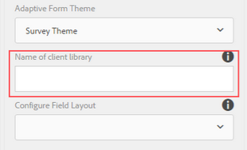

1. Select the input numeric box, and select  to open the rule editor.
1. Select **[!UICONTROL Create Rule]**. Using the options shown below, create a rule to save the squared value of the input in the Output field of your form.

   [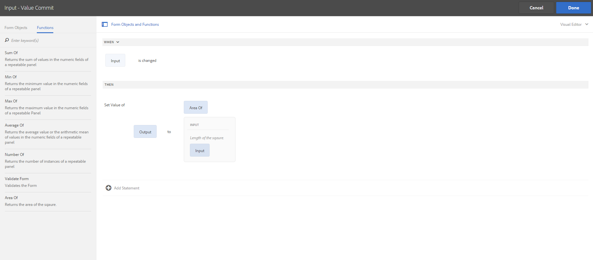](assets/add-custom-rule.png)

1. Select **[!UICONTROL Done]**. Your custom function is added.

   >[!NOTE]
   >
   > To invoke a form data model (FDM) from the rule editor using custom functions, [see here](/help/forms/using-form-data-model.md#invoke-services-in-adaptive-forms-using-rules-invoke-services).

#### Function declaration supported types {#function-declaration-supported-types}

**Function Statement**

```javascript
function area(len) {
    return len*len;
}
```

This function is included without `jsdoc` comments.

**Function Expression**

```javascript
var area;
//Some codes later
/** */
area = function(len) {
    return len*len;
};
```

**Function Expression and Statement**

```javascript
var b={};
/** */
b.area = function(len) {
    return len*len;
}
```

**Function Declaration as Variable**

```javascript
/** */
var x1,
    area = function(len) {
        return len*len;
    },
    x2 =5, x3 =true;
```

Limitation: The custom function picks only the first function declaration from the variable list, if declared together. For every function declared, use a function expression to ensure each is recognized.

**Function Declaration as Object**

```javascript
var c = {
    b : {
        /** */
        area : function(len) {
            return len*len;
        }
    }
};
```

>[!NOTE]
>
>Ensure that you use `jsdoc` for every custom function. Although detailed `jsdoc` comments are encouraged, you must include at least an empty `jsdoc` comment to mark your function as a custom function. This marking enables default handling of your custom function and allows the rule builder to identify and expose it correctly within your form.

### Supporting Custom functions in Validation Expressions {#supporting-custom-functions-in-validation-expressions-br}

When forms require **complex validation rules**, the validation logic resides in custom functions, and the author calls these custom functions directly from a field validation expression. To make this custom function library known and available during server-side validation, the form author configures the name of the **Adobe [!DNL Experience Manager] (AEM) client library** under the **[!UICONTROL Basic]** tab of the Adaptive Form Container properties, as shown below.

This configuration establishes a single, reusable location for validation logic that runs both on the client and on the server. Because the same client library is referenced during server-side validation, custom validation functions behave consistently regardless of where the validation executes.


**Configuring a custom function library per Adaptive Form:**

1. Open the **Adaptive Form Container** properties.
2. Navigate to the **[!UICONTROL Basic]** tab.
3. Enter the name of the **AEM client library** that contains the custom JavaScript validation functions.

The form author can configure a **custom JavaScript library per Adaptive Form**. Within this library, keep only the reusable functions that are called from validation expressions. This ensures the library stays focused, avoids unnecessary code on the server side, and makes validation logic easier to maintain and reuse across fields.

These reusable functions have a dependency on the **jQuery** and **Underscore.js** third-party libraries. Because these dependencies must be available for the custom functions to execute correctly, ensure they are loaded alongside the configured client library so that both client-side and server-side validation resolve successfully.

## Error handling on Submit Action {#error-handling-on-submit-action}

### Configure Custom Error Pages

As part of the **Adobe [!DNL Experience Manager] (AEM)** security and hardening guidelines, configure custom error pages named **400.jsp**, **404.jsp**, and **500.jsp**. AEM invokes these handlers whenever a form submission returns a **400**, **404**, or **500** error. AEM also invokes the same handlers when these error codes are triggered on the Publish node, ensuring consistent error responses across both authoring and publishing environments.

Each handler maps directly to a standard HTTP status code:

- **400.jsp** — handles **Bad Request (400)** errors returned on form submission.
- **404.jsp** — handles **Not Found (404)** errors returned on form submission.
- **500.jsp** — handles **Internal Server Error (500)** responses returned on form submission.

Administrators can also create additional JSP pages for other HTTP error codes, extending consistent, branded error handling to any response an Adaptive Form may generate.

### Preventing Data Loss for Unbounded Fields

Unbounded fields lose their data during prefill when the supplied data does not include the required Adaptive Form data tags. Unbounded fields are Adaptive Form fields that do not have the **`bindref`** property, meaning they are not mapped to a schema binding.

This data loss occurs when you prefill a **Form Data Model (FDM)** or a schema-based Adaptive Form with **eXtensible Markup Language (XML)** or **JavaScript Object Notation (JSON)** data that is compliant with a schema but does not contain the following tags:

- **`<afData>`**
- **`<afBoundData>`**
- **`<afUnboundData>`**

The supporting schema can be an XML schema, a JSON schema, or a Form Data Model (FDM). Because unbounded fields have no schema binding through the **`bindref`** property, AEM relies on the **`<afUnboundData>`** container to carry their values. When that container is absent from the prefill data, the values of unbounded fields cannot be resolved and are lost. To preserve unbounded field data during prefill, always include the **`<afData>`**, **`<afBoundData>`**, and **`<afUnboundData>`** tags in the XML or JSON payload.

## Manage rules {#manage-rules}

<!-- in visual  or code editor mode depending on the mode used to create the rule -->

When you select a form object and select , the Manage rules interface lists **all existing rules on that object**, letting you view each rule's title alongside a preview of its rule summary. The UI enables you to expand and view the complete rule summary, change the order of rules, edit rules, and delete rules from a single, centralized view.

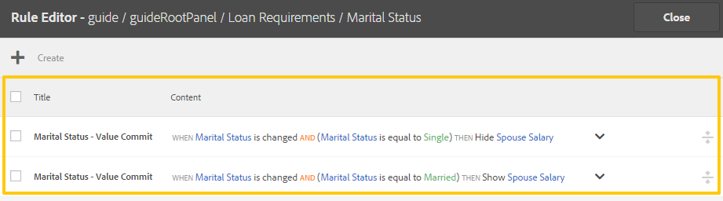

You can perform the following actions on rules:

* **Expand/Collapse**: The **Content column** in the rule list displays the rule content. If the entire rule content is not visible in the default view, select  to expand it and reveal the full rule details.

* **Reorder**: Any new rule you create is stacked at the **bottom of the rule list**. **Rules execute from top to bottom**, so the rule at the top executes first, followed by other rules of the same type. This ordering matters because it determines the sequence in which conditional logic is applied at runtime. For example, suppose you have **When, Show, Enable, and When** rules positioned first, second, third, and fourth from the top, respectively. The **When rule at the top executes first**, followed by the **When rule at the fourth position**. The **Show and Enable rules execute afterward**. To change the order of a rule, select  against it, or drag and drop it to the desired position in the list.

* **Edit**: To edit a rule, select the check box next to the rule title. Options to edit and delete the rule appear. Select **[!UICONTROL Edit]** to open the selected rule in the rule editor.

* **Delete**: To delete a rule, select the rule and select **[!UICONTROL Delete]**.

* **Enable/Disable**: When you must suspend usage of a rule temporarily, select one or more rules and select **[!UICONTROL Disable]** in the Actions toolbar to disable them. Because a disabled rule is excluded from evaluation, it does not execute at runtime, allowing you to pause a rule without permanently deleting it. To re-enable a disabled rule, select the rule and select **Enable** in the Actions toolbar. The **Status column** of the rule displays whether the rule is enabled or disabled.

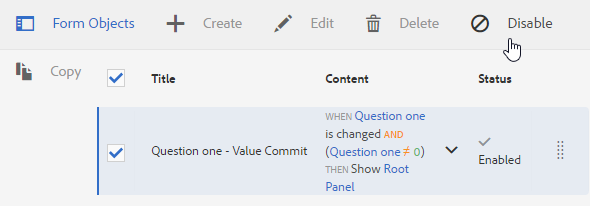

## Copy-paste rules {#copy-paste-rules}

Copy-paste a rule from one field to other similar fields to save time and ensure consistency across your form. This lets you reuse a configured rule without rebuilding it manually on every form object.

To copy-paste rules, do the following:

1. Select the form object from which you want to copy a rule, and in the component toolbar select . The rule editor user interface appears with the form object selected and the existing rules appear.

   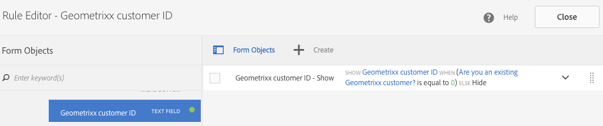

   For information about managing existing rules, see [Manage rules](rule-editor.md#p-manage-rules-p).

2. Select the check box next to the rule title. Options to manage the rule appear. Select **[!UICONTROL Copy]**.

   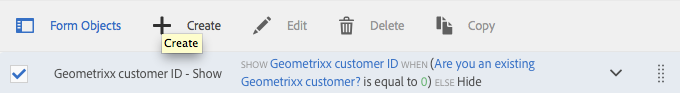

3. Select another form object to which you want to paste the rule and select **[!UICONTROL Paste]**. After pasting, edit the rule to make changes to the rule as needed for the target form object.

   >[!NOTE]
   >
   >Paste a rule to another form object only if that form object supports the copied rule's event. This restriction exists because each form object type responds to specific events. For example, a button supports the click event. As a result, you can paste a rule with a click event to a button but not to a check box, because a check box does not support the click event.

4. Select **[!UICONTROL Done]** to save the rule.

## Nested expressions {#nestedexpressions}

The **Rule editor** supports **nested expressions**, allowing you to combine multiple **AND** and **OR** operators within a single rule to build **nested rules**. Mixing **AND** and **OR** operators lets you express complex, multi-condition logic in one rule, so that outcomes trigger only when specific combinations of conditions are satisfied. This capability is essential for scenarios where a single flat condition is insufficient and layered decision logic is required.

For example, a nested rule can display a message to the user about eligibility for a child's custody, showing the message only when all of the required conditions are met. Because the operators are nested, the Rule editor evaluates each grouped condition together, ensuring that eligibility logic reflects the exact combination of criteria defined in the rule.

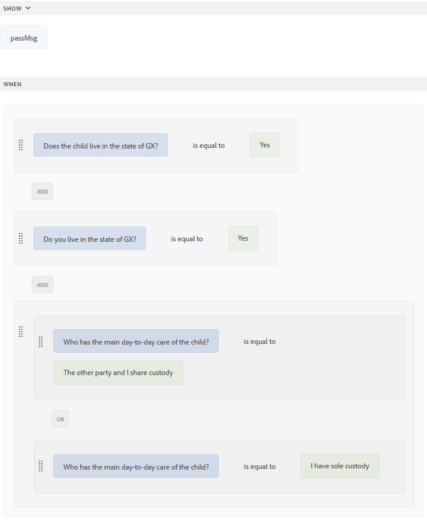

### Reordering conditions with drag-and-drop

You can also **drag-and-drop** conditions within a rule to edit its structure without deleting and re-adding conditions. To reposition a condition:

1. Select and hover over the handle ( ) that appears before the condition.
2. Wait until the pointer turns into the hand symbol, as shown below. The hand symbol indicates that the condition is ready to be moved.
3. Drag the condition and drop it anywhere within the rule.
4. Release the condition to place it in its new position.

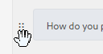

Once the condition is dropped, the rule structure changes to reflect the new arrangement, because the editor re-evaluates the placement of AND and OR operators relative to the moved condition. This lets you refine the logic of a nested rule quickly and preserve the intended eligibility outcomes.

## Date expression conditions {#dateexpression}

The **Rule editor** enables date comparisons to create conditional logic in **Adaptive Forms**. Date expressions compare one date value against another—most commonly a user-entered date against the **current date**—and trigger form behavior based on the result.

### Example: Displaying an income note based on mortgage date

The following example condition displays a static text object when the mortgage on the house is already taken, which the user indicates by entering a value in the date field.

Because the mortgage date entered by the user falls in the past, the **Adaptive Form** displays a note about the income calculation. The rule compares the date the user enters with the **current date**, and when the user-entered date is earlier than the **current date**, the form displays the text message named **Income**.

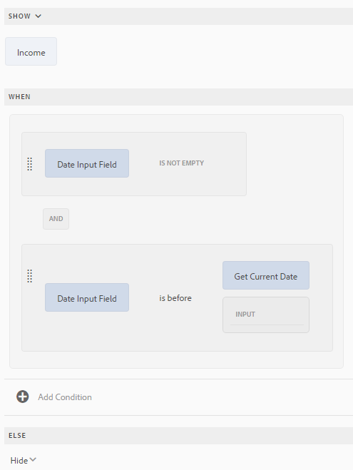

### How the date comparison works

The rule evaluates the condition as follows:

1. **Capture the input date.** Read the mortgage date entered by the user in the date field.
2. **Compare against the current date.** Evaluate whether the user-entered date is earlier than the **current date**.
3. **Trigger the display action.** When the user-entered date is earlier than the **current date**—indicating the mortgage is already in place—the form reveals the **Income** text message. This ensures the income-calculation note appears only when it is relevant to the user's situation.

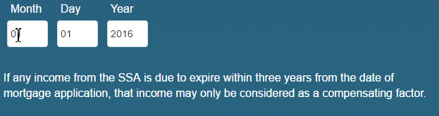

When the filled date is earlier than the **current date**, the form displays the **Income** text message. The condition remains inactive—and the **Income** message stays hidden—whenever the entered date matches or is later than the **current date**, so the note surfaces exclusively for mortgages that are already taken.

## Number comparison conditions {#number-comparison-conditions}

The **Rule editor** lets you create conditions that compare two numbers. A number comparison condition evaluates one numeric value against another and triggers a defined action when the specified relationship — such as *less than*, *greater than*, or *equal to* — is satisfied. Number comparison conditions are commonly used to control form behavior dynamically, showing, hiding, or modifying content based on the values applicants enter.

### Example: Requesting additional proof of residence

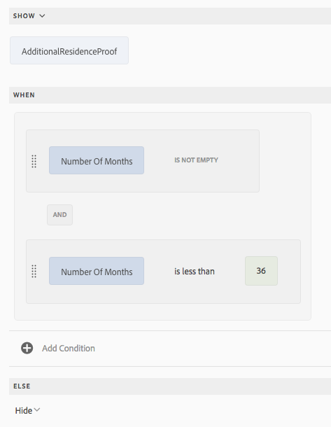

The following example demonstrates a condition that displays a static text object when the number of months an applicant has been staying at the current address is **less than 36 months**.

The condition works as follows:

1. **Input evaluated:** The number of months the applicant has lived at the current residential address.
2. **Comparison applied:** The entered value is compared against the threshold of **36 months** using the *less than* operator.
3. **Resulting action:** When the applicant indicates living at the present residential address for **less than 36 months**, the form displays a notification stating that the applicant may be required to provide additional proof of residence.

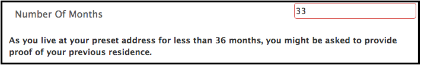

<!--
 ## Impact of rule editor on existing scripts {#impact-of-rule-editor-on-existing-scripts}

In [!DNL Experience Manager Forms] versions prior to [!DNL Experience Manager 6.1 Forms] feature pack 1, form authors and developers used to write expressions in the Scripts tab of the Edit component dialog to add dynamic behavior to Adaptive Forms. The Scripts tab is now replaced by the rule editor.

Any scripts or expressions that you must have written in the Scripts tab are available in the rule editor. While you cannot view or edit them in visual editor, if you are a part of the forms-power-users group you can edit scripts in code editor.
-->

This ensures that the form dynamically adjusts its content based on the value entered, prompting applicants for supplementary documentation only when the residency threshold is not met. As a result, forms remain concise and request additional proof of residence exactly when the business logic requires it.

## Example rules {#example}

### Invoke Form Data Model service {#invoke}

The **Invoke service action** calls a service configured in a **Form Data Model (FDM)**, sends form field values as input to that service, and populates the service response back into the form fields. This lets an **Adaptive Form** retrieve data from an external web service at runtime in response to a user action.

#### Example scenario

Consider a web service named **`GetInterestRates`** that takes three inputs — loan amount, tenure, and the applicant's credit score — and returns a loan plan that includes the **EMI (Equated Monthly Installment) amount** and the rate of interest. Because the service both accepts inputs and returns structured output, it is a suitable data source for an **Invoke service action** on a form.

To implement this scenario, complete the following steps:

1. **Create a Form Data Model (FDM)** using the `GetInterestRates` web service as its data source.
2. **Add the data model objects and the `get` service** to the form model. Once added, the **`get` service** appears in the **Services tab** of the **Form Data Model (FDM)**, where it becomes available for configuration.
3. **Create an Adaptive Form** that includes fields bound to the data model objects, so the form can capture user inputs for loan amount, tenure, and credit score.
4. **Add a button that triggers the web service.** When the user selects this button, it invokes `GetInterestRates`, which fetches the loan plan details based on the entered inputs.

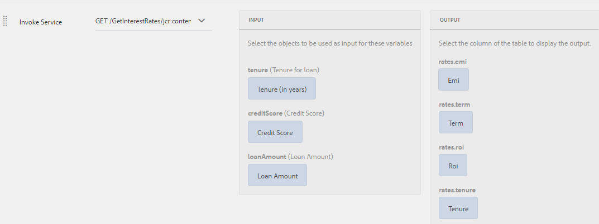

As a result of the invocation, the service response — the **EMI (Equated Monthly Installment) amount** and rate of interest — is mapped to the corresponding output fields on the form. This mapping ensures the returned plan details are populated into the appropriate fields so the user sees the calculated result immediately.

#### How to configure the Invoke service action

The following rule shows how to configure the **Invoke service action** to accomplish the example scenario, defining the input arguments passed to the service and the output mapping that returns the results to the form fields.

>[!NOTE]
>
>If the input is of array type, the fields that support arrays are visible under the Output drop-down section.

### Triggering multiple actions using the When rule {#triggering-multiple-actions-using-the-when-rule}

A **When rule** lets a single condition trigger multiple actions on a form, executing all specified behaviors at once when its condition evaluates to **True**. In a loan application form, the form author wants to capture whether the loan applicant is an existing customer, then drive several field behaviors from that single answer.

Specifically, the form must:

1. **Show or hide the customer ID field** based on the applicant's response — because an existing customer needs to supply a customer ID, while a new applicant does not.
2. **Set focus on the customer ID field** when the applicant is identified as an existing customer, so the applicant can immediately enter the required value.

Both behaviors are driven by the same answer, which is why a single **When rule** is well suited to this scenario: one condition triggers multiple coordinated actions.

#### Form components

The loan application form has the following components:

* A radio button, **[!UICONTROL Are you an existing Geometrixx customer?]**, which provides **[!UICONTROL Yes]** and **[!UICONTROL No]** options. The value for **Yes** is **0** and the value for **No** is **1**.

* A text field, **[!UICONTROL Geometrixx customer ID]**, used to specify the customer ID.

#### Rule logic in the visual editor

When you write a **When rule** on the radio button to implement this behavior, the rule appears as shown below in the visual rule editor.

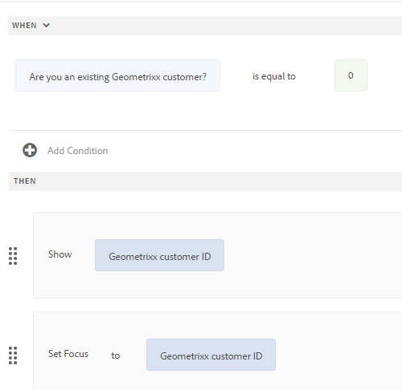

Rule in the visual editor

<!--
 he rule appears as follows in the code editor.

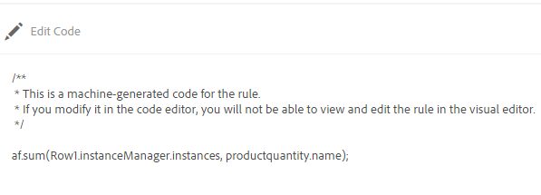

Rule in the code editor
-->

<!--
 The rule appears as follows in the code editor.

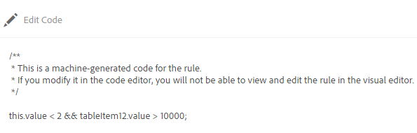

Rule in the code editor
-->

In the example rule, the statement in the **When section** is the **condition**. When the condition returns **True**, the rule executes the actions specified in the **Then section**. This structure separates the trigger (the applicant's answer) from the outcome (showing the field and setting focus), ensuring that all defined actions run together whenever the condition is satisfied.

<!--
 The rule appears as follows in the code editor.

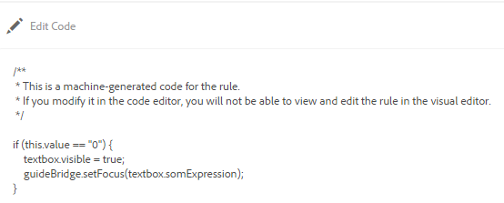 

Rule in the code editor
-->

### Using a function output in a rule {#using-a-function-output-in-a-rule}

The **sum** function lets you total the quantities entered across every repeated instance of a table row and display the result in a single non-repeatable cell. In a purchase order form, a table where users fill in their orders can automatically calculate a **Total Quantity** by applying this function inside a **Set Value Of** rule.

#### Table setup

The purchase order form contains a table with the following structure:

* **`Row1`** — the first row is **repeatable**, so users can order multiple products and specify different quantities for each. Its element name is **`Row1`**.
* **`productquantity`** — the title of the cell in the Product Quantity column of the repeatable row is **Quantity**. The element name for this cell is **`productquantity`**. Because this cell lives inside the repeatable row, it holds a separate value for each ordered product.
* **Total Quantity** — the second row in the table is **non-repeatable**, and the title of the cell in the Product Quantity column of this row is **Total Quantity**. This cell displays the aggregated result.

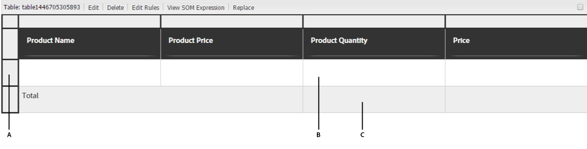

**A.** Row1 **B.** Quantity **C.** Total Quantity

#### Building the Set Value Of rule

The goal is to add the specified quantities in the Product Quantity column across all products and display the sum in the Total Quantity cell. Because **`productquantity`** repeats once per ordered product, the **sum** function is required to collapse those multiple values into a single total. You achieve this by writing a **Set Value Of** rule on the **Total Quantity** cell.

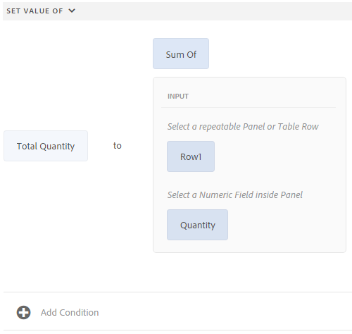

To create the rule in the visual editor, follow these steps:

1. Select the **Total Quantity** cell, then add a new **Set Value Of** rule targeting that cell.
2. In the rule expression, apply the **sum** function to the repeatable element — that is, calculate the sum of **`productquantity`** across all instances of **`Row1`**.
3. Because **`productquantity`** appears once for every repeated row, the **sum** function iterates over each instance and adds the entered quantities together.
4. Save the rule. The **Total Quantity** cell now updates automatically, displaying the combined quantity of all ordered products as users add rows and enter values.

This ensures the total always reflects the current contents of the repeatable row without requiring users to calculate the sum manually.

### Validating a field value using expression {#validating-a-field-value-using-expression}

A **Validate rule** lets you enforce business logic on a field value by evaluating a validation expression whenever the field changes. When the expression condition is met, the form blocks the entry and prevents the user from submitting an invalid value. This makes expression-based validation a reliable way to guard against incorrect data at the point of entry, rather than catching errors later during processing.

#### The Validation Scenario

In the purchase order form explained in the previous example, the goal is to restrict the user from ordering more than **one quantity** of any product priced above **10,000**. In other words, high-value products (those exceeding a unit price of **10,000**) are limited to a maximum order quantity of **one**, while lower-priced products remain unrestricted. To enforce this rule, define a **Validate rule** (a validation expression) on the quantity field, as shown below.

#### How the Validate Rule Works

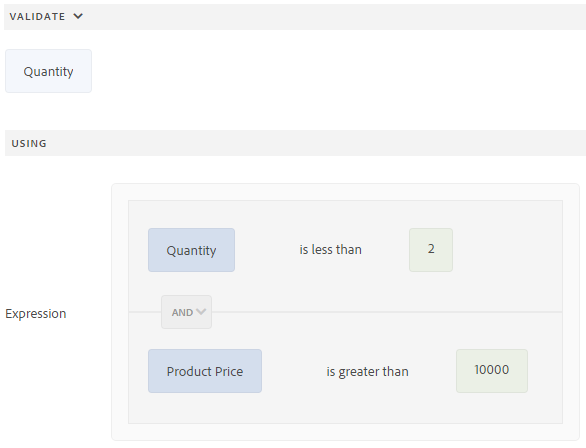

The Validate rule works by combining two conditions into a single expression:

1. **Check the price** — evaluate whether the product's price exceeds **10,000**.
2. **Check the quantity** — evaluate whether the entered quantity is greater than **one**.
3. **Trigger the validation** — when both conditions are true (price above **10,000** and quantity above **one**), the rule flags the entry as invalid and stops the user from proceeding.

Because the expression evaluates both the price and the quantity together, the restriction applies only to the specific case that matters — high-value items ordered in bulk — while allowing all other combinations to pass through without interruption.

#### Building the Rule in the Visual Editor

You define this logic in the visual editor, where the Validate rule is constructed from the field conditions rather than written manually. The visual editor lets you select the relevant fields, set the comparison operators, and combine the price and quantity conditions into the complete validation expression. Once configured, the rule enforces the restriction automatically each time a user attempts to set a quantity for a product priced above **10,000**.
