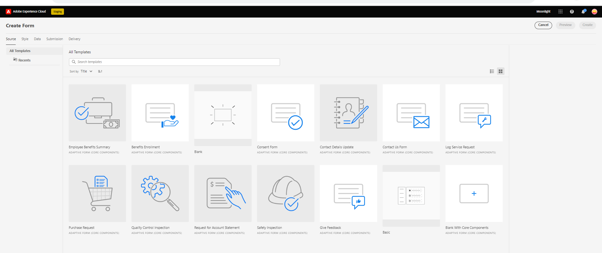
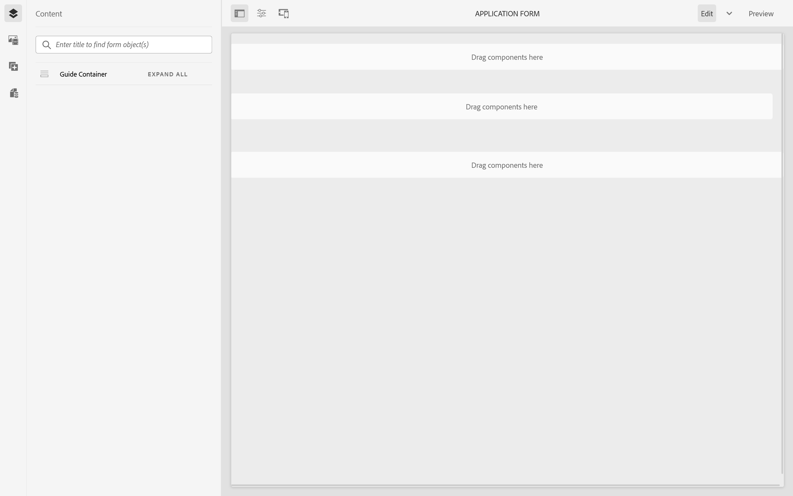
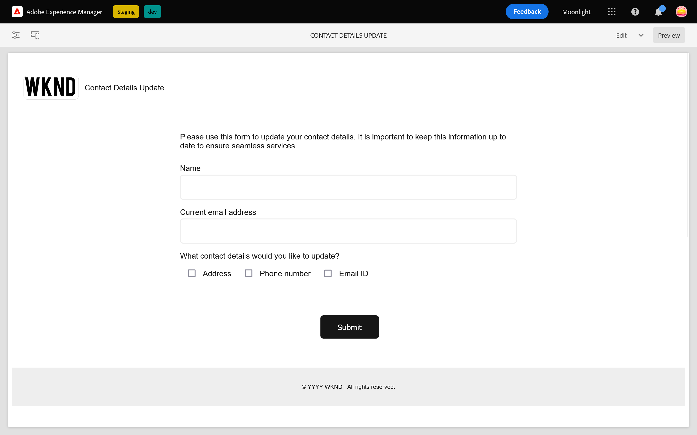
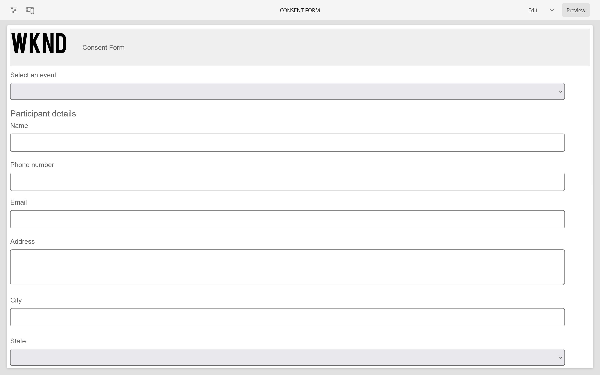
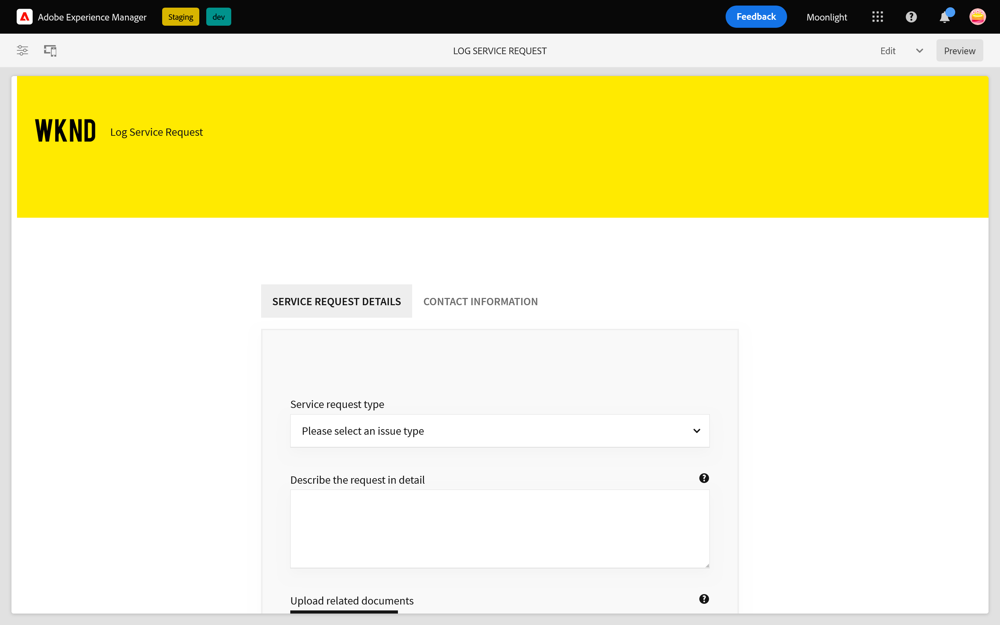
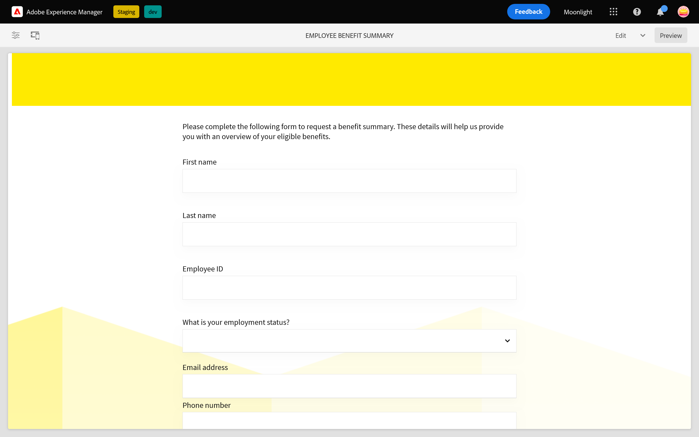
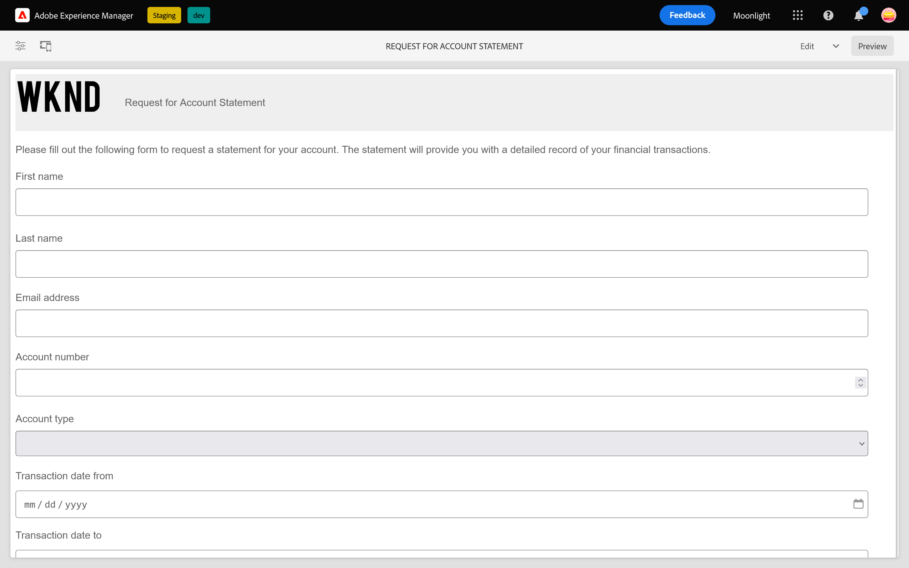
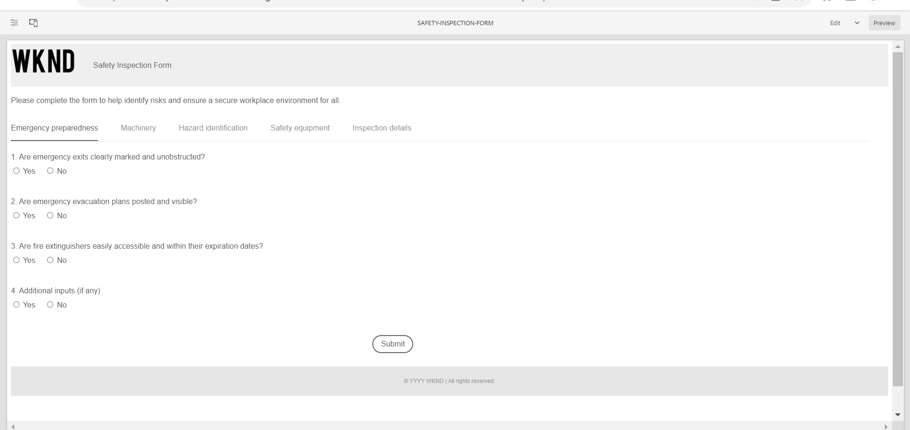

# Sample Themes, Templates, and Form Data models in Core Components {#sample-themes-templates-and-data-models}

AEM Forms as a Cloud Service provides sample reference themes, templates, and form data models to help you start quickly with creating Adaptive Forms with Core Components. You can [enable Adaptive Forms Core Components](https://experienceleague.adobe.com/docs/experience-manager-cloud-service/content/forms/setup-configure-migrate/enable-adaptive-forms-core-components.html) on AEM Forms as a Cloud Service and local development environment to get sample OOTB templates and to [use and customize sample themes](https://experienceleague.adobe.com/docs/experience-manager-cloud-service/content/forms/adaptive-forms-authoring/authoring-adaptive-forms-core-components/create-an-adaptive-form-on-forms-cs/using-themes-in-core-components.html) in [!DNL AEM Forms].

The sample themes, templates, and form data models included in the reference content package are:

|Templates | Themes | Form Data Models |
---------|----------|---------
| Basic |Canvas |Microsoft&reg; Dynamics 365  |
| Blank |WKND |Salesforce |
| Contact Us |Easel |  |
| Contact details update |   |   |
| Consent form   | |  |
| Log service request |  |  |
| Give feedback  |  |  |
| Benefits enrollment |  |   |
| Employee benefits summary  |   |   |
| Request for account statement |   |   |
| Safety inspection form |   |   |
| Quality control inspection |   |   |
| Purchase request |  |  |

## Sample themes {#Sample-Themes}

Reference sample themes help authors to define and customize styling to forms, authors with even a basic knowledge of CSS can customize theme as per requirement. Form authors [enable Adaptive Forms Core Components](https://experienceleague.adobe.com/docs/experience-manager-cloud-service/content/forms/setup-configure-migrate/enable-adaptive-forms-core-components.html) on AEM Forms as a Cloud Service and local development environment to get these themes described as follows:

### Canvas {#Canvas}

Canvas theme is the default theme for forms, and emphasizes use of basic colors, transparency, and flat icons. In the screenshot below, you can see how the Canvas theme looks.

### WKND {#WKND}

WKND theme embodies a lively, imaginative, and engaging design to showcase a stylish appearance to your forms. The theme is based on the appearance and styling of [WKND site](https://wknd.site/us/en.html) which is a travel and adventure website build on [Adobe Experience Manager Core Components](https://experienceleague.adobe.com/docs/experience-manager-core-components/using/introduction).

### Easel {#Easel}

Easel theme helps to create a form appearance that is appealing and easy to set up, it is customized for simplicity and user-friendliness. Easel theme is based on the concept where a portable stand used by artists to support a canvas while they work on their paintings.

## Sample templates {#Sample-templates}

Templates define initial form structure, content, and actions to replicate in your form or use a similar template structure to your form, for example, Consent form, Benefits enrollment form and many more. You can get the following templates by [enabling Adaptive Forms Core Components](https://experienceleague.adobe.com/docs/experience-manager-cloud-service/content/forms/setup-configure-migrate/enable-adaptive-forms-core-components.html) on AEM Forms as a Cloud Service or local development environment. The sample templates in Adaptive Forms Core Components are:

### Basic {#Basic}

Basic template helps you quickly create an enrollment experience form. You can also use it to preview functionality of [Adaptive Forms Core Components](https://experienceleague.adobe.com/docs/experience-manager-core-components/using/adaptive-forms/introduction). It provides a wizard layout for section-by-section presentation of data.

### Blank {#Blank}

A blank canvas template is used to create an Adaptive form structure, content, and rules from scratch. No form components are pre-incorporated in the blank template.
    

### Contact Us {#Contact-Us}

Contact us form template is used to create a form to facilitate communication between website visitors and administrators. Users can submit queries, feedback, or support requests through the form.

### Contact Details Update {#Contact-Details-Update}

Contact details update template help authors to create a form for address and contact details update of customers. The form also assists customers in updating personal information related to subscription or benefits to ensure seamless communication and uninterrupted access to the services or benefits.

### Consent Form {#Consent-Form}

Consent form template is used to create a form for procuring a legal document from participants who participate in a specific activity, research study, medical procedure, or any situation where their personal information or rights may be involved. The form ensures transparency, protect the rights of the participant, and establish a clear understanding of what the individual is agreeing to.

### Log Service Request {#Log-Service-Request}

Log service request template helps to create a form that request-specific logging services from a service provider. The form serves as a formal request to create a ticket have certain events, activities, or data logged for monitoring or tracking status.

### Give Feedback {#Give-Feedback}

Give feedback form template helps to build a form to provide constructive feedback to another person or team. The form helps to ensure that feedback is clear, specific, and actionable, promoting open communication and improvement.

### Benefits Enrollment {#Benefits-Enrollment}

Benefits enrollment form template is used to create a form to collect essential information from their employees regarding their preferred benefits and coverage options. It typically accompanies the annual benefits enrollment period.

### Employee Benefits Summary {#Employee-Benefits-Summary}

Employee benefits summary form template is used to create a form to gather essential details about an individual's benefits. It helps in evaluating coverage quickly and accurately, providing a comprehensive overview for efficient assistance and support.

### Request for Account Statement {#Request-for-Account-Statement}  

Request for account statement template helps to create a form that initiates the process of obtaining an accurate and up-to-date statement of customers. The statement provides a detailed record of financial transactions, activities, or other relevant information about customers who use this form.

### Safety Inspection {#Safety-Inspection}

Safety inspection form template helps to create a form to input details for a safe work environment. By conducting regular inspections using this form, potential hazards can be identified. The form covers various aspects such as emergency exits, fire safety, electrical safety, hazardous materials, personal protective equipment, workstation ergonomics for the safety and well-being of employees, visitors, and customers.

### Quality Control Inspection {#Quality-Control-Inspection}

Quality control inspection form template is used to create a form to assess and document the visual appearance, dimensions, functionality, documentation, testing results, and overall quality of a product or item. It helps identify defects, non-conformances, and corrective actions necessary to ensure adherence to quality standards.

### Purchase Request {#Purchase-Request}

Purchase request form template helps to build a form to initiate the procurement process and allow employees to formally request the purchase of goods or services necessary for their work. The form captures essential details such as item description, quantity, preferred supplier (if applicable), budget allocation, justification for purchase, delivery information, and required approvals.

## Reference Form Data Models {#reference-models}

After you create an [Adaptive Form](https://experienceleague.adobe.com/docs/experience-manager-core-components/using/adaptive-forms/introduction.html?lang=en#adaptive-forms-core-components) based on [Core Component](https://experienceleague.adobe.com/docs/experience-manager-core-components/using/adaptive-forms/introduction.html?lang=en#adaptive-forms-core-components), you can connect your form with database Microsoft® Dynamics 365 and Salesforce servers to enable business workflows. For example:

* Write data in Microsoft&reg; Dynamics 365 and Salesforce on Adaptive Form submission.
* Write data in Microsoft&reg; Dynamics 365 and Salesforce through custom entities defined in Form Data Model and vice versa.
* Query Microsoft&reg; Dynamics 365 and Salesforce server for data and prepopulate Adaptive Forms.
* Read data from Microsoft&reg; Dynamics 365 and Salesforce server.

You can get the following Form Data Models by installing the [Reference content package](https://experience.adobe.com/#/downloads/content/software-distribution/en/aemcloud.html?package=/content/software-distribution/en/details.html/content/dam/aemcloud/public/aem-forms-reference-content.ui.content-2.1.0.zip):

* Microsoft&reg; Dynamics 365
* Salesforce 

For information on using these models, see [Configure Microsoft&reg; Dynamics 365 and Salesforce cloud services](https://experienceleague.adobe.com/docs/experience-manager-cloud-service/content/forms/integrate/use-form-data-model/configure-msdynamics-salesforce.html?lang=en#configure-dynamics-cloud-service)
