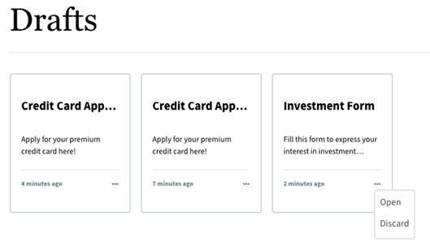
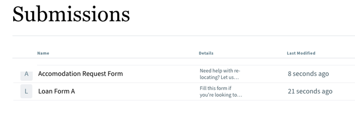

# Save forms as drafts and list them on Sites page

<!--This article provides information about the Auto-save feature, which is currently available as a pre-release feature. The pre-release feature is accessible only through our [pre-release channel](https://experienceleague.adobe.com/en/docs/experience-manager-cloud-service/content/release-notes/prerelease#new-features).-->

Adobe Experience Manager (AEM) offers a **save-as-draft** option that lets users pause form completion and return to finish it later. Consider a user who begins filling out a form but needs to pause and return later — the **save-as-draft** capability preserves their progress so the form can be completed at a future time.

## Save-as-draft capability

To support saving and returning to forms, AEM provides the **Drafts & Submissions** Forms Portal component out of the box. This component displays drafts and submissions directly on AEM Sites pages and serves two functions:

- **Drafts:** Lists forms that have been saved as drafts for later completion.
- **Submissions:** Lists forms that have already been submitted, so users can review what they have sent.

## Login requirements for drafts and submissions

Access to drafts and submissions is restricted to authenticated users. Specifically:

- Only **logged-in users** can edit their drafts or view their submitted forms.
- To have drafts and submissions appear in the **Drafts & Submissions** component, users must be logged in at the time of form submission or when saving the draft.

Because the **Drafts & Submissions** component associates each draft and submission with a specific user account, authentication is essential. If an anonymous user navigates through the list of forms using the **Search & Lister** component and saves a form as a draft, that anonymous draft is not associated with any account. As a result, the **Drafts & Submissions** component does not list the anonymous draft, and the form author cannot later retrieve it. This is why logging in before saving or submitting is required: it links the form to the user, ensuring the draft or submission can be found again.

## Pre-requisites

Before using the Drafts & Submissions Forms Portal component, complete the required storage configuration described below. The **Drafts & Submissions Forms Portal component** enables users to save partially completed forms as drafts and to view, resume, or manage their submitted forms. This functionality depends on a properly configured storage backend, because draft and submission data must be persisted reliably between user sessions.

Complete the following prerequisite:

* [Configure [!DNL Azure] Storage and Unified Storage Connector for Drafts & Submissions Forms Portal component](#configure-azure-storage-and-unified-storage-connector-for-drafts--submissions-forms-portal-component)

This step establishes the connection between the Forms Portal component and **[!DNL Azure] Storage**, Microsoft's cloud storage service, through the **Unified Storage Connector**. The Unified Storage Connector acts as the abstraction layer that routes draft and submission data to the configured storage provider. Configuring [!DNL Azure] Storage and the Unified Storage Connector is required because the component cannot persist or retrieve draft and submitted form data without a designated, connected storage location. As a result, this configuration must be completed first to ensure that saved drafts and form submissions are stored, retrievable, and available to users across sessions.

### Configure [!DNL Azure] Storage and Unified Storage Connector for the Drafts & Submissions Forms Portal component

The **Drafts & Submissions** component requires a configured storage backend before it can save and list drafts on an Adobe Experience Manager (AEM) Sites page. Two prerequisites make this possible: a valid **[!DNL Azure] storage account** and an **access key** that authorizes access to that account. The **Unified Storage Connector** provides the framework that links AEM with external storage, and it is required so that draft forms and submitted forms are persisted reliably outside the authoring instance and can be retrieved on demand.

Before you begin, ensure you have:

- An active **[!DNL Azure] storage account**.
- The corresponding **[!DNL Azure] access key** used to authorize access to the storage account.

Once both are available, complete the two configuration stages below.

#### Step 1: Create an [!DNL Azure] Storage Configuration

1. Navigate to **[!UICONTROL Tools]** &gt; **[!UICONTROL Cloud Services]** &gt; **[!UICONTROL Azure Storage]**.

    

2. Select a configuration folder to create the configuration, then select **[!UICONTROL Create]**.

    ![Select [!DNL Azure] Storage Configuration Folder](/help/forms/assets/save-form-as-draft-select-config-folder.png)

3. Specify a title for the configuration in the **[!UICONTROL Title]** field.
4. Specify the [!DNL Azure] storage account details in the **[!UICONTROL Azure Storage Account]** and **[!UICONTROL Azure Access Key]** fields. Enter the **`Connection String`** in the **`Azure Storage Account`** textbox and the **`Azure Key`** in the **`Azure Access key`** textbox.

    

5. Click **Save**.

    >[!NOTE]
    >
    > You can retrieve the **[!UICONTROL Azure Storage Account]** and **[!UICONTROL Azure Access Key]** from the [Microsoft [!DNL Azure] Portal](https://learn.microsoft.com/en-us/azure/storage/common/storage-account-keys-manage?tabs=azure-portal).

After you have successfully created the [!DNL Azure] Storage Configuration, configure the Unified Storage Connector for Forms Portal.

#### Step 2: Configure the Unified Storage Connector for Forms Portal

1. Navigate to **[!UICONTROL Tools]** &gt; **[!UICONTROL Forms]** &gt; **[!UICONTROL Unified Storage Connector]**.

    

2. In the **[!UICONTROL Forms Portal]** section, select **[!UICONTROL Azure]** from the **[!UICONTROL Storage]** drop-down list.
3. Specify the configuration path for the [!DNL Azure] storage configuration in the **[!UICONTROL Storage Configuration Path]** field. This path points the connector to the [!DNL Azure] Storage Configuration you created in Step 1.

    

4. Select **[!UICONTROL Save]**.

>[!NOTE]
>
> If you need to configure a storage option other than [!DNL Azure], write to <aem-forms-ea@adobe.com> from your official email address with your detailed requirements.

Once you have successfully configured both the [!DNL Azure] Storage and the Unified Storage Connector for storing drafts and submitted forms, add the **Drafts & Submissions** component to the Adobe Experience Manager (AEM) Sites page.

## How to add the Drafts & Submissions component to an AEM Sites page?

The **Drafts & Submissions** portal component is an out-of-the-box Adobe Experience Manager (AEM) Forms Portal component that displays a logged-in user's saved form drafts and completed form submissions directly on an AEM Sites page. Adding this component gives end users a single, self-service location to resume incomplete forms and review previously submitted forms, which improves form completion rates and reduces the need to re-enter data.

Authors and administrators can use the out-of-the-box Forms Portal components to list drafts and submissions on the Sites page. Perform the following steps to add the **Drafts & Submissions** portal component:

1. Open the Adobe Experience Manager (AEM) Sites page in an **Edit** mode.
1. Go to the **[!UICONTROL Page Information]** > **[!UICONTROL Edit Template]**.

    

1. Click the **[!UICONTROL Policy]** and select the **[!UICONTROL Drafts & Submissions]** checkbox under the **[AEM Archetype Project Name] - Forms and Communications Portal**. This enables the **Drafts & Submissions** component so that it becomes available for insertion on pages that use this template.

    

1. Click **[!UICONTROL Done]**.
1. Now re-open the AEM Sites page in the authoring mode.
1. Locate the section within the page editor that allows you to add the Forms Portal component.
1. Click the **Add** icon. The icon is a plus sign (+) that signifies the option to add new components.

    Clicking the **Add** icon displays an **Insert New Component** dialog box that displays various components for insertion.

    >[!NOTE]
    >
    > Alternatively, you can also drag and drop the component.

1. Browse the available components in the dialog box and select the desired component from the list. For example, select the **Drafts & Submissions** component from the list to add the **Drafts & Submissions** Forms Portal component.

    

After the component is placed on the page, configure the properties of the **Drafts & Submissions** component according to your requirements. Select the component and open its configuration (properties) dialog to control how drafts and submissions are presented. Typical configuration options include:

- **Display settings** — control the title, layout, and which columns or details are shown for each draft and submission.
- **Data source** — specify the forms or form data sources whose drafts and submissions the component lists.
- **Actions** — enable or restrict actions such as opening, editing, or deleting a draft and viewing a submission.

Configuring these properties ensures that the **Drafts & Submissions** component surfaces the relevant drafts and completed submissions to each authenticated user, matching the behavior expected on the published Sites page.

## Configure properties of the Drafts & Submissions Component

You can configure the properties of the **Drafts & Submissions** component:

1. Select the **Drafts & Submissions** component.
1. Click the  and the dialog box appears.
1. In the **[!UICONTROL Drafts and Submissions]** dialog, specify the following:

   * **Title**: Identifies the component within a Sites page. By default, the specified title appears at the top of the component, helping users immediately recognize its purpose and content.
   * **Select Type**: Determines whether the component lists **draft forms** or **submitted forms**, allowing you to tailor the display to the exact workflow stage users need to access.

     

      * If you choose **Draft Forms**, the component displays all forms saved as drafts, giving users quick access to incomplete work they can return to and finish.
      * If you choose **Submitted Forms**, the component displays the forms submitted by logged-in users, providing a clear record of completed submissions.
   * **Layout**: Controls how the selected draft forms or submitted forms are presented, in either **card** format or **list** format. Card format arranges entries as visual tiles for easier scanning, while list format presents entries in a compact, sequential arrangement suited to dense form collections.

## Configure forms to save as drafts

Adaptive Forms support **two configuration methods** for saving in-progress form data as drafts, allowing users to preserve their entries and resume completion later. Saving a form as a draft captures the data a user has already entered so that a partially completed form is not lost, which reduces form abandonment and prevents the loss of data when a session is interrupted. This is especially valuable for long or complex forms, where users often cannot complete every field in a single sitting.

Configure Adaptive Forms to save as drafts using either of the following methods:

* **[User action](#user-action)** — The form is saved as a draft when the user explicitly triggers the save, for example by selecting a save button. This gives users direct control over when their progress is stored.
* **[Auto-save](#auto-save)** — The form is saved as a draft automatically, without requiring the user to initiate the save. Because the data is captured in the background, auto-save protects against unexpected data loss even if the user forgets to save manually.

Both methods store the draft so that the user can return to the form later and continue from where they left off, ensuring a smoother, more reliable form-filling experience.

### User action

>[!NOTE]
>
> Ensure that the [Core Components version is set to **3.0.24 or later**](https://github.com/adobe/aem-core-forms-components) to save forms as drafts using the **Save Form** rule. This version prerequisite is mandatory, as earlier releases do not support the draft-saving capability.

To save a form as a Draft, create a **Save Form** rule on a form component, such as a button. The **Save Form** rule is a Rule Editor action that captures the current state of an Adaptive Form and stores it as a draft, allowing users to resume completing the form later without losing entered data. When the button is clicked, the rule triggers, and as a result the form is saved as a draft. Perform the following steps to create a **Save Form** rule on a button component:

#### Steps to create a Save Form rule on a button

1. Open an Adaptive Form in an edit mode.
1. Select the **[!UICONTROL Edit Rules]** icon to open the Rule Editor for the **Button** component. 
1. Select **[!UICONTROL Create]** to configure and create the rule for button.

    

1. In the **[!UICONTROL When]** section, select **is clicked** and in the **[!UICONTROL Then]** section, select the **Save Form** option.
1. Select **[!UICONTROL Done]** to save the rule.

When you preview an Adaptive Form, fill it out, and click the **Save Form** button, the form is saved as a draft. Saving as a draft preserves the user's progress, so the form can be reopened and completed at a later time, reducing the risk of data loss during lengthy submissions.

### Drafts

<!--based on the occurrence of an event or-->

>[!NOTE]
>
> Ensure that the [**Core Components version 3.0.52 or later**](https://github.com/adobe/aem-core-forms-components) is installed to save forms as drafts using the auto-save feature, which protects user-entered data from being lost during a session.

You can also configure an Adaptive Form to save automatically based on a time-based event. This automatically saves the form after the specified duration, ensuring that in-progress data is preserved without requiring manual intervention. When you [enable Forms Portal components for your environment](/help/forms/list-forms-on-sites-page.md#enable-forms-portal-components-for-your-existing-environment), the **Auto Save** tab appears in the Forms container properties.

Configuring the auto-save feature lets end users resume incomplete forms from a saved draft, reducing abandonment and data re-entry. To configure the auto-save feature for an Adaptive Form:

1. In the author instance, open an Adaptive Form in an edit mode.
1. Open the Content browser, and select the **[!UICONTROL Guide Container]** component of your Adaptive Form.
1. Click the Guide Container properties  icon and open the **[!UICONTROL Drafts]** tab.

    

1. Select the **[!UICONTROL Automatically Save Drafts]** check box to enable auto-save of the form as drafts. This activates periodic draft saving so that partially completed forms are retained.
1. Configure **[!UICONTROL Save Preference]** as **Save drafts at regular intervals**, to auto-save the form after a specific interval of time.
1. Specify the time interval in **[!UICONTROL Save interval frequency (Seconds)]** to set the duration that triggers the automatic saving of the form at the defined interval.
1. Click **[!UICONTROL Done]**.

## View drafts/submitted forms on Sites page using the Drafts & Submissions component

The **Drafts & Submissions** Forms Portal component displays both saved draft forms and submitted forms directly on the **Sites page**. Use this component whenever you need to view saved drafts or review submitted forms. The behavior of the component depends on the value chosen for **[!UICONTROL Select Type]** in the [configure dialog of the Drafts & Submissions component](#configure-properties-of-the-drafts--submissions-component).

### View draft forms

When **[!UICONTROL Select Type]** is set to **Draft Forms** in the [configure dialog of the Drafts & Submissions component](#configure-properties-of-the-drafts--submissions-component), all forms saved as drafts display on the **Sites page**. Draft forms remain editable so you can return and finish them at any time.

To open and complete a draft:

1. Locate the saved draft on the **Sites page**.
2. Click the **ellipsis (...)** associated with the form.
3. Select the option to open the draft and complete the form.

### View submitted forms

When **[!UICONTROL Select Type]** is set to **Submitted Forms** in the [configure dialog of the Drafts & Submissions component](#configure-properties-of-the-drafts--submissions-component), the submitted forms appear on the **Sites page**. Submitted forms are **view-only**: you can view them but cannot edit them, because a submission represents a finalized record that must remain unchanged. Unlike draft forms, which remain editable until you complete them, submitted forms preserve the exact data captured at the time of submission.

### Discard a form

You can discard a form by clicking the **ellipsis (...)** that appears in the bottom-right corner of the form. This action is available for the forms shown by the Drafts & Submissions component, allowing you to remove entries you no longer need.

## Next Steps

### Link Forms to Adobe Experience Manager (AEM) Sites Pages

The next article demonstrates [how to add references to forms on the Sites page using the Link Forms Portal component](/help/forms/add-form-link-to-aem-sites-page.md). This step connects your authored forms directly to the web pages your audience visits, ensuring that forms are surfaced exactly where users need to complete them.

The **Link Forms Portal component** embeds and references forms within an Adobe Experience Manager (AEM) Sites page, allowing authors to place a form on a live page without recreating it. Because the component references an existing form rather than duplicating it, updates made to the source form automatically propagate to every page that references it, keeping content consistent across your site.

Linking forms to Sites pages is a foundational step in delivering interactive experiences, and it typically supports outcomes such as:

- **Streamlined data collection** — visitors submit information directly from the page they are browsing, reducing drop-off caused by redirects.
- **Consistent branding and layout** — the form inherits the surrounding page design, so it aligns with the rest of the site experience.
- **Centralized form management** — a single form can be referenced across multiple pages, so edits are made once and reflected everywhere.

By completing this next task, you establish the connection between the form authoring layer and the published Sites page, enabling end users to discover and interact with your forms in context.

## Related articles

{{forms-portal-see-also}}

## See Also {#see-also}

{{see-also}}
