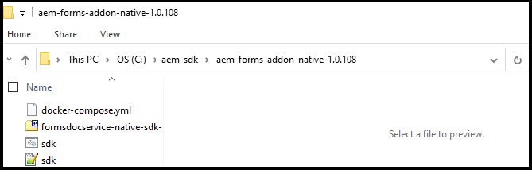
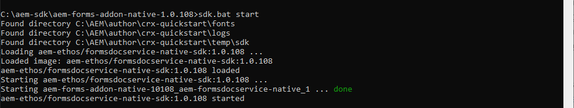

# Set up a local development environment and initial development project {#overview}

When you set up and configure an [!DNL  Adobe Experience Manager Forms] as a [!DNL  Cloud Service] environment, you set up development, staging, and production environments on cloud. In addition, you can also set up and configure a local development environment.

You can use the local development environment to perform the following actions without logging in to cloud development environment:

* [Create forms](creating-adaptive-form.md) and related assets (themes, templates, custom Submit Actions, and more)
* [Convert PDF forms to Adaptive Forms](https://experienceleague.adobe.com/docs/aem-forms-automated-conversion-service/using/convert-existing-forms-to-adaptive-forms.html)
* Build applications to generate [Customer Communications](aem-forms-cloud-service-communications-introduction.md) on demand or in batch modes.

 After an Adaptive Form or related assets are ready on the local development instance or an application to generate [Customer Communications] is ready, you can export the Adaptive Form or Customer Communications application from the local development environment to a Cloud Service environment for further testing or moving to production environments.

You can also develop and test custom code like custom components and prefill service on the local development environment. When the custom code is tested and ready, you can use the Git repository of your Cloud Service development environment to deploy the custom code.

To set up a new local development environment and use it to develop for  activities, perform the following actions in listed order:

* [Set up development tools](#setup-development-tools-for-AEM-projects)

* [Setup local Author and Publish instances](#set-up-local-experience-manager-environment-for-development)

* [Add Forms archive to local development instances and configure users](#add-forms-archive-configure-users)

* [Set up local development environment for microservices](#docker-microservices)

* [Set up a development project](#forms-cloud-service-local-development-environment)

* [Set up local Dispatcher tools](#setup-local-dispatcher-tools)

<!--
You can use the local development environment to create and test Adaptive Forms without connecting to the Cloud Service. [!DNL AEM Forms] provides an SDK to help test all the cloud-ready functionalities on the local development environment. When your forms and related assets are ready and tested on the local development environment, you can import these forms and related assets to an [!DNL AEM Forms] as a Cloud Service instance for publishing. 

You can also develop and test custom code like custom components and prefill service on the local development environment. When the custom code is tested and ready, you can use the Git repository of your [!DNL AEM Forms] as a Cloud Service development environment to deploy the custom code. 

>[!NOTE]
>
> Pre-pilot release does not support using an [!DNL AEM Forms] as a Cloud Service development instance to create forms. You can create forms, related assets, and custom code only on a local development environment.-->

<!--
You configure two types of development environments:

* **[!DNL AEM Forms] as a Cloud Service development environment:** Use the [[!DNL AEM Forms] as a Cloud Service](setup-forms-cloud-service.md) environment to store, manage, and publish Adaptive Forms and related assets. Do not use an [!DNL AEM Forms] as a Cloud Service environment to create Adaptive Forms and related assets <!--, form-centric workflows, a form data model, or to generate a Document of Record. -->

<!--
* **Local development environment:** You can use the local development environment to create and test Adaptive Forms without connecting to the service. Adobe provides a SDK for the local development to help test all the cloud-ready functionalities. 
Use a local development environment:
    
    * To create forms and related assets (themes, templates, custom Submit Actions, and more) and convert PDF forms to Adaptive Forms. After an Adaptive Form or related assets are ready on the local development instance, you can export the Adaptive Form and related assets from the local development environment to an [!DNL AEM Forms] as a Cloud Service development environment for publishing.  
    
    * To update configuration settings and develop and test custom code like custom components and prefill service. When the custom code is tested and ready, you can use the Git repository of your [!DNL AEM Forms] as a Cloud Service development environment to deploy the custom code.  

You can use the local development environment to create and test Adaptive Forms without connecting to the service. Adobe provides a SDK for the local development to help test all the cloud-ready functionalities. When your forms and related assets are ready and tested on the local development environment, you can import these forms and related assets to an [!DNL AEM Forms] as a Cloud Service instance for publishing. 

You can use the [development tools](https://experienceleague.adobe.com/docs/experience-manager-65/developing/devtools/dev-tools.html) to write custom code, customize or create new Adaptive Forms components, create a custom prefill service, or modify default configurations of an [!DNL AEM Forms] as a Cloud Service instance. 

-->

## Prerequisites

You require the following software to set up a local development environment. Download these before starting to set up the local development environment:

|Software   | Description |Download links|
|---|---|---|
| Adobe Experience Manager as a Cloud Service SDK | SDK includes [!DNL Adobe Experience Manager] QuickStart and Dispatcher tools| Download the latest SDK from [Software Distribution](#software-distribution)||
| Adobe Experience Manager Forms feature archive (AEM Forms add-on)  | Tools to create, style, and optimize Adaptive Forms and other Adobe Experience Manager Forms features| Download from [Software Distribution](#software-distribution) |
| (Optional) Adobe Experience Manager Forms reference content  | Tools to create, style, and optimize Adaptive Forms and other Adobe Experience Manager Forms features| Download from [Software Distribution](#software-distribution) |
| (Optional) Adobe Experience Manager Forms Designer | Tools to create, style, and optimize Adaptive Forms and other Adobe Experience Manager Forms features| Download from [Software Distribution](#software-distribution) |

### Download the latest version of software from Software Distribution {#software-distribution}

To download latest version of Adobe Experience Manager as a Cloud Service SDK, Experience Manager Forms feature archive (AEM Forms add-on), forms reference assets, or Forms Designer from [Software Distribution](https://experience.adobe.com/#/downloads/content/software-distribution/en/aemcloud.html):

1. Log in to <https://experience.adobe.com/#/downloads> with your Adobe ID

    >[!NOTE]
    >
    > Your Adobe Organization must be provisioned for AEM as a Cloud Service to download the AEM as a Cloud Service SDK.

1. Navigate to the **[!UICONTROL AEM as a Cloud Service]** tab.
1. Sort by published date in descending order.
1. Click on the latest Adobe Experience Manager as a Cloud Service SDK, Experience Manager Forms feature archive (AEM Forms add-on), forms reference assets, or Forms Designer.
1. Review and accept the EULA. Tap the **[!UICONTROL Download]** button.

## Set up development tools for AEM Projects {#setup-development-tools-for-AEM-projects}

The Adobe Experience Manager Forms project is a custom code base. It contains code, configurations, and content that is deployed via Cloud Manager to [!DNL Adobe Experience Manager] as a Cloud Service. The [AEM Project Maven Archetype](https://github.com/adobe/aem-project-archetype) provides the baseline structure for the project.

Set up the following development tools to use for your [!DNL Adobe Experience Manager] project for development:

* [Java™](https://experienceleague.adobe.com/docs/experience-manager-learn/cloud-service/local-development-environment-set-up/development-tools.html?lang=en#local-development-environment-set-up)
* [Git](https://experienceleague.adobe.com/docs/experience-manager-learn/cloud-service/local-development-environment-set-up/development-tools.html?lang=en#install-git)
* [Node.js (npm)](https://experienceleague.adobe.com/docs/experience-manager-learn/cloud-service/local-development-environment-set-up/development-tools.html?lang=en#node-js)
* [Maven](https://experienceleague.adobe.com/docs/experience-manager-learn/cloud-service/local-development-environment-set-up/development-tools.html?lang=en#install-maven)

For detailed instructions to set up previously mentioned development tools, see [Set up development tools](https://experienceleague.adobe.com/docs/experience-manager-learn/cloud-service/local-development-environment-set-up/development-tools.html).

## Set up local Experience Manager environment for development

The Cloud Service SDK provides a QuickStart file. It runs a local version of Experience Manager. You can run either the Author or Publish instances locally.

While the QuickStart provides a local development experience, it does not have all features available in [!DNL Adobe Experience Manager] as a Cloud Service. So, always test your features and code with [!DNL Adobe Experience Manager] as a Cloud Service development environment before moving the features to stage or production.

To install and configure local Experience Manager environment, perform the following steps:

* [Download and extract](https://experience.adobe.com/#/downloads/content/software-distribution/en/aemcloud.html) the [!DNL Adobe Experience Manager] as a Cloud Service SDK
* [Set up an Author instance](https://experienceleague.adobe.com/docs/experience-manager-learn/cloud-service/local-development-environment-set-up/aem-runtime.html?lang=en#set-up-local-aem-author-service)
* [Set up a Publish instance](https://experienceleague.adobe.com/docs/experience-manager-learn/cloud-service/local-development-environment-set-up/aem-runtime.html?lang=en#set-up-local-aem-publish-service)

## Add Forms archive to local Author and Publish instances and configure Forms-specific users {#add-forms-archive-configure-users}

Perform the following steps in the listed order to add Forms archive to Experience Manager instances and configure forms-specific users:

### Install the latest Forms add-on feature archive {#add-forms-archive}

Adobe Experience Manager Forms as a Cloud Service feature archive provides tools to create, style, and optimize Adaptive Forms on the local development environment. Install the package to create an Adaptive Form and use various other features of [!DNL AEM Forms]. To install the package:

1. Download and extract the latest [!DNL AEM Forms] archive for your operating system from [Software Distribution](https://experience.adobe.com/#/downloads/content/software-distribution/en/aemcloud.html).

1. Navigate to the crx-quickstart/install directory. If the folder does not exist, create it.

1. Stop your  AEM instance, place the [!DNL AEM Forms] add-on feature archive, `aem-forms-addon-<version>.far`,  in the install folder, and restart the instance.

### Configure users and permissions {#configure-users-and-permissions}

Create users like Form Developer and Form Practitioner and [add these users to pre-defined forms groups](https://experienceleague.adobe.com/docs/experience-manager-learn/cloud-service/accessing/aem-users-groups-and-permissions.html?lang=en#accessing) to provide them required permissions. The table below lists all types of users and pre-defined groups for each type of forms users:
  
| User Type | AEM Group |
|---|---|
| Form practitioner / | [!DNL forms-users] (AEM Forms Users), [!DNL template-authors], [!DNL workflow-users], [!DNL workflow-editors], and [!DNL fdm-authors]  |
| Form developer | [!DNL forms-users] (AEM Forms Users), [!DNL template-authors], [!DNL workflow-users], [!DNL workflow-editors], and [!DNL fdm-authors]  |
| Customer Experience Lead or UX Designer| [!DNL forms-users], [!DNL template-authors]|
| AEM administrator | [!DNL aem-administrators], [!DNL fd-administrators] |
| End user| When a user must login to view and submit an Adaptive Form, add such users to [!DNL forms-users] group. </br> When no user authentication is required to access Adaptive Forms, do not assign any group to such users.|

<!--  

## Set up a local AEM instance for development

Perform the following steps in the listed order to set up and configure your local development environment:

1. **Set up an AEM author instance:** You require an author instance to create Adaptive Forms. Download and extract the latest AEM SDK archive. Run the quick start file in author run mode to set up an author instance. For detailed instructions, see [default local instance](https://experienceleague.adobe.com/docs/experience-manager-learn/cloud-service/local-development-environment-set-up/aem-runtime.html).  

1. **Install the latest [!DNL AEM Forms] add-on feature archive:** [!DNL AEM Forms] add-on feature archive provides tools to create, style, and optimize Adaptive Forms on the local development environment. Install the package to create an Adaptive Form and use various other features of [!DNL AEM Forms]. To install the package:

    1. Download and extract the latest [!DNL AEM Forms] archive for your operating system from [Software Distribution](https://experience.adobe.com/#/downloads/content/software-distribution/en/aemcloud.html).

    1. Navigate to the crx-quickstart/install directory. If the folder does not exist, create it.

    1. Stop your Cloud ready AEM instance, place the [!DNL AEM Forms] add-on feature archive, `aem-forms-addon-<version>.far`,  in the install folder, and restart the instance.

1. **Configure users and permissions:** Create users like Form Developer and Form Practitioner a nd add these users to pre-defined forms group to provide them required permissions. The table below lists all types of users and pre-defined groups for each type of forms users:
  
    | User Type | AEM Group |
    |---|---|
    | Form Practitioner  | forms-users (AEM Forms Users), template-authors  |
    | Form Developer | forms-users (AEM Forms Users), template-authors |
    | End-User| everyone* |

    `*` When a user should log in to access or submit Adaptive Forms, add such users to the everyone group.  -->

<!--    
### Set up an AEM project for the development tasks related to local AEM 6.5.5 Forms instance

Use this project to update configurations, create overlays, develop custom Adaptive Form components, and custom code using the local development environment. To set up the project:

1. **Install and configure Maven and set up an AEM project based on Apache Maven:** Apache Maven is an open-source tool for managing software projects. It helps automate builds and provides quality project information. It is the recommended build management tool for AEM projects. For detailed instructions to set up an AEM project based on Apache Maven, see [How to Build AEM Projects using Apache Maven](https://experienceleague.adobe.com/docs/experience-manager-65/developing/devtools/ht-projects-maven.html).

1. Configure the project to use [uber-jar](https://experienceleague.adobe.com/docs/experience-manager-65/release-notes/release-notes.html?lang=en#install-aem-forms-jee-installer) version 6.5.5 or later and [[!DNL AEM Forms] Client SDK](https://repo1.maven.org/maven2/com/adobe/aemfd/aemfd-client-sdk/) version 6.0.160 or later.  

1. **Set Up an Integrated Development Environment:**  Set up an IDE of your choice for development, see [Set Up an Integrated Development Environment](https://experienceleague.adobe.com/docs/experience-manager-learn/foundation/development/set-up-a-local-aem-development-environment.html#set-up-an-integrated-development-environment) for detailed instructions.
 -->

## Set up local development environment for Document of Record (DoR){#docker-microservices}

AEM Forms as a Cloud Services provides a docker-based SDK environment for easier development of Document of Record and for using other microservices. It frees you from manually configuring platform-specific binaries and adaptations. To set up the environment:

1. Install and Configure Docker:

    * (For Microsoft® Windows) Install [Docker Desktop](https://www.docker.com/products/docker-desktop). It configures `Docker Engine` and `docker-compose` on your machine.

    * (Apple macOS) Install [Docker Desktop for Mac](https://hub.docker.com/editions/community/docker-ce-desktop-mac). It includes Docker Engine, Docker CLI client, Docker Compose, Docker Content Trust, Kubernetes, and Credential Helper.

    * (For Linux®) Install [Docker Engine](https://docs.docker.com/engine/install/#server) and [Docker Compose](https://docs.docker.com/compose/install/) on your machine.

    >[!NOTE]
    >
    > * For Apple macOS, allowlist folders containing local AEM Author instances.
    >
    > * Docker Desktop for Windows supports two backends, Hyper-V
    > (legacy) and WSL2 (modern). File sharing is automatically
    > managed by Docker when using WSL2 (modern). You have to
    > explicitly configure file sharing while using  Hyper-V (legacy).  

1. Create a folder, say aem-sdk, in parallel to your author and publish instances. For example C:\aem-sdk.  

1. Extract the `aem-forms-addon-<version>.zip\aem-forms-addon-native-<version>.zip` file.

   

1. Create an environment variable AEM_HOME and point to local AEM Author installation. For example C:\aem\author\.

1. Open sdk.bat or sdk.sh for editing. Set the AEM_HOME to point to local AEM Author installation. For example C:\aem\author\.

1. Open command prompt and navigate to the `aem-forms-addon-native-<version>` folder.

1. Ensure that your local AEM Author instance is up and running. Run the following command to start the SDK:

    * (on Microsoft® Windows) `sdk.bat start`
    * (on Linux® or Apple macOS) `AEM_HOME=[local AEM Author installation] ./sdk.sh start`

    >[!NOTE]
    >
    > If you have defined the environment variable in the sdk.sh file, specifying it at the command line is optional. The option to define the environment variable at the command line is provided to execute the command without updating the shell script.  

    

You can now use the local development environment to render Document of Record. To test, upload an XDP file to your environment and render it. For example, <http://localhost:4502/libs/xfaforms/profiles/default.print.pdf?template=crx:///content/dam/formsanddocuments/cheque-request.xdp> converts the XDP file to the PDF document.

## Set up a development project for Forms based on Experience Manager archetype {#forms-cloud-service-local-development-environment}

Use this project to create Adaptive Forms, deploy configuration updates, overlays, create custom Adaptive Form components, test, and custom code on local [!DNL Experience Manager Forms] SDK. After testing locally, you can deploy the project to  [!DNL Experience Manager Forms] as a Cloud Service production and non-production environments. When you deploy the project, the following AEM Forms assets are also deployed:

|Themes | Templates | Form Data Models |
---------|----------|---------
| Canvas 3.0 | Basic | Microsoft® Dynamics 365 |
| Tranquil   | Blank | Salesforce |
| Urbane |   |  |
| Ultramarine |  |  |
| Beryl  |  |  |

>[!NOTE]
>
> Setup AEM Archetype version 30 or later based project to get and use Microsoft® Dynamics 365 and Salesforce Form Data Models with AEM Forms as a Cloud Service.
> Setup AEM Archetype version 32 or later based project to get and use Tranquil, Urbane, and Ultramarine themes with AEM Forms as a Cloud Service.

To set up the project:

1. **Clone Cloud Manager Git repository on your local development instance:**  Your Cloud Manager Git repository contains a default AEM project. It is based on [AEM Archetype](https://github.com/adobe/aem-project-archetype/). Clone your Cloud Manager Git Repository using Self-Service Git Account Management from Cloud Manager UI to bring the project on your local development environment. For details to accessing the repository, see [Accessing Repositories](https://experienceleague.adobe.com/docs/experience-manager-cloud-manager/using/managing-code/accessing-repos.html).  

<!-- 1. 
After the repository is cloned, [integrate your Git repo with Cloud Manager](https://experienceleague.adobe.com/docs/experience-manager-cloud-manager/using/managing-code/setup-cloud-manager-git-integration.html)

**Make cloned AEM project compatible with [!DNL AEM Forms] as a Cloud Service:** Remove uber-jar and other non-cloud dependencies from the pom.xml files of the project. You can refer the pom.xml files of the [sample AEM project](assets/FaaCSample.zip) for the list of required dependencies and update your AEM project accordingly. You can also refer [AEM Project Structure](https://experienceleague.adobe.com/docs/experience-manager-cloud-service/content/implementing/developing/aem-project-content-package-structure.html) to learn changes required to make an AEM project compatible with AEM as a Cloud Service.  -->

1. **Create an [!DNL Experience Manager Forms] as a [Cloud Service] project:** Create an [!DNL Experience Manager Forms] as a [Cloud Service] project based on [AEM Archetype 32](https://github.com/adobe/aem-project-archetype/releases/tag/aem-project-archetype-32) or later. The archetype  help developers easily start developing for [!DNL AEM Forms] as a Cloud Service. It also includes some sample themes and templates to help you started quickly.

    Open the command prompt and run the below command to create an [!DNL Experience Manager Forms] as a Cloud Service project.

    ```shell

    mvn -B archetype:generate -DarchetypeGroupId=com.adobe.aem -DarchetypeArtifactId=aem-project-archetype-DarchetypeVersion=32 -DaemVersion="cloud" -DappTitle="My Site" -DappId="mysite" -DgroupId="com.mysite" -DincludeFormsenrollment="y" -DincludeFormscommunications="y" -DincludeExamples="y"

    ```

    Change the `appTitle`, `appId`, and `groupId` in the above command to reflect your environment.

    * Use the `includeFormsenrollment=y` option to include Forms specific configurations, themes, templates, Core Components, and dependencies required to create Adaptive Forms. If you use Forms Portal, set the `includeExamples=y` option. It adds Forms Portal core components to the project.

    * Use the `includeFormscommunications=y` option includes Forms Core Components and dependencies required to include Customer Communications functionality.

1. Deploy the project to your local development environment. You can use the following command to deploy to your local development environment

    `mvn -PautoInstallPackage clean install`

    For the complete list of commands, see [Building and Installing](https://experienceleague.adobe.com/docs/experience-manager-core-components/using/developing/archetype/using.html?lang=en#building-and-installing)

1. [Deploy the code to your [!DNL AEM Forms] as a Cloud Service environment](https://experienceleague.adobe.com/docs/experience-manager-cloud-service/implementing/deploying/overview.html?lang=en#customer-releases).

## Set up local Dispatcher tools {#setup-local-dispatcher-tools}

Dispatcher is an Apache HTTP Web server module that provides a security and performance layer between the CDN and AEM Publish tier. Dispatcher is an integral part of the overall Experience Manager architecture and should be part of local development environment.

Perform the following steps to configure local Dispatcher and then add Forms-specific rules to it:

### Set up local Dispatcher {#setup-local-dispatcher}

The [!DNL Experience Manager] as a Cloud Service SDK includes the recommended Dispatcher Tools version, that facilitates configuring, validating, and simulating Dispatcher locally. Dispatcher Tools are Docker-based and provide command-line tools to transpile Apache HTTP Web Server and Dispatcher configuration files into a compatible format and deploy them to Dispatcher running in the Docker container.

Caching on Dispatcher allows [!DNL AEM Forms] to prefill Adaptive Forms at a client. It improves rendering speed of prefilled forms.

For detailed instructions to set up Dispatcher, see [Set up local Dispatcher tools](https://experienceleague.adobe.com/docs/experience-manager-learn/cloud-service/local-development-environment-set-up/dispatcher-tools.html?lang=en#local-development-environment-set-up)

### Add Forms specific rules to Dispatcher {#forms-specific-rules-to-dispatcher}

Perform the following steps to configure Dispatcher cache for Experience Manager Forms as a Cloud Service:

1. Open your AEM Project and navigate to `\src\conf.dispatcher.d\available_farms`
1. Create a copy of the `default.farm` file. For example, `forms.farm`.
1. Open the newly created `forms.farm` file for editing and replace the following code:

    ```json
    #/ignoreUrlParams {
    #/0001 { /glob "*" /type "deny" }
    #/0002 { /glob "q" /type "allow" }
    #}
    ```

    with

    ```json
    /ignoreUrlParams {
    /0001 { /glob "*" /type "deny" }
    /0002 { /glob "dataRef" /type "allow" }
    }
    ```

1. Save and close your file.
1. Go to `conf.d/enabled_farms` and create a symbolic link to the `forms.farm` file.
1. Compile and deploy the project to your [!DNL AEM Forms] as a Cloud Service environment.

### Considerations about caching {#considerations-about-caching}

* Dispatcher caching allows [!DNL AEM Forms] to prefill Adaptive Forms at a client. It improves rendering speed of prefilled forms.
* Caching secured content features is disabled, by default. To enable the feature, you can perform the instructions provided in the [Caching Secured Content](https://experienceleague.adobe.com/docs/experience-manager-dispatcher/using/configuring/permissions-cache.html?lang=en) article
* The Dispatcher can fail to invalidate some Adaptive Forms and related Adaptive Forms. To resolve such issues, see [[!DNL AEM Forms] Caching](troubleshooting-caching-performance.md) in troubleshooting section.
* Caching localized Adaptive Forms:
  * Use URL format `http://host:port/content/forms/af/<afName>.<locale>.html` to request a localized version of an Adaptive Form instead of `http://host:port/content/forms/af/afName.html?afAcceptLang=<locale>`
  * Browser Locale option is disabled, by default. To change browser locale setting,
* When you use URL Format `http://host:port/content/forms/af/<adaptivefName>.html`, and Use Browser Locale in configuration manager is disabled, the non-localized version of the Adaptive Form is served. The non-localized language is the language used while developing the Adaptive Form. The locale configured for your browser (browser locale) is not considered and a non-localized version of the Adaptive Form is served.
* When you use URL Format `http://host:port/content/forms/af/<adaptivefName>.html`, and Use Browser Locale in configuration manager is enabled, a localized version of the Adaptive Form is served, if available. The language of the localized Adaptive Form is based on the locale configured for your browser (browser locale). It can lead to [caching only first instance of an Adaptive Form]. To prevent the issue from happening on your instance, see [only first instance of an Adaptive Form is cached](troubleshooting-caching-performance.md) in troubleshooting section.

Your local development environment is ready.

## Upgrade your local development environment {#upgrade-your-local-development-environment}

Upgrading the SDK to a new version requires replacing the entire local development environment, resulting in a loss of all code, configuration, and content in the local repositories. Ensure that any code, config, or content that should not be destroyed is safely committed to Git, or exported from the local Experience Manager instances as CRX-Packages.

### How to avoid content loss when upgrading the SDK {#avoid-content-loss-when-upgrading--SDK}

Upgrading the SDK is effectively creating a brand new Author and Publish instances, including a new repository ([Set up AEM project](#forms-cloud-service-local-development-environment)), meaning any changes made to a prior SDK's repository are lost. For viable strategies for aiding in persisting content between SDK upgrades, see [How to avoid content loss when upgrading the AEM SDK](https://experienceleague.adobe.com/docs/experience-manager-learn/cloud-service/local-development-environment-set-up/aem-runtime.html?lang=en#optional-local-aem-runtime-set-up-tasks)

<!--When you update any  Forms-specifc configuration, create overlays, develop custom Adaptive Form components, or develop and test any custom code in AEM project for the development tasks related to local development instance, use the AEM project cloned from the Cloud Manager Git repository to [deploy the custom code and other changes to your [!DNL AEM Forms] as a Cloud Service's production or non-production environment](https://video.tv.adobe.com/v/30191?quality=9).

## Upgrade your local development environment {#update-local-setup}

Update the local AEM setup (AEM SDK) to latest version at least monthly on, or shortly after, the last Thursday of each month, which is the release cadence for AEM as a Cloud Service "feature releases". You can download local AEM SDK from [Software Distribution](https://experience.adobe.com/#/downloads/content/software-distribution/en/aemcloud.html).

Updating the AEM SDK to a new version requires replacing the entire local development environment, resulting in a loss of all code, configuration and content in the local AEM repositories. Ensure that any code, config or content that should not be destroyed is safely committed to Git, or exported from the local AEM instance as AEM Packages.

### How to avoid content loss when upgrading the AEM SDK {#avoid-content-loss-when-upgrading--AEM-SDK}

Upgrading the AEM SDK is effectively creating a brand new AEM runtime ([Set up a local AEM instance](setup-forms-cloud-service.md)), including a new repository ([Set up AEM project](#forms-cloud-service-local-development-environment)), meaning any changes made to a prior AEM SDK's repository are lost. The following are viable strategies for aiding in persisting content between AEM SDK upgrades, and can be used discretely or in concert:

1. Create a content package dedicated to containing the sample content to aid in development and maintain it in Git. Any content that should be persisted through AEM SDK upgrades would be persisted into this package and re-deployed after upgrading the AEM SDK.
1. Use [oak-upgrade](https://jackrabbit.apache.org/oak/docs/migration.html) with the `includepaths` directive, to copy content from the prior AEM SDK repository to the new AEM SDK repository.
1. Back up any content using AEM Package Manager and content packages on the prior AEM SDK and re-install them on the new AEM SDK.

Remember, using the above approaches to maintain code between AEM SDK upgrades, indicates a development anti-pattern. Non-disposable code should originate in your Development IDE and flow into AEM SDK via deployments.

For information about troubleshooting, stopping local AEM environment, run modes, and deployment, see [Set up local AEM Runtime](https://experienceleague.adobe.com/docs/experience-manager-learn/cloud-service/local-development-environment-set-up/aem-runtime.html#local-development-environment-set-up).-->

### Back up and import Forms-specific content to a new SDK environment {#backup-and-import-Forms-specific-content-to-new-SDK-environment}

To back up and move assets from existing SDK to a new SDK environment:

* Create a backup of your existing content.

* Set up a fresh SDK environment.

* Import the backup to your new SDK environment.

### Create a backup of your existing content {#create-backup-of-your-existing-content}

Back up your Adaptive Forms, templates, form data model, theme, configurations, and custom code. You can perform the following action to create backup:

1. [Download](import-export-forms-templates.md#manage-forms-and-related-assets) Adaptive Forms, themes, and PDF forms.
1. Export Adaptive Form templates.

1. Download Form Data Models

1. Export editable templates, cloud configurations, and workflow model. To export all the previously mentioned items from your existing SDK, create an [CRX-Package](https://experienceleague.adobe.com/docs/experience-manager-cloud-service/implementing/deploying/overview.html) with the following filters:

    * /conf/ReferenceEditableTemplates
    * /conf/global/settings/cloudconfigs
    * /conf/global/settings/wcm
    * /var/workflow/models
    * /conf/global/settings/workflow
1. Export email configurations, submit, and prefill actions code from your local development environment. To export these settings and configuration, create a copy of the following folders and files on your local development environment:

    * `[Archetype Project in Cloud Service Git]/core/src/main/java/com/<program name>/core/service`
    * `[Archetype Project in Cloud Service Git] /core/src/main/java/com/<program name>/core/servlets/FileAttachmentServlet.java`
    * `[Archetype Project in Cloud Service Git]/ui.apps/src/main/content/jcr_root/apps/<program name>/config`

### Import the backup to your new SDK environment {#import-the-backup-to-your-new-SDK-environment}

Import Adaptive Forms, templates, form data model, theme, configurations, and custom code to your fresh environment. You can perform the following action to import backup:

1. [Import](import-export-forms-templates.md#manage-forms-and-related-assets) Adaptive Forms, themes, and PDF forms to new SDK environments.
1. Import Adaptive Form templates to new SDK environment.

1. Upload Form Data Models to new SDK environment.

1. Import editable templates, cloud configurations, and workflow model. To import all the previously mentioned items yo your new SDK environment, import the CRX-Package containing these items to your new SDK environment.

1. Import email configurations, submit, and prefill actions code from your local development environment. To import these settings and configuration, place the following files from your old Archetype project to your new Archetype project:

    * `[Archetype Project in Cloud Service Git]/core/src/main/java/com/<program name>/core/service`
    * `[Archetype Project in Cloud Service Git] /core/src/main/java/com/<program name>/core/servlets/FileAttachmentServlet.java`
    * `[Archetype Project in Cloud Service Git]/ui.apps/src/main/content/jcr_root/apps/<program name>/config`

Your new environment now has forms and related assets of old environment.
