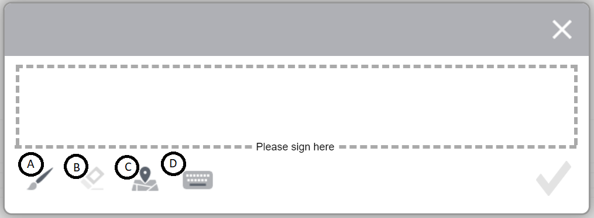
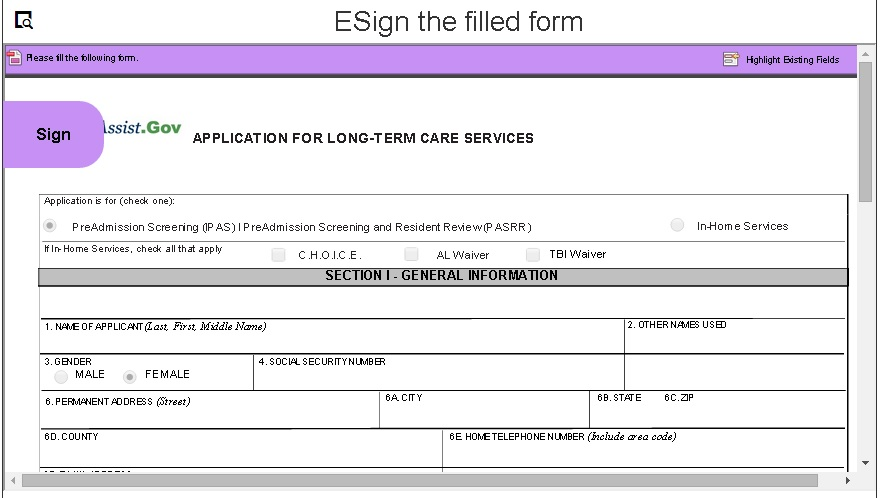
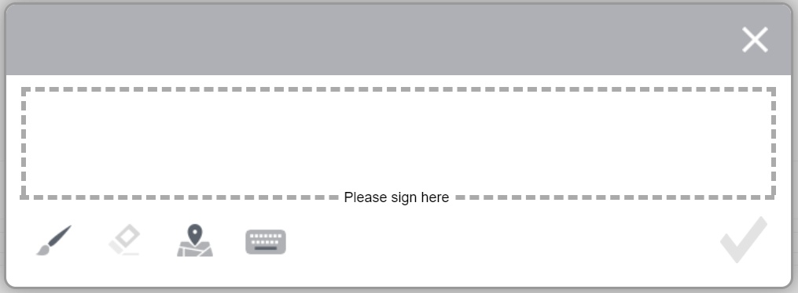

# E-sign a form using scribble signatures{#apply-electronic-signatures-to-a-form-using-deprecated-scribble-signatures}

>[!NOTE]
>
> Adobe recommends using the modern and extensible data capture [Core Components](https://experienceleague.adobe.com/docs/experience-manager-core-components/using/adaptive-forms/introduction.html) for [creating new Adaptive Forms](/help/forms/creating-adaptive-form-core-components.md) or [adding Adaptive Forms to AEM Sites pages](/help/forms/create-or-add-an-adaptive-form-to-aem-sites-page.md). These components represent a significant advancement in Adaptive Forms creation, ensuring impressive user experiences. This article describes older approach to author Adaptive Forms using foundation components.

| Version | Article link |
| -------- | ---------------------------- |
| AEM 6.5  |    [Click here](https://experienceleague.adobe.com/docs/experience-manager-65/forms/adaptive-forms-basic-authoring/signing-forms-using-scribble.html)                  |
| AEM as a Cloud Service     | This article        |

You can use the **Scribble Signature** component to draw (Scribble) signature on an Adaptive Form. <!-- The Signature step component displays a PDF version of the Adaptive Form. You require a Document of Record option enabled or form template based Adaptive Forms to use the Signature step component. -->

## Various Options available in Signature Window

* **A:** Click the **Paint Brush** icon to draw your signature on canvas.
* **B:** Click the **Clear** icon to clear the signature on canvas.
* **C:** Click the **Geolocation** icon to add geolocation along with the signature.
* **D:** Click the **Keyboard** icon to type your name on canvas. 

 Once you select the Done  icon in Scribble signature window, you cannot edit the signature. In case, if you want to edit the signature, you have to disregard the current signature and re-sign using the above Paint Brush/Keyboard option.

You can select the **Configure**  icon to set the aspect ratio of Scribble Signature canvas. 
* When the aspect ratio of the Scribble Signature canvas is less than 1, the geolocation information is added at the bottom of the Scribble Signature canvas.

* When the aspect ratio of the Scribble Signature canvas is more than 1, the geolocation information is added to the right-side of the Scribble Signature canvas. 
 

 

   >[!NOTE]
   >
   >Signatures are always saved in a PNG format.
   >
   
## Configure an Adaptive Form to use Scribble Signature {#configure-an-adaptive-form-to-use-scribble-signature}

1. Open an Adaptive Form in an edit mode.
1. Drag-and-drop the **Scribble Signature** component from component browser to the Adaptive Form.
1. Select the **Configure**  icon. It opens properties browser and displays properties of the Scribble Signature component. [Configure properties of Scribble signature](#properties-of-scribble-signature-component) as dicussed in the next section.

   

1. Select the Done  icon to save the changes. The Signature is configured successfully.

## Configure properties of Scribble Signature component

You can easily customize your Scribble Signature component for visitors with the Configure Dialog. 

### Basic Tab

* **Name** - You can identify a form component easily with its unique name both in the form and in the rule editor, but the name must not contain spaces or special characters.

* **Title** - With its Title, you can easily identify a component in a form and by default, the title appears on top of the component. If you do not add a title, the name of the component is displayed instead of the title text.

* **Allow Rich Text for Title** - This features enables users to format plain text titles, incorporating features like bold, italic, underlined text, various fonts, font sizes, colors, and additional option to enhance visual presentation and customization. It offers greater flexibility and creative control in making titles stand out within documents, websites, or applications.  
      Upon selecting the checkbox for **Allow Rich Text for Title** , formatting options become visible to style the component's title. To access all available formatting options, you can click on the  tab.
     
      

* **Hide Title** - Select the option to hide the component's Title.
* **Required Field** - Select the option to make the field mandatory.
* **Required Field Message** - The **Required Field Message** is a customizable message displayed to users when they attempt to submit a form without filling in a mandatory field.
* **Data Model Bind Reference** - A bind reference is a reference to a data element that is stored in an external data source and used in a form. The bind reference allows you to dynamically bind data to form fields, so that the form can display the most up-to-date data from the data source. For example, a bind reference can be used to display a customer's name and address in a form, based on the customer's ID entered into the form. The bind reference can also be used to update the data source with data entered into the form. In this way, AEM Forms enables you to create forms that interact with external data sources, providing a seamless user experience for collecting and managing data.
* **Hide Object** - Select the option to hide the component from the form. The component remains accessible for other purposes, such as using it for calculations in the Rule Editor. This is useful when you need to store information that doesn't need to be seen or directly changed by the user. 
* **Disable Object** - Select the option to disable the component. The disabled component is not active or editable by the end user. The user can see the value of the field but cannot modify it. The component remains accessible for other purposes, such as using it for calculations in the Rule Editor.
* **Aspect Ratio** - The aspect ratio in a Scribble Signature component defines the proportional relationship between its width and height.
* **Field Layout** - The **Field Layout** option determines how form elements, including the labels (captions) and error messages, are positioned relative to the component. The **Caption and Error as Top of Widget** positions the field's caption (label) and error messages above the component. **Inherit from Adaptive Form Configuration** uses the default field layout settings specified in the Adaptive Form configuration.
* **CSS Class** - The **CSS class** allows you to apply custom styles to a component by assigning one or more CSS classes defined in your stylesheet. It enables consistent styling and layout customization across your Adaptive Form.

### Help Content

* **Short description** - A short description is a brief text explanation that provides additional information or clarification about the purpose of a specific form field. It helps the user understand what type of data should be entered into the field and can provide guidelines or examples to help ensure that the information entered is valid and meets the desired criteria. By default, short descriptions remain hidden. Enable the **Always show short description** option to display it below the component.

* **Always show short description** - Enable the option to display the Short description below the component.

* **Long Description** -  It refers to additional information or guidance that is provided to the user to assist them in filling out a form field correctly. It appears when the user clicks the help icon (i) placed next to the component. It provides more detailed information than a form field's label or placeholder text, and is designed to help the user understand the requirements or constraints of the field. It can also offer suggestions or examples to make filling out the form easier and more accurate.

### Accessibility Tab {#accessibility}

On the **Accessibility** tab, values are set for [ARIA accessibility](https://www.w3.org/WAI/standards-guidelines/aria/) labels for the component. Various options are available for using the text for screen reader:

* **Screen Reader Precedence** - Screen Reader Precedence refers to additional text that is specifically intended to be read by assistive technologies, such as screen readers, used by visually impaired individuals. This text provides an audio description of the form field's purpose, and can include information about the field's title, description, name, and any relevant messages (Custom text). The screen reader text helps ensure that the form is accessible to all users, including those with visual impairments, and provides them with a complete understanding of the form field and its requirements. 

   * **Custom text**: Select this option to use the custom text for ARIA accessibility labels. Selecting this option displays the Custom Text dialog box. You can add relevant information in the Custom Text dialog box.
   * **Short Description**: Select this option to use the description for ARIA accessibility labels.
   * **Title**: Select this option to use the title for ARIA accessibility labels.
   *  **Name**: Select this option to use the name for ARIA accessibility labels.
   * **None**: Select this option if you do not want to add for ARIA accessibility labels.

<!--

 * **Element Name**: Specify name of the component.

    * **Title:** Specify unique title of the component.
    * **Template message:** Specify the message to be displayed while the signature PDF is being loaded. Adobe Sign services take some time to prepare and load signature PDF.
    * **Signing Service:** Select the **Scribble Signature** option.

    * **CSS Class**: Specify CSS class of the client library, if any. Adobe recommends using [themes](themes.md) and [in-line styles](inline-style-adaptive-forms.md) instead of CSS Class.
## Sign an Adaptive Form using Scribble Signature {#sign-an-adaptive-form-using-scribble-signature}

1. After you fill an Adaptive Form and reach the Signature Step page, the signature screen is displayed.

   

1. Click **[!UICONTROL Sign]**. The scribble sign dialog appears. Sign the form and click the Done  icon to save the signature.

   

1. Click complete to finish the signing process.

   

The signatures are added to the form and the form control moves to the next panel. -->

## See Also {#see-also}

{{see-also}}